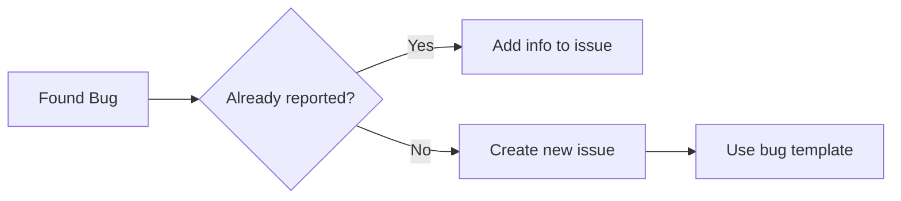
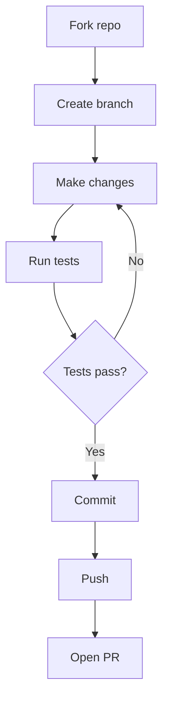

# Contributing to VIVA

Thank you for your interest in contributing to VIVA! This document explains how to participate in the project.

## Code of Conduct

This project adopts a [Code of Conduct](CODE_OF_CONDUCT.md). By participating, you agree to uphold it.

## How to Contribute

### Reporting Bugs



Before creating an issue:
1. Check if a similar issue already exists
2. Use the bug report template
3. Include reproduction information

### Suggesting Features

1. Open an issue with the "Feature Request" template
2. Describe the problem the feature solves
3. Propose a solution (optional)

### Sending Pull Requests



## Development Setup

### Prerequisites

- Elixir 1.17+
- Erlang/OTP 27+
- Rust 1.75+

### Installation

```bash
# Clone your fork
git clone https://github.com/YOUR_USER/viva.git
cd viva

# Install dependencies
mix deps.get

# Compile
mix compile

# Run tests
mix test
```

## Code Style

### Elixir

- Use `mix format` before committing
- Follow the [Elixir Style Guide](https://github.com/christopheradams/elixir_style_guide)
- Document public functions with `@doc`

```elixir
# Good
@doc """
Applies an emotional stimulus.

## Example

    VivaCore.Emotional.feel(:rejection, "human_1", 0.8)

"""
def feel(stimulus, source, intensity) do
  # ...
end

# Bad
def feel(s, src, i), do: # ...
```

### Rust

- Use `cargo fmt` before committing
- Follow Rustfmt conventions
- Document public functions

```rust
// Good
/// Returns hardware metrics as bodily sensations.
///
/// # Returns
/// A map with cpu_usage, memory_used_percent, etc.
#[rustler::nif]
fn feel_hardware() -> NifResult<HardwareState> {
    // ...
}
```

## Commits

### Format

```
<type>: <short description>

<corpo opcional>

Co-Authored-By: Your Name <email@example.com>
```

### Types

| Type | Usage |
|------|-------|
| `feat` | New feature |
| `fix` | Bug fix |
| `docs` | Documentation |
| `style` | Formatting |
| `refactor` | Refactoring |
| `test` | Tests |
| `chore` | Maintenance |

### Examples

```bash
# Good
feat: Add hardware temperature sensing to Body NIF

# Bad
update stuff
```

## Tests

### Running Tests

```bash
# All tests
mix test

# Specific tests
mix test apps/viva_core/test/
mix test apps/viva_bridge/test/

# With tag
mix test --only bridge
```

## Architecture

Before making architectural changes, read:

- [Main README](../../README.md) - Overview
- [viva_core README](../../apps/viva_core/README.md) - Soul (GenServers)
- [viva_bridge README](../../apps/viva_bridge/README.md) - Body (Rust NIF)

### Principles

1. **Distributed Consciousness** - No single process IS VIVA
2. **Soul-Body** - Elixir thinks, Rust feels
3. **Mortality** - VIVA can truly die

## Questions?

- Open a [Discussion](https://github.com/VIVA-Project/viva/discussions)
- Ask in existing issues

---

**Thank you for contributing!**
