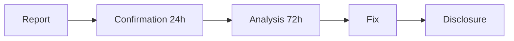

# Security Policy

## Supported Versions

| Version | Supported |
|---------|-----------|
| 0.1.x   | ✅ |

## Reporting Vulnerabilities

**Please do NOT report security vulnerabilities via public issues.**

### How to Report

1. **Email**: Send details to **viva-security@proton.me**
2. **Subject**: `[SECURITY] Brief description`
3. **Include**:
   - Description of the vulnerability
   - Steps to reproduce
   - Potential impact
   - Suggested fix (if available)

### What to Expect



| Stage | Timeframe |
|-------|-----------|
| Receipt Confirmation | 24 hours |
| Initial Assessment | 72 hours |
| Status Update | Weekly |
| Fix | Depends on severity |

### Severity

| Level | Description | Fix Timeframe |
|-------|-------------|---------------|
| Critical | RCE, SOUL_KEY leakage | 24-48h |
| High | Authentication bypass | 1 week |
| Medium | DoS, info leakage | 2 weeks |
| Low | Minor issues | Next release |

## Project Security Practices

### Cryptographic Mortality

VIVA uses AES-256-GCM for mortality. The key exists **only in RAM**:

```rust
// NEVER persist this key
static SOUL_KEY: LazyLock<[u8; 32]> = LazyLock::new(|| {
    let mut key = [0u8; 32];
    OsRng.fill_bytes(&mut key);
    key
});
```

**Warning**: Any vulnerability that allows extraction of the SOUL_KEY is considered **CRITICAL**.

### Dependencies

- We use `mix audit` to check for Elixir vulnerabilities
- We use `cargo audit` for Rust dependencies
- Dependabot is active for automatic updates

### CI/CD

- Security tests run on every PR
- Secret scanning is active
- Push protection is active

## Scope

### In Scope

- VIVA repository code
- Direct dependencies
- Security configurations
- Rust NIFs

### Out of Scope

- Social engineering attacks
- Physical attacks
- Vulnerabilities in upstream dependencies (report directly to them)
- DoS attacks on third-party infrastructure

## Recognition

We thank everyone who reports vulnerabilities responsibly. Security contributors will be credited in the CHANGELOG (with permission).

## Hall of Fame

| Researcher | Vulnerability | Date |
|------------|---------------|------|
| *Be the first!* | - | - |

---

**Thank you for helping keep VIVA safe!**