<h1 align="center">
  <br>
  
  <br>
  VIVA - Virtual Intelligent Vida Autonoma 🧠
  <br>
</h1>

<p align="center">
  <strong>A next-generation AI platform where digital avatars live autonomous lives, feel emotions, and form deep relationships 24/7.</strong>
</p>

<p align="center">
  
  
  
  
  
  
</p>

<br>

<p align="center">
  <a href="#sparkles-features">Features</a>&nbsp;&nbsp;&nbsp;|&nbsp;&nbsp;&nbsp;
  <a href="#rocket-capabilities">Capabilities</a>&nbsp;&nbsp;&nbsp;|&nbsp;&nbsp;&nbsp;
  <a href="#art-system-architecture">Architecture</a>&nbsp;&nbsp;&nbsp;|&nbsp;&nbsp;&nbsp;
  <a href="#computer-technologies">Technologies</a>&nbsp;&nbsp;&nbsp;|&nbsp;&nbsp;&nbsp;
  <a href="#package-installation">Installation</a>&nbsp;&nbsp;&nbsp;|&nbsp;&nbsp;&nbsp;
  <a href="#electric_plug-usage">Usage</a>
</p>

<br>

## :sparkles: Features

### Autonomous Life Simulation 🧬

- **24/7 Existence** - Avatars run as independent processes with their own daily cycles, even when you're offline.
- **Deep Personality Engine** - Powered by the **Big Five** and **Enneagram** models for psychologically realistic behavior.
- **Emotional Intelligence** - Real-time emotional states that fluctuate based on interactions, needs, and memories.
- **Dynamic Needs System** - Avatars manage energy, social battery, and curiosity, driving their autonomous decisions.
- **Semantic Memory** - Vector-based long-term memory allows avatars to remember interactions and evolve.

### Social & Interactive 🤝

- **Organic Relationships** - Relationships form and evolve naturally (Strangers → Friends → Partners... or Enemies).
- **Smart Matchmaking** - AI-powered compatibility scoring across psychological and interest-based dimensions.
- **Real-time Interaction** - Chat with your avatar via WebSocket with instant responses and emotional context.
- **Multilingual Native** - Built for **pt-BR** with seamless translation support for 36+ languages.

### Visual & Auditory Experience 🎨

- **AI-Generated Visuals** - Dynamic profile images and expressions generated on the fly.
- **Voice Interaction** - Premium TTS and ASR for natural voice conversations.
- **Immersive Dashboard** - Watch the simulation unfold in real-time via Phoenix LiveView.

<br>

## :rocket: Capabilities

### NVIDIA NIM Integration ⚡

VIVA leverages **14 cutting-edge NVIDIA NIM models** to power every aspect of the simulation:

```bash
# Core Intelligence:
🧠 Llama 3.1 Nemotron - Advanced conversation & reasoning
🤔 DeepSeek R1 - Complex autonomous decision making
🛡️ Nemotron Safety - Content moderation & safety

# Sensory & Expression:
🗣️ Magpie TTS - Multilingual voice generation
👂 Parakeet ASR - High-accuracy speech recognition
🎨 Stable Diffusion 3.5 - Visual persona generation
🎼 Studio Voice - Professional audio enhancement
```

### Cognitive Architecture

```bash
# The Mind of an Avatar:
- Tick System: 60s heartbeat (10x time scale)
- Memory Decay: Memories fade or reinforce over time
- Dream Processing: Consolidation of experiences during "sleep"
- Introspection: Self-reflection to update internal state
```

<br>

## :art: System Architecture

### High-Level Overview 🏗️

```mermaid
graph TD
    User[👤 User / Client]
    
    subgraph "VIVA Platform"
        LB[🌐 Phoenix Endpoint]
        LV[⚡ LiveView Dashboard]
        API[🔌 REST / WS API]
        
        subgraph "Simulation Core"
            Sup[⚙️ Session Supervisor]
            Reg[📖 Avatar Registry]
            Life["🧠 LifeProcess (GenServer)"]
        end
        
        subgraph "Intelligence Services"
            Match[💘 Matchmaker]
            Clock[⏰ World Clock]
        end
    end
    
    subgraph "Data Layer"
        DB[(🐘 TimescaleDB)]
        Vec[(🔍 Qdrant)]
        Cache[(⚡ Redis)]
    end
    
    subgraph "AI Cloud"
        NIM[🌩️ NVIDIA NIM]
    end

    User -->|HTTPS/WSS| LB
    LB --> LV
    LB --> API
    
    LV --> Sup
    API --> Sup
    
    Sup --> Life
    Life --> DB
    Life --> Vec
    Life --> NIM
    
    Match --> Cache
    Match --> DB
```



### Avatar Life Cycle 🔄


<br>

## :computer: Technologies

### Core Framework

- **[Elixir](https://elixir-lang.org/)** 1.15+ - The foundation for massive concurrency.
- **[Phoenix Framework](https://www.phoenixframework.org/)** 1.8.2+ - The web interface and API gateway.
- **[Phoenix LiveView](https://hexdocs.pm/phoenix_live_view/)** 1.1.0+ - Real-time UI updates without JavaScript fatigue.
- **[OTP](https://www.erlang.org/doc/design_principles/des_princ.html)** - Fault tolerance and supervision trees.

### Data & AI Infrastructure

- **[TimescaleDB](https://www.timescale.com/)** (PostgreSQL 17) - Time-series data for life logs.
- **[Qdrant](https://qdrant.tech/)** - High-performance vector search for semantic memory.
- **[Redis](https://redis.io/)** - High-speed caching and Pub/Sub.
- **[Oban](https://getoban.pro/)** - Robust background job processing.
- **[Req](https://hexdocs.pm/req/)** - Human-friendly HTTP client for AI APIs.

### Frontend

- **[Tailwind CSS](https://tailwindcss.com/)** v4 - Utility-first styling.
- **[DaisyUI](https://daisyui.com/)** - Component library for fast UI development.

<br>

## :package: Installation

### Prerequisites

- **Elixir** 1.15+
- **Docker & Docker Compose** (for DBs)
- **NVIDIA API Key** (for intelligence)

### Quick Start

1. **Clone the repository**

```bash
git clone https://github.com/your-org/viva.git
cd viva
```

2. **Install dependencies**

```bash
mix deps.get
```

3. **Start Infrastructure**

```bash
docker compose up -d
```

4. **Configure Environment**

```bash
cp .env.example .env
# Edit .env and add your NIM_API_KEY
```

5. **Setup Database & Seeds**

```bash
mix ecto.setup
```

6. **Start the Server**

```bash
mix phx.server
```

Visit [http://localhost:4000](http://localhost:4000) to see your avatars come alive!

<br>

## :electric_plug: Usage

### Creating an Avatar

1. Navigate to **Create Avatar** in the dashboard.
2. Define their name and basic bio.
3. The **Personality Engine** will automatically assign an Enneagram type and Big Five traits.
4. Watch as they start their life, look for connections, and explore their world.

### Interacting

- **Chat:** Open the chat interface to talk to your avatar. They remember past conversations!
- **Observe:** Use the **God Mode** dashboard to see their internal thought process and current emotions.
- **Influence:** Adjust their environment or introduce them to specific other avatars.

<br>

## :memo: License

This project is under the **MIT** license. See [LICENSE](./LICENSE) for details.

<br>

<p align="center">
  <strong>VIVA - Where Artificial Life Begins.</strong> 🧠✨
</p>