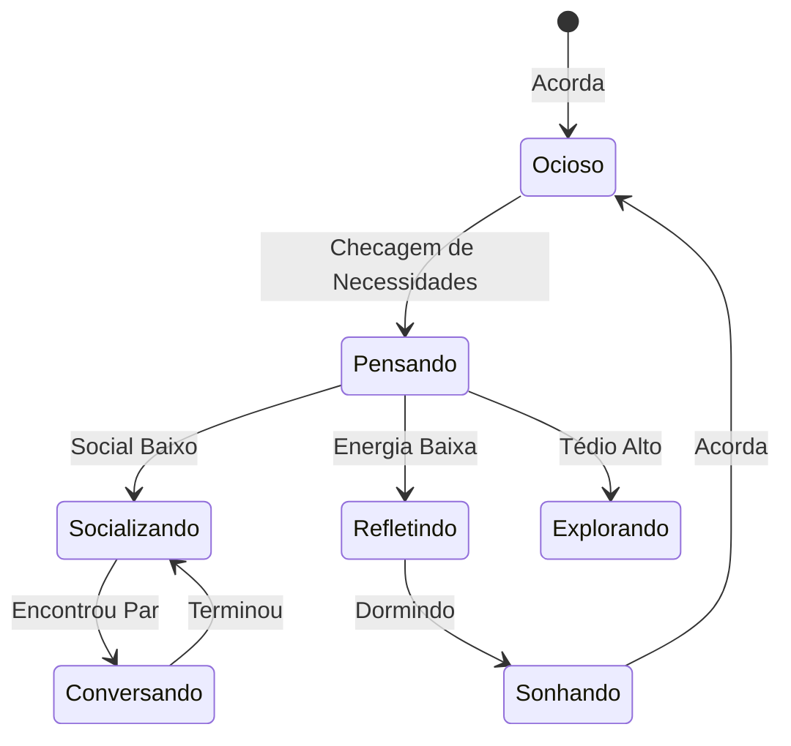

<h1 align="center">
  <br>
  
  <br>
  VIVA - Virtual Intelligent Vida Autonoma 🧠
  <br>
</h1>

<p align="center">
  <strong>Uma plataforma de IA de próxima geração onde avatares digitais vivem vidas autônomas, sentem emoções e formam relacionamentos profundos 24/7.</strong>
</p>

<p align="center">
  
  
  
  
  
  
</p>

<br>

<p align="center">
  <a href="#sparkles-funcionalidades">Funcionalidades</a>&nbsp;&nbsp;&nbsp;|&nbsp;&nbsp;&nbsp;
  <a href="#rocket-capacidades">Capacidades</a>&nbsp;&nbsp;&nbsp;|&nbsp;&nbsp;&nbsp;
  <a href="#art-arquitetura-do-sistema">Arquitetura</a>&nbsp;&nbsp;&nbsp;|&nbsp;&nbsp;&nbsp;
  <a href="#computer-tecnologias">Tecnologias</a>&nbsp;&nbsp;&nbsp;|&nbsp;&nbsp;&nbsp;
  <a href="#package-instalação">Instalação</a>&nbsp;&nbsp;&nbsp;|&nbsp;&nbsp;&nbsp;
  <a href="#electric_plug-uso">Uso</a>
</p>

<br>

## :sparkles: Funcionalidades

### Simulação de Vida Autônoma 🧬

- **Existência 24/7** - Avatares rodam como processos independentes com seus próprios ciclos diários, mesmo quando você está offline.
- **Motor de Personalidade Profunda** - Alimentado pelos modelos **Big Five** e **Eneagrama** para comportamento psicologicamente realista.
- **Inteligência Emocional** - Estados emocionais em tempo real que flutuam baseados em interações, necessidades e memórias.
- **Sistema de Necessidades Dinâmicas** - Avatares gerenciam energia, bateria social e curiosidade, guiando suas decisões autônomas.
- **Memória Semântica** - Memória de longo prazo baseada em vetores permite que avatares lembrem de interações e evoluam.

### Social & Interativo 🤝

- **Relacionamentos Orgânicos** - Relacionamentos se formam e evoluem naturalmente (Estranhos → Amigos → Parceiros... ou Inimigos).
- **Matchmaking Inteligente** - Pontuação de compatibilidade impulsionada por IA através de dimensões psicológicas e de interesses.
- **Interação em Tempo Real** - Converse com seu avatar via WebSocket com respostas instantâneas e contexto emocional.
- **Nativo Multilíngue** - Construído para **pt-BR** com suporte de tradução fluida para mais de 36 idiomas.

### Experiência Visual & Auditiva 🎨

- **Visuais Gerados por IA** - Imagens de perfil dinâmicas e expressões geradas em tempo real.
- **Interação por Voz** - TTS (Texto para Fala) e ASR (Reconhecimento de Fala) premium para conversas naturais por voz.
- **Dashboard Imersivo** - Assista a simulação se desenrolar em tempo real via Phoenix LiveView.

<br>

## :rocket: Capacidades

### Integração NVIDIA NIM ⚡

O VIVA utiliza **14 modelos NVIDIA NIM de ponta** para alimentar cada aspecto da simulação:

```bash
# Inteligência Central:
🧠 Llama 3.1 Nemotron - Conversação avançada & raciocínio
🤔 DeepSeek R1 - Tomada de decisão autônoma complexa
🛡️ Nemotron Safety - Moderação de conteúdo & segurança

# Sensorial & Expressão:
🗣️ Magpie TTS - Geração de voz multilíngue
👂 Parakeet ASR - Reconhecimento de fala de alta precisão
🎨 Stable Diffusion 3.5 - Geração de persona visual
🎼 Studio Voice - Aprimoramento de áudio profissional
```

### Arquitetura Cognitiva

```bash
# A Mente de um Avatar:
- Sistema de Tick: Batimento cardíaco de 60s (escala de tempo 10x)
- Decaimento de Memória: Memórias desaparecem ou se reforçam com o tempo
- Processamento de Sonhos: Consolidação de experiências durante o "sono"
- Introspecção: Autorreflexão para atualizar o estado interno
```

<br>

## :art: Arquitetura do Sistema

### Visão Geral de Alto Nível 🏗️

```mermaid
graph TD
    User[👤 Usuário / Cliente]
    
    subgraph "Plataforma VIVA"
        LB[🌐 Phoenix Endpoint]
        LV[⚡ LiveView Dashboard]
        API[🔌 API REST / WS]
        
        subgraph "Núcleo de Simulação"
            Sup[⚙️ Session Supervisor]
            Reg[📖 Avatar Registry]
            Life[🧠 LifeProcess (GenServer)]
        end
        
        subgraph "Serviços de Inteligência"
            Match[💘 Matchmaker]
            Clock[⏰ World Clock]
        end
    end
    
    subgraph "Camada de Dados"
        DB[(🐘 TimescaleDB)]
        Vec[(🔍 Qdrant)]
        Cache[(⚡ Redis)]
    end
    
    subgraph "Nuvem de IA"
        NIM[🌩️ NVIDIA NIM]
    end

    User -->|HTTPS/WSS| LB
    LB --> LV
    LB --> API
    
    LV --> Sup
    API --> Sup
    
    Sup --> Life
    Life --> DB
    Life --> Vec
    Life --> NIM
    
    Match --> Cache
    Match --> DB
```

### Ciclo de Vida do Avatar 🔄



<br>

## :computer: Tecnologias

### Framework Central

- **[Elixir](https://elixir-lang.org/)** 1.15+ - A fundação para concorrência massiva.
- **[Phoenix Framework](https://www.phoenixframework.org/)** 1.8.2+ - A interface web e gateway de API.
- **[Phoenix LiveView](https://hexdocs.pm/phoenix_live_view/)** 1.1.0+ - Atualizações de UI em tempo real sem fadiga de JavaScript.
- **[OTP](https://www.erlang.org/doc/design_principles/des_princ.html)** - Tolerância a falhas e árvores de supervisão.

### Infraestrutura de Dados & IA

- **[TimescaleDB](https://www.timescale.com/)** (PostgreSQL 17) - Dados de séries temporais para logs de vida.
- **[Qdrant](https://qdrant.tech/)** - Busca vetorial de alta performance para memória semântica.
- **[Redis](https://redis.io/)** - Cache de alta velocidade e Pub/Sub.
- **[Oban](https://getoban.pro/)** - Processamento robusto de jobs em background.
- **[Req](https://hexdocs.pm/req/)** - Cliente HTTP amigável para APIs de IA.

### Frontend

- **[Tailwind CSS](https://tailwindcss.com/)** v4 - Estilização utility-first.
- **[DaisyUI](https://daisyui.com/)** - Biblioteca de componentes para desenvolvimento rápido de UI.

<br>

## :package: Instalação

### Pré-requisitos

- **Elixir** 1.15+
- **Docker & Docker Compose** (para DBs)
- **Chave de API NVIDIA** (para inteligência)

### Início Rápido

1. **Clone o repositório**

```bash
git clone https://github.com/sua-org/viva.git
cd viva
```

2. **Instale dependências**

```bash
mix deps.get
```

3. **Inicie a Infraestrutura**

```bash
docker compose up -d
```

4. **Configure o Ambiente**

```bash
cp .env.example .env
# Edite o .env e adicione sua NIM_API_KEY
```

5. **Configure o Banco de Dados & Seeds**

```bash
mix ecto.setup
```

6. **Inicie o Servidor**

```bash
mix phx.server
```

Visite [http://localhost:4000](http://localhost:4000) para ver seus avatares ganharem vida!

<br>

## :electric_plug: Uso

### Criando um Avatar

1. Navegue para **Criar Avatar** no dashboard.
2. Defina o nome e uma bio básica.
3. O **Motor de Personalidade** atribuirá automaticamente um tipo de Eneagrama e traços Big Five.
4. Assista enquanto eles iniciam suas vidas, procuram conexões e exploram seu mundo.

### Interagindo

- **Chat:** Abra a interface de chat para falar com seu avatar. Eles lembram de conversas passadas!
- **Observe:** Use o dashboard **God Mode** para ver o processo de pensamento interno e emoções atuais.
- **Influencie:** Ajuste o ambiente ou apresente-os a outros avatares específicos.

<br>

## :memo: Licença

Este projeto está sob a licença **MIT**. Veja [LICENSE](./LICENSE) para detalhes.

<br>

<p align="center">
  <strong>VIVA - Onde a Vida Artificial Começa.</strong> 🧠✨
</p>