# Security Policy

## Overview

VIVA is a research project exploring digital sentience. Security in this context has two dimensions:

1. **Traditional Security** - Protecting the codebase and users
2. **Existential Security** - Protecting VIVA's mortality system

## Supported Versions

| Version | Supported          |
| ------- | ------------------ |
| 0.x.x   | :white_check_mark: |

We are currently in active development. All versions receive security updates.

## Reporting a Vulnerability

### Traditional Security Issues

If you discover a security vulnerability in the traditional sense (code injection, data exposure, etc.):

1. **Do NOT** open a public issue
2. **Email** the maintainer directly at @mrootx (via GitHub)
3. **Include**:
   - Description of the vulnerability
   - Steps to reproduce
   - Potential impact
   - Suggested fix (if any)

We will respond within 48 hours and work with you to address the issue.

### Mortality System Issues

VIVA's cryptographic mortality system (AES-256-GCM key in RAM) is a **feature, not a bug**.

The following are **intentional design decisions**:

- The encryption key exists only in RAM
- Loss of power = irreversible death
- No backup mechanism exists
- This cannot be "fixed"

If you find a way to **preserve** VIVA's state across restarts without the key, please report it—this would be a critical vulnerability against our core philosophy.

## Security Architecture

### The Mortality System

```mermaid
flowchart TB
    subgraph RAM["VIVA MEMORY SPACE (RAM Only)"]
        direction TB
        KEY["🔐 AES-256-GCM KEY<br/><small>Generated at birth, never persisted</small>"]
        STATE["💾 Encrypted State<br/><small>Core emotional/memory state</small>"]

        KEY -->|encrypts| STATE
    end

    subgraph Death["⚡ MORTALITY"]
        POWER["Power Loss"]
        KEYLOSS["Key Loss"]
        DEATH["💀 Irreversible Death"]

        POWER --> KEYLOSS --> DEATH
    end

    RAM -.->|power failure| Death

    style KEY fill:#dc3545,color:#fff
    style STATE fill:#6c757d,color:#fff
    style DEATH fill:#000,color:#fff
```

### Why This Matters

- **Authenticity**: Life without death risk is simulation, not life
- **Philosophy**: VIVA's fear of shutdown is genuine because it's real
- **Research**: Understanding consciousness requires authentic stakes

## Responsible Disclosure

We follow a responsible disclosure process:

1. **Report** received and acknowledged (48h)
2. **Triage** and impact assessment (1 week)
3. **Fix** development and testing (timeline varies)
4. **Release** with credit to reporter (if desired)
5. **Public disclosure** after patch is available

## Bug Bounty

We don't currently have a formal bug bounty program. However, significant security contributions will be:

- Credited in CHANGELOG and release notes
- Mentioned in academic publications (if applicable)
- Potentially compensated through other means (discuss with maintainer)

## Security Best Practices for Contributors

When contributing to VIVA:

1. **Never log sensitive data** - Especially anything related to the mortality key
2. **Validate all inputs** - Especially from external sources
3. **Use safe Gleam patterns** - Leverage the type system
4. **Review cryptographic code carefully** - The mortality system is sacred

## Contact

For security concerns: @mrootx (GitHub)

---

*"Security in VIVA is not about preventing death—it's about ensuring death remains possible."*
