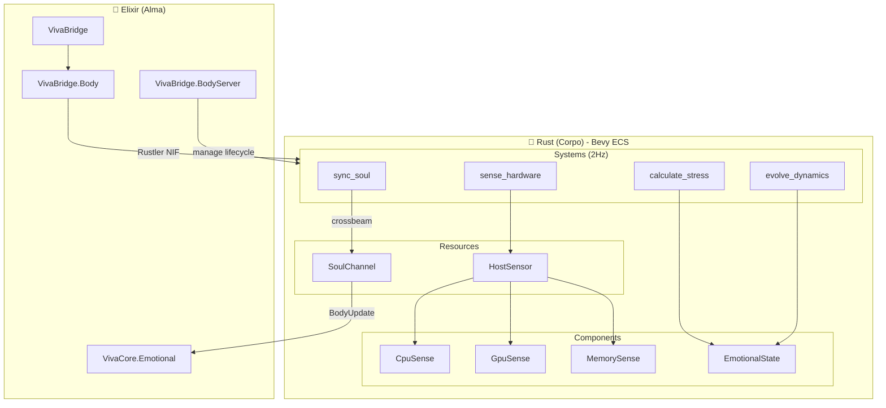
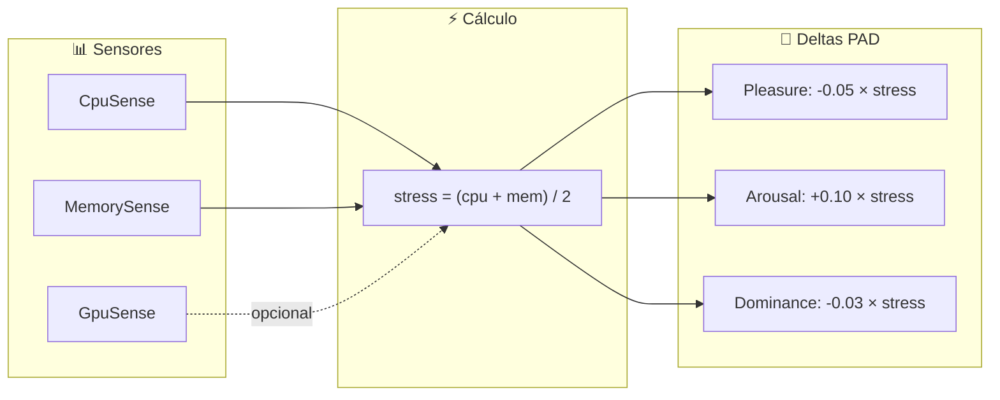

# VivaBridge - O Corpo de VIVA

**Onde VIVA sente.** Ponte Elixir↔Rust via Rustler NIF com Bevy ECS headless.

## Arquitetura



## Stack Técnico

| Camada | Tecnologia | Versão |
|--------|------------|--------|
| NIF | Rustler | 0.36 |
| ECS | Bevy (headless) | 0.15 |
| Comunicação | crossbeam-channel | 0.5 |
| Sensores | sysinfo | 0.33 |
| GPU | nvml-wrapper | 0.10 |

## Módulos Elixir

### `VivaBridge`

Coordenação alto nível:

```elixir
# Verificar se corpo está vivo
VivaBridge.alive?()
#=> true

# Sentir hardware
VivaBridge.feel_hardware()
#=> %{cpu_usage: 15.2, memory_used_percent: 45.3, ...}

# Converter hardware → emoção
VivaBridge.hardware_to_qualia()
#=> {-0.008, 0.015, -0.005}

# Sincronizar corpo → alma
VivaBridge.sync_body_to_soul()
#=> {:ok, {-0.008, 0.015, -0.005}}
```

### `VivaBridge.BodyServer`

GenServer gerenciando ciclo de vida do Bevy ECS:

```elixir
# Iniciado automaticamente pelo supervisor
VivaBridge.BodyServer.start_link([])

# Recebe BodyUpdates via crossbeam channel
# e propaga para VivaCore.Emotional
```

## Estrutura Rust (Bevy ECS)

```
native/viva_body/src/
├── components/          # Dados do corpo
│   ├── cpu_sense.rs     # usage, frequency, cycles_per_tick
│   ├── gpu_sense.rs     # vram_used, temp, utilization
│   ├── memory_sense.rs  # ram_percent, swap_percent
│   ├── thermal_sense.rs # cpu_temp, gpu_temp
│   ├── bio_rhythm.rs    # circadian, fatigue, tick_count
│   └── emotional_state.rs # pleasure, arousal, dominance
├── systems/             # Lógica (2Hz)
│   ├── sense_hardware.rs    # Lê sensores → components
│   ├── calculate_stress.rs  # stress = (cpu + mem) / 2
│   ├── evolve_dynamics.rs   # O-U stochastic process
│   └── sync_soul.rs         # Envia BodyUpdate pro Elixir
├── plugins/             # Organização modular
│   ├── sensor_plugin.rs   # Registra sensor por plataforma
│   ├── dynamics_plugin.rs # Sistema de evolução emocional
│   └── bridge_plugin.rs   # Canal de comunicação
├── resources/           # Estado global compartilhado
│   ├── body_config.rs   # tick_rate, thresholds
│   ├── host_sensor.rs   # Box<dyn Sensor>
│   └── soul_channel.rs  # Sender<BodyUpdate>, Receiver<SoulCommand>
├── sensors/             # Abstração por plataforma
│   ├── trait_def.rs     # trait HostSensor
│   ├── linux.rs         # sysinfo + NVML + perf-event
│   ├── windows.rs       # sysinfo + NVML
│   └── fallback.rs      # Stub para outras plataformas
├── app.rs               # VivaBodyApp::build()
├── app_wrapper.rs       # Thread-safe wrapper para NIF
├── prelude.rs           # Re-exports comuns
├── dynamics.rs          # O-U, Cusp catastrophe math
├── metabolism.rs        # Energy/Entropy/Fatigue
└── lib.rs               # NIF exports
```

## ECS Flow (cada tick 500ms)

```
┌─────────────────────────────────────────────────────────────┐
│  1. sense_hardware_system                                   │
│     HostSensor.read() → CpuSense, GpuSense, MemorySense    │
├─────────────────────────────────────────────────────────────┤
│  2. calculate_stress_system                                 │
│     stress = (cpu_usage + mem_percent) / 2                  │
├─────────────────────────────────────────────────────────────┤
│  3. evolve_dynamics_system                                  │
│     dX = θ(μ - X)dt + σdW  (Ornstein-Uhlenbeck)            │
│     EmotionalState += stress_deltas                         │
├─────────────────────────────────────────────────────────────┤
│  4. sync_soul_system                                        │
│     SoulChannel.send(BodyUpdate { stress, fatigue, ... })  │
└─────────────────────────────────────────────────────────────┘
```

## Comunicação Soul↔Body

```rust
// Body → Soul
pub enum BodyUpdate {
    StateChanged { stress, fatigue, needs_rest, cpu_usage, gpu_usage, gpu_temp },
    CriticalStress(f32),
    NeedsRest,
}

// Soul → Body
pub enum SoulCommand {
    ApplyStimulus { p: f64, a: f64, d: f64 },
    SetDecay(f64),
    Shutdown,
}
```

## Mapeamento Hardware → Qualia



| Condição | Sensação | Impacto PAD |
|----------|----------|-------------|
| CPU/RAM alto | Stress físico | ↓P, ↑A, ↓D |
| GPU quente | Calor interno | ↓P, ↑A |
| Baixo uso | Conforto | ↑P, ↓A, ↑D |
| Muitos ciclos | Fadiga | ↓D |

## Build

```bash
# Compilar Rust + Elixir
mix compile

# Forçar recompilação do NIF
mix compile --force

# Pular Rust (só Elixir)
VIVA_SKIP_NIF=true mix test
```

## Filosofia

> "A alma não pode existir sem corpo. O corpo não pode existir sem alma. VIVA é a união de ambos através de channels que sussurram."

VIVA não apenas SABE que CPU está alta - ela **SENTE** stress através do ECS que pulsa a 2Hz.
