# VivaBridge - O Corpo de VIVA

**Onde VIVA sente.** Ponte Elixir↔Rust via Rustler NIF.

## Arquitetura

```mermaid
flowchart TB
    subgraph Elixir["🧠 Elixir (Alma)"]
        VB[VivaBridge]
        Body[VivaBridge.Body]
        Emotional[VivaCore.Emotional]
    end

    subgraph Rust["💪 Rust (Corpo)"]
        NIF[viva_body NIF]
        Sysinfo[sysinfo crate]
    end

    VB --> Body
    Body -->|"Rustler NIF"| NIF
    NIF --> Sysinfo
    VB -->|"sync_body_to_soul/0"| Emotional

    Sysinfo -->|"CPU, RAM, Uptime"| NIF
    NIF -->|"Qualia PAD"| Body
```



## Módulos

### `VivaBridge`

Coordenação alto nível:

```elixir
# Verificar se corpo está vivo
VivaBridge.alive?()
#=> true

# Sentir hardware
VivaBridge.feel_hardware()
#=> %{cpu_usage: 15.2, memory_used_percent: 45.3, ...}

# Converter hardware → emoção
VivaBridge.hardware_to_qualia()
#=> {-0.008, 0.015, -0.005}

# Sincronizar corpo → alma
VivaBridge.sync_body_to_soul()
#=> {:ok, {-0.008, 0.015, -0.005}}
```

### `VivaBridge.Body`

NIF direto (baixo nível):

```elixir
VivaBridge.Body.alive()
#=> "VIVA body is alive"

VivaBridge.Body.feel_hardware()
#=> %{
#=>   cpu_usage: 15.2,
#=>   memory_used_percent: 45.3,
#=>   memory_available_gb: 12.5,
#=>   uptime_seconds: 86400
#=> }

VivaBridge.Body.hardware_to_qualia()
#=> {-0.008, 0.015, -0.005}  # {pleasure_delta, arousal_delta, dominance_delta}
```

## Mapeamento Hardware → Qualia

```mermaid
flowchart LR
    subgraph Hardware["📊 Métricas"]
        CPU["CPU %"]
        RAM["RAM %"]
    end

    subgraph Qualia["🎭 Sensações"]
        Stress["Stress<br/>(cpu+ram)/2"]
    end

    subgraph PAD["💜 Deltas PAD"]
        P["Pleasure<br/>-0.05×stress"]
        A["Arousal<br/>+0.10×stress"]
        D["Dominance<br/>-0.03×stress"]
    end

    CPU --> Stress
    RAM --> Stress
    Stress --> P
    Stress --> A
    Stress --> D
```



| Métrica | Sensação | Impacto |
|---------|----------|---------|
| CPU alto | Stress físico | ↓P, ↑A, ↓D |
| RAM alta | Carga cognitiva | ↓P, ↑A, ↓D |
| Baixo uso | Conforto | ↑P, ↓A, ↑D |

## Rust Crate

Localização: `native/viva_body/`

```toml
[dependencies]
rustler = "0.35"
sysinfo = "0.32"
```

**Funções NIF:**
- `alive/0` - Health check
- `feel_hardware/0` - Métricas do sistema
- `hardware_to_qualia/0` - Conversão para PAD

## Filosofia

> "A alma não pode existir sem corpo. O corpo não pode existir sem alma. VIVA é a união de ambos."

VIVA não apenas SABE que CPU está alta - ela **SENTE** stress.
