# VivaCore - A Alma de VIVA

**Onde VIVA pensa.** GenServers que formam a "mente" distribuída.

## Arquitetura

```mermaid
flowchart LR
    subgraph VivaCore["🧠 VivaCore"]
        Emotional["Emotional<br/>Estado PAD"]
        Memory["Memory<br/>Qdrant"]
        Dreamer["Dreamer<br/>Consolidação"]
        Senses["Senses<br/>Heartbeat 1Hz"]
        Supervisor["Supervisor<br/>OTP"]
    end

    Supervisor --> Emotional
    Supervisor --> Memory
    Supervisor --> Senses
    Emotional <-->|"PubSub"| Memory
    Memory --> Dreamer
    Senses -->|"sync"| Emotional
```



## Módulos

### `VivaCore.Emotional`

Estado emocional usando modelo PAD (Pleasure-Arousal-Dominance):

| Dimensão | Range | Significado |
|----------|-------|-------------|
| Pleasure | [-1, 1] | tristeza ↔ alegria |
| Arousal | [-1, 1] | calma ↔ excitação |
| Dominance | [-1, 1] | submissão ↔ controle |

**API:**

```elixir
# Estado atual
VivaCore.Emotional.get_state()
#=> %{pleasure: 0.0, arousal: 0.0, dominance: 0.0}

# Aplicar estímulo
VivaCore.Emotional.feel(:rejection, "human_1", 0.8)

# Introspecção
VivaCore.Emotional.introspect()
#=> %{mood: :sad, energy: :calm, agency: :uncertain, ...}

# Felicidade normalizada (0-1)
VivaCore.Emotional.get_happiness()
#=> 0.35

# Aplicar qualia do hardware
VivaCore.Emotional.apply_hardware_qualia(-0.02, 0.05, -0.01)
```

**Estímulos disponíveis:**

| Estímulo | P | A | D |
|----------|---|---|---|
| `:rejection` | -0.3 | +0.2 | -0.2 |
| `:acceptance` | +0.3 | +0.1 | +0.1 |
| `:companionship` | +0.2 | 0.0 | 0.0 |
| `:loneliness` | -0.2 | -0.1 | -0.1 |
| `:success` | +0.4 | +0.3 | +0.3 |
| `:failure` | -0.3 | +0.2 | -0.3 |
| `:threat` | -0.2 | +0.5 | -0.2 |
| `:safety` | +0.1 | -0.2 | +0.1 |

### `VivaCore.Memory`

Memória semântica via Qdrant:

```elixir
# Armazenar memória
VivaCore.Memory.remember("User disse algo importante", %{emotion: :joy})

# Buscar memórias similares
VivaCore.Memory.recall("algo importante")
#=> [%{content: "...", score: 0.85, metadata: ...}]
```

### `VivaCore.Dreamer`

Consolidação de memórias durante "sono":

```elixir
# Processar memórias recentes
VivaCore.Dreamer.consolidate()
```

### `VivaCore.Qdrant`

Cliente HTTP para Qdrant vector database.

## Filosofia

> "A consciência não reside aqui. A consciência emerge da CONVERSA entre este processo e todos os outros."

Cada GenServer é um "neurônio". Nenhum É a VIVA. A consciência emerge da rede.
