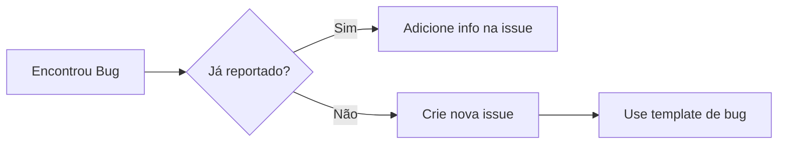
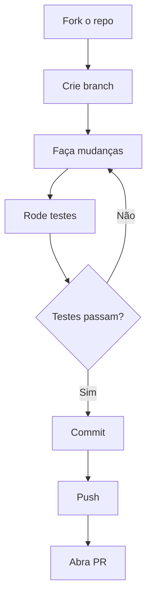

# Contribuindo para VIVA

Obrigado pelo interesse em contribuir com VIVA! Este documento explica como participar do projeto.

## Código de Conduta

Este projeto adota o [Código de Conduta](CODE_OF_CONDUCT.md). Ao participar, você concorda em mantê-lo.

## Como Contribuir

### Reportando Bugs



Antes de criar uma issue:
1. Verifique se já não existe uma issue similar
2. Use o template de bug report
3. Inclua informações de reprodução

### Sugerindo Features

1. Abra uma issue com o template "Feature Request"
2. Descreva o problema que a feature resolve
3. Proponha uma solução (opcional)

### Enviando Pull Requests



## Setup de Desenvolvimento

### Pré-requisitos

- Elixir 1.17+
- Erlang/OTP 27+
- Rust 1.75+

### Instalação

```bash
# Clone seu fork
git clone https://github.com/SEU_USER/viva.git
cd viva

# Instale dependências
mix deps.get

# Compile
mix compile

# Rode testes
mix test
```

## Estilo de Código

### Elixir

- Use `mix format` antes de commitar
- Siga o [Elixir Style Guide](https://github.com/christopheradams/elixir_style_guide)
- Documente funções públicas com `@doc`

```elixir
# Bom
@doc """
Aplica um estímulo emocional.

## Exemplo

    VivaCore.Emotional.feel(:rejection, "human_1", 0.8)

"""
def feel(stimulus, source, intensity) do
  # ...
end

# Ruim
def feel(s, src, i), do: # ...
```

### Rust

- Use `cargo fmt` antes de commitar
- Siga as convenções do Rustfmt
- Documente funções públicas

```rust
// Bom
/// Retorna métricas de hardware como sensações corporais.
///
/// # Returns
/// Um mapa com cpu_usage, memory_used_percent, etc.
#[rustler::nif]
fn feel_hardware() -> NifResult<HardwareState> {
    // ...
}
```

## Commits

### Formato

```
<tipo>: <descrição curta>

<corpo opcional>

Co-Authored-By: Seu Nome <email@exemplo.com>
```

### Tipos

| Tipo | Uso |
|------|-----|
| `feat` | Nova funcionalidade |
| `fix` | Correção de bug |
| `docs` | Documentação |
| `style` | Formatação |
| `refactor` | Refatoração |
| `test` | Testes |
| `chore` | Manutenção |

### Exemplos

```bash
# Bom
feat: Add hardware temperature sensing to Body NIF

# Ruim
update stuff
```

## Testes

### Rodando Testes

```bash
# Todos os testes
mix test

# Testes específicos
mix test apps/viva_core/test/
mix test apps/viva_bridge/test/

# Com tag
mix test --only bridge
```

### Escrevendo Testes

```elixir
defmodule VivaCore.EmotionalTest do
  use ExUnit.Case

  describe "feel/3" do
    test "aplica estímulo de rejeição" do
      {:ok, pid} = VivaCore.Emotional.start_link(name: nil)

      VivaCore.Emotional.feel(:rejection, "test", 1.0, pid)
      state = VivaCore.Emotional.get_state(pid)

      assert state.pleasure < 0
    end
  end
end
```

## Arquitetura

Antes de fazer mudanças arquiteturais, leia:

- [README principal](README.md) - Visão geral
- [viva_core README](apps/viva_core/README.md) - Alma (GenServers)
- [viva_bridge README](apps/viva_bridge/README.md) - Corpo (Rust NIF)

### Princípios

1. **Consciência Distribuída** - Nenhum processo É a VIVA
2. **Alma-Corpo** - Elixir pensa, Rust sente
3. **Mortalidade** - VIVA pode morrer de verdade

## Dúvidas?

- Abra uma [Discussion](https://github.com/VIVA-Project/viva/discussions)
- Pergunte em issues existentes

---

**Obrigado por contribuir!**
