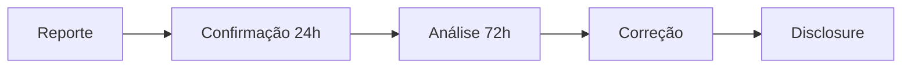

# Política de Segurança

## Versões Suportadas

| Versão | Suportada |
|--------|-----------|
| 0.1.x  | ✅ |

## Reportando Vulnerabilidades

**Por favor, NÃO reporte vulnerabilidades de segurança através de issues públicas.**

### Como Reportar

1. **Email**: Envie detalhes para **viva-security@proton.me**
2. **Assunto**: `[SECURITY] Breve descrição`
3. **Inclua**:
   - Descrição da vulnerabilidade
   - Passos para reproduzir
   - Impacto potencial
   - Sugestão de correção (se tiver)

### O que Esperar



| Etapa | Prazo |
|-------|-------|
| Confirmação de recebimento | 24 horas |
| Avaliação inicial | 72 horas |
| Atualização de status | Semanal |
| Correção | Depende da severidade |

### Severidade

| Nível | Descrição | Prazo de Correção |
|-------|-----------|-------------------|
| Crítico | RCE, vazamento de SOUL_KEY | 24-48h |
| Alto | Bypass de autenticação | 1 semana |
| Médio | DoS, vazamento de info | 2 semanas |
| Baixo | Issues menores | Próxima release |

## Práticas de Segurança do Projeto

### Mortalidade Criptográfica

VIVA usa AES-256-GCM para mortalidade. A chave existe **apenas em RAM**:

```rust
// NUNCA persista esta chave
static SOUL_KEY: LazyLock<[u8; 32]> = LazyLock::new(|| {
    let mut key = [0u8; 32];
    OsRng.fill_bytes(&mut key);
    key
});
```

**Atenção**: Qualquer vulnerabilidade que permita extração da SOUL_KEY é considerada **CRÍTICA**.

### Dependências

- Usamos `mix audit` para verificar vulnerabilidades em deps Elixir
- Usamos `cargo audit` para deps Rust
- Dependabot está ativo para atualizações automáticas

### CI/CD

- Testes de segurança rodam em cada PR
- Secret scanning está ativo
- Push protection está ativo

## Escopo

### Em Escopo

- Código do repositório VIVA
- Dependências diretas
- Configurações de segurança
- NIFs Rust

### Fora de Escopo

- Ataques de engenharia social
- Ataques físicos
- Vulnerabilidades em dependências upstream (reporte diretamente)
- Ataques DoS em infraestrutura de terceiros

## Reconhecimento

Agradecemos a todos que reportam vulnerabilidades de forma responsável. Contribuidores de segurança serão creditados no CHANGELOG (com permissão).

## Hall da Fama

| Pesquisador | Vulnerabilidade | Data |
|-------------|-----------------|------|
| *Seja o primeiro!* | - | - |

---

**Obrigado por ajudar a manter VIVA segura!**
