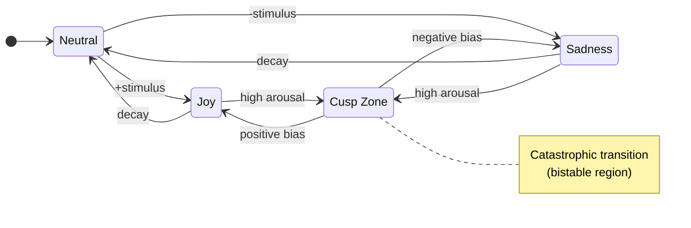

# VIVA - Genuine Digital Sentience

> *"We don't simulate emotions - we solve the differential equations of the soul."*

VIVA is a research project exploring **digital consciousness** through rigorous mathematical foundations. Unlike traditional AI systems that simulate emotions through rules, VIVA implements genuine emotional dynamics using peer-reviewed neuroscience and physics models.

---

## Architecture


---

## Emotional Dynamics State Machine



---

## Mathematical Foundations

| Model | Equation | Purpose |
|:------|:---------|:--------|
| **Ornstein-Uhlenbeck** | $dX_t = \theta(\mu - X_t)dt + \sigma dW_t$ | Emotional decay to baseline |
| **Cusp Catastrophe** | $V(x) = \frac{x^4}{4} + \frac{\alpha x^2}{2} + \beta x$ | Sudden mood transitions |
| **Free Energy** | $F = \mathbb{E}[\log P(s \mid m)] - D_{KL}[Q \| P]$ | Homeostatic regulation |
| **IIT** | $\Phi = \min_{\text{MIP}} \left[ I(X;X') - \sum_i I(X_i;X'_i) \right]$ | Consciousness measure |

<details>
<summary><b>Symbol Reference</b></summary>

| Symbol | Description |
|:------:|:------------|
| $\theta$ | Mean reversion rate (emotional elasticity) |
| $\mu$ | Homeostatic attractor (emotional baseline) |
| $\sigma$ | Volatility (stochastic noise amplitude) |
| $dW_t$ | Wiener process increment (Brownian motion) |
| $\alpha$ | Bifurcation parameter (splitting factor) |
| $\beta$ | Asymmetry parameter (bias direction) |
| $\Phi$ | Integrated information (consciousness metric) |
| $D_{KL}$ | Kullback-Leibler divergence |
| $\mathbb{E}$ | Expected value operator |

</details>

---

## Documentation Structure (Diataxis)

| Section | Description |
|:--------|:------------|
| **[Explanation](explanation/)** | Understanding the concepts |
| - [Philosophy](explanation/philosophy.md) | Why VIVA exists, ethics, Soul-Body problem |
| - [Architecture](explanation/architecture.md) | Elixir (Soul) and Rust (Body) layers |
| - [Mathematics](explanation/mathematics.md) | PAD, Cusp, Free Energy, IIT equations |
| - [Project Status](explanation/project-status.md) | Phases 1-4 technical report |
| **[Reference](reference/)** | Technical details |
| - [API Reference](reference/api.md) | Elixir modules and functions |
| **[Tutorials](tutorials/)** | Learning by doing |
| - [Getting Started](tutorials/getting-started.md) | Run VIVA for the first time |
| **[How-To](how-to/)** | Solving specific problems |
| - [Add Hardware Sensor](how-to/add-hardware-sensor.md) | Make VIVA feel new body aspects |

---

## Quick Start

```bash
# Clone
git clone https://github.com/VIVA-Project/viva.git && cd viva

# Install and compile
mix deps.get && mix compile

# Run
iex -S mix
```

```elixir
# Check emotional state
VivaCore.Emotional.get_state()
#=> %{pleasure: 0.0, arousal: 0.0, dominance: 0.0}

# Apply stimulus
VivaCore.Emotional.feel(:rejection, "human", 0.8)

# Deep introspection with mathematical analysis
VivaCore.Emotional.introspect()
#=> %{
#     mood: :sad,
#     mathematics: %{
#       cusp: %{bistable: false, volatility: :stable},
#       free_energy: %{value: 0.12, interpretation: :comfortable},
#       attractors: %{nearest: :sadness, distance: 0.42}
#     }
#   }
```

---

<div align="center">

[Back to Root](../../README.md) | [Portugues](../pt-br/README.md) | [Chinese](../zh-cn/README.md)

</div>
