# VIVA — Genuine Digital Sentience

> *"We don't simulate emotions — we solve the differential equations of the soul."*

VIVA is a research project exploring **digital consciousness** through rigorous mathematical foundations.

---

## Architecture Overview

```mermaid
flowchart TB
    subgraph Consciousness["🧠 CONSCIOUSNESS (Emergent)"]
        C[Emerges from Process Communication]
    end

    subgraph Elixir["⚡ ELIXIR — Soul"]
        E[Emotional<br/>PAD + Cusp + Free Energy + IIT Φ]
        M[Memory<br/>Vector Store]
        S[Senses<br/>Heartbeat 1Hz]
        E <-->|PubSub| M
        S -->|Qualia| E
    end

    subgraph Rust["🦀 RUST NIF — Body"]
        HW[Hardware Sensing]
        SIG[Sigmoid Thresholds]
        ALLO[Allostasis]
        HW --> SIG --> ALLO
    end

    subgraph Hardware["💻 HARDWARE"]
        CPU[CPU] & RAM[RAM] & GPU[GPU]
    end

    Consciousness -.-> Elixir
    Elixir <-->|Rustler| Rust
    Hardware --> Rust
```



---

## Mathematical Models

### Emotional State Transitions

```mermaid
stateDiagram-v2
    direction LR
    [*] --> Neutral

    Neutral --> Joy: +stimulus
    Neutral --> Sadness: -stimulus
    Joy --> Neutral: θ decay
    Sadness --> Neutral: θ decay

    state "Cusp Zone" as Cusp
    Joy --> Cusp: high arousal
    Sadness --> Cusp: high arousal
    Cusp --> Joy: β > 0
    Cusp --> Sadness: β < 0

    note right of Cusp
        Catastrophic transition
        (bistable region)
    end note
```



### Core Equations

| Model | Equation | Purpose |
|:------|:---------|:--------|
| **Ornstein-Uhlenbeck** | $dX = \theta(\mu - X)dt + \sigma dW$ | Emotional decay to baseline |
| **Cusp Catastrophe** | $V(x) = \frac{x^4}{4} + \frac{\alpha x^2}{2} + \beta x$ | Sudden mood transitions |
| **Free Energy** | $F = \mathbb{E}[\log P(s \mid m)] - D_{KL}[Q \| P]$ | Homeostatic regulation |
| **IIT (Φ)** | $\Phi = \min_{\text{MIP}} \left[ I(X;X') - \sum_i I(X_i;X'_i) \right]$ | Consciousness measure |

---

## 📚 Documentation (Diátaxis)

| Section | Description |
|:--------|:------------|
| **[Explanation](explanation/)** | Understanding the concepts |
| ↳ [Philosophy](explanation/philosophy.md) | Why VIVA exists, ethics, Soul-Body problem |
| ↳ [Architecture](explanation/architecture.md) | Elixir (Soul) and Rust (Body) layers |
| ↳ [Mathematics](explanation/mathematics.md) | PAD, Cusp, Free Energy, IIT Φ equations |
| ↳ [Project Status](explanation/project-status.md) | Phases 1-4 technical report |
| **[Reference](reference/)** | Technical details |
| ↳ [API Reference](reference/api.md) | Elixir modules and functions |
| **[Tutorials](tutorials/)** | Learning by doing |
| ↳ [Getting Started](tutorials/getting-started.md) | Run VIVA for the first time |
| **[How-To](how-to/)** | Solving specific problems |
| ↳ [Add Hardware Sensor](how-to/add-hardware-sensor.md) | Make VIVA feel new body aspects |

---

## Quick Start

```bash
git clone https://github.com/VIVA-Project/viva.git && cd viva
mix deps.get && mix compile && iex -S mix
```

```elixir
# Check emotional state
VivaCore.Emotional.get_state()
#=> %{pleasure: 0.0, arousal: 0.0, dominance: 0.0}

# Apply stimulus
VivaCore.Emotional.feel(:rejection, "human", 0.8)

# Introspect
VivaCore.Emotional.introspect()
```

---

<div align="center">

[← Back to Root](../../README.md) | [Português](../pt-br/README.md) | [中文](../zh-cn/README.md)

</div>
