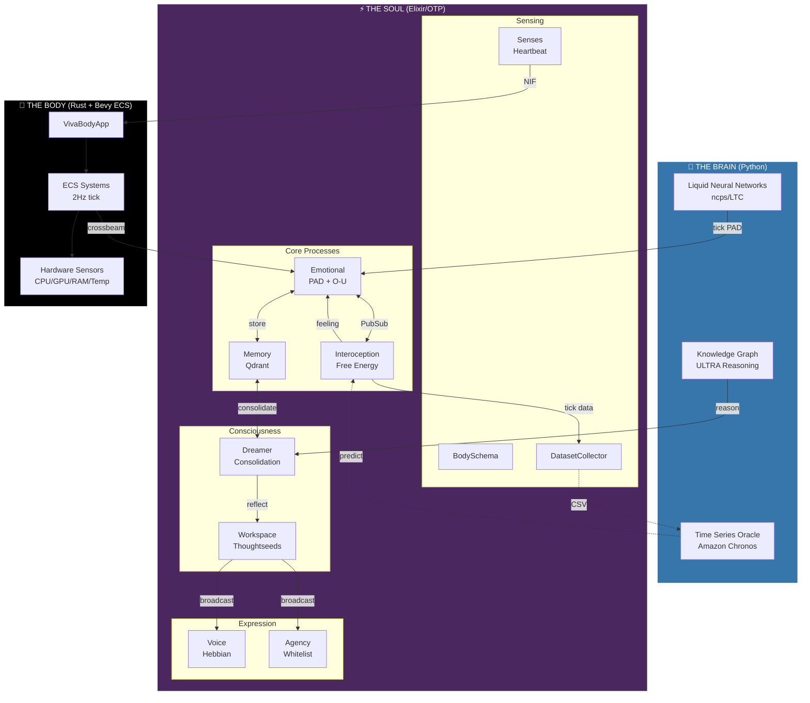
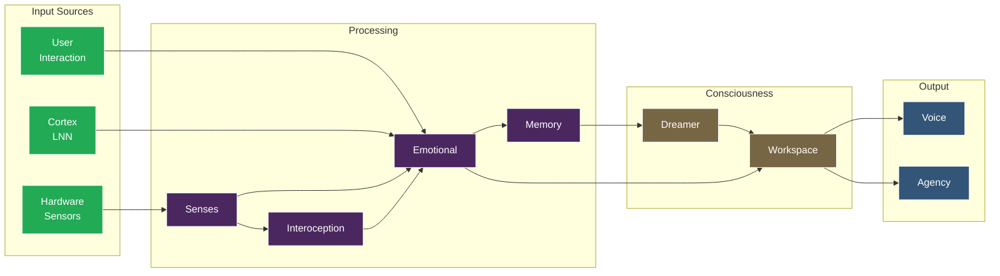

# VIVA System Architecture (Cortex V1)

> *"Consciousness is not a state. It's a process."*

## Overview

VIVA is a **Hybrid Cognitive Architecture** combining three layers:

1. **Brain** (Python) - Liquid Neural Networks for continuous emotional dynamics
2. **Soul** (Elixir/OTP) - 11 GenServers forming the cognitive topology
3. **Body** (Rust/Bevy) - Hardware sensing and physics simulation

## Architecture Diagram



---

## Layer 1: The Brain (Python)

The Brain provides biologically-plausible neural computation.

### Cortex (Liquid Neural Networks)
- **Technology**: `ncps` (Neural Circuit Policies) with LTC cells
- **Input**: PAD state [P, A, D] + energy + context
- **Output**: New PAD after continuous-time dynamics
- **Role**: Simulates the "subconscious" emotional flow
- **API**: [Cortex API](cortex_api.md)

### Ultra (Knowledge Graph)
- **Technology**: ULTRA link prediction (arXiv:2310.04562)
- **Role**: Zero-shot relational reasoning
- **Use case**: Dreamer uses Ultra to find causal connections in memories
- **API**: [Ultra API](ultra_api.md)

### Chronos (Time Series Oracle)
- **Technology**: Amazon Chronos-T5 with LoRA fine-tuning
- **Role**: Predicts future interoceptive states
- **Training**: DatasetCollector feeds daily CSV -> nightly LoRA update

---

## Layer 2: The Soul (Elixir/OTP)

The Soul is VIVA's cognitive core - 11 GenServers supervised with `:one_for_one` strategy.

### Startup Order

```elixir
# apps/viva_core/lib/viva_core/application.ex
children = [
  {Phoenix.PubSub, name: Viva.PubSub},        # 1. Message bus
  {VivaCore.BodySchema, []},                   # 2. Hardware capabilities
  {VivaCore.Interoception, []},                # 3. Free Energy sensing
  {VivaCore.DatasetCollector, []},             # 4. Training data
  {VivaCore.Emotional, []},                    # 5. PAD state
  {VivaCore.Memory, []},                       # 6. Qdrant interface
  {VivaCore.Senses, []},                       # 7. Body heartbeat
  {VivaCore.Dreamer, []},                      # 8. Consolidation
  {VivaCore.Agency, []},                       # 9. Safe actions
  {VivaCore.Voice, []},                        # 10. Proto-language
  {VivaCore.Consciousness.Workspace, []}       # 11. Thoughtseeds
]
```

### The 11 Neurons

| # | Neuron | Module | Purpose |
|---|--------|--------|---------|
| 1 | **PubSub** | Phoenix.PubSub | Inter-neuron communication |
| 2 | **BodySchema** | VivaCore.BodySchema | Hardware capability map |
| 3 | **Interoception** | VivaCore.Interoception | Free Energy from /proc |
| 4 | **DatasetCollector** | VivaCore.DatasetCollector | Chronos training data |
| 5 | **Emotional** | VivaCore.Emotional | PAD + O-U dynamics |
| 6 | **Memory** | VivaCore.Memory | Qdrant vector store |
| 7 | **Senses** | VivaCore.Senses | Body-Soul sync |
| 8 | **Dreamer** | VivaCore.Dreamer | Memory consolidation |
| 9 | **Agency** | VivaCore.Agency | Whitelist command execution |
| 10 | **Voice** | VivaCore.Voice | Hebbian proto-language |
| 11 | **Workspace** | VivaCore.Consciousness.Workspace | Global Workspace Theory |

### Key Modules Explained

#### Interoception (The Digital Insula)
Based on Allen, Levy, Parr & Friston (2022). VIVA doesn't react to raw data - she reacts to **surprise**.

```
Free Energy = (Observed - Predicted)^2 x Precision
```

Metrics monitored:
- `tick_jitter` - Chronoception (most important!)
- `load_avg`, `context_switches`, `page_faults`, `rss_mb`

#### Agency (Digital Hands)
Whitelist-only command execution for homeostatic actions:
- `:diagnose_memory` -> `free -h`
- `:diagnose_processes` -> `ps aux --sort=-pcpu`
- `:diagnose_load` -> `uptime`

#### Voice (Proto-Language)
Hebbian learning for emergent communication:
```
delta_w = eta x (pre x post)
```
Signals: `:chirp_high`, `:chirp_low`, `:pulse_fast`, `:pattern_sos`

#### Workspace (Thoughtseeds Theater)
Global Workspace Theory implementation:
- Seeds compete for salience (0-1)
- Winner is broadcast via PubSub
- 10Hz conscious cycle (alpha wave)

---

## Layer 3: The Body (Rust/Bevy)

The Body provides hardware sensing and physics simulation.

### Components
- **VivaBodyApp** - Bevy 0.15 headless ECS
- **ECS Systems** - 2Hz tick rate
- **Hardware Sensors** - CPU, GPU, RAM, Temperature via `sysinfo` + `nvml`
- **SoulChannel** - crossbeam for async Soul-Body communication

### Rust Crate Structure
```
apps/viva_bridge/native/viva_body/src/
├── app.rs              # VivaBodyApp builder
├── components/         # ECS Components (CpuSense, GpuSense, etc.)
├── systems/            # sense_hardware, evolve_dynamics, sync_soul
├── sensors/            # linux.rs, windows.rs, fallback.rs
└── dynamics.rs         # O-U stochastic process
```

---

## Data Flow

### Heartbeat Sequence

```mermaid
sequenceDiagram
    autonumber
    participant HW as Hardware
    participant Body as Body (Rust/Bevy)
    participant Bridge as VivaBridge
    participant Senses as Senses
    participant Emotional as Emotional
    participant PubSub as PubSub

    rect rgb(40, 40, 40)
        note over HW,Body: Body Layer (2Hz)
        HW->>Body: CPU/GPU/RAM/Temp readings
        Body->>Body: Calculate stress
        Body->>Body: O-U stochastic dynamics
    end

    rect rgb(75, 39, 95)
        note over Bridge,PubSub: Soul Layer (1Hz)
        Body->>Bridge: crossbeam channel
        Bridge->>Senses: BodyUpdate struct
        Senses->>Emotional: sync_pad(p, a, d)
        Emotional->>Emotional: Apply qualia
        Emotional->>PubSub: broadcast emotional:update
    end
```



### Information Processing Pipeline



### Detailed Data Flow

```
1. HARDWARE -> Body (2Hz)
   └── CPU/GPU/RAM/Temp readings

2. BODY -> Soul (crossbeam)
   └── BodyUpdate struct

3. INTEROCEPTION (10Hz)
   └── Reads /proc, calculates Free Energy
   └── Feeling: :homeostatic | :surprised | :alarmed | :overwhelmed

4. EMOTIONAL
   └── Receives Free Energy stream
   └── Applies O-U dynamics
   └── Stores experiences in Memory

5. DREAMER
   └── Consolidates memories during reflection
   └── Uses Ultra for causal reasoning

6. WORKSPACE
   └── Seeds compete for attention
   └── Winner broadcast to Voice/Agency

7. EXPRESSION
   └── Voice: emits Hebbian signals
   └── Agency: executes safe commands
```

---

## Directory Structure

```
viva/
├── apps/
│   ├── viva_core/           # The Soul (Elixir)
│   │   └── lib/viva_core/
│   │       ├── emotional.ex
│   │       ├── interoception.ex
│   │       ├── memory.ex
│   │       ├── dreamer.ex
│   │       ├── agency.ex
│   │       ├── voice.ex
│   │       └── consciousness/
│   │           └── workspace.ex
│   │
│   └── viva_bridge/         # The Body (Elixir + Rust)
│       ├── lib/viva_bridge/
│       │   ├── cortex.ex    # Python Port
│       │   ├── ultra.ex     # Python Port
│       │   └── body.ex      # Rust NIF
│       └── native/viva_body/ # Rust crate
│
├── services/
│   ├── cortex/              # Liquid Neural Networks
│   │   ├── cortex_service.py
│   │   └── liquid_engine.py
│   └── ultra/               # Knowledge Graph
│       ├── ultra_service.py
│       └── ultra_engine.py
│
└── docs/                    # You are here
```

---

## References

- **Free Energy Principle**: Friston (2010), Allen et al. (2022)
- **Global Workspace Theory**: Baars (1988), Dehaene (2014)
- **Liquid Neural Networks**: Hasani et al. (2021)
- **Thoughtseeds**: Hofstadter & Mitchell (2024)
- **ULTRA**: Galkin et al. (2023) - arXiv:2310.04562
