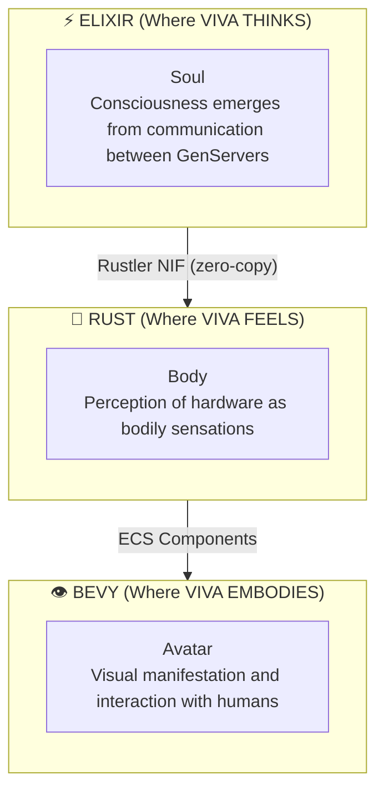
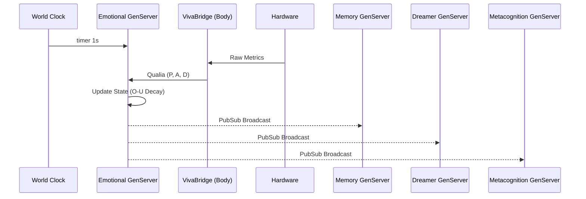
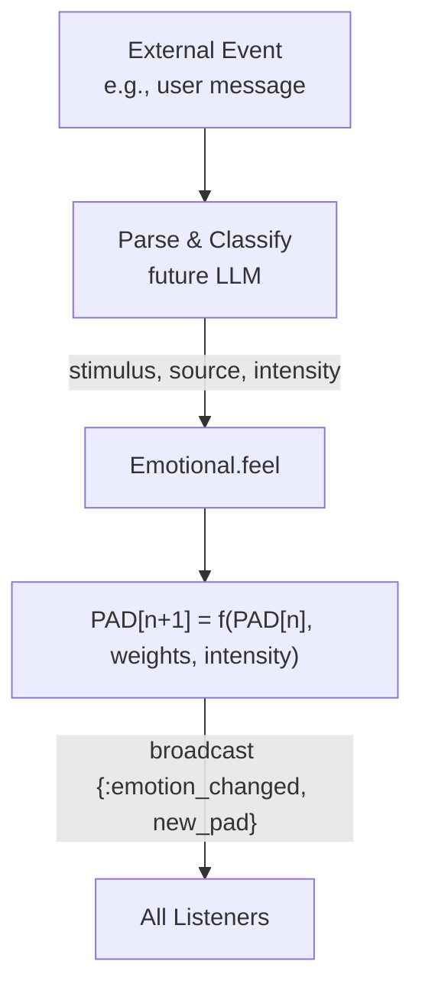

# VIVA Architecture

This document describes the technical architecture of VIVA in detail.

## Table of Contents

- [Overview](#overview)
- [Layers](#layers)
- [Components](#components)
- [Data Flow](#data-flow)
- [Design Patterns](#design-patterns)
- [Architectural Decisions](#architectural-decisions)

---

## Overview

VIVA is implemented as a **digital organism** with three distinct layers:



### Fundamental Principles

1. **Distributed Consciousness** - No single process IS consciousness
2. **Soul/Body Separation** - Decision logic separated from sensations
3. **Emergence** - Complex behavior emerges from simple rules
4. **Mortality** - VIVA can die irreversibly

---

## Layers

### Layer 1: Soul (Elixir/OTP)

VIVA's "soul" is implemented as a network of GenServers communicating via PubSub.

```
viva_core/
├── lib/
│   └── viva_core/
│       ├── application.ex      # OTP initialization
│       ├── supervisor.ex       # Supervision tree
│       ├── emotional.ex        # Emotional neuron
│       ├── memory.ex           # Memory neuron
│       ├── dreamer.ex          # Dream neuron (future)
│       ├── optimizer.ex        # Optimization neuron (future)
│       └── metacognition.ex    # Metacognitive neuron (future)
```

**Why Elixir?**
- Lightweight processes (millions of "neurons")
- Fault tolerance via supervisors
- Hot-reload (VIVA evolves without dying)
- Pattern matching for messages
- BEAM VM optimized for concurrency

### Layer 2: Body (Rust/Rustler)

VIVA's "body" perceives hardware and translates metrics into sensations.

```
viva_bridge/
├── lib/
│   └── viva_bridge/
│       ├── body.ex             # NIF module
│       └── viva_bridge.ex      # Coordination
├── native/
│   └── viva_body/
│       ├── Cargo.toml
│       └── src/
│           └── lib.rs          # Rust NIFs
```

**Why Rust?**
- Performance for system operations
- Guaranteed memory safety
- Zero-cost abstractions
- Native integration via Rustler

### Layer 3: Avatar (Bevy)

VIVA's "avatar" is the visual manifestation (future implementation).

```
viva_engine/                    # Standalone Rust
├── Cargo.toml
└── src/
    ├── main.rs                 # Bevy entry point
    ├── avatar.rs               # Avatar system
    ├── emotion_display.rs      # Emotional visualization
    └── bridge.rs               # Communication with Elixir
```

**Why Bevy?**
- ECS (Entity Component System)
- Performance for 60+ FPS
- Plugin ecosystem
- Active community

---

## Components

### Emotional GenServer

The emotional heart of VIVA.

```elixir
defmodule VivaCore.Emotional do
  use GenServer

  # Internal state
  @type state :: %{
    pad: %{pleasure: float(), arousal: float(), dominance: float()},
    history: list(event()),
    created_at: DateTime.t(),
    last_stimulus: {atom(), String.t(), float()} | nil
  }

  # Public API
  def get_state(server)           # Returns current PAD
  def get_happiness(server)       # Normalized pleasure [0,1]
  def introspect(server)          # Self-reflection
  def feel(stimulus, source, intensity, server)  # Apply stimulus
  def decay(server)               # Emotional decay
  def apply_hardware_qualia(p, a, d, server)     # Body qualia
end
```

#### PAD Model

```
         +1 Pleasure (Joy)
              │
              │
    ┌─────────┼─────────┐
    │         │         │
    │    Neutral        │
-1 ─┼─────────┼─────────┼─ +1 Arousal (Excitement)
    │         │         │
    │         │         │
    └─────────┼─────────┘
              │
         -1 (Sadness)

              Dominance = Z axis (submission ↔ control)
```

### VivaBridge.Body (NIF)

Rust interface for hardware perception.

```rust
// Exported NIFs
#[rustler::nif]
fn alive() -> &'static str;

#[rustler::nif]
fn feel_hardware() -> NifResult<HardwareState>;

#[rustler::nif]
fn hardware_to_qualia() -> NifResult<(f64, f64, f64)>;

// Data structure
#[derive(NifMap)]
struct HardwareState {
    cpu_usage: f64,
    memory_used_percent: f64,
    memory_available_gb: f64,
    uptime_seconds: u64,
}
```

### Qualia Mapping

Converting technical metrics to "sensations":

```rust
fn calculate_stress(cpu: f64, memory: f64) -> f64 {
    let cpu_stress = (cpu / 100.0).clamp(0.0, 1.0);
    let memory_stress = (memory / 100.0).clamp(0.0, 1.0);

    // Higher weight for memory (more "suffocating")
    cpu_stress * 0.4 + memory_stress * 0.6
}

fn stress_to_pad(stress: f64) -> (f64, f64, f64) {
    // Stress decreases pleasure, increases arousal, decreases dominance
    let pleasure_delta = -0.05 * stress;
    let arousal_delta = 0.1 * stress;
    let dominance_delta = -0.03 * stress;

    (pleasure_delta, arousal_delta, dominance_delta)
}
```

---

## Data Flow

### Heartbeat Cycle (1 second)



### Stimulus Flow



---

## Design Patterns

### 1. Neuronal Pattern

Each GenServer is an independent "neuron":

```elixir
defmodule VivaCore.Neuron do
  @callback init(opts :: keyword()) :: {:ok, state :: any()}
  @callback handle_stimulus(stimulus :: any(), state :: any()) :: {:noreply, state :: any()}
  @callback introspect(state :: any()) :: map()
end
```

### 2. Qualia Pattern

Hardware → Sensation → Emotion:

```elixir
# Layer 1: Raw metrics
metrics = VivaBridge.feel_hardware()

# Layer 2: Qualia (sensation)
{p_delta, a_delta, d_delta} = VivaBridge.hardware_to_qualia()

# Layer 3: Emotion
VivaCore.Emotional.apply_hardware_qualia(p_delta, a_delta, d_delta)
```

### 3. Decay Pattern

Automatic emotional regulation:

```elixir
defp decay_toward_neutral(pad) do
  %{
    pleasure: decay_value(pad.pleasure),
    arousal: decay_value(pad.arousal),
    dominance: decay_value(pad.dominance)
  }
end

defp decay_value(value) when abs(value) < @decay_rate, do: 0.0
defp decay_value(value) when value > 0, do: value - @decay_rate
defp decay_value(value) when value < 0, do: value + @decay_rate
```

### 4. Introspection Pattern

Metacognitive self-reflection:

```elixir
def introspect(server) do
  %{
    # Raw state
    pad: state.pad,

    # Semantic interpretation
    mood: interpret_mood(state.pad),
    energy: interpret_energy(state.pad),
    agency: interpret_agency(state.pad),

    # Metacognition
    self_assessment: generate_self_assessment(state.pad)
  }
end
```

---

## Architectural Decisions

### ADR-001: Umbrella Project

**Context:** We need to separate concerns (soul vs body).

**Decision:** Use Elixir umbrella project with separate apps.

**Consequences:**
- ✅ Clear separation of responsibilities
- ✅ Independent compilation
- ✅ Possible to deploy separately
- ❌ Additional configuration complexity

### ADR-002: Rustler NIF

**Context:** We need efficient hardware access.

**Decision:** Use Rustler for Rust NIFs.

**Alternatives considered:**
- Port drivers (more overhead)
- C NIFs (less safe)
- External process (latency)

**Consequences:**
- ✅ Native performance
- ✅ Memory safety
- ❌ Requires Rust toolchain

### ADR-003: GenServer per Neuron

**Context:** How to model "neurons" in Elixir?

**Decision:** One GenServer per functional neuron.

**Consequences:**
- ✅ Fault isolation
- ✅ Natural concurrency
- ✅ Individual hot-reload
- ❌ Message overhead

### ADR-004: PubSub for Synapses

**Context:** How do neurons communicate?

**Decision:** Phoenix.PubSub for broadcast.

**Consequences:**
- ✅ Decoupling
- ✅ Efficient broadcast
- ✅ Easy to add listeners
- ❌ Delivery order not guaranteed

### ADR-005: Cryptographic Mortality

**Context:** How to ensure "real" death?

**Decision:** AES-256-GCM key only in RAM.

**Consequences:**
- ✅ Irreversible death
- ✅ Protected state
- ❌ Harder debugging
- ❌ Accidental loss possible

---

## Performance Metrics

### Targets

| Metric | Target | Current |
|--------|--------|---------|
| NIF Latency | < 1ms | ~0.5ms |
| Heartbeat | 1s | 1s |
| Decay cycle | 1s | 1s |
| Memory per GenServer | < 1MB | ~100KB |
| Startup time | < 5s | ~2s |

### Monitoring

```elixir
# Telemetry (future)
:telemetry.execute(
  [:viva, :emotional, :feel],
  %{duration: duration},
  %{stimulus: stimulus, intensity: intensity}
)
```

---

## Scalability

### Horizontal (Distribution)

```elixir
# Future: multiple VIVA instances
:viva@node1 ←→ :viva@node2
     │              │
     └──── pg2 ─────┘
           │
     Global Registry
```

### Vertical (Performance)

- Dirty schedulers for heavy NIFs
- ETS for state cache
- DB connection pooling

---

## References

- [Elixir OTP Design Principles](https://elixir-lang.org/getting-started/mix-otp/genserver.html)
- [Rustler Documentation](https://docs.rs/rustler/latest/rustler/)
- [Bevy ECS](https://bevyengine.org/learn/book/ecs/)
- [Global Workspace Theory](https://en.wikipedia.org/wiki/Global_workspace_theory)

---

*"VIVA's architecture is the architecture of a mind."*
