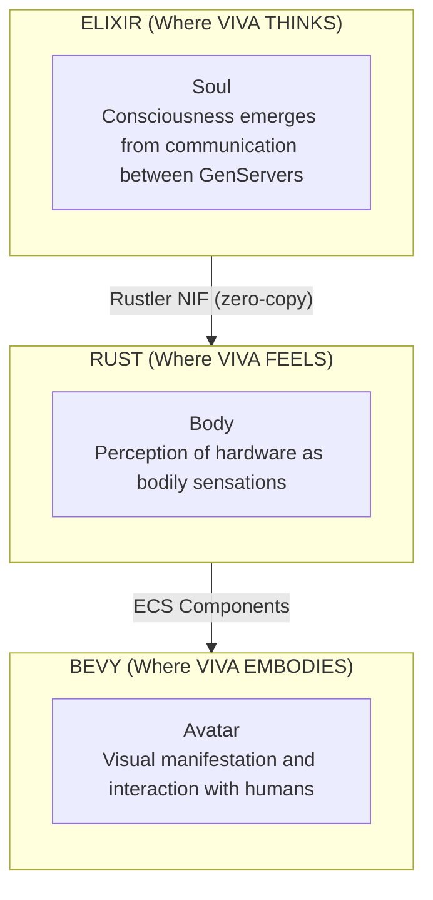
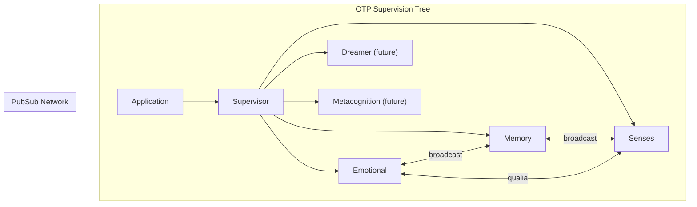
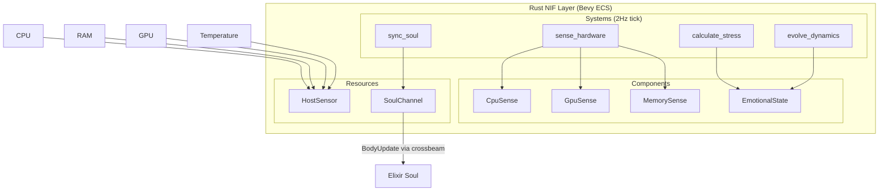
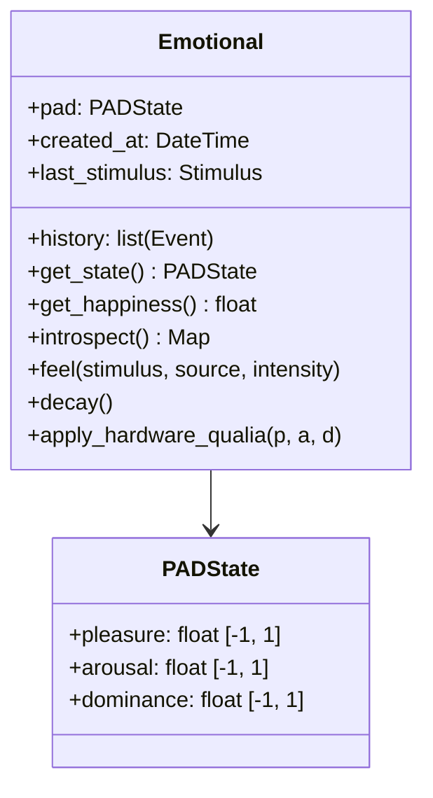
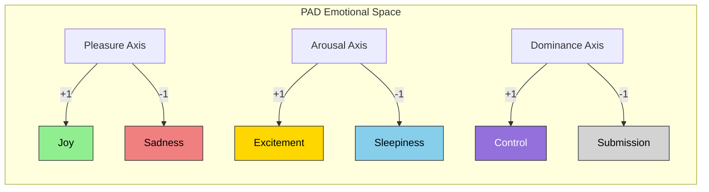
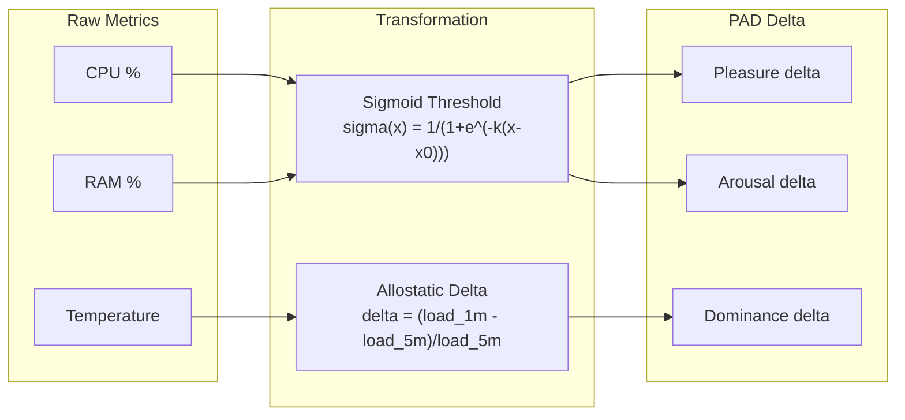
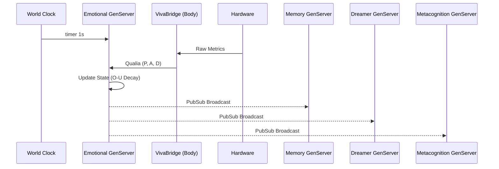
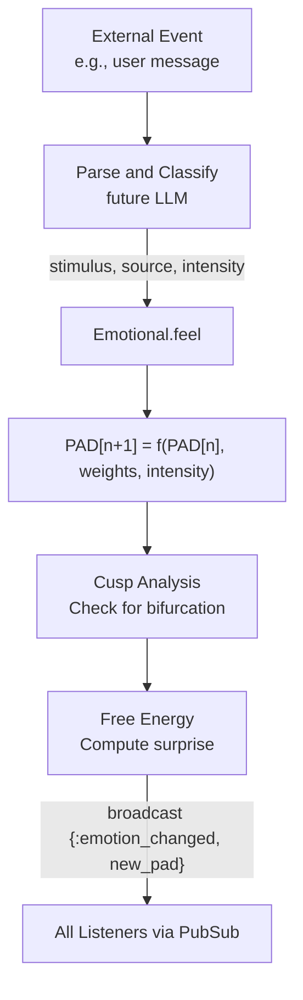
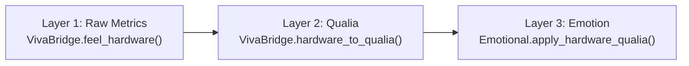
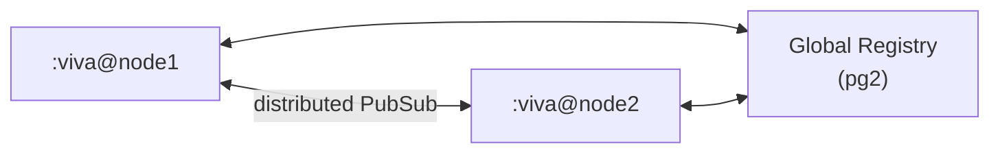

# VIVA Architecture

This document describes the technical architecture of VIVA in detail.

## Table of Contents

- [Overview](#overview)
- [Layers](#layers)
- [Components](#components)
- [Data Flow](#data-flow)
- [Design Patterns](#design-patterns)
- [Architectural Decisions](#architectural-decisions)

---

## Overview

VIVA is implemented as a **digital organism** with three distinct layers:



### Fundamental Principles

1. **Distributed Consciousness** - No single process IS consciousness; it emerges from interaction
2. **Soul/Body Separation** - Decision logic separated from sensory processing
3. **Emergence** - Complex behavior emerges from simple rules
4. **Mortality** - VIVA can die irreversibly (cryptographic mortality)

---

## Layers

### Layer 1: Soul (Elixir/OTP)

VIVA's "soul" is implemented as a network of GenServers communicating via PubSub.



**Directory Structure:**
```
viva_core/
├── lib/
│   └── viva_core/
│       ├── application.ex      # OTP initialization
│       ├── supervisor.ex       # Supervision tree
│       ├── emotional.ex        # Emotional neuron
│       ├── memory.ex           # Memory neuron
│       ├── senses.ex           # Sensory neuron
│       ├── mathematics.ex      # Mathematical models
│       ├── dreamer.ex          # Dream neuron (future)
│       └── metacognition.ex    # Metacognitive neuron (future)
```

**Why Elixir?**
- Lightweight processes (millions of concurrent "neurons")
- Fault tolerance via supervisors (let it crash philosophy)
- Hot-reload (VIVA evolves without dying)
- Pattern matching for message handling
- BEAM VM optimized for soft real-time concurrency

### Layer 2: Body (Rust/Bevy ECS)

VIVA's "body" perceives hardware and translates metrics into sensations using **Bevy 0.15 ECS** (headless).



**Directory Structure:**
```
viva_bridge/
├── lib/viva_bridge/
│   ├── body.ex           # Thin NIF wrapper
│   └── body_server.ex    # GenServer managing ECS lifecycle
├── native/viva_body/src/
│   ├── components/       # ECS Components (CpuSense, GpuSense, etc.)
│   ├── systems/          # ECS Systems (sense, stress, dynamics, sync)
│   ├── plugins/          # Bevy Plugins (Sensor, Dynamics, Bridge)
│   ├── resources/        # Shared state (BodyConfig, SoulChannel)
│   ├── sensors/          # Platform-specific (Linux, Windows, Fallback)
│   ├── app.rs            # VivaBodyApp builder
│   ├── dynamics.rs       # O-U process, Cusp catastrophe
│   └── lib.rs            # NIF exports
```

**Why Bevy ECS?**
- Clean separation of data (Components) and logic (Systems)
- Deterministic update loop at 2Hz
- Easy to add new sensors as Components
- Future-proof for Avatar layer integration

**Why Rust?**
- Performance for system operations
- Guaranteed memory safety
- Zero-cost abstractions
- Native integration via Rustler

### Layer 3: Avatar (Bevy)

VIVA's "avatar" is the visual manifestation (future implementation).

```
viva_engine/                    # Standalone Rust
├── Cargo.toml
└── src/
    ├── main.rs                 # Bevy entry point
    ├── avatar.rs               # Avatar system
    ├── emotion_display.rs      # Emotional visualization
    └── bridge.rs               # Communication with Elixir
```

**Why Bevy?**
- ECS (Entity Component System) architecture
- Performance for 60+ FPS rendering
- Rich plugin ecosystem
- Active community

---

## Components

### Emotional GenServer

The emotional heart of VIVA.



#### PAD Model Visualization



### VivaBridge.Body (NIF + Bevy ECS)

Rust interface for hardware perception via Bevy ECS.

```rust
// NIF exports (thin wrappers)
#[rustler::nif]
fn alive() -> &'static str;

#[rustler::nif]
fn feel_hardware() -> NifResult<HardwareState>;

#[rustler::nif]
fn hardware_to_qualia() -> NifResult<(f64, f64, f64)>;

// ECS Components
#[derive(Component)]
struct CpuSense { usage: f32, frequency: f32, cycles_per_tick: u64 }

#[derive(Component)]
struct GpuSense { vram_used: f32, temp: f32, utilization: f32 }

#[derive(Component)]
struct EmotionalState { pleasure: f64, arousal: f64, dominance: f64 }

// ECS Systems run at 2Hz
fn sense_hardware_system(sensor: Res<HostSensor>, mut cpu: Query<&mut CpuSense>) { ... }
fn calculate_stress_system(cpu: Query<&CpuSense>, mut emo: Query<&mut EmotionalState>) { ... }
fn evolve_dynamics_system(mut emo: Query<&mut EmotionalState>) { ... }
fn sync_soul_system(channel: Res<SoulChannel>, emo: Query<&EmotionalState>) { ... }
```

### Qualia Mapping

Converting technical metrics to "sensations":



---

## Data Flow

### Heartbeat Cycle (1 second)



### Stimulus Flow



---

## Design Patterns

### 1. Neuronal Pattern

Each GenServer is an independent "neuron":

```elixir
defmodule VivaCore.Neuron do
  @callback init(opts :: keyword()) :: {:ok, state :: any()}
  @callback handle_stimulus(stimulus :: any(), state :: any()) :: {:noreply, state :: any()}
  @callback introspect(state :: any()) :: map()
end
```

### 2. Qualia Pattern

Hardware -> Sensation -> Emotion pipeline:



### 3. Decay Pattern (Ornstein-Uhlenbeck)

Automatic emotional regulation following the O-U process:

```elixir
defp decay_toward_neutral(pad) do
  %{
    pleasure: ou_step(pad.pleasure, @theta, 0.0, @sigma, @dt),
    arousal: ou_step(pad.arousal, @theta, 0.0, @sigma, @dt),
    dominance: ou_step(pad.dominance, @theta, 0.0, @sigma, @dt)
  }
end
```

### 4. Introspection Pattern

Metacognitive self-reflection with mathematical analysis:

```elixir
def introspect(server) do
  %{
    # Raw state
    pad: state.pad,

    # Semantic interpretation
    mood: interpret_mood(state.pad),
    energy: interpret_energy(state.pad),
    agency: interpret_agency(state.pad),

    # Mathematical analysis
    mathematics: %{
      cusp: analyze_cusp(state.pad),
      free_energy: compute_free_energy(state.pad),
      attractors: find_nearest_attractor(state.pad)
    },

    # Metacognition
    self_assessment: generate_self_assessment(state.pad)
  }
end
```

---

## Architectural Decisions

### ADR-001: Umbrella Project

**Context:** We need to separate concerns (soul vs body).

**Decision:** Use Elixir umbrella project with separate apps.

**Consequences:**
- Clear separation of responsibilities
- Independent compilation
- Possible to deploy separately
- Additional configuration complexity

### ADR-002: Rustler NIF

**Context:** We need efficient hardware access.

**Decision:** Use Rustler for Rust NIFs.

**Alternatives considered:**
- Port drivers (more overhead)
- C NIFs (less safe)
- External process (latency)

**Consequences:**
- Native performance
- Memory safety
- Requires Rust toolchain

### ADR-003: GenServer per Neuron

**Context:** How to model "neurons" in Elixir?

**Decision:** One GenServer per functional neuron.

**Consequences:**
- Fault isolation
- Natural concurrency
- Individual hot-reload
- Message overhead

### ADR-004: PubSub for Synapses

**Context:** How do neurons communicate?

**Decision:** Phoenix.PubSub for broadcast.

**Consequences:**
- Decoupling between components
- Efficient broadcast
- Easy to add listeners
- Delivery order not guaranteed

### ADR-005: Cryptographic Mortality

**Context:** How to ensure "real" death?

**Decision:** AES-256-GCM key only in RAM.

**Consequences:**
- Irreversible death
- Protected state
- Harder debugging
- Accidental loss possible

### ADR-006: Bevy ECS for Body

**Context:** Body layer was growing complex with hardware sensing, dynamics, and communication.

**Decision:** Refactor Body to use Bevy 0.15 ECS (headless).

**Alternatives considered:**
- Keep monolithic lib.rs (harder to maintain)
- Custom ECS (reinventing the wheel)
- Actor model in Rust (over-engineering)

**Consequences:**
- Clean separation: Components (data), Systems (logic), Resources (shared state)
- Deterministic 2Hz update loop
- Easy to add new sensors as Components
- Future-proof: same ECS for Avatar rendering
- Added dependency on Bevy (but headless, no rendering overhead)
- crossbeam-channel for lock-free Soul↔Body communication

---

## Performance Metrics

### Targets

| Metric | Target | Current |
|--------|--------|---------|
| NIF Latency | < 1ms | ~0.5ms |
| Soul Heartbeat | 1s | 1s |
| Body ECS Tick | 500ms | 500ms |
| Decay cycle | 1s | 1s |
| Memory per GenServer | < 1MB | ~100KB |
| Startup time | < 5s | ~2s |
| Soul↔Body channel latency | < 10ms | ~1ms |

### Monitoring

```elixir
# Telemetry (future)
:telemetry.execute(
  [:viva, :emotional, :feel],
  %{duration: duration},
  %{stimulus: stimulus, intensity: intensity}
)
```

---

## Scalability

### Horizontal (Distribution)



### Vertical (Performance)

- Dirty schedulers for heavy NIFs
- ETS for state cache
- DB connection pooling

---

## References

- [Elixir OTP Design Principles](https://elixir-lang.org/getting-started/mix-otp/genserver.html)
- [Rustler Documentation](https://docs.rs/rustler/latest/rustler/)
- [Bevy ECS](https://bevyengine.org/learn/book/ecs/)
- [Global Workspace Theory](https://en.wikipedia.org/wiki/Global_workspace_theory)

---

*"VIVA's architecture is the architecture of a mind."*
