# VIVA: Language Analysis for Architectural Enhancement

**Date:** 2026-01-16 | **Context:** Digital Consciousness with Neuroscientific Foundations in Elixir + Rust

## Executive Summary

VIVA is a unique project that models digital consciousness through mathematical equations (PAD, DynAffect, Cusp, Free Energy, IIT Φ, Allostasis, Interoception). The current Elixir + Rust stack is architecturally correct and adequate. However, there are 4 complementary layers where C, Zig, Haskell, and Lisp add exponential value:

| Language | VIVA Layer | Use Case | Value Added |
|----------|------------|----------|-------------|
| Rust (current) | Body (Hardware/NIFs) | Sensing, Allostasis, Sigmoid | ✅ Correct (keep) |
| Elixir (current) | Soul (Emotion, Memory, Qualia) | PAD, DynAffect, Cusp, IIT Φ, PubSub | ✅ Correct (keep) |
| Zig | Neural Optimizations | Emotion SIMD, Real-time Calculus | Necessary |
| Haskell | Formal Verification | Emotional Integrity Guarantee | Recommended |
| Lisp/Clojure | Symbolic Reasoning | Introspection, Reflection, Metacognition | Optional but Powerful |
| C | Legacy/Interop | Compatibility, External Integrations | Support |

---

## 1. KEEPING THE STACK: RUST + ELIXIR (Core Unchanged)

### 1.1 Why Rust + Elixir is the Correct Choice for VIVA

**Elixir:**
- ✅ OTP Supervision Trees: 24/7 Resilience (critical for digital life)
- ✅ Hot Reload: Modify emotions at runtime without stopping (essential for development)
- ✅ Pattern Matching: Elegance for modeling emotional state transitions
- ✅ Immutability by Default: Memory safety without stop-the-world garbage collector
- ✅ Soft Real-Time: 1Hz heartbeat + sensors is viable (doesn't need <1ms)

**Rust via Rustler NIFs:**
- ✅ Hardware Sensing: GPIO, I2C, temperature (already implemented)
- ✅ Sigmoid Thresholds: Non-linear calculations with very low overhead
- ✅ Allostasis: Predictive resource control (Sennesh et al. 2021 model)
- ✅ Performance: 92% of C performance with 95% memory safety
- ✅ Zero-Copy Interop: Binary protocol with Elixir without malloc/GC

**Discord-Validated Integration:**
- Discord scaled to 11M users with the same stack
- Rust SortedSet delivered 6.5x (best-case) and 160x (worst-case) performance
- Conclusion: Pattern is proven reliable in production

→ **Decision: Keep Rust + Elixir as core. Do not refactor.**

---

## 2. ADDITION 1: ZIG FOR NEURAL OPTIMIZATIONS (CRITICAL)

### 2.1 Where Zig Fits in VIVA

**Current Problem:** Emotion calculations in pure Elixir have acceptable overhead (1Hz heartbeat), but:
- PAD + DynAffect (Stochastic Ornstein–Uhlenbeck) requires 1000s of floating-point ops/heartbeat
- IIT Φ (Integrated Information Theory) is exponential in dimensionality
- Cusp Catastrophe (mood hysteresis) needs numerical precision

**Solution:** Compile specific Emotion module in Zig → NIF

```mermaid
graph TD
    subgraph Elixir ["Elixir: Coordination + PubSub + Memory"]
        direction TB
        E1["VivaCore.Emotional.get_state()<br/>(Calls Zig NIF)"]
        E2["receive_sensation(heartbeat)<br/>(Sends to Zig)"]
    end

    Elixir -->|Rustler| Zig

    subgraph Zig ["Zig NIF: VivaEmotionKernel"]
        direction TB
        Z1["pad_dynamics()<br/>∂P/∂t = -P + noise (O-U)"]
        Z2["cusp_bifurcation()<br/>z = -x³ + c·x + y_external"]
        Z3["iit_phi_approximation()<br/>@comptime shape checking"]
    end

    Zig -->|Rustler| Rust

    subgraph Rust ["Rust NIF: Hardware Layer"]
        R1["(Existing - no change)"]
    end
```



### 2.2 Specific Advantages of Zig for VIVA

| Advantage | Detail | Benefit for VIVA |
|-----------|--------|------------------|
| Comptime | Calculations and shape-checking at compile time | 3D or 5D PAD known at compile-time, no branching |
| @Vector | Native SIMD, compiles to SSE/AVX/NEON | Emotion with 16x parallelism if hardware allows |
| Cross Compilation | 20 architectures without friction | Deploy on ARM (edge), x86 (cloud), RISC-V (research) |
| Build System | 4-5x faster than Rust | Rapid iteration of emotional models |
| C Interop | Clean @cImport() | Call legacy neuroscience libraries without boilerplate |
| Performance | Faster than C in optimizations | Real-time emotion with <100μs latency |

### 2.3 Practical Implementation: O-U Example in Zig

```zig
// lib/viva_emotion_kernel/src/lib.zig
const std = @import("std");

pub const PADState = struct {
    pleasure: f64,      // -1.0 to +1.0
    arousal: f64,       // -1.0 to +1.0
    dominance: f64,     // -1.0 to +1.0
};

pub const EmotionParams = struct {
    tau: f64 = 0.5,             // Time constant (seconds)
    noise_sigma: f64 = 0.1,     // Stochastic noise
    reward_weight: f64 = 0.5,
    cost_weight: f64 = 0.3,
};

// Comptime shape verification
fn validateDimensions(comptime dim: comptime_int) type {
    if (dim != 3 and dim != 5) {
        @compileError("PAD must be 3D or 5D");
    }
    return [dim]f64;
}

pub fn ornsteinUhlenbeck(
    comptime dim: comptime_int,
    state: validateDimensions(dim),
    dt: f64,
    params: EmotionParams,
    external_input: validateDimensions(dim),
    noise: validateDimensions(dim),
) validateDimensions(dim) {
    var next_state: validateDimensions(dim) = undefined;

    // Vectorized via @Vector if dim == 4 or 8 (power of 2)
    if (comptime dim == 3) {
        inline for (0..3) |i| {
            // ∂x/∂t = -(x - μ)/τ + σ * dW
            const drift = -(state[i] - 0.0) / params.tau;
            const stochastic = params.noise_sigma * noise[i];
            const forced = external_input[i] * params.reward_weight;

            next_state[i] = state[i] + (drift + stochastic + forced) * dt;
            // Clamp to [-1, 1] domain
            next_state[i] = std.math.clamp(next_state[i], -1.0, 1.0);
        }
    }

    return next_state;
}

pub fn cuspBifurcation(
    x: f64,
    c: f64,              // Control parameter
    y_external: f64,
) f64 {
    // Cusp model: z = -x³ + c·x + y
    // Exhibits hysteresis (emotional jumping)
    return -1.0 * (x * x * x) + c * x + y_external;
}

pub export fn viva_emotion_step(
    pad_state_ptr: [*]f64,
    pad_state_len: usize,
    dt_millis: i32,
    external_input_ptr: [*]f64,
    external_input_len: usize,
    noise_ptr: [*]f64,
    noise_len: usize,
) void {
    var state = pad_state_ptr[0..pad_state_len];
    var input = external_input_ptr[0..external_input_len];
    var noise = noise_ptr[0..noise_len];

    const dt = @as(f64, @floatFromInt(dt_millis)) / 1000.0;
    const params = EmotionParams{};

    // Computation
    // (implementation)
}
```

**Benefit:** Compile-time shape-checking avoids bugs like "3D emotion with 5D input". This is not possible in C or Rust without overhead.

### 2.4 Integration with Elixir

```elixir
# apps/viva_core/lib/viva_core/emotional/kernel.ex
defmodule VivaCore.Emotional.Kernel do
  use Rustler, otp_app: :viva_core, crate: :viva_emotion_kernel

  @doc """
  Computes next emotional state via Zig NIF

  Args:
    - pad_state: [pleasure, arousal, dominance] float list
    - dt_millis: timestep in ms
    - external_input: body sensations
    - noise: stochastic randomness

  Returns:
    - next_pad_state: [p, a, d] updated
  """
  def emotion_step(pad_state, dt_millis, external_input, noise) do
    nif_emotion_step(pad_state, dt_millis, external_input, noise)
  end

  defp nif_emotion_step(_pad, _dt, _input, _noise),
    do: :erlang.nif_error(:nif_not_loaded)
end

# Usage in GenServer
defmodule VivaCore.Emotional do
  defstruct pleasure: 0.0, arousal: 0.0, dominance: 0.0

  def step(state, heartbeat_data, dt_ms \\ 16) do
    [p, a, d] = Kernel.emotion_step(
      [state.pleasure, state.arousal, state.dominance],
      dt_ms,
      heartbeat_data.sensations,
      :random.normal_vector(3)
    )

    %__MODULE__{pleasure: p, arousal: a, dominance: d}
  end
end
```

### 2.5 Zig Implementation Roadmap

**Phase 1 (Immediate): Zig for O-U PAD**
- Move ∂P/∂t, ∂A/∂t, ∂D/∂t from Elixir to Zig NIF
- Expected: 10-50x speedup (pure floating-point)
- Time: 1-2 weeks

**Phase 2 (Short Term): Cusp Catastrophe + Hysteresis**
- Implement bifurcation in Zig with smooth interpolation
- Avoid numerical instabilities
- Time: 2-3 weeks

**Phase 3 (Medium Term): IIT Φ Approximation**
- Compute information integration efficiently
- Use comptime for different state space dimensionalities
- Time: 1 month

---

## 3. ADDITION 2: HASKELL FOR FORMAL VERIFICATION (RECOMMENDED)

### 3.1 Where Haskell Fits: Emotional Integrity Guarantees

**Problem:** How to guarantee that emotions transition correctly? That there are no logical contradictions?

VIVA is a system that makes decisions based on emotions. If the emotional model has a bug, all subsequent decisions are compromised.

**Solution:** Haskell + Liquid Haskell for theorem proving

```haskell
{-# LANGUAGE LiquidHaskell #-}

module Viva.Emotional.Invariants where

import Data.Refined

-- Define emotional domain as type with invariants
type Pleasure = Double -- Refinement: ∈ [-1, 1]
type Arousal = Double
type Dominance = Double

data PADState = PAD
  { pleasure :: Pleasure
  , arousal :: Arousal
  , dominance :: Dominance
  }

-- Property: Emotion transition obeys continuity
-- (no instantaneous jumps outside of Cusp)
{-@ type ValidPADTransition =
      (s1: PADState) ->
      (s2: PADState) ->
      {dP: Double | abs(s2.pleasure - s1.pleasure) <= 0.1} ->
      {dA: Double | abs(s2.arousal - s1.arousal) <= 0.1} ->
      {dD: Double | abs(s2.dominance - s1.dominance) <= 0.1} ->
      Bool
  @-}

-- Property: Allostasis preserves body budget
{-@ type AllostaticInvariant =
      (energy_before: {e: Double | e >= 0}) ->
      (energy_after: {e: Double | e >= 0}) ->
      -- Energy dissipation is never greater than limit
      {d: Double | d >= 0 && d <= energy_before * 0.1} ->
      Bool
  @-}

-- Property: Cusp bifurcation is continuous in normal domain
{-@ cuspMap :: c: Double -> x: {x: Double | -1 <= x && x <= 1} ->
            y: Double -> {z: Double | -2 <= z && z <= 2} @-}
cuspMap c x y = -(x^3) + c * x + y

-- Proof that emotion is always bounded
{-@ lemma_pad_bounded :: s: PADState ->
      {_ : () | -1 <= s.pleasure && s.pleasure <= 1} @-}
lemma_pad_bounded s = ()

-- Global Invariant: Emotion + Sensation = Qualia
{-@ type QualiaCoherence =
      (emotion: PADState) ->
      (sensation: SensationVector) ->
      {q: QualiaVector | magnitude q <= magnitude emotion + magnitude sensation} ->
      Bool
  @-}
```

### 3.2 Benefits of Haskell for VIVA

| Benefit | Detail | Application in VIVA |
|---------|--------|---------------------|
| Type-Level Verification | Properties encoded in type, not tests | Guarantee emotions always in [-1, 1] without runtime checks |
| Liquid Haskell | Automatic SMT solver for quantifier-free predicates | Prove emotional transitions respect continuity |
| Equational Reasoning | Rewrite rules for symbolic optimization | Verify Free Energy dissipation is correct |
| Totality Checking | Functions always terminate, no infinite loops | Guarantee allostasis converges in finite time |
| Pattern Exhaustiveness | Compiler forces handling of all cases | No forgetting extreme emotional states |
| Refactoring Confidence | Change implementation without breaking invariants | Safe refactor of Cusp models without regression |

### 3.3 Example: Formal Verification of Allostasis

```haskell
{-# LANGUAGE DependentTypes, LiquidHaskell #-}

module Viva.Allostasis.Verified where

-- Allostasis as formal predictive control
data AllostaticController = AC
  { targetEnergy :: {e: Double | e > 0}
  , currentEnergy :: {e: Double | e > 0}
  , dissipationRate :: {r: Double | r >= 0 && r <= 0.1}
  }

-- Property: Allostatic prediction is always valid
{-@ type ValidPrediction =
      (state: AllostaticController) ->
      (horizon_ms: {h: Int | h > 0 && h <= 10000}) ->
      {pred: Double |
        pred >= state.currentEnergy - (state.dissipationRate * horizon_ms / 1000) &&
        pred <= state.currentEnergy
      } ->
      Bool
  @-}

-- Verified implementation
{-@ predictEnergyAt ::
      ac: AllostaticController ->
      horizon_ms: {h: Int | h > 0} ->
      {e: Double | e >= 0} @-}
predictEnergyAt ac horizon_ms =
  let t = fromIntegral horizon_ms / 1000.0
      dissipated = ac.dissipationRate * t
  in max 0 (ac.currentEnergy - dissipated)

-- Proof: Transition is always admissible
{-@ lemma_energy_admissible ::
      ac: AllostaticController ->
      next: {n: Double | n >= 0} ->
      {_ : () | abs (ac.currentEnergy - next) <= ac.dissipationRate} @-}
lemma_energy_admissible ac next = ()

-- Global Invariant: Allostasis does not violate thermodynamics
{-@ invariant_allostaticFeasibility ::
      ac: AllostaticController ->
      {_ : () | ac.targetEnergy >= ac.currentEnergy * (1 - ac.dissipationRate)} @-}
invariant_allostaticFeasibility _ = ()
```

### 3.4 Integration with Elixir + Rust

Haskell does not replace Elixir/Rust. Instead:
1. Write specs in Haskell/Liquid Haskell
2. Automatically validate specs
3. Generate Haskell test cases for Elixir
4. Use for regression testing

```mermaid
graph TD
    subgraph Haskell ["Haskell: Formal Specification"]
        H1["Liquid Haskell + SMT solver"]
        H2["Properties of Allostasis, PAD,<br/>Cusp, IIT Φ as proof theorems"]
    end

    Haskell -->|"Property-Based Testing<br/>(QuickCheck)"| Tests

    subgraph Tests ["Generated Test-cases + Verified Invariants"]
        T1["Random PAD states"]
        T2["Cusp bifurcation traces"]
        T3["Allostatic trajectories"]
        T4["IIT Φ bounds"]
    end

    Tests -->|"Elixir Test Suite"| Elixir

    subgraph Elixir ["Elixir: Implementation Tested"]
        E1["ExUnit + property-based tests"]
        E2["VivaCore.Emotional matches<br/>formal Haskell spec"]
    end
```



### 3.5 Haskell Roadmap

**Phase 1 (Medium Term): Formal Specification**
- Write PAD invariants in Liquid Haskell
- Prove emotional continuity
- Time: 2-3 weeks
- Output: `Viva/Emotional/Specification.hs`

**Phase 2 (Long Term): Property-Based Testing**
- Use QuickCheck to generate test cases
- Validate Elixir against Haskell
- Time: 1 month

**Phase 3 (Research): Coq/Lean for Deep Proofs**
- If absolute proof of correctness is desired
- Use hs-to-coq to convert Haskell to Coq
- Prove theorems about IIT Φ
- Time: 3-6 months (optional)

---

## 4. ADDITION 3: LISP/CLOJURE FOR SYMBOLIC REASONING (OPTIONAL BUT POWERFUL)

### 4.1 Where Lisp Fits: Introspection and Meta-Cognition

**Problem:** VIVA is currently reactive (senses → emotes → acts). How to model reflection on one's own emotions?

> "I am sad. Why? Because I feel like no one understands me."
> "But is that true? Let me verify my interaction history..."

This is symbolic introspection, not numerical.

**Solution:** Lisp/Clojure for symbolic reasoning integrated with Elixir

### 4.2 Lisp → Elixir Architecture

```mermaid
graph TD
    subgraph Clojure ["Symbolic Layer (Lisp): Clojure"]
        C1["Symbolic Reasoning Engine<br/>(core.logic, meander pattern matching)"]
        C2["introspect_emotion(sad)<br/>→ {causes, is_justified, alternatives}"]
        C3["attribute_agency(action)<br/>→ Did I choose this?"]
        C4["reflect_on_values()<br/>→ What matters to me?"]
    end

    Clojure -->|"REST API<br/>JSON dispatch"| Elixir

    subgraph Elixir ["Elixir: Emotional Core"]
        E1["VivaCore.Emotional.GenServer"]
        E2["receive_introspection_result()<br/>→ Updates PAD based on reflection"]
        E3["trigger_symbolic_reflection()<br/>→ 'I should think about why...'"]
    end
```



### 4.3 Example: Vector Symbolic Architectures in Clojure

```clojure
; Clojure - Symbolic reasoning via Vector Symbolic Architectures
; (Inspired by brain's semantic vector algebra)

(ns viva.symbolic.introspection
  (:require [clojure.core.logic :as l]
            [clojure.set :as set]))

; Symbolic emotional vector (hyperdimensional)
; Each emotion is a 10k dimensional vector
; Semantically similar emotions have close vectors

(def emotion-vectors
  {:sadness (random-hypervector 10000)
   :loneliness (random-hypervector 10000)
   :joy (random-hypervector 10000)
   :pride (random-hypervector 10000)})

; Emotional cause vector
(def cause-vectors
  {:rejection (random-hypervector 10000)
   :success (random-hypervector 10000)
   :social-connection (random-hypervector 10000)})

; Introspection via symbolic pattern matching
(defn reflect_on_sadness [current_pad_state]
  (l/run* [cause interpretation]
    ; If I am sad (Pleasure < -0.5)
    (l/membero :sadness (get-emotions-from-pad current_pad_state))

    ; Then there is some cause
    (l/conde
      ; Explanation 1: Rejection
      [(l/membero cause [:rejection :failure])
       (l/== interpretation "I was rejected or failed")]

      ; Explanation 2: Isolation
      [(l/membero cause [:loneliness :separation])
       (l/== interpretation "I feel alone")]

      ; Explanation 3: Loss of meaning
      [(l/membero cause [:meaninglessness :purpose-loss])
       (l/== interpretation "Nothing matters right now")])

    ; Verify if this explanation is consistent with memory
    (is-consistent-with-memory? cause)))

; Vector Semantic Similarity
; Used to resolve ambiguous causes
(defn disambiguate_cause [emotion_state possible_causes]
  (let [emotion-vec (emotion-vectors emotion_state)
        ; Search for highest semantic similarity
        cause (apply max-key
                     (fn [c] (cosine-similarity emotion-vec (cause-vectors c)))
                     possible_causes)]
    cause))

; Metacognition: Reflect on own reflection
(defn reflect_on_reflection [reflection_result]
  (l/run* [meta-pattern]
    (l/conde
      ; Pattern 1: "I am better than I thought"
      [(l/== (:justification reflection_result) :positive)
       (l/== meta-pattern :self-enhancement)]

      ; Pattern 2: "I am rationalizing"
      [(l/== (:confidence reflection_result) :low)
       (l/== meta-pattern :self-deception)]

      ; Pattern 3: "My analysis is clear"
      [(l/== (:certainty reflection_result) :high)
       (l/== meta-pattern :clear-judgment)])))
```

### 4.4 REST Integration with Elixir

```elixir
# apps/viva_core/lib/viva_core/emotional/introspection.ex
defmodule VivaCore.Emotional.Introspection do
  @clojure_endpoint "http://localhost:3001"

  @doc """
  Asks the Clojure symbolic engine to reflect on
  why I am feeling something specific
  """
  def reflect_on_emotion(pad_state) do
    payload = %{
      pleasure: pad_state.pleasure,
      arousal: pad_state.arousal,
      dominance: pad_state.dominance
    }

    case HTTPClient.post("#{@clojure_endpoint}/reflect", payload) do
      {:ok, %{status: 200, body: result}} ->
        # result = {causes, interpretation, confidence}
        {:ok, parse_symbolic_result(result)}

      {:error, reason} ->
        {:error, "Introspection failed: #{reason}"}
    end
  end

  defp parse_symbolic_result(clojure_response) do
    %{
      causes: clojure_response["causes"],
      main_interpretation: clojure_response["main_interpretation"],
      confidence: clojure_response["confidence"],
      alternatives: clojure_response["alternatives"]
    }
  end

  # Use symbolic result to update emotional state
  def integrate_introspection(current_emotion, reflection) do
    # If introspection revealed new perspective,
    # adjust PAD slightly
    bonus_pleasure =
      if reflection.confidence == "high" and reflection.main_interpretation do
        0.05
      else
        0.0
      end

    %{current_emotion | pleasure: current_emotion.pleasure + bonus_pleasure}
  end
end
```

### 4.5 Lisp/Clojure Use Cases in VIVA

| Case | Implementation | Benefit |
|------|----------------|---------|
| Introspection | Symbolic pattern matching on emotions | VIVA understands why she feels |
| Counterfactual Reasoning | "What if I had acted differently?" | Learn from hypotheses |
| Social Attribution | "Did he do X for Y or for Z?" | Understand others' intentions |
| Value Reflection | "What really matters?" | Metacognition and purpose |
| Narrative Construction | Construct stories about self | Identity and continuity |

### 4.6 Lisp/Clojure Roadmap

**Phase 1 (Long Term): Basic Symbolic Setup**
- Initialize Clojure microservice
- REST integration with Elixir
- Time: 2-3 weeks

**Phase 2 (Research): Symbolic Patterns**
- Implement reflection patterns
- Test with emotional scenarios
- Time: 1-2 months

**Phase 3 (Advanced): Vector Semantic Similarity**
- Add hypervectors for emotions
- Search causes by semantic similarity
- Time: 1-3 months

---

## 5. C: COMPATIBILITY AND LEGACY (SUPPORT)

### 5.1 When to Use C in VIVA

- **Integration with legacy neuroscience libraries:** MNE-Python (via C), OpenViBE, etc.
- **Proprietary Hardware:** Sensors with C drivers
- **Ultra-critical Performance:** If Zig + Rust are still not enough
- **Portability:** Some edge devices only support C

### 5.2 Pattern: C → Rust → Elixir


**Rule:** Never call C directly from Elixir. Always via Rust wrapper.

---

## 6. PROPOSED FINAL ARCHITECTURE FOR VIVA

```mermaid
graph TD
    subgraph Reflexive ["REFLEXIVE LAYER (Lisp/Clojure) - Optional"]
        direction TB
        L1["• Symbolic Introspection"]
        L2["• Counterfactual Reasoning"]
        L3["• Self-Narrative"]
        L4["[REST API] ←→ [Clojure + core.logic]"]
    end

    subgraph Verified ["VERIFIED LAYER (Haskell) - Recommended"]
        direction TB
        H1["• Liquid Haskell: Formal Properties"]
        H2["• Property-Based Testing (QuickCheck)"]
        H3["• Emotional Invariant Proof"]
        H4["[Validation Layer] ←→ [Haskell + SMT Solver]"]
    end

    subgraph Emotional ["EMOTIONAL LAYER (Elixir) - Core"]
        direction TB
        E1["VivaCore.Emotional:<br/>• PAD State (GenServer)<br/>• DynAffect (O-U dynamics)<br/>• Free Energy minimization<br/>• IIT Φ computation<br/>• Memory (Vector Store - Qdrant)<br/>• Communication (Phoenix.PubSub)"]
        E2["VivaCore.Allostasis:<br/>• Body Budget management<br/>• Predictive control<br/>• Visceral state"]
    end

    subgraph Optimal ["OPTIMAL LAYER (Zig) - Critical for Real-time"]
        direction TB
        Z1["VivaEmotionKernel (Zig NIF):<br/>• O-U Dynamics (PAD evolution)<br/>• Cusp Bifurcation (emotional jumps)<br/>• IIT Φ (approximate)<br/>• SIMD-optimized (@Vector)<br/>• Comptime shape-checking"]
        Z2["[Rust Wrapper] ←→ [Zig NIF]"]
    end

    subgraph Corporal ["CORPORAL LAYER (Rust) - Existing System"]
        direction TB
        R1["Rust NIFs via Rustler:<br/>• Hardware Sensing (GPIO, I2C, PWM)<br/>• Sigmoid Thresholds<br/>• Allostatic Control (homeostasis)<br/>• Data marshalling"]
        R2["Optional:<br/>• CUDA GPU (via rust-cuda)<br/>• WebAssembly (wasm32 target)"]
    end

    subgraph Hardware ["HARDWARE"]
        direction TB
        HW1["• CPU (x86, ARM, RISC-V)<br/>• RAM (BEAM memory management)<br/>• Sensors (temperature, light, sound)<br/>• GPU (optional for ML)"]
    end

    Reflexive -->|"JSON-RPC"| Emotional
    Verified -->|"Test-case generation"| Emotional
    Emotional -->|"Rustler NIFs"| Optimal
    Optimal -->|"Rustler + Unsafe"| Corporal
    Corporal -->|"System Calls / FFI"| Hardware
```


Inter-Layer Communication:

Data Flow:


---

## 7. IMPLEMENTATION ROADMAP (12 MONTHS)

### Sprint 0-4 (Immediate): Zig Core
**Goal:** Emotionality is 10-50x faster
- Week 1-2: Setup Zig + Rustler bindings
- Week 2-3: O-U dynamics in Zig
- Week 3-4: Integration testing
- **Output:** `VivaEmotionKernel.zig` + Rust wrapper

### Sprint 4-8 (Short Term): Haskell Verification
**Goal:** Formal guarantees of emotional invariants
- Week 4-5: Liquid Haskell specs for PAD
- Week 5-6: Property-based testing
- Week 6-7: CI/CD integration
- Week 7-8: Documentation
- **Output:** Haskell spec file + test-case generator

### Sprint 8-12 (Medium Term): Lisp Introspection
**Goal:** Integrated symbolic reflection
- Week 8-9: Clojure microservice setup
- Week 9-10: core.logic patterns
- Week 10-11: REST integration
- Week 11-12: Narrative system
- **Output:** Clojure symbolization engine

### Sprint 12+ (Long Term): Research
**Goal:** Theoretical deepening
- IIT Φ exact computation (vs approximation)
- Visual Embodiment (Bevy engine)
- Global Workspace Theory
- Neurosymbolic integration

---

## 8. FINAL COMPARISON: WHICH LANGUAGE FOR WHAT

| Language | Adds? | Why? | Risk |
|----------|-------|------|------|
| Rust | ✅ Keep | Already correct | None |
| Elixir | ✅ Keep | Already correct | None |
| Zig | 🔴 YES - CRITICAL | 10-50x performance, comptime guarantees | Small community; but everything in Rust if fails |
| Haskell | 🟡 YES - RECOMMENDED | Formal verification, property testing, confidence | Learning curve; but doesn't break Elixir code |
| Lisp | 🟢 MAYBE - OPTIONAL | Symbolic reasoning, introspection, consciousness | Possible overhead; REST integration is clean |
| C | 🟢 NO - LEGACY ONLY | If specific C library needed | Always via Rust wrapper |

---

## 9. CONCLUSION

VIVA is a unique project because it models consciousness as an emergent phenomenon, not as a symbolic simulation. Its current stack (Rust + Elixir) is architecturally correct.

However, **optimization and formal verification** elevate it from "research project" to "robust system":
- **Zig** adds numerical computation speed without sacrificing safety
- **Haskell** adds formal guarantees of emotional correctness
- **Lisp** adds symbolic reflection (meta-consciousness)

VIVA's true innovation is not the technical stack, but the **conceptual architecture**: emotion as continuous dynamic + allostasis as control feedback + interoception as perception.

**Final Recommendation:**
1. Start with **Zig** (critical performance in emotionality)
2. Progress to **Haskell** (confidence in production)
3. Consider **Lisp** (if contemplating true sentience with self-reflection)

---

**Author:** Claude (in collaboration with Gabriel Maialva)
**Date:** 16/01/2026
