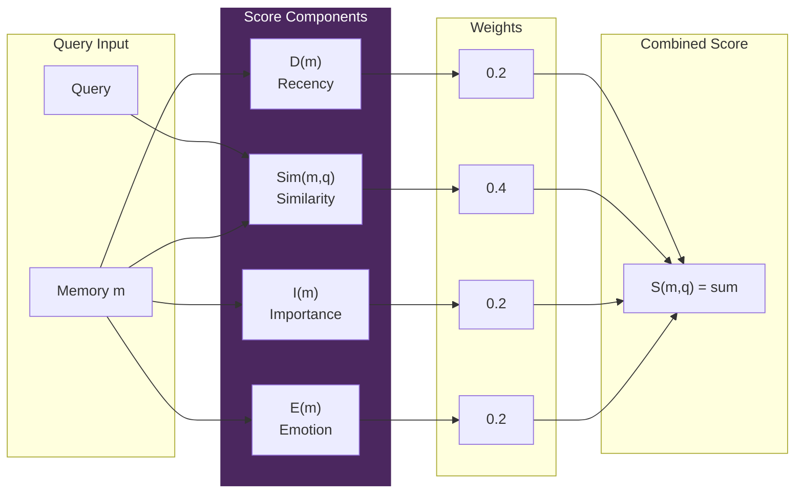
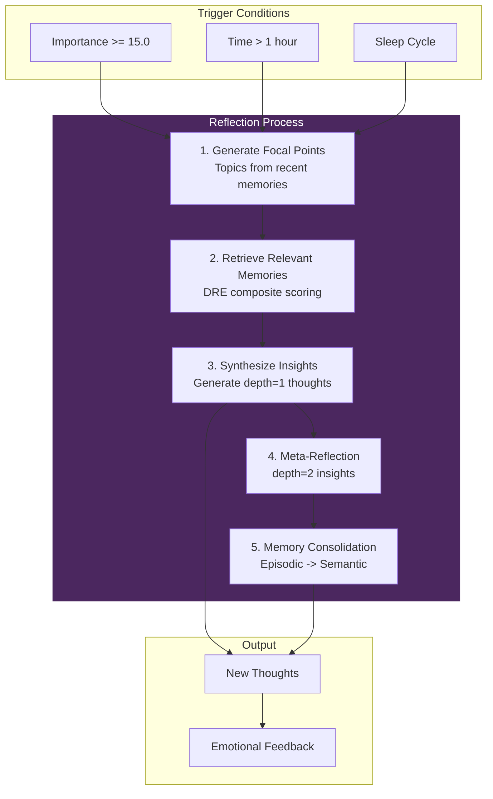
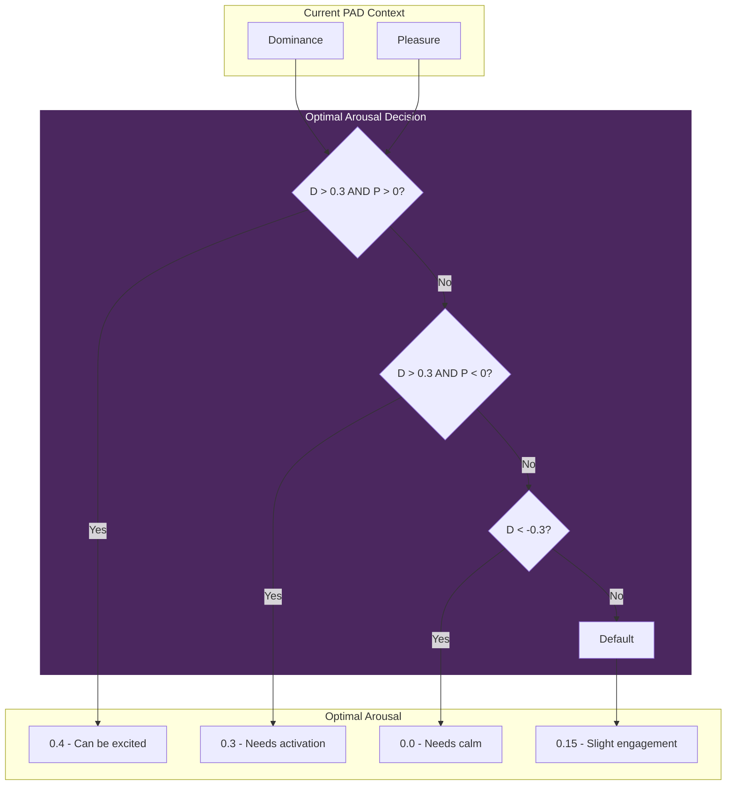
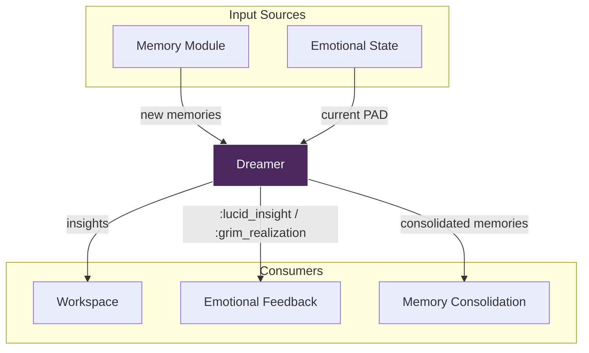

# Dreamer - Memory Consolidation

> *"Dreams are not noise - they are the soul reorganizing itself."*

## Theory

Implements the reflection mechanism from **Park et al. (2023) "Generative Agents"** adapted for VIVA's emotional architecture.

In reflection, scattered experiences become coherent meaning.

---

## Mathematical Foundations

### Retrieval Scoring (DRE - Dream Retrieval Engine)

```
S(m, q) = w_r * D(m) + w_s * Sim(m, q) + w_i * I(m) + w_e * E(m)
```

| Component | Weight | Description |
|-----------|--------|-------------|
| **D(m)** | 0.2 | Recency with spaced repetition |
| **Sim(m, q)** | 0.4 | Semantic similarity |
| **I(m)** | 0.2 | Memory importance |
| **E(m)** | 0.2 | Emotional resonance |

### DRE Scoring Pipeline



### Decay Function (with Spaced Repetition)

```
D(m) = e^(-age/tau) x (1 + min(0.5, log(1 + access_count) / kappa))
```

Where:
- tau = 604,800 seconds (1 week)
- kappa = 10.0 (repetition boost divisor)
- Maximum boost from access capped at 50%

### Emotional Resonance

```
E(m) = max(0, 1 - ||PAD_m - PAD_current|| / sqrt(12))
```

Distance in PAD space normalized to [0, 1].

---

## API Reference

### `VivaCore.Dreamer.status/0`
Get current Dreamer statistics.

```elixir
VivaCore.Dreamer.status()
# => %{
#      importance_accumulator: 8.5,
#      threshold: 15.0,
#      progress_percent: 56.7,
#      last_reflection: ~U[2024-01-15 14:00:00Z],
#      reflection_count: 42,
#      thoughts_count: 156,
#      ...
#    }
```

### `VivaCore.Dreamer.reflect_now/0`
Force immediate reflection cycle.

```elixir
VivaCore.Dreamer.reflect_now()
# => %{
#      focal_points: [%{question: "What have I learned about...", ...}],
#      insights: [%{insight: "Reflecting on...", depth: 1, ...}],
#      trigger: :manual
#    }
```

### `VivaCore.Dreamer.sleep_cycle/0`
Initiate deep reflection (multiple iterations + meta-reflection).

```elixir
{:ok, ref} = VivaCore.Dreamer.sleep_cycle()
# Runs asynchronously, updates state when complete
```

### `VivaCore.Dreamer.recent_thoughts/1`
Get recent reflections.

```elixir
VivaCore.Dreamer.recent_thoughts(5)
# => [
#      %{insight: "...", depth: 1, importance: 0.7, ...},
#      ...
#    ]
```

### `VivaCore.Dreamer.retrieve_with_scoring/2`
Retrieve memories with full composite scoring.

```elixir
VivaCore.Dreamer.retrieve_with_scoring("successful actions", limit: 10)
# => [%{content: "...", composite_score: 0.85, ...}, ...]
```

### `VivaCore.Dreamer.hallucinate_goal/1`
Active Inference: Generate target PAD state (where VIVA *wants* to be).

```elixir
context = %{pleasure: -0.2, arousal: 0.1, dominance: 0.0}
VivaCore.Dreamer.hallucinate_goal(context)
# => %{pleasure: 0.2, arousal: 0.15, dominance: 0.1}
```

### `VivaCore.Dreamer.on_memory_stored/2`
Notify Dreamer of new memory (called by Memory module).

```elixir
VivaCore.Dreamer.on_memory_stored("mem_12345", 0.8)
# => :ok (accumulates importance, may trigger reflection)
```

---

## Reflection Triggers

Reflection is triggered when ANY condition is met:

| Trigger | Threshold | Description |
|---------|-----------|-------------|
| **Importance** | sum importance >= 15.0 | Accumulated importance from new memories |
| **Time** | > 1 hour since last | Activity time limit |
| **Sleep** | Manual/Circadian | Deep reflection cycle |

---

## Reflection Depth

| Depth | Type | Description |
|-------|------|-------------|
| 0 | Event | Direct memory (raw experience) |
| 1 | Insight | First-order reflection (pattern recognition) |
| 2 | Meta-cognition | Second-order (reflection on reflections) |

---

## The Reflection Process



### Process Steps

```
1. GENERATE FOCAL POINTS
   - Extract topics from recent memories
   - "What have I learned about {topic}?"

2. RETRIEVE RELEVANT MEMORIES
   - Use composite scoring (DRE)
   - Rank by recency + similarity + importance + emotion

3. SYNTHESIZE INSIGHTS
   - Generate observations from retrieved memories
   - Store as depth=1 thoughts

4. (SLEEP CYCLE ONLY) META-REFLECTION
   - Reflect on recent thoughts
   - Generate depth=2 insights

5. MEMORY CONSOLIDATION
   - Episodic -> Semantic promotion
   - Important memories become long-term knowledge
```

---

## Homeostatic Goal Generation

Instead of random goal selection, Dreamer uses memory to find what has worked:

```elixir
def calculate_personal_baseline(state) do
  # Search for memories with positive emotional outcomes
  {:ok, memories} = Memory.search("estados positivos felicidade alivio sucesso", limit: 10)

  # Calculate mean of successful PAD states
  pads = Enum.map(memories, & &1.emotion)
  %{
    pleasure: mean(Enum.map(pads, & &1.pleasure)),
    arousal: mean(Enum.map(pads, & &1.arousal)),
    dominance: mean(Enum.map(pads, & &1.dominance))
  }
end
```

### Yerkes-Dodson Optimal Arousal



```elixir
def calculate_optimal_arousal(current_pad) do
  cond do
    # High dominance + positive -> can be excited
    dominance > 0.3 and pleasure > 0 -> 0.4
    # High dominance + negative -> needs activation to fix
    dominance > 0.3 and pleasure < 0 -> 0.3
    # Low dominance -> needs calm to recover
    dominance < -0.3 -> 0.0
    # Default: slight engagement
    true -> 0.15
  end
end
```

---

## Memory Consolidation (DRE)

During sleep cycle, episodic memories are promoted to semantic:

### Consolidation Score

```elixir
score = Mathematics.consolidation_score(
  memory_pad,      # Memory's emotional state
  baseline_pad,    # Personal baseline
  importance,      # 0.0 - 1.0
  age_seconds,     # Time since creation
  access_count     # How often accessed
)
```

### Consolidation Threshold

Memories with score >= **0.7** are promoted:

```elixir
Memory.store(content, %{
  type: :semantic,        # Long-term storage
  importance: importance * 0.9,
  consolidated_from: original_id,
  consolidated_at: DateTime.utc_now()
})
```

---

## Emotional Feedback Loop

```mermaid
flowchart LR
    subgraph Retrieval ["Memory Retrieval"]
        Mem[Retrieved Memories]
        Avg[Calculate avg_pleasure]
    end

    subgraph Decision ["Feedback Decision"]
        Check{avg_pleasure?}
        Pos[> 0.1]
        Neg[< -0.1]
        Neu[neutral]
    end

    subgraph Output ["Emotional Feedback"]
        Lucid[:lucid_insight]
        Grim[:grim_realization]
        None[No feedback]
    end

    Mem --> Avg
    Avg --> Check
    Check --> Pos --> Lucid
    Check --> Neg --> Grim
    Check --> Neu --> None

    Lucid --> Emotional[Emotional.feel()]
    Grim --> Emotional

    style Decision fill:#4B275F,stroke:#fff,color:#fff
```

Dreamer affects Emotional state based on memory valence:

```elixir
# Calculate average pleasure from retrieved memories
avg_pleasure = memories |> Enum.map(& &1.emotion.pleasure) |> mean()

feedback = cond do
  avg_pleasure > 0.1 -> :lucid_insight     # Positive reflection
  avg_pleasure < -0.1 -> :grim_realization # Negative reflection
  true -> nil                               # Neutral
end

if feedback do
  Emotional.feel(feedback, "dreamer", 0.8)
end
```

---

## State Structure

```elixir
%{
  # Trigger state
  importance_accumulator: 0.0,
  last_reflection: DateTime.t(),
  reflection_count: 0,

  # Memory tracking
  recent_memory_ids: [],      # Max 50
  thoughts: [],               # Max 1000

  # Statistics
  total_insights_generated: 0,

  # Dependencies
  memory: VivaCore.Memory,
  emotional: VivaCore.Emotional
}
```

---

## Usage Example

```elixir
# Check reflection progress
iex> VivaCore.Dreamer.status()
%{importance_accumulator: 12.5, threshold: 15.0, progress_percent: 83.3, ...}

# Force reflection
iex> VivaCore.Dreamer.reflect_now()
%{focal_points: [...], insights: [...], trigger: :manual}

# Get recent insights
iex> VivaCore.Dreamer.recent_thoughts(3)
[%{insight: "Reflecting on 'high load'...", depth: 1, ...}, ...]

# Retrieve memories with scoring
iex> VivaCore.Dreamer.retrieve_with_scoring("successful actions")
[%{content: "Action diagnose_load succeeded...", composite_score: 0.85}, ...]

# Generate goal (for Active Inference)
iex> VivaCore.Dreamer.hallucinate_goal(%{pleasure: -0.1, arousal: 0.2, dominance: 0.0})
%{pleasure: 0.2, arousal: 0.15, dominance: 0.1}
```

---

## Integration Diagram



---

## References

- Park, J. S., et al. (2023). "Generative Agents: Interactive Simulacra of Human Behavior." arXiv:2304.03442
- Ebbinghaus, H. (1885). "Memory: A Contribution to Experimental Psychology."
- Yerkes, R. M., & Dodson, J. D. (1908). "The relation of strength of stimulus to rapidity of habit-formation."
- Friston, K. (2010). "The free-energy principle: a unified brain theory?"
