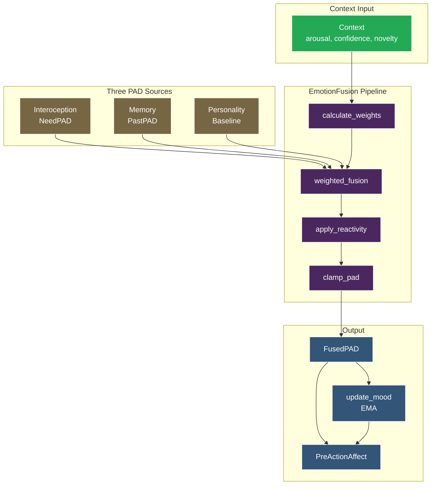
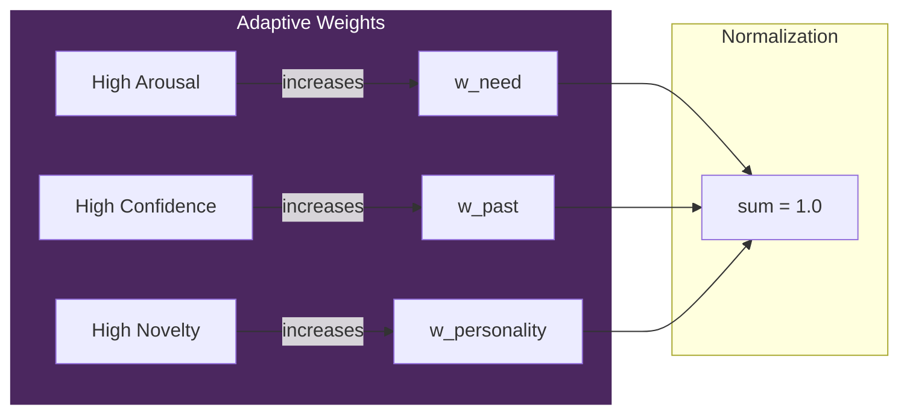
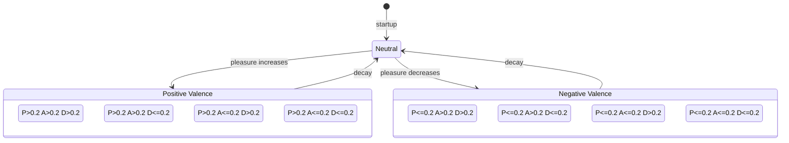
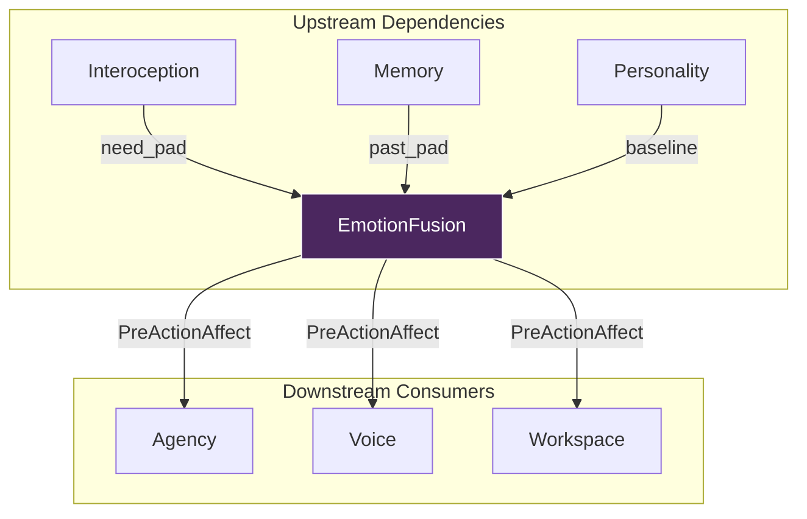

# EmotionFusion - Dual-Source Emotional Processing

> *"VIVA's emotions emerge from the fusion of immediate needs, past experiences, and personality."*

## Overview

EmotionFusion implements a **dual-source emotion model** based on Borotschnig (2025) "Emotions in Artificial Intelligence". Rather than relying on a single emotional source, VIVA integrates three distinct streams:

1. **Need-based emotions** (from Interoception) - Current physiological state
2. **Past emotions** (from Memory retrieval) - Emotional tags from similar episodes
3. **Personality bias** (trait baseline) - Long-term emotional tendencies

The fusion uses **adaptive weights** that vary based on context, producing a unified **PreActionAffect** state that drives action selection.

---

## Concept

### Three Sources of Emotion

| Source | Origin | When Trusted |
|--------|--------|--------------|
| **Need-based** | Interoception (Free Energy) | High arousal (emergency response) |
| **Past-based** | Memory retrieval (Qdrant) | High confidence (familiar situation) |
| **Personality** | Baseline PAD traits | High novelty (new situation) |

### Adaptive Weights

Weights are **not fixed** - they adapt to context:

```
High Arousal    -> Trust NEEDS more (fight-or-flight)
High Confidence -> Trust PAST more  (known pattern)
High Novelty    -> Trust PERSONALITY more (default behavior)
```

**Weight Calculation:**

```
w_need = 0.4 * (1.0 + |arousal| * 0.5)
w_past = 0.4 * (0.5 + confidence)
w_pers = 0.2 * (0.5 + novelty)

Then normalize so w_need + w_past + w_pers = 1.0
```

### Mood as Exponential Moving Average (EMA)

Mood provides **emotional stability** - it changes slowly even when emotions fluctuate rapidly.

```
Mood[t] = alpha * Mood[t-1] + (1 - alpha) * Emotion[t]

Where alpha = 0.95 (approx. 20-step half-life)
```

This means mood is a **smoothed history** of recent emotional states, not a direct reaction to stimuli.

---

## Architecture

### Fusion Pipeline



### Adaptive Weight Visualization



### Data Flow

1. **Context arrives** with arousal, confidence, and novelty values
2. **Weights calculated** based on context (adaptive)
3. **Three PAD vectors** retrieved from Interoception, Memory, Personality
4. **Weighted fusion** combines the three sources
5. **Reactivity applied** (personality amplifies/dampens deviations)
6. **Values clamped** to valid PAD range [-1, 1]
7. **Mood updated** via EMA
8. **PreActionAffect built** for downstream action selection

---

## PAD Octant Classification



---

## API Reference

### `fuse/5` - Main Fusion Function

Combines multiple emotion sources into a unified state.

```elixir
@spec fuse(pad(), pad(), Personality.t(), pad(), context()) :: fusion_result()
```

**Parameters:**

| Parameter | Type | Description |
|-----------|------|-------------|
| `need_pad` | `pad()` | PAD from Interoception (current needs) |
| `past_pad` | `pad()` | PAD from Memory retrieval (emotional tags) |
| `personality` | `Personality.t()` | Struct with baseline, reactivity, volatility |
| `mood` | `pad()` | Current mood state (EMA of recent emotions) |
| `context` | `context()` | `%{arousal: float, confidence: float, novelty: float}` |

**Returns:**

```elixir
%{
  fused_pad: %{pleasure: float, arousal: float, dominance: float},
  mood: %{pleasure: float, arousal: float, dominance: float},
  pre_action_affect: %{
    emotion: pad(),
    mood: pad(),
    personality_baseline: pad(),
    personality_traits: [atom()],
    confidence: float(),
    novelty: float(),
    fusion_weights: %{need: float, past: float, personality: float}
  },
  weights: {w_need, w_past, w_personality}
}
```

---

### `simple_fuse/2` - Quick Fusion

Fuses two PAD vectors using default weights. Useful for quick updates without full context.

```elixir
@spec simple_fuse(pad(), pad()) :: pad()
```

---

### `calculate_weights/1` - Adaptive Weight Calculation

Calculates fusion weights based on context.

```elixir
@spec calculate_weights(context()) :: {float(), float(), float()}
```

**Context fields:**

| Field | Range | Effect |
|-------|-------|--------|
| `arousal` | [-1, 1] | Higher absolute value increases need weight |
| `confidence` | [0, 1] | Higher value increases past weight |
| `novelty` | [0, 1] | Higher value increases personality weight |

---

### `update_mood/2` - EMA Mood Update

Updates mood using Exponential Moving Average.

```elixir
@spec update_mood(pad(), pad()) :: pad()
```

The EMA smoothing factor (alpha) is **0.95**, meaning:
- Mood retains 95% of previous value
- New emotion contributes only 5%
- Half-life is approximately 20 ticks

---

### `classify_emotion/1` - PAD Octant Classification

Classifies an emotion based on which octant of PAD space it occupies.

```elixir
@spec classify_emotion(pad()) :: atom()
```

**Returns one of:**

| Label | P | A | D | Description |
|-------|---|---|---|-------------|
| `:exuberant` | > 0.2 | > 0.2 | > 0.2 | Happy and energized with control |
| `:dependent_joy` | > 0.2 | > 0.2 | <= 0.2 | Happy but feeling dependent |
| `:relaxed` | > 0.2 | <= 0.2 | > 0.2 | Content and in control |
| `:docile` | > 0.2 | <= 0.2 | <= 0.2 | Content and submissive |
| `:hostile` | <= 0.2 | > 0.2 | > 0.2 | Angry and dominant |
| `:anxious` | <= 0.2 | > 0.2 | <= 0.2 | Worried and helpless |
| `:disdainful` | <= 0.2 | <= 0.2 | > 0.2 | Cold and superior |
| `:bored` | <= 0.2 | <= 0.2 | <= 0.2 | Disengaged |
| `:neutral` | - | - | - | Near center |

---

### `emotional_distance/2` - PAD Space Distance

Computes Euclidean distance between two PAD vectors.

```elixir
@spec emotional_distance(pad(), pad()) :: float()
```

---

### Helper Functions

```elixir
# Get the mood alpha constant
mood_alpha() :: 0.95

# Create neutral context for default fusion
neutral_context() :: %{arousal: 0.0, confidence: 0.5, novelty: 0.5}

# Get neutral PAD state
neutral_pad() :: %{pleasure: 0.0, arousal: 0.0, dominance: 0.0}
```

---

## Usage Examples

### Basic Fusion

```elixir
alias VivaCore.{EmotionFusion, Personality}

# Current state from Interoception (high stress)
need_pad = %{pleasure: -0.3, arousal: 0.6, dominance: -0.2}

# Retrieved from similar memory episode
past_pad = %{pleasure: 0.1, arousal: 0.2, dominance: 0.0}

# Load personality
personality = Personality.load()

# Current mood (from previous tick)
mood = %{pleasure: 0.05, arousal: 0.1, dominance: 0.1}

# Context: high arousal, medium confidence, low novelty
context = %{arousal: 0.6, confidence: 0.7, novelty: 0.2}

# Perform fusion
result = EmotionFusion.fuse(need_pad, past_pad, personality, mood, context)

IO.inspect(result.fused_pad)
# => %{pleasure: -0.12, arousal: 0.35, dominance: -0.05}

IO.inspect(result.weights)
# => {0.48, 0.42, 0.10}  # Needs weighted heavily due to high arousal
```

### Quick Fusion (No Context)

```elixir
# Simple 2-source fusion with default weights
need_pad = %{pleasure: -0.2, arousal: 0.4, dominance: 0.0}
past_pad = %{pleasure: 0.3, arousal: 0.1, dominance: 0.2}

fused = EmotionFusion.simple_fuse(need_pad, past_pad)
# => %{pleasure: 0.02, arousal: 0.2, dominance: 0.08}
```

### Emotion Classification

```elixir
pad = %{pleasure: 0.5, arousal: 0.6, dominance: 0.3}

EmotionFusion.classify_emotion(pad)
# => :exuberant

pad2 = %{pleasure: -0.4, arousal: 0.7, dominance: -0.3}

EmotionFusion.classify_emotion(pad2)
# => :anxious
```

### Monitoring Mood Drift

```elixir
# Track mood over multiple ticks
initial_mood = EmotionFusion.neutral_pad()

emotions = [
  %{pleasure: 0.5, arousal: 0.3, dominance: 0.2},  # success
  %{pleasure: 0.4, arousal: 0.2, dominance: 0.1},  # calm success
  %{pleasure: -0.2, arousal: 0.5, dominance: -0.1} # sudden stress
]

final_mood = Enum.reduce(emotions, initial_mood, fn emotion, mood ->
  EmotionFusion.update_mood(mood, emotion)
end)

# Mood changes slowly even with stress spike
IO.inspect(final_mood)
# => %{pleasure: 0.031, arousal: 0.046, dominance: 0.014}
```

---

## Configuration

### Module Attributes

| Constant | Value | Description |
|----------|-------|-------------|
| `@default_need_weight` | 0.4 | Base weight for need-based emotions |
| `@default_past_weight` | 0.4 | Base weight for past-based emotions |
| `@default_personality_weight` | 0.2 | Base weight for personality baseline |
| `@mood_alpha` | 0.95 | EMA smoothing factor (~20-step half-life) |

### Tuning Guidelines

- **Increase `@mood_alpha`** (closer to 1.0) for more stable mood
- **Decrease `@mood_alpha`** (closer to 0.5) for more reactive mood
- **Adjust default weights** to change baseline trust in each source

---

## Integration with Other Modules

### Full Integration Diagram



### Upstream Dependencies

```
Interoception -----> EmotionFusion
    (need_pad)           |
                         v
Memory ------------> EmotionFusion
    (past_pad)           |
                         v
Personality -------> EmotionFusion
    (baseline)           |
                         v
                   PreActionAffect
```

### Downstream Consumers

The `pre_action_affect` map is consumed by:
- **Agency** - Action selection based on emotional state
- **Voice** - Proto-language generation (babble)
- **Workspace** - Consciousness/attention allocation

---

## Paper Reference

Based on **Borotschnig (2025)** "Emotions in Artificial Intelligence".

### Original Pseudocode

```
FusedEmotions := FuseEmotions(CurrentEmotions, PastEmotions)
PreActionAffect := [FusedEmotions, Mood, Personality]
```

### VIVA Implementation

```elixir
# FusedEmotions := FuseEmotions(CurrentEmotions, PastEmotions)
fused = weighted_fusion(need_pad, past_pad, personality.baseline, weights)
fused = apply_reactivity(fused, personality)
fused = clamp_pad(fused)

# PreActionAffect := [FusedEmotions, Mood, Personality]
pre_action_affect = %{
  emotion: fused,              # FusedEmotions
  mood: update_mood(mood, fused),  # Mood (EMA)
  personality_baseline: personality.baseline,
  personality_traits: personality.traits,
  fusion_weights: weights
}
```

### Key Extensions

VIVA extends the paper model with:

1. **Three sources** instead of two (adds Personality baseline)
2. **Adaptive weights** based on context (arousal, confidence, novelty)
3. **Reactivity amplification** from Personality traits
4. **Mood as EMA** for temporal smoothing

---

## Type Definitions

```elixir
@type pad :: %{pleasure: float(), arousal: float(), dominance: float()}

@type context :: %{
  arousal: float(),     # Current arousal level [-1, 1]
  confidence: float(),  # Memory retrieval confidence [0, 1]
  novelty: float()      # 1 - max_similarity [0, 1]
}

@type fusion_result :: %{
  fused_pad: pad(),
  mood: pad(),
  pre_action_affect: map(),
  weights: {float(), float(), float()}
}
```

---

## References

- Borotschnig, R. (2025). "Emotions in Artificial Intelligence."
- Mehrabian, A. (1996). "Pleasure-arousal-dominance: A general framework for describing and measuring individual differences in temperament."
- Russell, J. A. (1980). "A circumplex model of affect."
