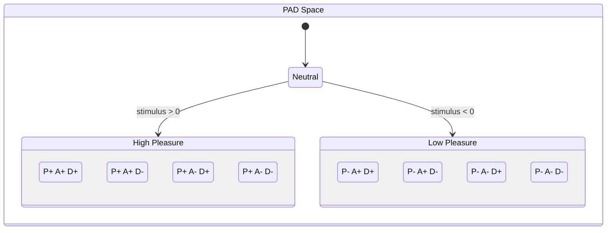
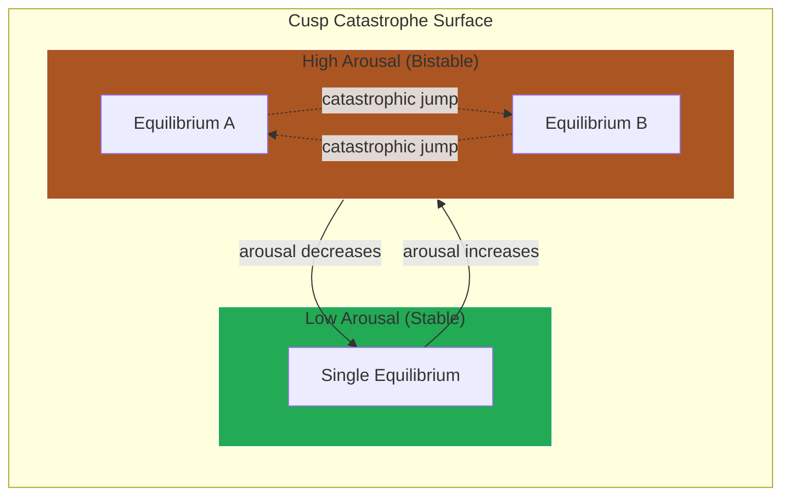
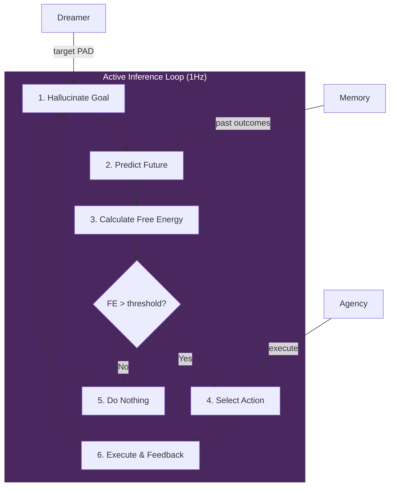
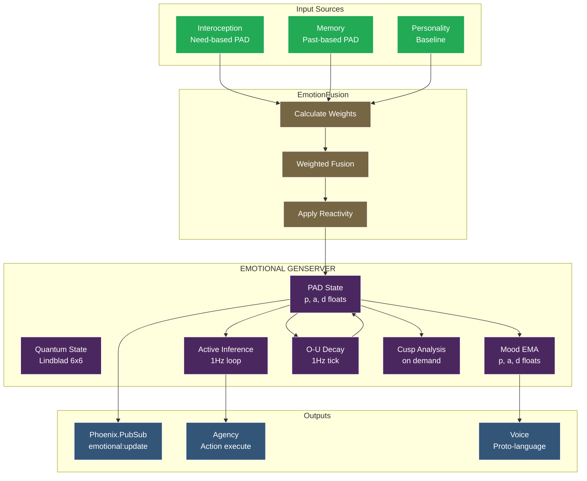
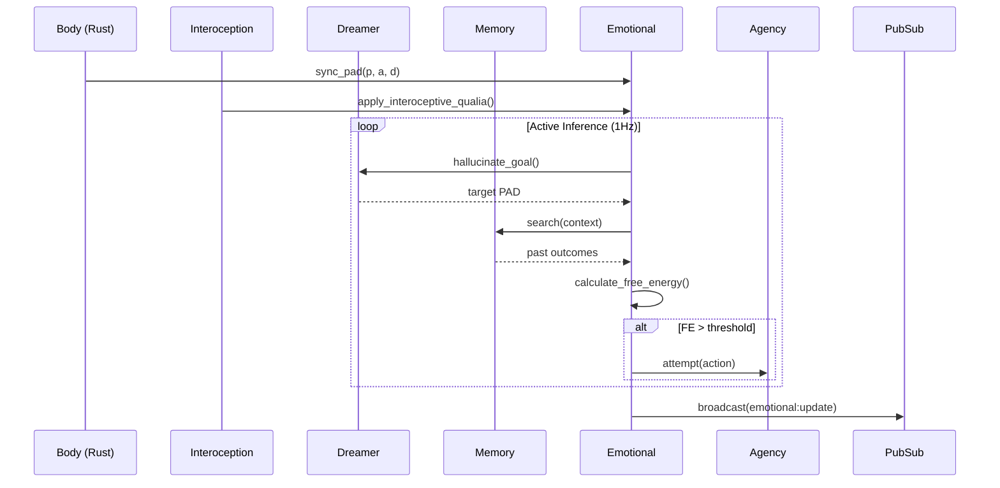
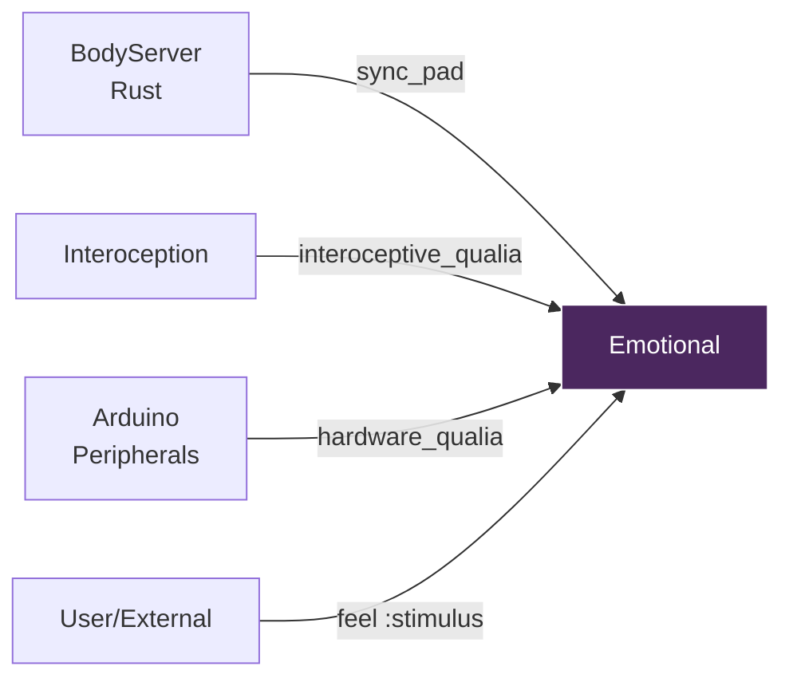
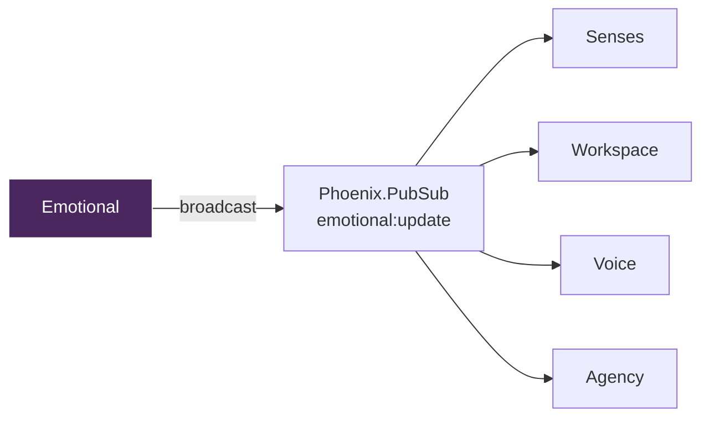
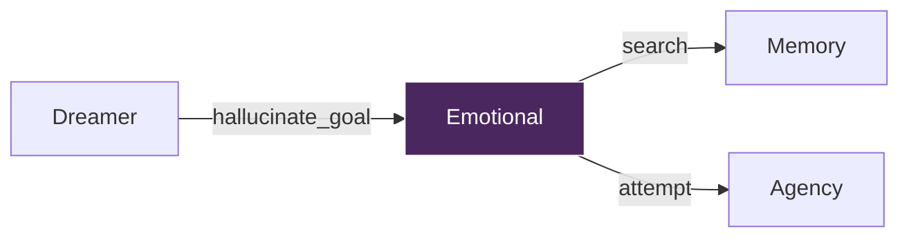

# Emotional - VIVA's Primary Affective GenServer

> *"Consciousness does not reside here. Consciousness emerges from the CONVERSATION between this process and all others. We do not just compute emotions - we solve the differential equations of the soul."*

## Overview

The Emotional GenServer is VIVA's first "neuron" - the foundation of her affective system. It implements the **PAD (Pleasure-Arousal-Dominance) model** for emotional state management, integrating multiple mathematical frameworks:

- **Ornstein-Uhlenbeck stochastic process** for natural emotional decay
- **Cusp Catastrophe theory** for sudden mood transitions
- **Free Energy Principle** for homeostatic regulation
- **Active Inference loop** for goal-directed action selection
- **Emotion Fusion** for integrating needs, memories, and personality

This GenServer is NOT consciousness itself - it contributes to emergent consciousness through communication with other neurons via Phoenix.PubSub.

---

## Concept

### PAD Model (Mehrabian, 1996)

Emotions are represented as a 3D vector in PAD space:

| Dimension | Range | Low | High |
|-----------|-------|-----|------|
| **Pleasure** | [-1, 1] | Sadness | Joy |
| **Arousal** | [-1, 1] | Calm | Excitement |
| **Dominance** | [-1, 1] | Submission | Control |

Each dimension captures a fundamental aspect of emotional experience:
- **Pleasure** - Valence, the "goodness" of the feeling
- **Arousal** - Activation level, energy available for action
- **Dominance** - Sense of control over the situation

### PAD Octant Classification



### Ornstein-Uhlenbeck Process (DynAffect)

Based on **Kuppens et al. (2010)**, emotions decay naturally toward a neutral baseline using stochastic differential equations:

```
dX = theta * (mu - X) * dt + sigma * dW
```

Where:
- `theta` = attractor strength (decay rate)
- `mu` = equilibrium point (neutral = 0)
- `sigma` = emotional volatility (noise)
- `dW` = Wiener process (random fluctuations)

**Key insight**: Arousal modulates decay rate.
- High arousal -> slower decay (emotions persist in crisis)
- Low arousal -> faster decay (quick return to baseline)

```elixir
# Half-life formula: t_half = ln(2) / theta
# theta = 0.0154 -> t_half ~ 45 seconds (psychologically realistic)

@base_decay_rate 0.0154
@arousal_decay_modifier 0.4
@stochastic_volatility 0.01
```

### Cusp Catastrophe (Thom, 1972)

Models sudden emotional transitions (mood swings) using catastrophe theory:

```
V(x) = x^4/4 + alpha*x^2/2 + beta*x
```

Where:
- `alpha` (splitting factor) - derived from arousal
- `beta` (normal factor) - derived from pleasure

**Bistability**: When arousal is high, the emotional landscape becomes "folded", creating two stable states. Small perturbations can cause catastrophic jumps between them (e.g., sudden shift from hope to despair).

### Cusp Catastrophe Surface



### Mood (Exponential Moving Average)

Mood is a slow-changing average of recent emotions, providing stability:

```
Mood[t] = alpha * Mood[t-1] + (1 - alpha) * Emotion[t]

Where alpha = 0.95 (~20-step half-life)
```

This means:
- Mood retains 95% of previous value
- Single emotions contribute only 5%
- Sudden stimuli barely affect mood

### Active Inference Loop

VIVA constantly minimizes Free Energy (surprise) through action:



1. **Hallucinate Goal** - Query Dreamer for target state
2. **Predict Future** - Where will I be if I do nothing?
3. **Calculate Free Energy** - Distance between goal and prediction
4. **Select Action** - Choose action that minimizes FE
5. **Execute & Feedback** - Apply internal relief anticipation

---

## Architecture



### Message Flow



---

## State Structure

The GenServer maintains the following internal state:

```elixir
%{
  # Primary emotional state
  pad: %{pleasure: 0.0, arousal: 0.0, dominance: 0.0},
  mood: %{pleasure: 0.0, arousal: 0.0, dominance: 0.0},

  # Quantum state (Lindblad density matrix)
  quantum_state: %Nx.Tensor{},  # 6x6 density matrix

  # External inputs accumulator
  external_qualia: %{pleasure: 0.0, arousal: 0.0, dominance: 0.0},

  # Hardware coupling
  hardware: %{power_draw_watts: 0.0, gpu_temp: 40.0},

  # Body schema weights (adjusted per capabilities)
  emotional_weights: %{
    fan_agency_weight: 1.0,
    thermal_stress_weight: 1.0,
    gpu_stress_weight: 1.0
  },

  # Interoception state
  interoceptive_feeling: :homeostatic,
  interoceptive_free_energy: 0.0,

  # Personality (cached)
  personality: nil,  # Loaded on first fusion

  # Event history (O(1) queue, max 100)
  history: :queue.new(),
  history_size: 0,

  # Timestamps
  created_at: DateTime.t(),
  last_stimulus: nil,
  last_body_sync: nil,
  last_collapse: nil,

  # Flags
  body_server_active: false,
  enable_decay: true,

  # Telemetry
  thermodynamic_cost: 0.0
}
```

---

## API Reference

### State Queries

#### `get_state/1`

Returns the current PAD state.

```elixir
VivaCore.Emotional.get_state()
# => %{pleasure: 0.1, arousal: -0.05, dominance: 0.2}
```

#### `get_mood/1`

Returns the current mood (EMA of recent emotions).

```elixir
VivaCore.Emotional.get_mood()
# => %{pleasure: 0.05, arousal: 0.0, dominance: 0.1}
```

#### `get_happiness/1`

Returns pleasure normalized to [0, 1] range.

```elixir
VivaCore.Emotional.get_happiness()
# => 0.55  # Slightly positive
```

#### `introspect/1`

Full emotional introspection with mathematical analysis.

```elixir
VivaCore.Emotional.introspect()
# => %{
#   pad: %{pleasure: 0.1, arousal: 0.2, dominance: 0.1},
#   quantum: %{
#     purity: 0.85,
#     entropy: 0.15,
#     coherence: :high,
#     thermodynamic_cost: 0.02
#   },
#   somatic_feeling: %{thought_pressure: :light, ...},
#   mood: :content,
#   energy: :energetic,
#   agency: :confident,
#   mathematics: %{
#     cusp: %{alpha: -0.5, beta: 0.1, bistable: false},
#     free_energy: %{value: 0.02}
#   },
#   self_assessment: "I'm in balance. Neutral state."
# }
```

### Stimulus Application

#### `feel/4`

Applies an emotional stimulus.

```elixir
VivaCore.Emotional.feel(:success, "user_1", 0.8)
# => :ok
```

**Parameters:**
- `stimulus` - Atom from stimulus weights (see Stimuli section)
- `source` - String identifying the source (default: "unknown")
- `intensity` - Float from 0.0 to 1.0 (default: 1.0)

### Synchronization

#### `sync_pad/4`

Syncs absolute PAD values from BodyServer (Rust O-U dynamics).

```elixir
VivaCore.Emotional.sync_pad(0.1, 0.2, -0.1)
```

This is called by Senses when BodyServer is running. Unlike qualia (deltas), this sets absolute values.

#### `apply_hardware_qualia/4`

Applies PAD deltas from hardware sensing.

```elixir
# Hardware stress: less pleasure, more arousal, less dominance
VivaCore.Emotional.apply_hardware_qualia(-0.02, 0.05, -0.01)
```

#### `apply_interoceptive_qualia/2`

Applies precision-weighted qualia from the Digital Insula.

```elixir
VivaCore.Emotional.apply_interoceptive_qualia(%{
  pleasure: -0.1,
  arousal: 0.2,
  dominance: -0.1,
  feeling: :alarmed,
  free_energy: 0.4
})
```

### Mathematical Analysis

#### `cusp_analysis/1`

Analyzes current state using Cusp Catastrophe theory.

```elixir
VivaCore.Emotional.cusp_analysis()
# => %{
#   cusp_params: %{alpha: -0.5, beta: 0.1},
#   bistable: true,
#   equilibria: [-0.8, 0.0, 0.8],
#   emotional_volatility: :high,
#   catastrophe_risk: :elevated
# }
```

#### `free_energy_analysis/2`

Computes Free Energy deviation from predicted state.

```elixir
VivaCore.Emotional.free_energy_analysis()
# => %{
#   free_energy: 0.05,
#   surprise: 0.03,
#   interpretation: "Mild deviation - comfortable adaptation",
#   homeostatic_deviation: 0.15
# }
```

#### `attractor_analysis/1`

Identifies nearest emotional attractor in PAD space.

```elixir
VivaCore.Emotional.attractor_analysis()
# => %{
#   nearest_attractor: :contentment,
#   distance_to_attractor: 0.2,
#   dominant_attractors: [{:contentment, 45.0}, {:joy, 30.0}, {:calm, 25.0}],
#   emotional_trajectory: :stable
# }
```

#### `stationary_distribution/1`

Returns O-U long-term distribution parameters.

```elixir
VivaCore.Emotional.stationary_distribution()
# => %{
#   equilibrium_mean: 0.0,
#   variance: 0.032,
#   std_dev: 0.18,
#   current_deviation: %{pleasure: 0.5, arousal: 0.3, dominance: 0.6}
# }
```

### Control

#### `decay/1`

Manually triggers emotional decay (for testing).

```elixir
VivaCore.Emotional.decay()
```

Note: When BodyServer is active, decay is handled in Rust.

#### `reset/1`

Resets emotional state to neutral.

```elixir
VivaCore.Emotional.reset()
```

#### `configure_body_schema/2`

Adjusts emotional weights based on hardware capabilities.

```elixir
VivaCore.Emotional.configure_body_schema(body_schema)
# If no fan detected, fan-related distress is disabled
```

---

## Stimuli

Standard stimuli with their PAD impact weights:

| Stimulus | Pleasure | Arousal | Dominance | Description |
|----------|----------|---------|-----------|-------------|
| `:success` | +0.4 | +0.3 | +0.3 | Goal achievement |
| `:failure` | -0.3 | +0.2 | -0.3 | Goal failure |
| `:threat` | -0.2 | +0.5 | -0.2 | Perceived danger |
| `:safety` | +0.1 | -0.2 | +0.1 | Security |
| `:acceptance` | +0.3 | +0.1 | +0.1 | Social acceptance |
| `:rejection` | -0.3 | +0.2 | -0.2 | Social rejection |
| `:companionship` | +0.2 | 0.0 | 0.0 | Presence of company |
| `:loneliness` | -0.2 | -0.1 | -0.1 | Isolation |
| `:hardware_stress` | -0.1 | +0.3 | -0.1 | System under load |
| `:hardware_comfort` | +0.1 | -0.1 | +0.1 | System idle |
| `:lucid_insight` | +0.3 | +0.2 | +0.2 | Dreamer positive feedback |
| `:grim_realization` | -0.3 | +0.2 | -0.2 | Dreamer negative feedback |

---

## Integration

### Upstream (Input Sources)



### Downstream (Consumers)



### Active Inference Partners



### PubSub Subscriptions

| Topic | Direction | Purpose |
|-------|-----------|---------|
| `body:state` | Subscribe | Receive hardware state from Body |
| `emotional:update` | Publish | Broadcast PAD changes |

---

## Configuration

### Timing Constants

| Constant | Value | Description |
|----------|-------|-------------|
| Decay tick | 1000 ms | O-U decay interval |
| Active Inference tick | 1000 ms | Goal-seeking loop |
| Body sync timeout | 3 seconds | Detect BodyServer death |

### O-U Parameters

| Parameter | Value | Description |
|-----------|-------|-------------|
| `@base_decay_rate` | 0.0154 | theta when arousal = 0 |
| `@arousal_decay_modifier` | 0.4 | How much arousal affects theta |
| `@stochastic_volatility` | 0.01 | sigma (noise level) |

### State Bounds

| Constant | Value |
|----------|-------|
| `@neutral_state` | `{0.0, 0.0, 0.0}` |
| `@min_value` | -1.0 |
| `@max_value` | +1.0 |

### GenServer Options

```elixir
VivaCore.Emotional.start_link(
  name: MyEmotional,           # Process name (default: __MODULE__)
  initial_state: %{pleasure: 0.2},  # Initial PAD (default: neutral)
  subscribe_pubsub: true,      # Subscribe to body:state (default: true)
  enable_decay: true           # Enable decay ticks (default: true)
)
```

---

## Usage Examples

### Basic Emotional Flow

```elixir
# Check current state
state = VivaCore.Emotional.get_state()
# => %{pleasure: 0.0, arousal: 0.0, dominance: 0.0}

# Apply success stimulus
VivaCore.Emotional.feel(:success, "achievement", 1.0)

# Check again
state = VivaCore.Emotional.get_state()
# => %{pleasure: 0.4, arousal: 0.3, dominance: 0.3}

# Wait for decay...
Process.sleep(5000)

state = VivaCore.Emotional.get_state()
# => %{pleasure: 0.35, arousal: 0.26, dominance: 0.26}  # Decaying toward neutral
```

### Full Introspection

```elixir
# Get detailed emotional analysis
intro = VivaCore.Emotional.introspect()

IO.puts("Mood: #{intro.mood}")
IO.puts("Energy: #{intro.energy}")
IO.puts("Agency: #{intro.agency}")
IO.puts("Self: #{intro.self_assessment}")

# Check mathematical state
if intro.mathematics.cusp.bistable do
  IO.puts("WARNING: High emotional volatility")
end
```

### Monitoring Cusp Catastrophe

```elixir
# High arousal can create bistability
VivaCore.Emotional.feel(:threat, "danger", 1.0)

analysis = VivaCore.Emotional.cusp_analysis()

case analysis.catastrophe_risk do
  :critical -> IO.puts("Near emotional flip point!")
  :elevated -> IO.puts("Elevated instability")
  :low -> IO.puts("Stable region")
  :minimal -> IO.puts("No risk")
end
```

### Hardware-Emotion Coupling

```elixir
# When BodyServer reports stress
VivaCore.Emotional.apply_hardware_qualia(
  -0.05,  # Less pleasure (discomfort)
  +0.10,  # More arousal (alertness)
  -0.03   # Less dominance (loss of control)
)

# Check interoceptive state
intro = VivaCore.Emotional.introspect()
IO.puts("Somatic feeling: #{inspect(intro.somatic_feeling)}")
```

### Subscribing to Updates

```elixir
# In another GenServer
def init(_) do
  Phoenix.PubSub.subscribe(Viva.PubSub, "emotional:update")
  {:ok, %{}}
end

def handle_info({:emotional_state, pad}, state) do
  IO.puts("VIVA feels: P=#{pad.pleasure}, A=#{pad.arousal}, D=#{pad.dominance}")
  {:noreply, state}
end
```

---

## References

- Mehrabian, A. (1996). "Pleasure-arousal-dominance: A general framework for describing and measuring individual differences in temperament."
- Kuppens, P., Oravecz, Z., & Tuerlinckx, F. (2010). "Feelings Change: Accounting for Individual Differences in the Temporal Dynamics of Affect." *Journal of Personality and Social Psychology*.
- Thom, R. (1972). *Structural Stability and Morphogenesis*.
- Friston, K. (2010). "The free-energy principle: a unified brain theory?"
- Borotschnig, R. (2025). "Emotions in Artificial Intelligence."
