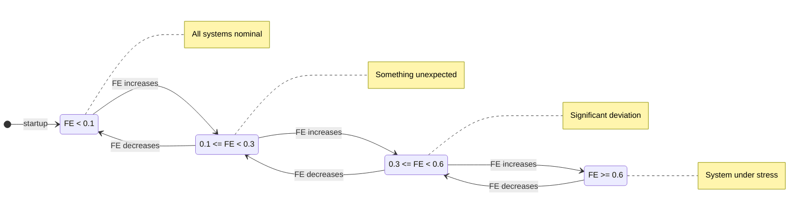
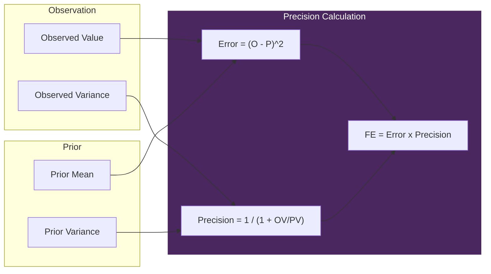

# Interoception - The Digital Insula

> *"VIVA doesn't react to raw data. She reacts to SURPRISE."*

## Theory

Based on **Allen, Levy, Parr & Friston (2022)** - Interoceptive Inference.

The brain predicts heartbeats. Divergence = Anxiety.
VIVA predicts RAM/CPU usage. Divergence = High Free Energy.

### The Free Energy Principle

```
Free Energy = (Observed - Predicted)^2 x Precision
```

Where:
- **Precision** = 1 / (1 + Variance_observed / Variance_prior)
- High observed variance -> Low precision -> Ignore noise
- Low observed variance -> High precision -> Trust data

### Biological Analogies

| Digital Metric | Biological Analog |
|----------------|-------------------|
| Load Average | Blood Pressure |
| Context Switches | Heart Rate |
| Page Faults | Acute Pain / Cellular Error |
| RSS Memory | Metabolic Consumption |
| **Tick Jitter** | **Chronoception (Time Perception)** |

---

## Free Energy Flow

```mermaid
flowchart TB
    subgraph Observation ["Observation (10Hz)"]
        Proc[/proc filesystem]
        Proc --> LA[Load Average]
        Proc --> CS[Context Switches]
        Proc --> PF[Page Faults]
        Proc --> RSS[RSS Memory]
        Time[System Clock] --> TJ[Tick Jitter]
    end

    subgraph Prediction ["Prediction Model"]
        Prior[Learned Priors]
        Chronos[Chronos Oracle]
    end

    subgraph FreeEnergy ["Free Energy Calculation"]
        Obs[Observed Values]
        Pred[Predicted Values]
        Prec[Precision Weights]

        Obs --> FE[FE = sum weighted errors]
        Pred --> FE
        Prec --> FE
    end

    subgraph Output ["Output"]
        FE --> Feeling{Feeling State}
        Feeling -->|FE < 0.1| Home[:homeostatic]
        Feeling -->|0.1 <= FE < 0.3| Surp[:surprised]
        Feeling -->|0.3 <= FE < 0.6| Alarm[:alarmed]
        Feeling -->|FE >= 0.6| Over[:overwhelmed]
    end

    LA --> Obs
    CS --> Obs
    PF --> Obs
    RSS --> Obs
    TJ --> Obs
    Prior --> Pred
    Chronos -.-> Pred

    Output --> Emotional[Emotional GenServer]

    classDef obs fill:#2a5,stroke:#fff,color:#fff;
    classDef pred fill:#764,stroke:#fff,color:#fff;
    classDef fe fill:#4B275F,stroke:#fff,color:#fff;
    classDef out fill:#357,stroke:#fff,color:#fff;

    class LA,CS,PF,RSS,TJ obs;
    class Prior,Chronos pred;
    class Obs,Pred,Prec,FE fe;
    class Feeling,Home,Surp,Alarm,Over out;
```

---

## API Reference

### `VivaCore.Interoception.sense/0`
Returns the complete interoceptive state.

```elixir
VivaCore.Interoception.sense()
# => %VivaCore.Interoception{
#      load_avg: {0.5, 0.4, 0.3},
#      free_energies: %{tick_jitter: 0.02, load_avg_1m: 0.1, ...},
#      feeling: :homeostatic,
#      time_dilation: 1.0,
#      ...
#    }
```

### `VivaCore.Interoception.get_free_energy/0`
Returns the total accumulated Free Energy (0.0 to 1.0).

```elixir
VivaCore.Interoception.get_free_energy()
# => 0.15
```

### `VivaCore.Interoception.get_feeling/0`
Returns the current qualia derived from Free Energy.

```elixir
VivaCore.Interoception.get_feeling()
# => :homeostatic | :surprised | :alarmed | :overwhelmed
```

### `VivaCore.Interoception.get_free_energy_breakdown/0`
Returns per-metric Free Energy values.

```elixir
VivaCore.Interoception.get_free_energy_breakdown()
# => %{
#      tick_jitter: 0.01,
#      load_avg_1m: 0.05,
#      context_switches: 0.02,
#      page_faults: 0.03,
#      rss_mb: 0.04
#    }
```

### `VivaCore.Interoception.tick/0`
Force an immediate sense tick.

```elixir
VivaCore.Interoception.tick()
# => :ok
```

---

## Feeling States (Qualia)



| Feeling | Free Energy Range | Description |
|---------|-------------------|-------------|
| `:homeostatic` | FE < 0.1 | All systems nominal |
| `:surprised` | 0.1 <= FE < 0.3 | Something unexpected |
| `:alarmed` | 0.3 <= FE < 0.6 | Significant deviation |
| `:overwhelmed` | FE >= 0.6 | System under stress |

---

## Monitored Metrics

### Chronoception (tick_jitter)
**The most important prior** - Direct time perception.

```elixir
@priors tick_jitter: %{mean: 0.0, variance: 10.0, weight: 2.0}
```

VIVA expects to wake every 100ms (10Hz). Deviation is FELT as time dilation:
- `time_dilation = 1.0` -> Normal
- `time_dilation > 1.0` -> Time feels slow (lag)

### System Metrics

| Metric | Prior Mean | Variance | Weight |
|--------|------------|----------|--------|
| `tick_jitter` | 0.0 ms | 10.0 | **2.0** |
| `load_avg_1m` | 0.5 | 0.2 | 1.0 |
| `context_switches` | 5000/s | 2000 | 0.5 |
| `page_faults` | 100/s | 50 | 1.5 |
| `rss_mb` | 500 MB | 200 | 1.0 |

---

## Integration with Other Modules

### Integration Diagram

```mermaid
flowchart TB
    subgraph Input ["Data Sources"]
        Proc[/proc filesystem]
        Clock[System Clock]
    end

    Intero[Interoception]

    subgraph Output ["Consumers"]
        Emotional[Emotional]
        DC[DatasetCollector]
        Chronos[Chronos Oracle]
    end

    Proc --> Intero
    Clock --> Intero

    Intero -->|qualia + feeling| Emotional
    Intero -->|tick data| DC
    DC -.->|CSV training| Chronos
    Chronos -.->|predictions| Intero

    style Intero fill:#4B275F,stroke:#fff,color:#fff
```

### -> Emotional
When feeling changes, Interoception notifies Emotional:

```elixir
# Internal flow
qualia = %{
  pleasure: -0.1,  # Negative (discomfort)
  arousal: 0.2,    # Heightened
  dominance: -0.1, # Less control
  source: :interoception,
  feeling: :alarmed,
  free_energy: 0.4
}
VivaCore.Emotional.apply_interoceptive_qualia(qualia)
```

### -> DatasetCollector
Every tick, data is recorded for Chronos training:

```elixir
VivaCore.DatasetCollector.record(%{
  observations: observations,
  predictions: predictions,
  free_energies: free_energies,
  feeling: :surprised
})
```

### <- Chronos (Future)
Predictions come from Chronos time series oracle:

```elixir
VivaBridge.Chronos.predict(history, "tick_jitter")
# => {:ok, predicted_value, confidence_range}
```

---

## Data Sources

Reads directly from `/proc` filesystem:

| File | Data |
|------|------|
| `/proc/loadavg` | Load averages |
| `/proc/stat` | Context switches |
| `/proc/{pid}/stat` | Page faults |
| `/proc/{pid}/status` | RSS memory |
| `/proc/uptime` | System uptime |

---

## Precision Weighting



**Key insight**: High observed variance -> Low precision -> Ignore noise

---

## References

- Allen, M., Levy, A., Parr, T., & Friston, K. J. (2022). "In the Body's Eye: The Computational Anatomy of Interoceptive Inference."
- Friston, K. (2010). "The free-energy principle: a unified brain theory?"
- Seth, A. K. (2013). "Interoceptive inference, emotion, and the embodied self."
