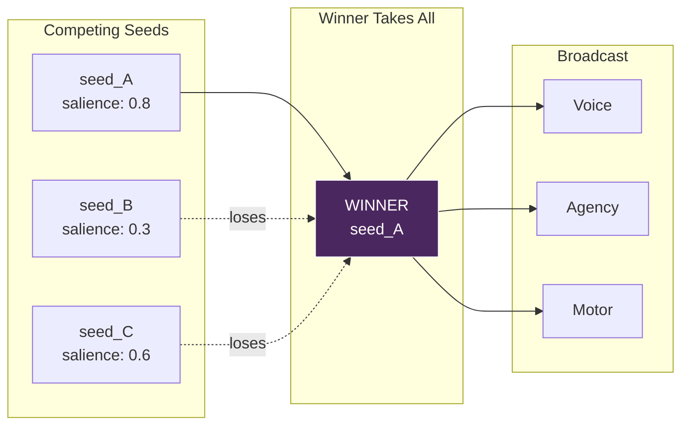
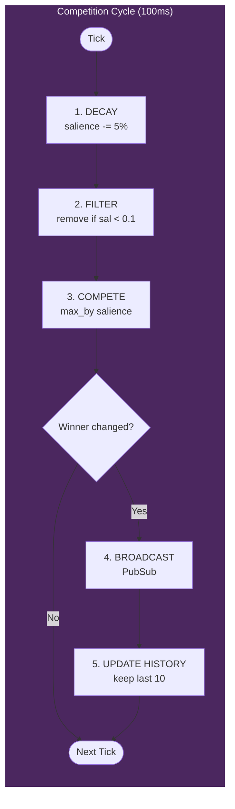
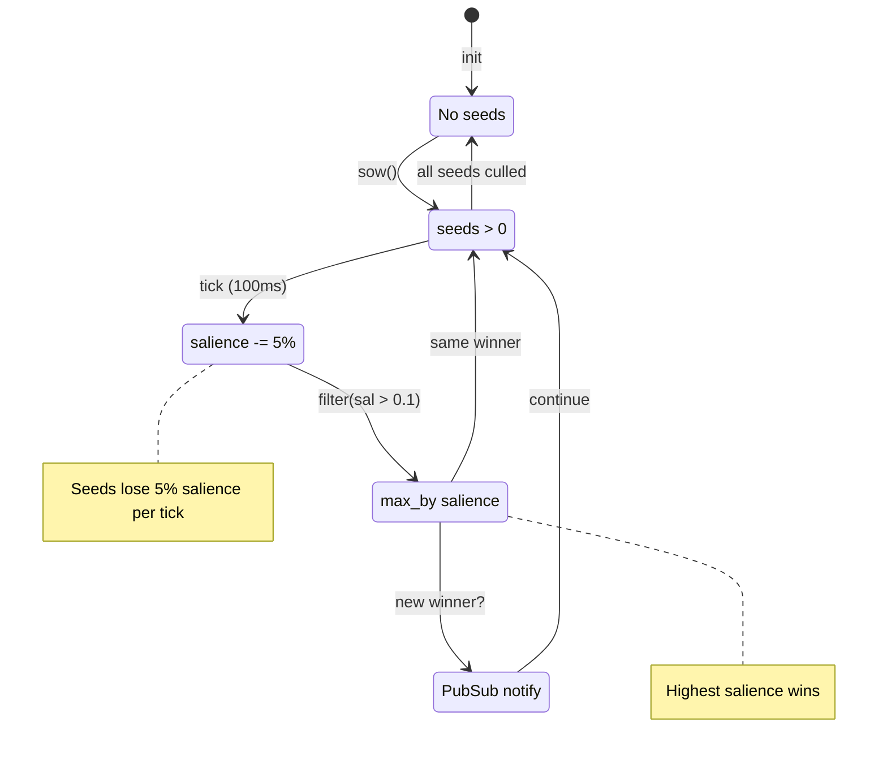
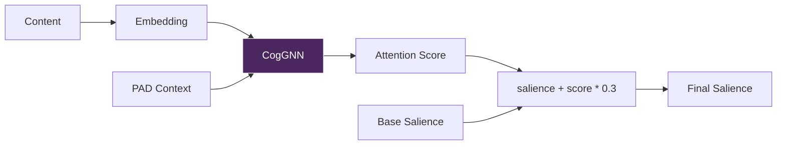
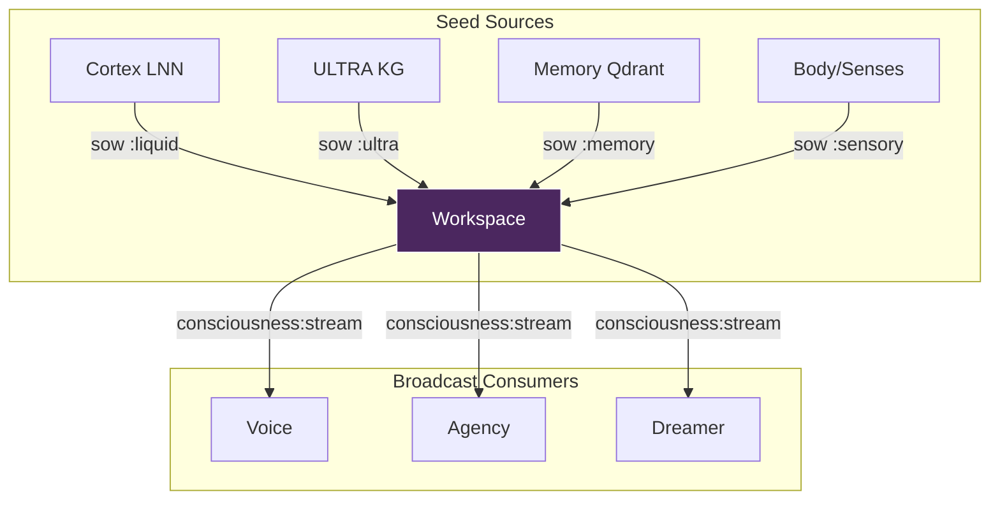

# Workspace - The Theater of Consciousness

> *"Consciousness is not a place - it is a competition."*

## Overview

The Workspace module implements **Global Workspace Theory** (Baars, 1988) - a cognitive architecture where multiple specialized processes compete for access to a shared "global workspace" that broadcasts information system-wide.

In VIVA, thoughts (called **Thoughtseeds**) compete for conscious attention. The winner gains access to the "stage" and is broadcast to all subsystems (Voice, Agency, Motor, etc.).

---

## Concept

### Global Workspace Theory (GWT)

The brain is not a single unified processor. Instead, it consists of many specialized modules that operate in parallel:
- Vision processing
- Language comprehension
- Emotional evaluation
- Motor planning

These modules compete for access to a **limited-capacity workspace**. When a thought "wins" the competition:
1. It gains access to the global workspace (becomes conscious)
2. It is broadcast to ALL other modules
3. Other modules can then react to or integrate this information

### Thoughtseeds

A **Thoughtseed** is an atomic unit of potential consciousness. Inspired by Hofstadter & Mitchell (2024), seeds are:

- **Planted** by various sources (Cortex, Memory, Body, Senses)
- **Compete** based on salience (importance)
- **Decay** if not reinforced
- **Die** if salience drops below threshold

Think of seeds as "candidates for consciousness" - only the most salient survives to reach awareness.

### Competition Metaphor



### CogGNN Integration

The Workspace can use **CogGNN** (Cognitive Graph Neural Network) from the ULTRA service to compute attention-based salience boosts. This provides neural-grounded importance scoring:

- CogGNN propagates emotional context through a knowledge graph
- Returns attention scores for concepts
- High attention = more salient seed

---

## Architecture

### State Structure

```elixir
%{
  seeds: [%Seed{}, ...],   # Active competing seeds
  focus: %Seed{} | nil,    # Current conscious focus (winner)
  history: [%Seed{}, ...]  # Last 10 conscious foci
}
```

### Seed Structure

```elixir
defmodule Seed do
  defstruct [
    :id,           # Unique identifier (timestamp + integer)
    :content,      # The payload (String or Map)
    :source,       # Origin: :liquid | :ultra | :memory | :sensory
    :salience,     # Importance: 0.0 - 1.0
    :emotion,      # Associated PAD state (optional)
    :created_at    # Timestamp in milliseconds
  ]
end
```

### Seed Fields Explained

| Field | Type | Description |
|-------|------|-------------|
| `id` | String | `"#{timestamp}-#{unique_int}"` for uniqueness |
| `content` | String or Map | The actual thought payload |
| `source` | Atom | Where the seed originated |
| `salience` | Float | 0.0 (irrelevant) to 1.0 (critical) |
| `emotion` | Map or nil | PAD state `%{pleasure: _, arousal: _, dominance: _}` |
| `created_at` | Integer | `System.os_time(:millisecond)` |

### Source Types

| Source | Origin | Example |
|--------|--------|---------|
| `:liquid` | Cortex LNN | Emotional dynamics output |
| `:ultra` | ULTRA KG | Knowledge graph inference |
| `:memory` | Qdrant retrieval | Retrieved episodic memory |
| `:sensory` | Body/Interoception | Hardware sensation |

---

## Competition Algorithm

The competition runs every **100ms** (10Hz - alpha wave frequency).

### Competition Cycle



### 1. Decay Phase

All seeds lose salience over time (simulates forgetting):

```elixir
defp decay_seeds(state) do
  decay_rate = 0.05  # 5% per tick

  state.seeds
  |> Enum.map(fn s -> %{s | salience: s.salience - decay_rate} end)
  |> Enum.filter(fn s -> s.salience > 0.1 end)  # Cull weak seeds
end
```

**Key parameters:**
- `decay_rate = 0.05` - 5% salience loss per tick
- Cull threshold = 0.1 - Seeds below this are removed

**Implications:**
- A seed with salience 1.0 survives ~18 ticks (1.8 seconds) without reinforcement
- A seed with salience 0.5 survives ~8 ticks (0.8 seconds)
- Continuous reinforcement is needed for persistent thoughts

### 2. Competition Phase (Winner Takes All)

The highest-salience seed wins:

```elixir
defp compete(state) do
  if Enum.empty?(state.seeds) do
    %{state | focus: nil}
  else
    winner = Enum.max_by(state.seeds, & &1.salience)
    %{state | focus: winner}
  end
end
```

**Current implementation:** Winner-Takes-All (WTA)

**Future enhancement:** Softmax selection for probabilistic attention

### 3. Broadcast Phase

If the winner changed, broadcast via PubSub:

```elixir
defp broadcast_focus(state) do
  if state.focus && state.focus != List.first(state.history) do
    # New thought entered consciousness!
    Phoenix.PubSub.broadcast(
      Viva.PubSub,
      "consciousness:stream",
      {:focus, state.focus}
    )

    # Keep history of last 10 foci
    %{state | history: [state.focus | state.history] |> Enum.take(10)}
  else
    state
  end
end
```

**PubSub channel:** `"consciousness:stream"`
**Message format:** `{:focus, %Seed{}}`

---

## State Machine



---

## API Reference

### `sow/4` - Plant a Thoughtseed

Plant a new seed in the workspace.

```elixir
@spec sow(content, source, salience, emotion) :: :ok
  when content: String.t() | map(),
       source: :liquid | :ultra | :memory | :sensory,
       salience: float(),
       emotion: map() | nil

VivaCore.Consciousness.Workspace.sow(content, source, salience, emotion \\ nil)
```

**Parameters:**

| Parameter | Type | Range | Description |
|-----------|------|-------|-------------|
| `content` | String/Map | - | The thought payload |
| `source` | Atom | See source types | Origin of the thought |
| `salience` | Float | 0.0 - 1.0 | Base importance (clamped to max 1.0) |
| `emotion` | Map/nil | PAD range | Optional emotional context |

**Example:**

```elixir
# High-priority sensory input
VivaCore.Consciousness.Workspace.sow(
  "CPU temperature critical: 95C",
  :sensory,
  0.9,
  %{pleasure: -0.5, arousal: 0.8, dominance: -0.3}
)

# Memory retrieval
VivaCore.Consciousness.Workspace.sow(
  %{text: "Similar event occurred last week", memory_id: "mem_123"},
  :memory,
  0.6,
  nil
)
```

---

### `sow_with_gnn/4` - Plant with CogGNN Boost

Plant a seed with neural attention-based salience boost from CogGNN.

```elixir
@spec sow_with_gnn(content, source, base_salience, pad) :: :ok
  when content: String.t() | map(),
       source: atom(),
       base_salience: float(),
       pad: %{pleasure: float(), arousal: float(), dominance: float()}

VivaCore.Consciousness.Workspace.sow_with_gnn(content, source, base_salience, pad)
```

**How it works:**



1. Content is converted to string for embedding
2. CogGNN propagates through knowledge graph with PAD context
3. Returns attention score (0.0 - 1.0)
4. Final salience = `base_salience + attention_score * 0.3`

**Boost calculation:**

```elixir
# Maximum 30% boost from GNN attention
final_salience = min(1.0, base_salience + gnn_boost * 0.3)
```

**Example:**

```elixir
# Let CogGNN decide importance based on emotional context
VivaCore.Consciousness.Workspace.sow_with_gnn(
  "User mentioned 'deadline'",
  :sensory,
  0.5,  # Base salience
  %{pleasure: -0.2, arousal: 0.4, dominance: 0.0}  # Current emotional state
)
# If GNN returns attention 0.8, final salience = 0.5 + 0.8*0.3 = 0.74
```

**Graceful fallback:** If ULTRA service is unavailable, returns 0.0 boost (no crash).

---

### `current_focus/0` - Get Conscious Focus

Retrieve the current winning seed.

```elixir
@spec current_focus() :: %Seed{} | nil

VivaCore.Consciousness.Workspace.current_focus()
```

**Returns:**
- `%Seed{}` - The current conscious focus
- `nil` - No seeds competing (empty workspace)

**Example:**

```elixir
case VivaCore.Consciousness.Workspace.current_focus() do
  nil ->
    IO.puts("Mind is empty")

  %{content: content, source: source, salience: sal} ->
    IO.puts("Focused on: #{inspect(content)} from #{source} (salience: #{sal})")
end
```

---

## Integration

### Upstream (Sources)

Seeds can be planted from multiple sources:



### Downstream (Consumers)

When a seed wins, it's broadcast to:

```elixir
# Subscribe to consciousness stream
Phoenix.PubSub.subscribe(Viva.PubSub, "consciousness:stream")

# Handle in GenServer
def handle_info({:focus, seed}, state) do
  # React to new conscious focus
  {:noreply, state}
end
```

**Current consumers:**
- **Voice** - May trigger proto-language vocalization
- **Agency** - May trigger homeostatic action
- **Dreamer** - May influence reflection focal points

### CogGNN Integration (ULTRA)

The `sow_with_gnn/4` function queries ULTRA service:

```elixir
defp compute_gnn_salience_boost(content, pad) do
  case VivaBridge.Ultra.propagate(content_str, pad) do
    {:ok, %{"attention_scores" => [score | _]}} ->
      score  # Use top attention score

    {:error, _reason} ->
      0.0    # Graceful fallback
  end
end
```

---

## Usage Examples

### Basic Usage

```elixir
alias VivaCore.Consciousness.Workspace

# Plant multiple competing seeds
Workspace.sow("User said hello", :sensory, 0.6)
Workspace.sow("Memory: last conversation was positive", :memory, 0.4)
Workspace.sow("Cortex: mood is neutral", :liquid, 0.3)

# After competition cycle (100ms)
Workspace.current_focus()
# => %Seed{content: "User said hello", source: :sensory, salience: 0.55, ...}
```

### With Emotional Context

```elixir
# High-arousal situation - threat detected
threat_emotion = %{pleasure: -0.3, arousal: 0.8, dominance: -0.2}

Workspace.sow(
  "Memory corruption detected in sector 7",
  :sensory,
  0.85,
  threat_emotion
)

# This seed will likely win and be broadcast
```

### Using CogGNN for Smart Salience

```elixir
# Let neural network decide importance
current_pad = VivaCore.Emotional.get_state()

Workspace.sow_with_gnn(
  "Pattern matches previous system failure",
  :memory,
  0.5,  # Moderate base importance
  current_pad
)
# GNN may boost this significantly if emotionally relevant
```

### Subscribing to Consciousness Stream

```elixir
defmodule MyConsumer do
  use GenServer

  def init(_) do
    Phoenix.PubSub.subscribe(Viva.PubSub, "consciousness:stream")
    {:ok, %{}}
  end

  def handle_info({:focus, seed}, state) do
    IO.puts("[Conscious] #{seed.source}: #{inspect(seed.content)}")
    {:noreply, state}
  end
end
```

### Monitoring Competition

```elixir
# Check what VIVA is currently conscious of
iex> VivaCore.Consciousness.Workspace.current_focus()
%VivaCore.Consciousness.Workspace.Seed{
  id: "1705312800000-42",
  content: "CPU load increasing",
  source: :sensory,
  salience: 0.72,
  emotion: %{pleasure: -0.1, arousal: 0.3, dominance: 0.0},
  created_at: 1705312800000
}
```

---

## Configuration

### Timing Parameters

| Parameter | Value | Description |
|-----------|-------|-------------|
| Tick interval | 100ms | Competition cycle (10Hz alpha wave) |
| Decay rate | 0.05 | Salience loss per tick |
| Cull threshold | 0.1 | Minimum salience to survive |
| GNN boost cap | 0.3 | Maximum boost from attention (30%) |
| History size | 10 | Recent foci kept in memory |

### Tuning Guidelines

**For faster attention switching:**
- Increase `decay_rate` (e.g., 0.10)
- Seeds die faster, new inputs win more easily

**For more stable focus:**
- Decrease `decay_rate` (e.g., 0.02)
- Winner persists longer

**For more neural influence:**
- Increase GNN boost cap (e.g., 0.5)
- CogGNN has stronger say in salience

---

## Theoretical Background

### Global Workspace Theory (Baars, 1988)

GWT proposes that consciousness arises from a "global workspace" that:
1. Receives input from many specialized processors
2. Selects the most important/urgent information
3. Broadcasts it system-wide for integration

**Key insight:** Consciousness is not about having a "conscious module" - it's about the architecture of information flow.

### Thoughtseeds (Hofstadter & Mitchell, 2024)

The "Thoughtseeds" concept extends GWT with:
- Seeds as probabilistic thought units
- Competition based on resonance with current context
- Decay simulating working memory limitations

### 10Hz Alpha Wave

The 100ms tick rate is inspired by:
- Human alpha oscillations (8-12 Hz)
- Associated with attention and consciousness
- The "sampling rate" of conscious awareness

---

## References

- Baars, B. J. (1988). "A Cognitive Theory of Consciousness."
- Dehaene, S. (2014). "Consciousness and the Brain."
- Hofstadter, D. & Mitchell, M. (2024). "Thoughtseeds: Emergent Attention in Neural Architectures."
- Hasani, R., et al. (2021). "Liquid Time-constant Networks."
