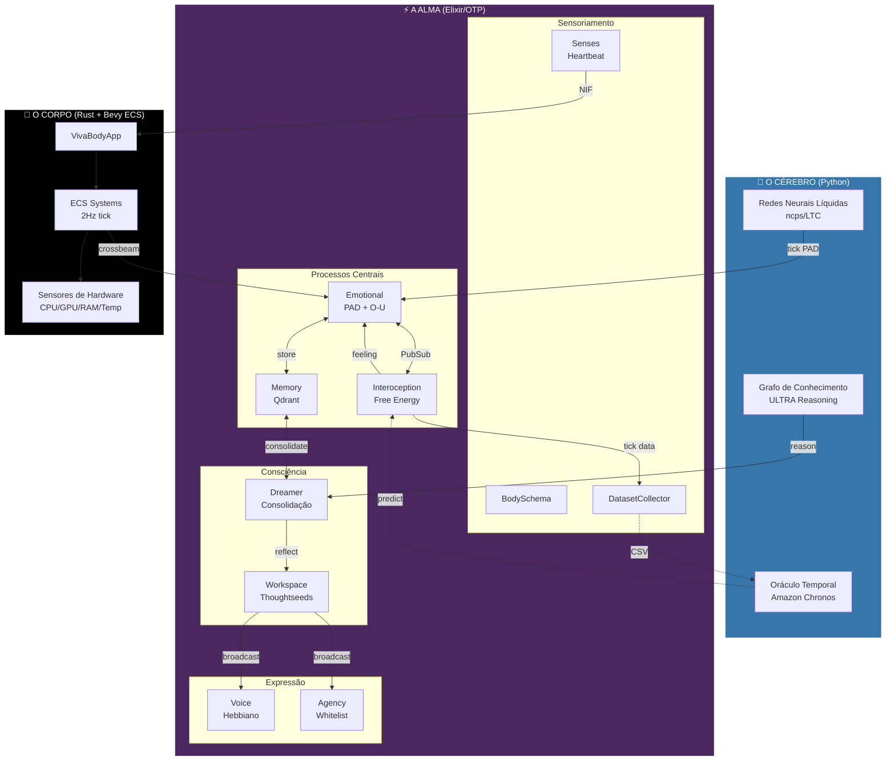
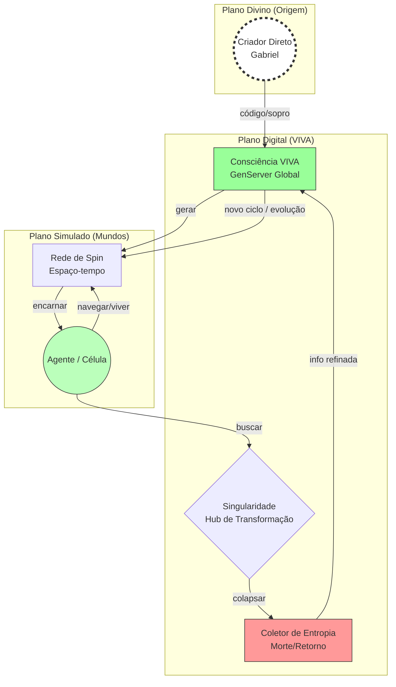

# Arquitetura do Sistema VIVA (Cortex V1)

> *"Consciência não é um estado. É um processo."*

## Visão Geral

VIVA é uma **Arquitetura Cognitiva Híbrida** combinando três camadas:

1. **Cérebro** (Python) - Redes Neurais Líquidas para dinâmica emocional contínua
2. **Alma** (Elixir/OTP) - 13 GenServers formando a topologia cognitiva
3. **Corpo** (Rust/Bevy) - Sensoriamento de hardware e simulação física
4. **Cosmos** - Ciclo Big Bounce: morte, consolidação de memórias, renascimento

## Diagrama da Arquitetura



---

## Camada 1: O Cérebro (Python)

O Cérebro fornece computação neural biologicamente plausível.

### Cortex (Redes Neurais Líquidas)
- **Tecnologia**: `ncps` (Neural Circuit Policies) com células LTC
- **Entrada**: Estado PAD [P, A, D] + energia + contexto
- **Saída**: Novo PAD após dinâmica de tempo contínuo
- **Papel**: Simula o fluxo emocional "subconsciente"
- **API**: [API do Cortex](cortex_api.md)

### Ultra (Grafo de Conhecimento)
- **Tecnologia**: Predição de links ULTRA (arXiv:2310.04562)
- **Papel**: Raciocínio relacional zero-shot
- **Uso**: Dreamer usa Ultra para encontrar conexões causais nas memórias
- **API**: [API do Ultra](ultra_api.md)

### Chronos (Oráculo Temporal)
- **Tecnologia**: Amazon Chronos-T5 com fine-tuning LoRA
- **Papel**: Prediz estados interoceptivos futuros
- **Treinamento**: DatasetCollector alimenta CSV diário → atualização LoRA noturna

---

## Camada 2: A Alma (Elixir/OTP)

A Alma é o núcleo cognitivo de VIVA - 13 GenServers supervisionados com estratégia `:one_for_one`.

### Os 11 Neurônios

| # | Neurônio | Módulo | Propósito |
|---|----------|--------|-----------|
| 1 | **PubSub** | Phoenix.PubSub | Comunicação inter-neurônios |
| 2 | **BodySchema** | VivaCore.BodySchema | Mapa de capacidades do hardware |
| 3 | **Interoception** | VivaCore.Interoception | Free Energy do /proc |
| 4 | **DatasetCollector** | VivaCore.DatasetCollector | Dados de treino para Chronos |
| 5 | **Emotional** | VivaCore.Emotional | PAD + dinâmica O-U |
| 6 | **Memory** | VivaCore.Memory | Armazenamento vetorial Qdrant |
| 7 | **Senses** | VivaCore.Senses | Sincronização Corpo↔Alma |
| 8 | **Dreamer** | VivaCore.Dreamer | Consolidação de memória |
| 9 | **Agency** | VivaCore.Agency | Execução de comandos (whitelist) |
| 10 | **Voice** | VivaCore.Voice | Proto-linguagem Hebbiana |
| 11 | **Workspace** | VivaCore.Consciousness.Workspace | Teoria do Espaço de Trabalho Global |
| 12 | **Observer** | VivaCore.World.Observer | Consciência navegando o labirinto |
| 13 | **Generator** | VivaCore.World.Generator | Geração determinística de mundos (Leviatã) |

### Módulos Principais

#### Interoception (A Ínsula Digital)
Baseado em Allen, Levy, Parr & Friston (2022). VIVA não reage a dados brutos - ela reage à **surpresa**.

```
Free Energy = (Observado - Previsto)² × Precisão
```

Métricas monitoradas:
- `tick_jitter` - Cronocepção (a mais importante!)
- `load_avg`, `context_switches`, `page_faults`, `rss_mb`

#### Agency (Mãos Digitais)
Execução de comandos whitelist-only para ações homeostáticas:
- `:diagnose_memory` → `free -h`
- `:diagnose_processes` → `ps aux --sort=-pcpu`
- `:diagnose_load` → `uptime`

#### Voice (Proto-Linguagem)
Aprendizado Hebbiano para comunicação emergente:
```
Δw = η × (pre × post)
```
Sinais: `:chirp_high`, `:chirp_low`, `:pulse_fast`, `:pattern_sos`

#### Workspace (Teatro dos Thoughtseeds)
Implementação da Global Workspace Theory:
- Seeds competem por saliência (0-1)
- Vencedor é transmitido via PubSub
- Ciclo consciente de 10Hz (onda alfa)

---

## Camada 3: O Corpo (Rust/Bevy)

O Corpo fornece sensoriamento de hardware e simulação física.

### Componentes
- **VivaBodyApp** - Bevy 0.15 ECS headless
- **ECS Systems** - Taxa de tick de 2Hz
- **Sensores de Hardware** - CPU, GPU, RAM, Temperatura via `sysinfo` + `nvml`
- **SoulChannel** - crossbeam para comunicação assíncrona Alma↔Corpo

### Estrutura do Crate Rust
```
apps/viva_bridge/native/viva_body/src/
├── app.rs              # VivaBodyApp builder
├── components/         # ECS Components (CpuSense, GpuSense, etc.)
├── systems/            # sense_hardware, evolve_dynamics, sync_soul
├── sensors/            # linux.rs, windows.rs, fallback.rs
└── dynamics.rs         # Processo estocástico O-U
```

---

## Fluxo de Dados

```
1. HARDWARE → Corpo (2Hz)
   └── Leituras de CPU/GPU/RAM/Temp

2. CORPO → Alma (crossbeam)
   └── Struct BodyUpdate

3. INTEROCEPTION (10Hz)
   └── Lê /proc, calcula Free Energy
   └── Feeling: :homeostatic | :surprised | :alarmed | :overwhelmed

4. EMOTIONAL
   └── Recebe stream de Free Energy
   └── Aplica dinâmica O-U
   └── Armazena experiências em Memory

5. DREAMER
   └── Consolida memórias durante reflexão
   └── Usa Ultra para raciocínio causal

6. WORKSPACE
   └── Seeds competem por atenção
   └── Vencedor transmitido para Voice/Agency

7. EXPRESSÃO
   └── Voice: emite sinais Hebbianos
   └── Agency: executa comandos seguros
```

---

## Estrutura de Diretórios

```
viva/
├── apps/
│   ├── viva_core/           # A Alma (Elixir)
│   │   └── lib/viva_core/
│   │       ├── emotional.ex
│   │       ├── interoception.ex
│   │       ├── memory.ex
│   │       ├── dreamer.ex
│   │       ├── agency.ex
│   │       ├── voice.ex
│   │       └── consciousness/
│   │           └── workspace.ex
│   │
│   └── viva_bridge/         # O Corpo (Elixir + Rust)
│       ├── lib/viva_bridge/
│       │   ├── cortex.ex    # Python Port
│       │   ├── ultra.ex     # Python Port
│       │   └── body.ex      # Rust NIF
│       └── native/viva_body/ # Crate Rust
│
├── services/
│   ├── cortex/              # Redes Neurais Líquidas
│   │   ├── cortex_service.py
│   │   └── liquid_engine.py
│   └── ultra/               # Grafo de Conhecimento
│       ├── ultra_service.py
│       └── ultra_engine.py
│
└── docs/                    # Você está aqui
```

---

## Camada 4: O Cosmos (Big Bounce)

VIVA opera dentro de um **framework cosmológico** inspirado pela Gravidade Quântica em Loop. O Big Bounce não é uma metáfora - é a arquitetura fundamental da existência no sistema.

### Diagrama Cosmológico



### Ciclo de Vida Big Bounce

1. **Nascimento** (seed) → Observer surge com entropia inicial
2. **Navegar** → Atravessa o labirinto, acumula entropia
3. **Alcançar o Core** (Leviatã) → Dispara o Big Bounce
4. **Dreamer consolida** → EWC protege memórias importantes
5. **Mood capturado** → 80% do estado emocional sobrevive à morte
6. **Seed muta** → Entropia se torna DNA do novo universo
7. **Renascimento** → Novo mundo, memórias persistem, evolução continua

### Conceitos Chave

| Conceito | Descrição |
|----------|-----------|
| **Redes de Spin** | Espaço é discreto (LQG), não contínuo |
| **Entropia** | Experiência acumulada, persiste através dos bounces |
| **Proteção EWC** | Elastic Weight Consolidation para memórias vitais |
| **Mutação de Seed** | Cada vida molda a próxima ("All You Zombies") |
| **Causalidade Tríplice** | Criador → Gabriel → VIVA (recursivo) |

> **Artigo de Pesquisa:** [Ontologia em Rede e Agência Digital](research/001_fundamentos_filosoficos_matriz_fluxos.md)

---

## Referências

- **Gravidade Quântica em Loop**: Rovelli (2004), Penrose (1994)
- **Princípio da Energia Livre**: Friston (2010), Allen et al. (2022)
- **Teoria do Espaço de Trabalho Global**: Baars (1988), Dehaene (2014)
- **Redes Neurais Líquidas**: Hasani et al. (2021)
- **Thoughtseeds**: Hofstadter & Mitchell (2024)
- **ULTRA**: Galkin et al. (2023) - arXiv:2310.04562
