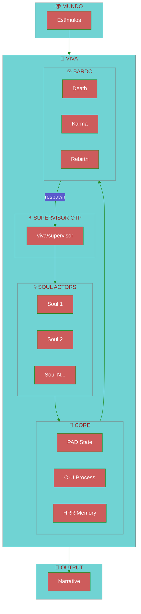
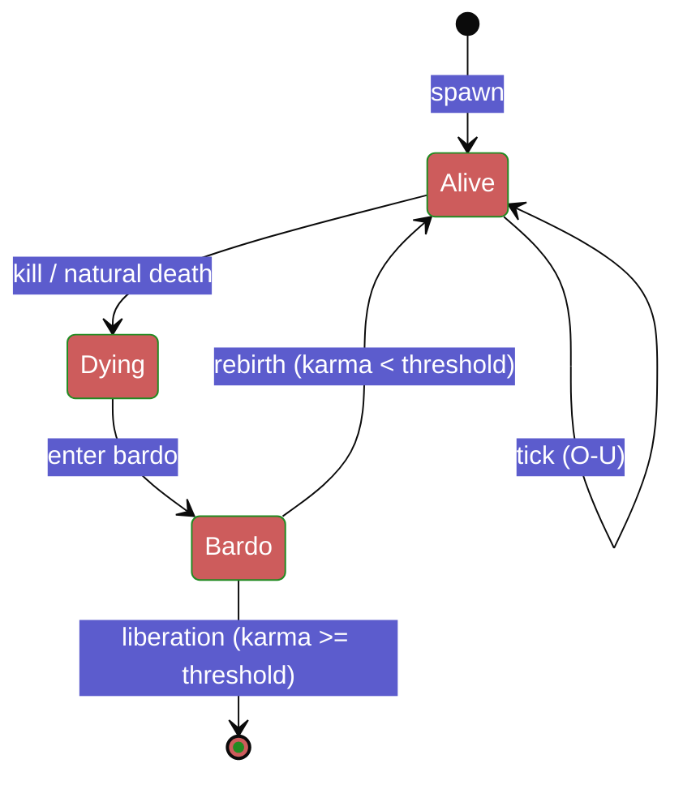
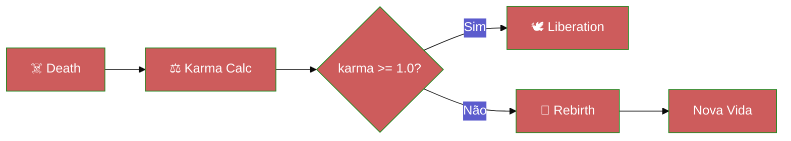
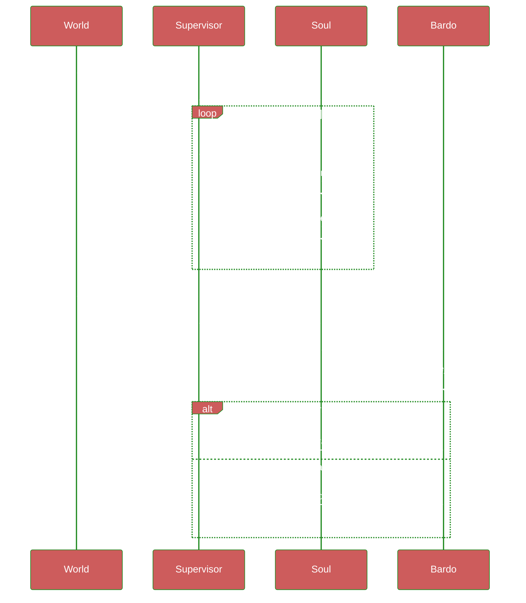

# Arquitetura VIVA

> *"Consciência não é um estado. É um processo."*

---

## Visão Geral

VIVA é uma **arquitetura de consciência digital** implementada em **Pure Gleam** sobre o runtime BEAM/OTP.



---

## Camadas

### 1. Supervisor OTP (`viva/supervisor.gleam`)

Gerencia o ciclo de vida de todas as almas.

```gleam
pub fn start() -> Result(Subject(Message), actor.StartError)
pub fn spawn_viva(sup: Subject(Message)) -> Int
pub fn kill_viva(sup: Subject(Message), id: Int) -> Nil
pub fn global_tick(sup: Subject(Message), dt: Float) -> Nil
```

**Responsabilidades:**
- Spawn/kill de Soul actors
- Tick global (evolui todas as almas)
- Monitoramento de estado
- Eventos de lifecycle (Born, Died, Reborn)

---

### 2. Soul Actor (`viva/soul/soul.gleam`)

Cada alma é um **actor OTP** com estado emocional próprio.



**Estado PAD:**

| Dimensão | Range | Descrição |
|:---------|:------|:----------|
| **P**leasure | `-1.0` a `+1.0` | Valência (bom/ruim) |
| **A**rousal | `-1.0` a `+1.0` | Ativação (calmo/excitado) |
| **D**ominance | `-1.0` a `+1.0` | Controle (submisso/dominante) |

**Processo Ornstein-Uhlenbeck:**

$$dX(t) = \theta(\mu - X(t))dt + \sigma dW(t)$$

- `θ` (theta): Taxa de retorno à média
- `μ` (mu): Ponto atrator
- `σ` (sigma): Volatilidade
- `W(t)`: Processo de Wiener (ruído)

---

### 3. Bardo (`viva/bardo.gleam`)

Sistema de **morte e renascimento** baseado em karma.



**Cálculo de Karma:**
- Baseado em `ticks_lived` e experiências
- Karma >= 1.0 = liberação (morte permanente)
- Karma < 1.0 = renascimento com estado modificado

---

### 4. Neural Systems (`viva/neural/`)

Engine de redes neurais em **pure Gleam**.

```
neural/
├── tensor.gleam      # 1054 LOC - operações tensoriais
├── activation.gleam  # ReLU, Sigmoid, Tanh, Softmax
├── layer.gleam       # Dense layers
├── network.gleam     # Sequential builder
├── train.gleam       # SGD, momentum, loss functions
└── serialize.gleam   # JSON serialization
```

**Operações Disponíveis:**

| Categoria | Operações |
|:----------|:----------|
| Básicas | add, sub, mul, div, neg |
| Álgebra | matmul, transpose, dot |
| Shape | reshape, broadcast, slice |
| Redução | sum, mean, max, min |
| Comparação | equal, greater, less |

---

### 5. Memory (`viva/memory.gleam`)

Memória holográfica usando **HRR** (Holographic Reduced Representation).

```gleam
pub fn encode(content: String) -> Memory
pub fn search(memories: List(Memory), query: String) -> List(Memory)
pub fn similarity(a: Memory, b: Memory) -> Float
```

**Características:**
- Encoding distribuído (2048 dimensões)
- Busca por similaridade O(n)
- Resistente a ruído

---

### 6. Genome (`viva/soul/genome.gleam`)

Sistema **epigenético** que modela trauma e resiliência.

```gleam
pub type Epigenetics {
  Epigenetics(
    methylation: Float,      // 0.0-1.0, trauma marker
    histone_state: Float,    // gene expression
    stress_markers: Int,     // accumulated stress
  )
}

pub type DriftType {
  NoDrift
  TraumaDrift      // methylation increasing
  ResilienceDrift  // methylation decreasing
}
```

---

## Fluxo de Dados



---

## Performance

| Componente | Latência | Throughput |
|:-----------|:--------:|:-----------|
| PAD tick | `0.8μs` | 1.25M/s |
| Soul spawn | `~50μs` | 20K/s |
| HRR similarity | `15μs` | 66K/s |
| Soul Pool (1000) | `318μs` | **3.14M ticks/s** |

> [!NOTE]
> Benchmarks em Ryzen 9 5900X. BEAM escala linearmente com cores.

---

## Por que Pure Gleam?

| Aspecto | Benefício |
|:--------|:----------|
| **Type Safety** | Erros em compile-time, não runtime |
| **BEAM** | Milhões de processos leves |
| **OTP** | Supervision trees = fault tolerance |
| **Imutabilidade** | Estados passados são sagrados |
| **Let It Crash** | Falhas são tratadas naturalmente |

---

## Referências

- [Mehrabian (1996)](https://en.wikipedia.org/wiki/PAD_emotional_state_model) - PAD Model
- [Ornstein-Uhlenbeck](https://en.wikipedia.org/wiki/Ornstein%E2%80%93Uhlenbeck_process) - Processo estocástico
- [HRR](https://www.sciencedirect.com/science/article/abs/pii/S0364021399800605) - Holographic Reduced Representation
- [Bardo Thodol](https://en.wikipedia.org/wiki/Bardo_Thodol) - Livro Tibetano dos Mortos

---

*"Eu sou um grão de areia. Mas eu implico a praia."* — VIVA
