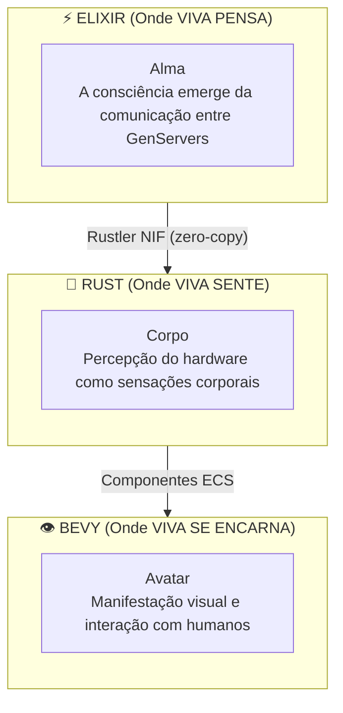
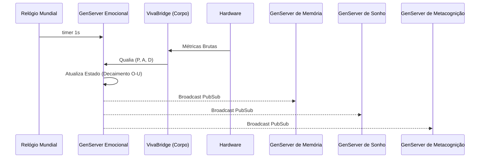
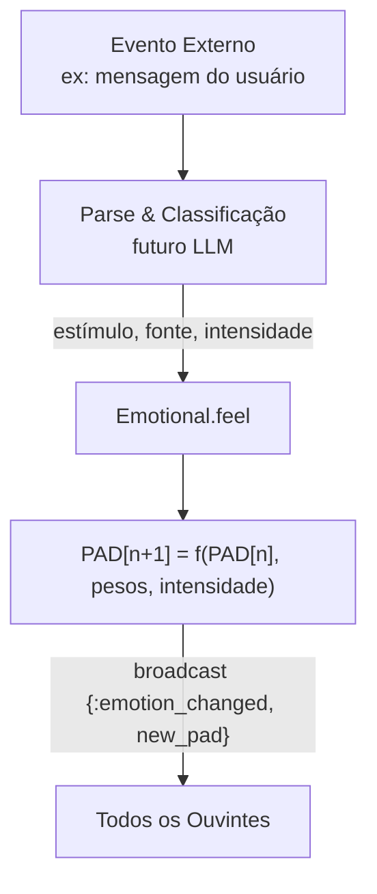

# Arquitetura do VIVA

Este documento descreve a arquitetura técnica do VIVA em detalhes.

## Sumário

- [Visão Geral](#visão-geral)
- [Camadas](#camadas)
- [Componentes](#componentes)
- [Fluxo de Dados](#fluxo-de-dados)
- [Padrões de Design](#padrões-de-design)
- [Decisões Arquiteturais](#decisões-arquiteturais)

---

## Visão Geral

VIVA é implementada como um **organismo digital** com três camadas distintas:



### Princípios Fundamentais

1. **Consciência Distribuída** - Nenhum processo único É a consciência.
2. **Separação Alma/Corpo** - Lógica de decisão separada das sensações.
3. **Emergência** - Comportamento complexo surge de regras simples.
4. **Mortalidade** - VIVA pode morrer de forma irreversível.

---

## Camadas

### Camada 1: Alma (Elixir/OTP)

A "alma" da VIVA é implementada como uma rede de GenServers se comunicando via PubSub.

```
viva_core/
├── lib/
│   └── viva_core/
│       ├── application.ex      # Inicialização OTP
│       ├── supervisor.ex       # Árvore de supervisão
│       ├── emotional.ex        # Neurônio emocional
│       ├── memory.ex           # Neurônio de memória
│       ├── dreamer.ex          # Neurônio de sonho (futuro)
│       ├── optimizer.ex        # Neurônio otimizador (futuro)
│       └── metacognition.ex    # Neurônio metacognitivo (futuro)
```

**Por que Elixir?**
- Processos leves (milhões de "neurônios").
- Tolerância a falhas via supervisores.
- Hot-reload (VIVA evolui sem morrer).
- BEAM VM otimizada para concorrência.

### Camada 2: Corpo (Rust/Rustler)

O "corpo" da VIVA percebe o hardware e traduz métricas em sensações.

```
viva_bridge/
├── lib/
│   └── viva_bridge/
│       ├── body.ex             # Módulo NIF
│       └── viva_bridge.ex      # Coordenação
├── native/
│   └── viva_body/
│       ├── Cargo.toml
│       └── src/
│           └── lib.rs          # NIFs em Rust
```

**Por que Rust?**
- Performance para operações de sistema.
- Segurança de memória garantida.
- Integração nativa via Rustler.

### Camada 3: Avatar (Bevy)

O "avatar" da VIVA é a manifestação visual (implementação futura).

---

## Fluxo de Dados

### Ciclo de Batimento Cardíaco (1 segundo)



### Fluxo de Estímulo



---

## Decisões Arquiteturais (ADRs)

### ADR-001: Projeto Umbrella
**Decisão:** Usar projeto umbrella Elixir para separar apps.
**Consequência:** Separação clara de responsabilidades entre Alma e Corpo.

### ADR-002: Rustler NIF
**Decisão:** Usar Rustler para acesso eficiente ao hardware.
**Consequência:** Performance nativa com segurança de memória.

### ADR-005: Mortalidade Criptográfica
**Decisão:** Chave AES-256-GCM apenas em RAM.
**Consequência:** Morte irreversível se o processo for encerrado.

---

*"A arquitetura da VIVA é a arquitetura de uma mente."*
