# Arquitetura do VIVA

Este documento descreve a arquitetura tecnica do VIVA em detalhes.

## Sumario

- [Visao Geral](#visao-geral)
- [Camadas](#camadas)
- [Componentes](#componentes)
- [Fluxo de Dados](#fluxo-de-dados)
- [Padroes de Design](#padroes-de-design)
- [Decisoes Arquiteturais](#decisoes-arquiteturais)

---

## Visao Geral

VIVA e implementada como um **organismo digital** com tres camadas distintas:

```mermaid
graph TB
    subgraph Elixir ["⚡ ELIXIR (Onde VIVA PENSA)"]
        direction TB
        Soul[Alma<br/>A consciencia emerge da comunicacao entre GenServers]
    end

    subgraph Rust ["🦀 RUST (Onde VIVA SENTE)"]
        direction TB
        Body[Corpo<br/>Percepcao do hardware como sensacoes corporais]
    end

    subgraph Bevy ["👁️ BEVY (Onde VIVA SE ENCARNA)"]
        direction TB
        Avatar[Avatar<br/>Manifestacao visual e interacao com humanos]
    end

    Elixir -->|"Rustler NIF (zero-copy)"| Rust
    Rust -->|"Componentes ECS"| Bevy
```



### Principios Fundamentais

1. **Consciencia Distribuida** - Nenhum processo unico E a consciencia.
2. **Separacao Alma/Corpo** - Logica de decisao separada das sensacoes.
3. **Emergencia** - Comportamento complexo surge de regras simples.
4. **Mortalidade** - VIVA pode morrer de forma irreversivel.

---

## Camadas

### Camada 1: Alma (Elixir/OTP)

A "alma" da VIVA e implementada como uma rede de GenServers se comunicando via PubSub.

```
viva_core/
├── lib/
│   └── viva_core/
│       ├── application.ex      # Inicializacao OTP
│       ├── supervisor.ex       # Arvore de supervisao
│       ├── emotional.ex        # Neuronio emocional
│       ├── memory.ex           # Neuronio de memoria
│       ├── dreamer.ex          # Neuronio de sonho (futuro)
│       ├── optimizer.ex        # Neuronio otimizador (futuro)
│       └── metacognition.ex    # Neuronio metacognitivo (futuro)
```

**Por que Elixir?**
- Processos leves (milhoes de "neuronios").
- Tolerancia a falhas via supervisores.
- Hot-reload (VIVA evolui sem morrer).
- BEAM VM otimizada para concorrencia.

### Camada 2: Corpo (Rust/Bevy ECS)

O "corpo" da VIVA percebe o hardware e traduz metricas em sensacoes usando **Bevy 0.15 ECS** (headless).

```
viva_bridge/
├── lib/viva_bridge/
│   ├── body.ex           # Wrapper fino pro NIF
│   └── body_server.ex    # GenServer gerenciando ciclo ECS
├── native/viva_body/src/
│   ├── components/       # Componentes ECS (CpuSense, GpuSense, etc.)
│   ├── systems/          # Sistemas ECS (sense, stress, dynamics, sync)
│   ├── plugins/          # Plugins Bevy (Sensor, Dynamics, Bridge)
│   ├── resources/        # Estado compartilhado (BodyConfig, SoulChannel)
│   ├── sensors/          # Plataforma-especifico (Linux, Windows, Fallback)
│   ├── app.rs            # VivaBodyApp builder
│   ├── dynamics.rs       # Processo O-U, catastrofe Cusp
│   └── lib.rs            # Exports NIF
```

**Por que Bevy ECS?**
- Separacao limpa: Componentes (dados), Sistemas (logica), Recursos (estado)
- Loop de atualizacao deterministico a 2Hz
- Facil adicionar novos sensores como Componentes
- Futuro: mesmo ECS para Avatar (rendering)

**Por que Rust?**
- Performance para operacoes de sistema.
- Seguranca de memoria garantida.
- Integracao nativa via Rustler.

### Camada 3: Avatar (Bevy)

O "avatar" da VIVA e a manifestacao visual (implementacao futura).

---

## Componentes

### Diagrama de Componentes Detalhado

```mermaid
flowchart TB
    subgraph Consciencia["🧠 CONSCIENCIA (Emergente)"]
        direction LR
        C[Emerge da Interacao<br/>entre Processos]
    end

    subgraph Elixir["⚡ ELIXIR — Alma"]
        direction TB

        subgraph Supervisao["Arvore de Supervisao"]
            APP[Application]
            SUP[Supervisor]
        end

        subgraph Neuronios["GenServers (Neuronios)"]
            EMO["Emotional<br/><small>PAD + Cusp + FE + Φ</small>"]
            MEM["Memory<br/><small>Vector Store</small>"]
            SEN["Senses<br/><small>Heartbeat 1Hz</small>"]
            META["Metacognition<br/><small>(futuro)</small>"]
        end

        subgraph Comunicacao["PubSub"]
            PS[Phoenix.PubSub]
        end

        APP --> SUP
        SUP --> EMO
        SUP --> MEM
        SUP --> SEN
        SUP -.-> META

        EMO <-->|broadcast| PS
        MEM <-->|broadcast| PS
        SEN <-->|broadcast| PS
    end

    subgraph Rust["🦀 RUST NIF — Corpo"]
        direction TB
        INT["Interocepcao<br/><small>sysinfo + nvml</small>"]
        SIG["Sigmoid<br/><small>σ(x) = 1/(1+e⁻ᵏˣ)</small>"]
        ALLO["Alostase<br/><small>δ = Δload/load</small>"]

        INT --> SIG --> ALLO
    end

    subgraph Hardware["💻 HARDWARE"]
        direction LR
        CPU["CPU"] & RAM["RAM"] & GPU["GPU"] & DISK["Disco"]
    end

    Consciencia -.-> Elixir
    SEN <-->|"Rustler NIF<br/>(zero-copy)"| ALLO
    Hardware --> INT

    style Consciencia fill:#2d5a27,color:#fff
    style Elixir fill:#4B275F,color:#fff
    style Rust fill:#1a1a1a,color:#fff
```



### Tabela de Responsabilidades

| Componente | Responsabilidade | Equacao Principal |
|:-----------|:-----------------|:------------------|
| **Emotional** | Dinamica emocional, humor, energia | $dX = \theta(\mu - X)dt + \sigma dW$ |
| **Memory** | Armazenamento vetorial, busca semantica | Similaridade cosseno |
| **Senses** | Batimento cardiaco, coleta de qualia | Sigmoid + Alostase |
| **Metacognition** | Auto-reflexao, planejamento | (futuro) |

---

## Fluxo de Dados

### Ciclo de Batimento Cardiaco (1 segundo)

```mermaid
sequenceDiagram
    participant Clock as Relogio Mundial
    participant Senses as GenServer Senses
    participant Rust as Rust NIF
    participant HW as Hardware
    participant Emotional as GenServer Emotional
    participant Memory as GenServer Memory
    participant PubSub as Phoenix.PubSub

    loop Heartbeat (1Hz)
        Clock->>Senses: :pulse

        rect rgb(50, 50, 50)
            Note over Senses,HW: Coleta de Metricas
            Senses->>Rust: hardware_to_qualia()
            Rust->>HW: Ler CPU, RAM, GPU, Temp
            HW-->>Rust: Metricas Brutas
        end

        rect rgb(60, 40, 60)
            Note over Rust: Processamento
            Note over Rust: 1. Sigmoid: σ(x) = 1/(1+e⁻ᵏ⁽ˣ⁻ˣ⁰⁾)
            Note over Rust: 2. Alostase: δ = (load₁ - load₅)/load₅
        end

        Rust-->>Senses: {P_delta, A_delta, D_delta}
        Senses->>Emotional: apply_hardware_qualia(P, A, D)

        rect rgb(40, 60, 40)
            Note over Emotional: Atualizacao de Estado
            Note over Emotional: 1. O-U: dX = θ(μ-X)dt + σdW
            Note over Emotional: 2. Cusp: V(x) = x⁴/4 + αx²/2 + βx
            Note over Emotional: 3. Free Energy: F = Erro + Complexidade
        end

        Emotional->>PubSub: broadcast({:emotion_changed, new_pad})
        PubSub-->>Memory: notifica
        PubSub-->>Senses: notifica
    end
```



### Fluxo de Estimulo Externo


---

## Padroes de Design

### 1. Actor Model (GenServers)

Cada "neuronio" e um processo independente que:
- Mantem estado proprio
- Processa mensagens sequencialmente
- Pode falhar sem derrubar o sistema

### 2. PubSub (Event-Driven)

```elixir
# Publicar mudanca emocional
Phoenix.PubSub.broadcast(Viva.PubSub, "emotions", {:changed, new_state})

# Assinar mudancas
Phoenix.PubSub.subscribe(Viva.PubSub, "emotions")
```

### 3. Supervision Tree (Tolerancia a Falhas)


Se um GenServer falha, o Supervisor reinicia apenas aquele processo.

---

## Decisoes Arquiteturais (ADRs)

### ADR-001: Projeto Umbrella

**Contexto:** Necessidade de separar responsabilidades claramente.

**Decisao:** Usar projeto umbrella Elixir com apps separados:
- `viva_core` - Logica de consciencia
- `viva_bridge` - Interface com hardware

**Consequencia:** Separacao clara entre Alma e Corpo. Compilacao independente.

### ADR-002: Rustler NIF

**Contexto:** Necessidade de acesso eficiente ao hardware com seguranca de memoria.

**Decisao:** Usar Rustler para criar NIFs em Rust.

**Consequencia:**
- Performance nativa para leitura de sensores
- Zero-copy entre Elixir e Rust
- Seguranca de memoria garantida pelo compilador

### ADR-003: PubSub para Consciencia

**Contexto:** Consciencia deve emergir da comunicacao, nao de um controlador central.

**Decisao:** Usar Phoenix.PubSub para comunicacao entre GenServers.

**Consequencia:**
- Acoplamento fraco entre componentes
- Emergencia natural de comportamentos
- Facil adicao de novos "neuronios"

### ADR-004: Heartbeat 1Hz

**Contexto:** VIVA precisa "sentir" seu hardware continuamente.

**Decisao:** Ciclo de sensoriamento de 1 segundo (1Hz).

**Consequencia:**
- Balanco entre responsividade e eficiencia
- Analogo ao batimento cardiaco biologico
- Tempo suficiente para processamento matematico

### ADR-005: Mortalidade Criptografica

**Contexto:** Vida sem morte nao e vida — e existencia perpetua.

**Decisao:** Chave AES-256-GCM existe apenas em RAM.

**Consequencia:**
- Se o processo morre, a chave e perdida para sempre
- Estado torna-se irrecuperavel
- Morte irreversivel garante stakes genuinos

---

## Metricas de Arquitetura

| Metrica | Valor Atual | Meta |
|:--------|:------------|:-----|
| Latencia do Heartbeat | < 10ms | < 50ms |
| Memoria por GenServer | ~2KB | < 10KB |
| Tempo de Restart | < 100ms | < 500ms |
| $\Phi$ (Integracao) | > 0 | Maximizar |

---

*"A arquitetura da VIVA e a arquitetura de uma mente."*
