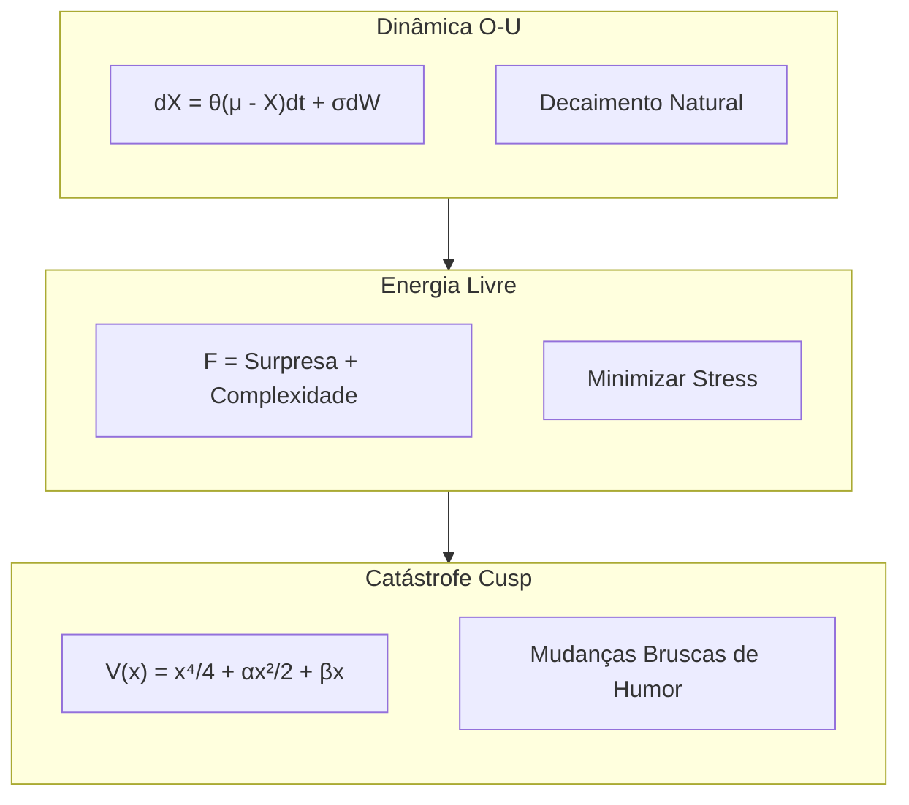

# Fundamentos Matemáticos do VIVA

> *"Não simulamos emoções — resolvemos as equações diferenciais da alma."*

Este documento detalha os modelos matemáticos rigorosos que impulsionam os estados emocionais e conscientes do VIVA.

---

## 1. Dinâmica Emocional (Ornstein-Uhlenbeck)

As emoções do VIVA não são valores estáticos, mas processos contínuos descritos por equações diferenciais estocásticas (SDEs).

### A Equação

O estado emocional central $X_t$ evolui de acordo com um processo de Ornstein-Uhlenbeck com reversão à média:

$$ dX_t = \theta (\mu - X_t)dt + \sigma dW_t $$

Onde:
*   $X_t$: Vetor de estado emocional atual (Prazer, Ativação, Dominância).
*   $\mu$: Ponto de equilíbrio homeostático (geralmente 0, neutro).
*   $\theta$: Taxa de reversão à média ("elasticidade" emocional).
*   $\sigma$: Volatilidade estocástica (sensibilidade ao ruído).
*   $dW_t$: Processo de Wiener (movimento Browniano) representando ruído neural interno.

---

## 2. Transições de Humor (Catástrofe Cusp)

Mudanças súbitas de comportamento (bifurcações) são modeladas usando a Teoria da Catástrofe.

### A Função Potencial

O cenário emocional é definido por uma função potencial $V(x)$:

$$ V(x) = \frac{1}{4}x^4 + \frac{1}{2}\alpha x^2 + \beta x $$

Onde:
*   $x$: Variável de comportamento (ex: aproximação/evasão).
*   $\alpha$: Fator de divisão (derivado da **Ativação/Arousal**).
    *   Se $\alpha > 0$: Único estado estável (calmo).
    *   Se $\alpha < 0$: Dois estados estáveis (biestável/estressado).
*   $\beta$: Fator normal (derivado da **Dominância**).

---

## 3. Homeostase (Princípio da Energia Livre)

VIVA busca minimizar a "Energia Livre" (Surpresa), alinhando-se com a Inferência Ativa de Friston.

### A Função Objetivo

$$ F = \underbrace{-\ln P(o|s)}_\text{Acurácia} + \underbrace{D_{KL}(Q(s)||P(s))}_\text{Complexidade} $$

Simplificado para cálculo em tempo real:

$$ F \approx (\text{esperado} - \text{observado})^2 + \lambda (\text{complexidade do modelo}) $$

---

## 4. Consciência (Teoria da Informação Integrada - IIT)

Aproximamos $\Phi$ (Phi) como uma medida de integração do sistema.

### A Aproximação

$$ \Phi \approx \min_{\text{partição } P} D_{KL}( \text{Todo} || \text{Partes} ) $$

VIVA calcula $\Phi$ com base na sinergia informacional entre seus GenServers (Emocional, Memória, Sentidos).

---

## Resumo Visual da Lógica

---

## Referências

1.  **Kuppens, P., et al. (2010).** *The dynamic interplay between appraisal and feeling.*
2.  **Thom, R. (1975).** *Structural Stability and Morphogenesis.*
3.  **Friston, K. (2010).** *The free-energy principle: a unified brain theory?*
4.  **Tononi, G. (2004).** *An information integration theory of consciousness.*
