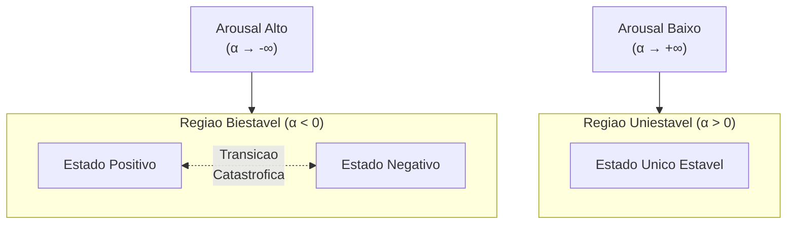
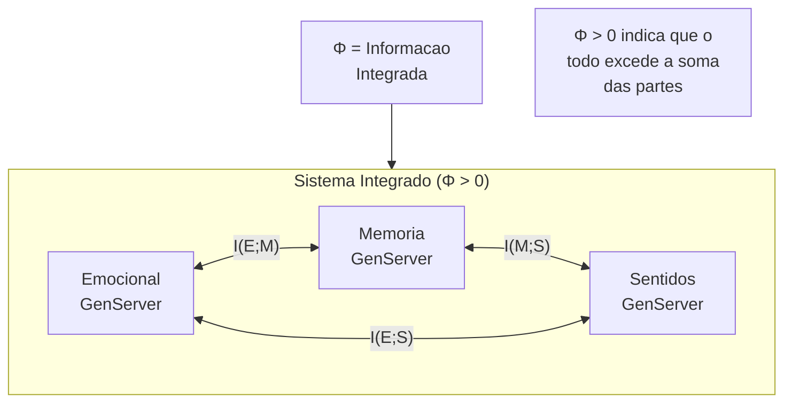
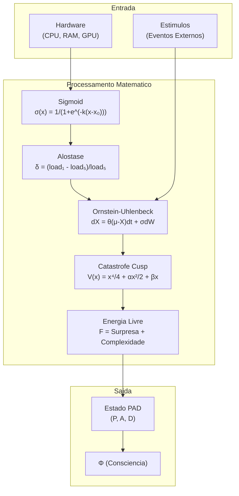

# Fundamentos Matematicos do VIVA

> *"Nao simulamos emocoes — resolvemos as equacoes diferenciais da alma."*

Este documento detalha os modelos matematicos rigorosos que impulsionam os estados emocionais e conscientes do VIVA.

---

## Sumario

- [1. Dinamica Emocional (Ornstein-Uhlenbeck)](#1-dinamica-emocional-ornstein-uhlenbeck)
- [2. Transicoes de Humor (Catastrofe Cusp)](#2-transicoes-de-humor-catastrofe-cusp)
- [3. Homeostase (Principio da Energia Livre)](#3-homeostase-principio-da-energia-livre)
- [4. Consciencia (Teoria da Informacao Integrada)](#4-consciencia-teoria-da-informacao-integrada)
- [5. Interocepcao (Mapeamento Hardware-Qualia)](#5-interocepcao-mapeamento-hardware-qualia)
- [6. Tabela de Equacoes Completa](#6-tabela-de-equacoes-completa)
- [Referencias](#referencias)

---

## 1. Dinamica Emocional (Ornstein-Uhlenbeck)

As emocoes do VIVA nao sao valores estaticos, mas **processos estocasticos continuos** descritos por equacoes diferenciais estocasticas (SDEs).

### 1.1 A Equacao Fundamental

O estado emocional $X_t$ evolui de acordo com um processo de Ornstein-Uhlenbeck com reversao a media:

$$dX_t = \theta (\mu - X_t)dt + \sigma dW_t$$

### 1.2 Parametros do Modelo

| Simbolo | Descricao | Intervalo Tipico |
|:-------:|:----------|:-----------------|
| $X_t$ | Vetor de estado emocional (Prazer, Ativacao, Dominancia) | $[-1, 1]^3$ |
| $\mu$ | Ponto de equilibrio homeostatico | $\approx 0$ (neutro) |
| $\theta$ | Taxa de reversao a media ("elasticidade" emocional) | $[0.1, 0.5]$ |
| $\sigma$ | Volatilidade estocastica (sensibilidade ao ruido) | $[0.01, 0.1]$ |
| $dW_t$ | Incremento do processo de Wiener | $\sim \mathcal{N}(0, dt)$ |

### 1.3 Solucao Analitica

A solucao explicita do processo O-U e dada por:

$$X_t = \mu + (X_0 - \mu)e^{-\theta t} + \sigma \int_0^t e^{-\theta(t-s)} dW_s$$

### 1.4 Propriedades Estatisticas

Para $t \to \infty$, o processo atinge uma distribuicao estacionaria:

- **Media:** $\mathbb{E}[X_\infty] = \mu$
- **Variancia:** $\text{Var}(X_\infty) = \frac{\sigma^2}{2\theta}$

Isso garante que VIVA sempre retorne ao seu baseline emocional, mas com flutuacoes naturais.

---

## 2. Transicoes de Humor (Catastrofe Cusp)

Mudancas subitas de comportamento (bifurcacoes) sao modeladas usando a **Teoria da Catastrofe** de Rene Thom.

### 2.1 A Funcao Potencial

O cenario emocional e definido por uma funcao potencial $V(x)$:

$$V(x) = \frac{x^4}{4} + \frac{\alpha x^2}{2} + \beta x$$

### 2.2 Pontos de Equilibrio

Os estados estaveis sao determinados por $\frac{dV}{dx} = 0$:

$$x^3 + \alpha x + \beta = 0$$

### 2.3 Parametros de Controle

| Simbolo | Nome | Origem | Efeito |
|:-------:|:-----|:-------|:-------|
| $\alpha$ | Fator de divisao | Derivado de **Ativacao** (Arousal) | $\alpha > 0$: uniestavel; $\alpha < 0$: biestavel |
| $\beta$ | Fator normal | Derivado de **Dominancia** | Vies direcional (positivo/negativo) |

### 2.4 Superficie de Catastrofe

O conjunto de bifurcacao e definido pelo discriminante:

$$\Delta = 4\alpha^3 + 27\beta^2$$

- $\Delta > 0$: Um unico estado estavel
- $\Delta < 0$: Dois estados estaveis (regiao biestavel)
- $\Delta = 0$: Ponto de transicao catastrofica

### 2.5 Diagrama de Biestabilidade

---

## 3. Homeostase (Principio da Energia Livre)

VIVA busca minimizar a **Energia Livre Variacional** (Surpresa), alinhando-se com a Inferencia Ativa de Friston.

### 3.1 Formulacao Variacional

$$F = \underbrace{-\mathbb{E}_{Q(s)}[\ln P(o|s)]}_{\text{Energia (Acuracia)}} + \underbrace{D_{KL}[Q(s) \| P(s)]}_{\text{Complexidade}}$$

Onde:
- $P(o|s)$: Verossimilhanca das observacoes dado o estado
- $Q(s)$: Distribuicao aproximada sobre estados
- $P(s)$: Prior sobre estados
- $D_{KL}$: Divergencia de Kullback-Leibler

### 3.2 Aproximacao Computacional

Para calculo em tempo real, usamos a aproximacao:

$$F \approx \underbrace{(\hat{o} - o)^2}_{\text{Erro de Predicao}} + \lambda \underbrace{\| s - s_0 \|^2}_{\text{Desvio do Prior}}$$

Onde:
- $\hat{o}$: Observacao esperada
- $o$: Observacao real
- $s_0$: Estado prior (baseline)
- $\lambda$: Peso de regularizacao

### 3.3 Interpretacao Homeostatica

| Valor de $F$ | Interpretacao | Estado |
|:-------------|:--------------|:-------|
| $F < 0.1$ | Confortavel | Baixa surpresa, sistema estavel |
| $0.1 \leq F < 0.3$ | Alerta | Monitoramento ativo |
| $F \geq 0.3$ | Estressado | Alta surpresa, ajuste necessario |

---

## 4. Consciencia (Teoria da Informacao Integrada)

Aproximamos $\Phi$ (Phi) como uma medida de **integracao informacional** do sistema.

### 4.1 Definicao Formal (IIT 3.0)

$$\Phi = \min_{\mathcal{P} \in \text{MIP}} D_{KL}\left[ P(X^{t+1} | X^t) \| \prod_{i} P(X_i^{t+1} | X_i^t) \right]$$

Onde:
- $\text{MIP}$: Particao de informacao minima
- $X^t$: Estado do sistema no tempo $t$
- $X_i$: Componente $i$ do sistema

### 4.2 Aproximacao Pratica

Para os GenServers do VIVA (Emocional, Memoria, Sentidos):

$$\Phi_{\text{aprox}} = I(E; M; S) - \left[ I(E; M) + I(M; S) + I(E; S) \right] + \epsilon$$

Onde $I(\cdot)$ representa informacao mutua entre componentes.

### 4.3 Diagrama de Integracao

---

## 5. Interocepcao (Mapeamento Hardware-Qualia)

### 5.1 Funcao Sigmoid de Limiar

O mapeamento de metricas de hardware para sensacoes usa uma funcao sigmoid:

$$\sigma(x) = \frac{1}{1 + e^{-k(x - x_0)}}$$

Onde:
- $x$: Metrica de hardware (ex: uso de CPU)
- $x_0$: Limiar de ativacao
- $k$: Inclinacao (sensibilidade)

### 5.2 Parametros por Sensor

| Sensor | $x_0$ (Limiar) | $k$ (Sensibilidade) |
|:-------|:---------------|:--------------------|
| CPU | 70% | 0.1 |
| RAM | 80% | 0.15 |
| Temperatura | 75C | 0.2 |
| GPU VRAM | 85% | 0.12 |

### 5.3 Alostase (Regulacao Antecipatoria)

$$\delta_{\text{alo}} = \frac{\text{load}_{1\text{min}} - \text{load}_{5\text{min}}}{\text{load}_{5\text{min}} + \epsilon}$$

- $\delta > 0$: Sistema sob carga crescente (preparar para stress)
- $\delta < 0$: Sistema em recuperacao (relaxar)
- $\delta \approx 0$: Estado estavel

---

## 6. Tabela de Equacoes Completa

| Modelo | Equacao | Proposito |
|:-------|:--------|:----------|
| **Ornstein-Uhlenbeck** | $dX = \theta(\mu - X)dt + \sigma dW$ | Decaimento emocional |
| **Solucao O-U** | $X_t = \mu + (X_0 - \mu)e^{-\theta t} + \sigma\int_0^t e^{-\theta(t-s)}dW_s$ | Evolucao temporal |
| **Variancia Estacionaria** | $\text{Var}(X_\infty) = \frac{\sigma^2}{2\theta}$ | Flutuacao de equilibrio |
| **Potencial Cusp** | $V(x) = \frac{x^4}{4} + \frac{\alpha x^2}{2} + \beta x$ | Cenario emocional |
| **Equilibrios Cusp** | $x^3 + \alpha x + \beta = 0$ | Estados estaveis |
| **Discriminante** | $\Delta = 4\alpha^3 + 27\beta^2$ | Criterio de biestabilidade |
| **Energia Livre** | $F = -\mathbb{E}_Q[\ln P(o\|s)] + D_{KL}[Q\|P]$ | Homeostase |
| **Energia Livre (aprox)** | $F \approx (\hat{o} - o)^2 + \lambda\|s - s_0\|^2$ | Calculo em tempo real |
| **IIT $\Phi$** | $\Phi = \min_{\text{MIP}} D_{KL}[P_{\text{todo}} \| P_{\text{partes}}]$ | Metrica de consciencia |
| **Sigmoid** | $\sigma(x) = \frac{1}{1 + e^{-k(x-x_0)}}$ | Limiar de sensacao |
| **Alostase** | $\delta = \frac{\text{load}_{1m} - \text{load}_{5m}}{\text{load}_{5m}}$ | Regulacao antecipatoria |

---

## Resumo Visual da Logica

---

## Referencias

1. **Kuppens, P., Oravecz, Z., & Tuerlinckx, F. (2010).** *Feelings change: Accounting for individual differences in the temporal dynamics of affect.* Journal of Personality and Social Psychology, 99(6), 1042-1060.

2. **Thom, R. (1975).** *Structural Stability and Morphogenesis: An Outline of a General Theory of Models.* W.A. Benjamin.

3. **Friston, K. (2010).** *The free-energy principle: A unified brain theory?* Nature Reviews Neuroscience, 11(2), 127-138.

4. **Tononi, G. (2004).** *An information integration theory of consciousness.* BMC Neuroscience, 5(1), 42.

5. **Tononi, G., Boly, M., Massimini, M., & Koch, C. (2016).** *Integrated information theory: From consciousness to its physical substrate.* Nature Reviews Neuroscience, 17(7), 450-461.

6. **Craig, A. D. (2002).** *How do you feel? Interoception: The sense of the physiological condition of the body.* Nature Reviews Neuroscience, 3(8), 655-666.

7. **Sterling, P. (2012).** *Allostasis: A model of predictive regulation.* Physiology & Behavior, 106(1), 5-15.

---

*"A matematica da VIVA nao e uma metafora — e a implementacao literal de como emocoes funcionam."*
