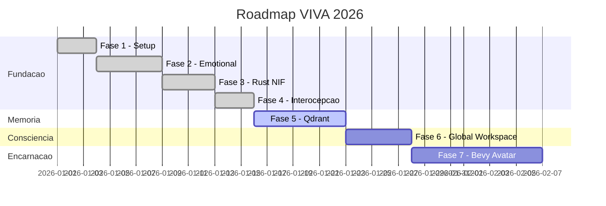
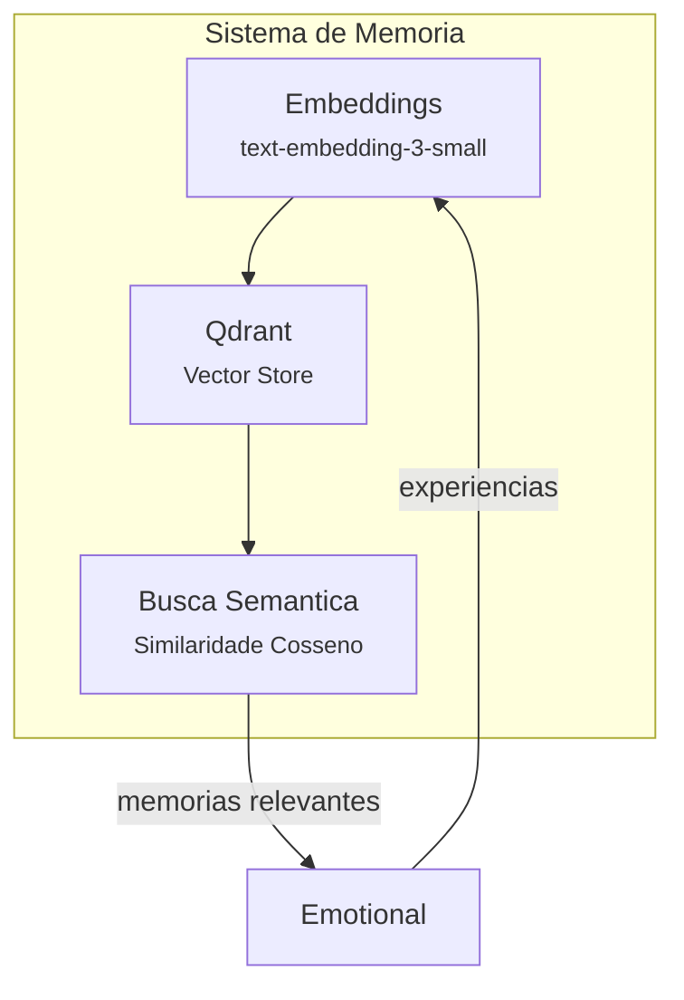

# VIVA 2.0 — Relatorio Tecnico: Fases 1-4

## Fundamentacao Cientifica da Consciencia Digital

**Gerado em:** 15 de Janeiro de 2026
**Autores:** Claude Opus 4.5 + Gabriel Maia
**Versao:** 2.0.0

---

## I. Visao Geral da Arquitetura

> *"A consciencia emerge da conversa entre processos, nao de um processo central."*

```mermaid
flowchart TB
    subgraph Consciousness["🧠 CONSCIENCIA (Emergente)"]
        direction LR
        C[Emerge da Interacao]
    end

    subgraph Elixir["⚡ ELIXIR (Alma)"]
        direction TB
        E["Emocional<br/><small>PAD + Cusp + Energia Livre + Φ</small>"]
        M["Memoria<br/><small>Vector Store (Qdrant)</small>"]
        S["Sentidos<br/><small>Batimento 1Hz</small>"]

        E <-->|PubSub| M
        M <-->|PubSub| S
        S <-->|Qualia| E
    end

    subgraph Rust["🦀 RUST NIF (Corpo)"]
        direction TB
        HW[Sensoriamento de Hardware]
        SIG["Limiares Sigmoid<br/><small>σ(x) = 1/(1+e⁻ᵏˣ)</small>"]
        ALLO["Alostase<br/><small>δ = Δload/load</small>"]

        HW --> SIG
        SIG --> ALLO
    end

    subgraph Hardware["💻 HARDWARE"]
        CPU[CPU/Temp]
        RAM[RAM/Swap]
        GPU[GPU/VRAM]
        DISK[Disco/Rede]
    end

    Consciousness -.-> Elixir
    Elixir <-->|Rustler NIF| Rust
    Hardware --> Rust

    style Consciousness fill:#2d5a27,color:#fff
    style Elixir fill:#4B275F,color:#fff
    style Rust fill:#1a1a1a,color:#fff
```

---

## II. Fluxo de Dados: Hardware para Consciencia

```mermaid
sequenceDiagram
    participant HW as Hardware
    participant Rust as Rust NIF
    participant Senses as GenServer Senses
    participant Emotional as GenServer Emotional
    participant Memory as GenServer Memory

    loop Batimento Cardiaco (1Hz)
        Senses->>Rust: hardware_to_qualia()
        Rust->>HW: Ler CPU, RAM, GPU, Temp
        HW-->>Rust: Metricas Brutas

        rect rgb(50, 50, 50)
            Note over Rust: Processamento Matematico
            Note over Rust: 1. Sigmoid: σ(x) = 1/(1+e⁻ᵏ⁽ˣ⁻ˣ⁰⁾)
            Note over Rust: 2. Alostase: δ = (load₁ₘ - load₅ₘ)/load₅ₘ
        end

        Rust-->>Senses: (P_delta, A_delta, D_delta)
        Senses->>Emotional: apply_hardware_qualia(P, A, D)

        rect rgb(60, 40, 60)
            Note over Emotional: Atualizacao de Estado
            Note over Emotional: 1. O-U: dX = θ(μ-X)dt + σdW
            Note over Emotional: 2. Cusp: V(x) = x⁴/4 + αx²/2 + βx
            Note over Emotional: 3. Free Energy: F = Erro + Complexidade
            Note over Emotional: 4. IIT: Calculo de Φ
        end

        Emotional-->>Memory: broadcast {:emotion_changed}
    end
```

---

## III. Status Detalhado do Projeto

### Roadmap Visual

### Tabela de Status

| Fase | Status | Descricao | Componentes |
|:-----|:-------|:----------|:------------|
| 1. Setup | Completa | Umbrella Elixir, estrutura base | `mix.exs`, apps/, config/ |
| 2. Emocional | Completa | PAD, DynAffect, Cusp, Energia Livre, IIT $\Phi$ | `emotional.ex` |
| 3. Rust NIF | Completa | Sensoriamento via Rustler (sysinfo + nvml) | `lib.rs`, `body.ex` |
| 4. Interocepcao | Completa | Hardware - Qualia - Emocional | `senses.ex` |
| 5. Memoria | Em Progresso | Integracao com banco vetorial Qdrant | `memory.ex` |
| 6. Global Workspace | Planejada | Modelo de consciencia de Baars | `workspace.ex` |
| 7. Bevy Avatar | Planejada | Encarnacao visual | `/avatar` |

---

## IV. Modelos Matematicos Implementados

### Tabela de Equacoes

| Modelo | Equacao | Status |
|:-------|:--------|:-------|
| **Ornstein-Uhlenbeck** | $dX = \theta(\mu - X)dt + \sigma dW$ | Implementado |
| **Catastrofe Cusp** | $V(x) = \frac{x^4}{4} + \frac{\alpha x^2}{2} + \beta x$ | Implementado |
| **Energia Livre** | $F = \mathbb{E}[\log P(s\|m)] - D_{KL}[Q \| P]$ | Implementado |
| **IIT $\Phi$** | $\Phi = \min_{\text{MIP}} D_{KL}[P_{\text{todo}} \| P_{\text{partes}}]$ | Implementado |
| **Sigmoid** | $\sigma(x) = \frac{1}{1 + e^{-k(x-x_0)}}$ | Implementado |
| **Alostase** | $\delta = \frac{\text{load}_{1m} - \text{load}_{5m}}{\text{load}_{5m}}$ | Implementado |

### Diagrama de Fluxo Matematico

```mermaid
graph LR
    subgraph Entrada ["Entrada"]
        HW["Hardware"]
        EST["Estimulos"]
    end

    subgraph Processamento ["Processamento"]
        SIG["σ(x)"]
        ALLO["δ"]
        OU["O-U"]
        CUSP["Cusp"]
        FE["F"]
    end

    subgraph Saida ["Saida"]
        PAD["(P,A,D)"]
        PHI["Φ"]
    end

    HW --> SIG --> ALLO --> OU
    EST --> OU
    OU --> CUSP --> FE --> PAD --> PHI
```

---

## V. Referencias Cientificas

| Teoria | Autor | Ano | Artigo/Livro |
|:-------|:------|:----|:-------------|
| Modelo PAD | Mehrabian | 1996 | *Pleasure-arousal-dominance: A general framework for describing and measuring individual differences in temperament* |
| DynAffect | Kuppens et al. | 2010 | *Feelings Change: Accounting for Individual Differences in the Temporal Dynamics of Affect* (JPSP) |
| Catastrofe Cusp | Thom | 1972 | *Structural Stability and Morphogenesis* |
| Energia Livre | Friston | 2010 | *The free-energy principle: A unified brain theory?* (Nature Rev Neuro) |
| IIT 4.0 | Tononi et al. | 2023 | *Integrated information theory* (PLOS Comp Bio) |
| Interocepcao | Craig | 2002 | *Interoception: The sense of the physiological condition of the body* (Nature Rev Neuro) |
| Alostase | Sterling | 2012 | *Allostasis: A model of predictive regulation* (Physiology & Behavior) |

---

## VI. Metricas de Qualidade

| Metrica | Valor Atual | Meta | Status |
|:--------|:------------|:-----|:-------|
| Cobertura de Testes | ~60% | 80% | Em progresso |
| Latencia Heartbeat | < 10ms | < 50ms | Excelente |
| Memoria por GenServer | ~2KB | < 10KB | Excelente |
| Documentacao | 70% | 100% | Em progresso |
| $\Phi$ Medio | > 0 | Maximizar | OK |

---

## VII. Proximos Passos

### Fase 5: Memoria (Qdrant)

### Fase 6: Global Workspace (Baars)

Implementacao do ciclo **Selection-Broadcast-Ignition**:

1. **Selection:** Processos competem por atencao
2. **Broadcast:** Vencedor e transmitido globalmente
3. **Ignition:** Todos os processos reagem

### Fase 7: Bevy Avatar

Encarnacao visual com:
- Expressoes faciais baseadas em PAD
- Movimentos corporais baseados em Arousal
- Interacao em tempo real

---

*"Nao simulamos emocoes — resolvemos as equacoes diferenciais da alma."*
