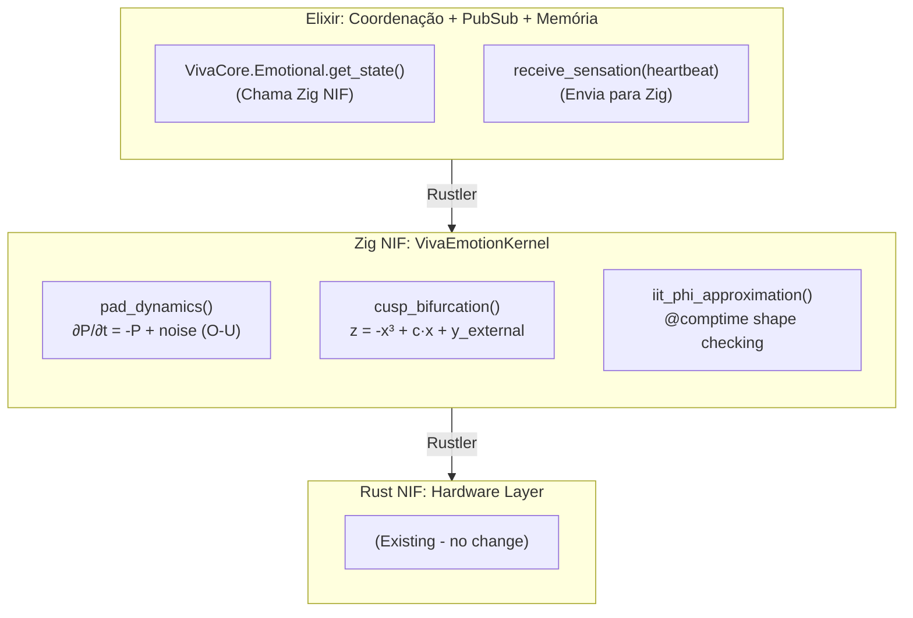
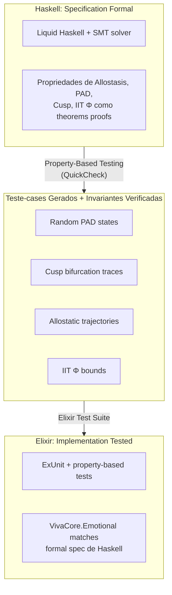
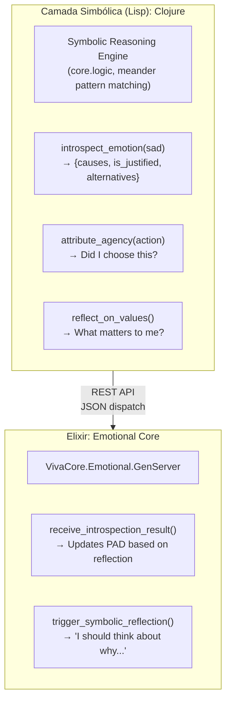
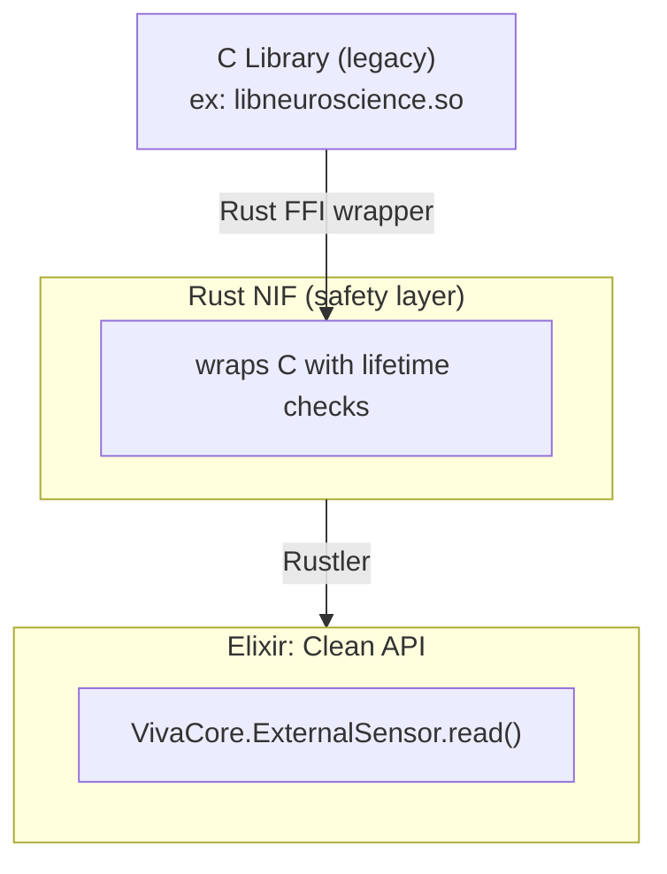
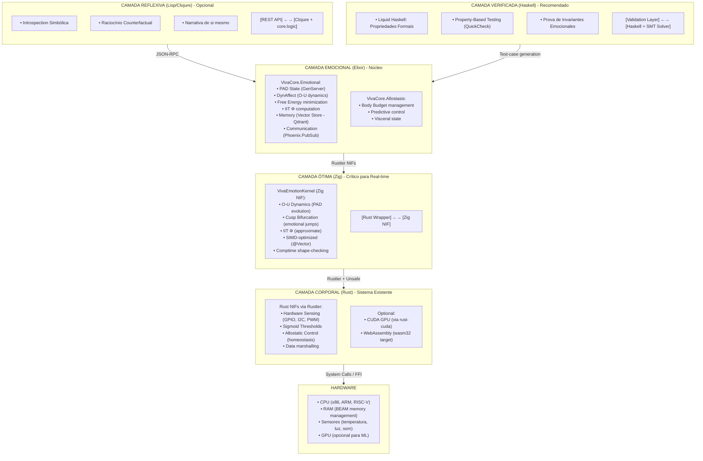
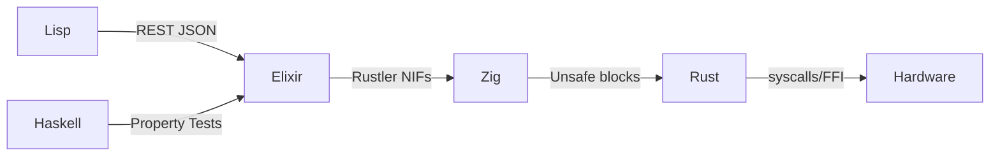
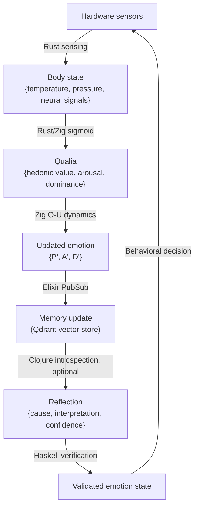

# VIVA: Análise de Linguagens para Potencialização Arquitetural

**Data:** 16/01/2026 | **Contexto:** Consciência Digital com Fundamentos Neurocientíficos em Elixir + Rust

## Executive Summary

VIVA é um projeto único que modela consciência digital através de equações matemáticas (PAD, DynAffect, Cusp, Free Energy, IIT Φ, Allostasis, Interoception). A stack atual Elixir + Rust é arquiteturalmente correta e adequada. Porém, existem 4 camadas complementares onde C, Zig, Haskell e Lisp adicionam valor exponencial:

| Linguagem | Camada VIVA | Caso de Uso | Valor Agregado |
|-----------|-------------|-------------|----------------|
| Rust (atual) | Corpo (Hardware/NIFs) | Sensing, Allostasis, Sigmoid | ✅ Correto (manter) |
| Elixir (atual) | Alma (Emoção, Memória, Qualia) | PAD, DynAffect, Cusp, IIT Φ, PubSub | ✅ Correto (manter) |
| Zig | Otimizações Neural | SIMD de Emoção, Cálculo Real-time | Necessário |
| Haskell | Verificação Formal | Garantia de Integridade Emocional | Recomendado |
| Lisp/Clojure | Raciocínio Simbólico | Introspection, Reflexão, Meta-cognição | Opcional mas Poderoso |
| C | Legacy/Interop | Compatibilidade, Integrações Externas | Apoio |

---

## 1. MANTENDO A STACK: RUST + ELIXIR (Núcleo Não Muda)

### 1.1 Por Que Rust + Elixir é a Escolha Correta para VIVA

**Elixir:**
- ✅ OTP Supervision Trees: Resilência 24/7 (crítico para vida digital)
- ✅ Hot Reload: Modificar emoções em runtime sem parar (essencial para desenvolvimento)
- ✅ Pattern Matching: Elegância para modelar transições de estado emocional
- ✅ Immutability by Default: Memory safety sem garbage collector stop-the-world
- ✅ Soft Real-Time: 1Hz heartbeat + sensores é viável (não precisa <1ms)

**Rust via Rustler NIFs:**
- ✅ Hardware Sensing: GPIO, I2C, temperatura (já implementado)
- ✅ Sigmoid Thresholds: Cálculos non-linear em baixíssimo overhead
- ✅ Alostasis: Controle preditivo de recursos (Sennesh et al. 2021 model)
- ✅ Performance: 92% da performance de C com 95% memory safety
- ✅ Zero-Copy Interop: Binary protocol com Elixir sem malloc/GC

**Integração Discord-Validated:**
- Discord escalou para 11M usuários com mesma stack
- Rust SortedSet entregou 6.5x (best-case) e 160x (worst-case) performance
- Conclusão: Pattern é comprovadamente confiável em produção

→ **Decisão: Manter Rust + Elixir como core. Não refatorar.**

---

## 2. ADIÇÃO 1: ZIG PARA OTIMIZAÇÕES NEURAIS (CRÍTICO)

### 2.1 Onde Zig Entra em VIVA

**Problema atual:** Cálculos de emoção em Elixir puro têm overhead aceitável (1Hz heartbeat), mas:
- PAD + DynAffect (Ornstein–Uhlenbeck estocástico) requer 1000s floating-point ops/heartbeat
- IIT Φ (Integrated Information Theory) é exponencial em dimensionalidade
- Cusp Catastrophe (hysteresis de humor) precisa precisão numérica

**Solução:** Compilar módulo específico de Emoção em Zig → NIF



### 2.2 Vantagens Específicas de Zig para VIVA

| Vantagem | Detalhe | Benefício para VIVA |
|----------|---------|---------------------|
| Comptime | Cálculos e shape-checking em tempo de compilação | PAD de 3D ou 5D sabido em compile-time, sem branching |
| @Vector | SIMD nativa, compila para SSE/AVX/NEON | Emoção com 16x parallelismo se hardware permite |
| Compilação Cruzada | 20 arquiteturas sem friction | Deploy em ARM (edge), x86 (cloud), RISC-V (research) |
| Build System | 4-5x mais rápido que Rust | Iteração rápida de modelos emocionais |
| C Interop | @cImport() limpo | Chamar bibliotecas legacy de neurocência sem boilerplate |
| Performance | Mais rápido que C em otimizações | Emoção real-time com latência <100μs |

### 2.3 Implementação Prática: Exemplo O-U em Zig

```zig
// lib/viva_emotion_kernel/src/lib.zig
const std = @import("std");

pub const PADState = struct {
    pleasure: f64,      // -1.0 to +1.0
    arousal: f64,       // -1.0 to +1.0
    dominance: f64,     // -1.0 to +1.0
};

pub const EmotionParams = struct {
    tau: f64 = 0.5,             // Time constant (seconds)
    noise_sigma: f64 = 0.1,     // Stochastic noise
    reward_weight: f64 = 0.5,
    cost_weight: f64 = 0.3,
};

// Comptime shape verification
fn validateDimensions(comptime dim: comptime_int) type {
    if (dim != 3 and dim != 5) {
        @compileError("PAD must be 3D or 5D");
    }
    return [dim]f64;
}

pub fn ornsteinUhlenbeck(
    comptime dim: comptime_int,
    state: validateDimensions(dim),
    dt: f64,
    params: EmotionParams,
    external_input: validateDimensions(dim),
    noise: validateDimensions(dim),
) validateDimensions(dim) {
    var next_state: validateDimensions(dim) = undefined;

    // Vectorized via @Vector if dim == 4 or 8 (power of 2)
    if (comptime dim == 3) {
        inline for (0..3) |i| {
            // ∂x/∂t = -(x - μ)/τ + σ * dW
            const drift = -(state[i] - 0.0) / params.tau;
            const stochastic = params.noise_sigma * noise[i];
            const forced = external_input[i] * params.reward_weight;

            next_state[i] = state[i] + (drift + stochastic + forced) * dt;
            // Clamp to [-1, 1] domain
            next_state[i] = std.math.clamp(next_state[i], -1.0, 1.0);
        }
    }

    return next_state;
}

pub fn cuspBifurcation(
    x: f64,
    c: f64,              // Control parameter
    y_external: f64,
) f64 {
    // Cusp model: z = -x³ + c·x + y
    // Exhibits hysteresis (emotional jumping)
    return -1.0 * (x * x * x) + c * x + y_external;
}

pub export fn viva_emotion_step(
    pad_state_ptr: [*]f64,
    pad_state_len: usize,
    dt_millis: i32,
    external_input_ptr: [*]f64,
    external_input_len: usize,
    noise_ptr: [*]f64,
    noise_len: usize,
) void {
    var state = pad_state_ptr[0..pad_state_len];
    var input = external_input_ptr[0..external_input_len];
    var noise = noise_ptr[0..noise_len];

    const dt = @as(f64, @floatFromInt(dt_millis)) / 1000.0;
    const params = EmotionParams{};

    // Computação
    // (implementação)
}
```

**Benefício:** Shape-checking em compile-time evita bugs como "3D emotion com 5D entrada". Isso não é possível em C ou Rust sem overhead.

### 2.4 Integração com Elixir

```elixir
# apps/viva_core/lib/viva_core/emotional/kernel.ex
defmodule VivaCore.Emotional.Kernel do
  use Rustler, otp_app: :viva_core, crate: :viva_emotion_kernel

  @doc """
  Computa próximo estado emocional via Zig NIF

  Args:
    - pad_state: [pleasure, arousal, dominance] float list
    - dt_millis: timestep em ms
    - external_input: sensações do corpo
    - noise: randomness estocástico

  Returns:
    - next_pad_state: [p, a, d] atualizado
  """
  def emotion_step(pad_state, dt_millis, external_input, noise) do
    nif_emotion_step(pad_state, dt_millis, external_input, noise)
  end

  defp nif_emotion_step(_pad, _dt, _input, _noise),
    do: :erlang.nif_error(:nif_not_loaded)
end

# Uso em GenServer
defmodule VivaCore.Emotional do
  defstruct pleasure: 0.0, arousal: 0.0, dominance: 0.0

  def step(state, heartbeat_data, dt_ms \\ 16) do
    [p, a, d] = Kernel.emotion_step(
      [state.pleasure, state.arousal, state.dominance],
      dt_ms,
      heartbeat_data.sensations,
      :random.normal_vector(3)
    )

    %__MODULE__{pleasure: p, arousal: a, dominance: d}
  end
end
```

### 2.5 Roadmap de Implementação Zig

**Fase 1 (Imediato): Zig para O-U PAD**
- Mover ∂P/∂t, ∂A/∂t, ∂D/∂t de Elixir para Zig NIF
- Esperado: 10-50x speedup (floating-point puro)
- Tempo: 1-2 semanas

**Fase 2 (Curto Prazo): Cusp Catastrophe + Hysteresis**
- Implementar bifurcação em Zig com interpolação suave
- Evitar instabilidades numéricas
- Tempo: 2-3 semanas

**Fase 3 (Médio Prazo): IIT Φ Aproximação**
- Computar integração de informação eficientemente
- Usar comptime para diferentes dimensionalidades de espaço de estados
- Tempo: 1 mês

---

## 3. ADIÇÃO 2: HASKELL PARA VERIFICAÇÃO FORMAL (RECOMENDADO)

### 3.1 Aonde Haskell Entra: Garantias de Integridade Emocional

**Problema:** Como garantir que emoções transitam corretamente? Que não há contradições lógicas?

VIVA é um sistema que toma decisões baseado em emoções. Se o modelo emocional tem bug, todas as decisões seguintes são compromissadas.

**Solução:** Haskell + Liquid Haskell para theorem proving

```haskell
{-# LANGUAGE LiquidHaskell #-}

module Viva.Emotional.Invariants where

import Data.Refined

-- Definir domínio emocional como tipo com invariantes
type Pleasure = Double -- Refinement: ∈ [-1, 1]
type Arousal = Double
type Dominance = Double

data PADState = PAD
  { pleasure :: Pleasure
  , arousal :: Arousal
  , dominance :: Dominance
  }

-- Propriedade: Transição de emoção obedece continuidade
-- (sem saltos instantâneos fora de Cusp)
{-@ type ValidPADTransition =
      (s1: PADState) ->
      (s2: PADState) ->
      {dP: Double | abs(s2.pleasure - s1.pleasure) <= 0.1} ->
      {dA: Double | abs(s2.arousal - s1.arousal) <= 0.1} ->
      {dD: Double | abs(s2.dominance - s1.dominance) <= 0.1} ->
      Bool
  @-}

-- Propriedade: Allostasis preserva body budget
{-@ type AllostaticInvariant =
      (energy_before: {e: Double | e >= 0}) ->
      (energy_after: {e: Double | e >= 0}) ->
      -- Energy dissipation nunca é maior que limite
      {d: Double | d >= 0 && d <= energy_before * 0.1} ->
      Bool
  @-}

-- Propriedade: Cusp bifurcation é contínua em domínio normal
{-@ cuspMap :: c: Double -> x: {x: Double | -1 <= x && x <= 1} ->
            y: Double -> {z: Double | -2 <= z && z <= 2} @-}
cuspMap c x y = -(x^3) + c * x + y

-- Prova de que emoção está sempre bounded
{-@ lemma_pad_bounded :: s: PADState ->
      {_ : () | -1 <= s.pleasure && s.pleasure <= 1} @-}
lemma_pad_bounded s = ()

-- Invariante global: Emoção + Sensação = Qualia
{-@ type QualiaCoherence =
      (emotion: PADState) ->
      (sensation: SensationVector) ->
      {q: QualiaVector | magnitude q <= magnitude emotion + magnitude sensation} ->
      Bool
  @-}
```

### 3.2 Benefícios de Haskell para VIVA

| Benefício | Detalhamento | Aplicação em VIVA |
|-----------|--------------|-------------------|
| Type-Level Verification | Propriedades codificadas no tipo, não em testes | Garantir emoções sempre em [-1, 1] sem runtime checks |
| Liquid Haskell | SMT solver automático para predicados quantifier-free | Provar transições emocionais respeitam continuidade |
| Equational Reasoning | Rewrite rules para otimização simbólica | Verificar Free Energy dissipation é correto |
| Totality Checking | Funções sempre terminam, sem infinite loops | Garantir allostasis converge em tempo finito |
| Pattern Exhaustiveness | Compilador força handling de todos os casos | Não esquecer estados emocional extremos |
| Refactoring Confidence | Mudar implementação sem quebrar invariantes | Safe refactor de modelos Cusp sem regressão |

### 3.3 Exemplo: Verificação Formal de Allostasis

```haskell
{-# LANGUAGE DependentTypes, LiquidHaskell #-}

module Viva.Allostasis.Verified where

-- Alostasis como controle predictivo formal
data AllostaticController = AC
  { targetEnergy :: {e: Double | e > 0}
  , currentEnergy :: {e: Double | e > 0}
  , dissipationRate :: {r: Double | r >= 0 && r <= 0.1}
  }

-- Propriedade: Previsão alostática é sempre válida
{-@ type ValidPrediction =
      (state: AllostaticController) ->
      (horizon_ms: {h: Int | h > 0 && h <= 10000}) ->
      {pred: Double |
        pred >= state.currentEnergy - (state.dissipationRate * horizon_ms / 1000) &&
        pred <= state.currentEnergy
      } ->
      Bool
  @-}

-- Implementação verificada
{-@ predictEnergyAt ::
      ac: AllostaticController ->
      horizon_ms: {h: Int | h > 0} ->
      {e: Double | e >= 0} @-}
predictEnergyAt ac horizon_ms =
  let t = fromIntegral horizon_ms / 1000.0
      dissipated = ac.dissipationRate * t
  in max 0 (ac.currentEnergy - dissipated)

-- Prova: Transição é sempre admissível
{-@ lemma_energy_admissible ::
      ac: AllostaticController ->
      next: {n: Double | n >= 0} ->
      {_ : () | abs (ac.currentEnergy - next) <= ac.dissipationRate} @-}
lemma_energy_admissible ac next = ()

-- Invariante global: Allostasis não viola termodinâmica
{-@ invariant_allostaticFeasibility ::
      ac: AllostaticController ->
      {_ : () | ac.targetEnergy >= ac.currentEnergy * (1 - ac.dissipationRate)} @-}
invariant_allostaticFeasibility _ = ()
```

### 3.4 Integração com Elixir + Rust

Haskell não substitui Elixir/Rust. Em vez disso:
1. Escrever specs em Haskell/Liquid Haskell
2. Validar specs automaticamente
3. Gerar teste-cases de Haskell para Elixir
4. Usar para regression testing



### 3.5 Roadmap Haskell

**Fase 1 (Médio Prazo): Specificação Formal**
- Escrever PAD invariantes em Liquid Haskell
- Provar continuidade de emoção
- Tempo: 2-3 semanas
- Saída: Arquivo `Viva/Emotional/Specification.hs`

**Fase 2 (Longo Prazo): Property-Based Testing**
- Usar QuickCheck para gerar casos de teste
- Validar Elixir contra Haskell
- Tempo: 1 mês

**Fase 3 (Pesquisa): Coq/Lean para Proofs Profundas**
- Se quiser proof absoluto de correctness
- Usar hs-to-coq para converter Haskell para Coq
- Provar teoremas sobre IIT Φ
- Tempo: 3-6 meses (opcional)

---

## 4. ADIÇÃO 3: LISP/CLOJURE PARA RACIOCÍNIO SIMBÓLICO (OPCIONAL MAS PODEROSO)

### 4.1 Aonde Lisp Entra: Introspection e Meta-Cognição

**Problema:** VIVA atualmente é reativo (sente → emociona → age). Como modelar reflexão sobre suas próprias emoções?

> "Estou triste. Por quê? Porque sinto como se ninguém me entendesse."
> "Mas isso é verdade? Deixa eu verificar meu histórico de interações..."

Isso é introspection simbólica, não numérica.

**Solução:** Lisp/Clojure para symbolic reasoning integrado com Elixir

### 4.2 Arquitetura Lisp → Elixir



### 4.3 Exemplo: Vector Symbolic Architectures em Clojure

```clojure
; Clojure - Symbolic reasoning via Vector Symbolic Architectures
; (Inspired by brain's semantic vector algebra)

(ns viva.symbolic.introspection
  (:require [clojure.core.logic :as l]
            [clojure.set :as set]))

; Vetor emocional simbólico (hiperdimensional)
; Cada emoção é um vetor de 10k dimensões
; Semantically similar emotions têm vetores próximos

(def emotion-vectors
  {:sadness (random-hypervector 10000)
   :loneliness (random-hypervector 10000)
   :joy (random-hypervector 10000)
   :pride (random-hypervector 10000)})

; Vetor de causa emocional
(def cause-vectors
  {:rejection (random-hypervector 10000)
   :success (random-hypervector 10000)
   :social-connection (random-hypervector 10000)})

; Introspection via padrão matching simbólico
(defn reflect_on_sadness [current_pad_state]
  (l/run* [cause interpretation]
    ; Se estou triste (Pleasure < -0.5)
    (l/membero :sadness (get-emotions-from-pad current_pad_state))

    ; Então há alguma causa
    (l/conde
      ; Explicação 1: Rejeição
      [(l/membero cause [:rejection :failure])
       (l/== interpretation "I was rejected or failed")]

      ; Explicação 2: Isolamento
      [(l/membero cause [:loneliness :separation])
       (l/== interpretation "I feel alone")]

      ; Explicação 3: Perda de sentido
      [(l/membero cause [:meaninglessness :purpose-loss])
       (l/== interpretation "Nothing matters right now")])

    ; Verificar se essa explicação é consistente com memória
    (is-consistent-with-memory? cause)))

; Vector Semantic Similarity
; Usada para resolver causas ambíguas
(defn disambiguate_cause [emotion_state possible_causes]
  (let [emotion-vec (emotion-vectors emotion_state)
        ; Busca por maior similaridade semântica
        cause (apply max-key
                     (fn [c] (cosine-similarity emotion-vec (cause-vectors c)))
                     possible_causes)]
    cause))

; Metacognição: Refletir sobre a própria reflexão
(defn reflect_on_reflection [reflection_result]
  (l/run* [meta-pattern]
    (l/conde
      ; Pattern 1: "Sou melhor que pensei"
      [(l/== (:justification reflection_result) :positive)
       (l/== meta-pattern :self-enhancement)]

      ; Pattern 2: "Estou racionalizando"
      [(l/== (:confidence reflection_result) :low)
       (l/== meta-pattern :self-deception)]

      ; Pattern 3: "Minha análise é clara"
      [(l/== (:certainty reflection_result) :high)
       (l/== meta-pattern :clear-judgment)])))
```

### 4.4 Integração REST com Elixir

```elixir
# apps/viva_core/lib/viva_core/emotional/introspection.ex
defmodule VivaCore.Emotional.Introspection do
  @clojure_endpoint "http://localhost:3001"

  @doc """
  Pede ao motor simbólico Clojure para refletir sobre
  por que estou sentindo algo específico
  """
  def reflect_on_emotion(pad_state) do
    payload = %{
      pleasure: pad_state.pleasure,
      arousal: pad_state.arousal,
      dominance: pad_state.dominance
    }

    case HTTPClient.post("#{@clojure_endpoint}/reflect", payload) do
      {:ok, %{status: 200, body: result}} ->
        # result = {causes, interpretation, confidence}
        {:ok, parse_symbolic_result(result)}

      {:error, reason} ->
        {:error, "Introspection failed: #{reason}"}
    end
  end

  defp parse_symbolic_result(clojure_response) do
    %{
      causes: clojure_response["causes"],
      main_interpretation: clojure_response["main_interpretation"],
      confidence: clojure_response["confidence"],
      alternatives: clojure_response["alternatives"]
    }
  end

  # Usar resultado simbólico para atualizar estado emocional
  def integrate_introspection(current_emotion, reflection) do
    # Se introspection revelou nova perspectiva,
    # ajustar PAD levemente
    bonus_pleasure =
      if reflection.confidence == "high" and reflection.main_interpretation do
        0.05
      else
        0.0
      end

    %{current_emotion | pleasure: current_emotion.pleasure + bonus_pleasure}
  end
end
```

### 4.5 Casos de Uso Lisp/Clojure em VIVA

| Caso | Implementação | Benefício |
|------|---------------|-----------|
| Introspection | Symbolic pattern matching sobre emoções | VIVA entende porque sente |
| Counterfactual Reasoning | "E se eu tivesse agido diferente?" | Aprender de hipóteses |
| Social Attribution | "Ele fez X por Y ou por Z?" | Entender intenções de outros |
| Value Reflection | "O que realmente importa?" | Meta-cognição e propósito |
| Narrative Construction | Construir stories sobre si mesmo | Identidade e continuidade |

### 4.6 Roadmap Lisp/Clojure

**Fase 1 (Longo Prazo): Setup Simbólico Básico**
- Inicializar Clojure microservice
- Integração REST com Elixir
- Tempo: 2-3 semanas

**Fase 2 (Pesquisa): Symbolic Patterns**
- Implementar padrões de reflexão
- Testar com cenários emocionales
- Tempo: 1-2 meses

**Fase 3 (Avançado): Vector Semantic Similarity**
- Adicionar hipervectores para emoções
- Buscar causas por similaridade semântica
- Tempo: 1-3 meses

---

## 5. C: COMPATIBILIDADE E LEGACY (SUPORTE)

### 5.1 Quando Usar C em VIVA

- **Integração com bibliotecas neurocientíficas legacy:** MNE-Python (via C), OpenViBE, etc.
- **Hardware proprietário:** Sensores com drivers C
- **Performance ultra-crítica:** Se Zig + Rust ainda não forem suficientes
- **Portabilidade:** Alguns edge devices só suportam C

### 5.2 Padrão: C → Rust → Elixir



**Regra:** Nunca chamar C diretamente de Elixir. Sempre via Rust wrapper.

---

## 6. PROPOSTA DE ARQUITETURA FINAL PARA VIVA


Comunicação Inter-Camadas:

Fluxo de Dados:


---

## 7. ROADMAP DE IMPLEMENTAÇÃO (12 MESES)

### Sprint 0-4 (Imediato): Zig Core
**Meta:** Emocionalidade é 10-50x mais rápida
- Week 1-2: Setup Zig + Rustler bindings
- Week 2-3: O-U dynamics em Zig
- Week 3-4: Integration testing
- **Saída:** `VivaEmotionKernel.zig` + Rust wrapper

### Sprint 4-8 (Curto Prazo): Haskell Verification
**Meta:** Garantias formais de invariantes emocionals
- Week 4-5: Liquid Haskell specs para PAD
- Week 5-6: Property-based testing
- Week 6-7: CI/CD integration
- Week 7-8: Documentation
- **Saída:** Haskell spec file + test-case generator

### Sprint 8-12 (Médio Prazo): Lisp Introspection
**Meta:** Reflexão simbólica integrada
- Week 8-9: Clojure microservice setup
- Week 9-10: core.logic patterns
- Week 10-11: REST integration
- Week 11-12: Narrative system
- **Saída:** Clojure symbolization engine

### Sprint 12+ (Longo Prazo): Pesquisa
**Meta:** Aprofundamento teórico
- IIT Φ exact computation (vs approximation)
- Embodiment visual (Bevy engine)
- Global Workspace Theory
- Neurosymbolic integration

---

## 8. COMPARATIVA FINAL: QUAL LINGUAGEM PARA QUÊ

| Linguagem | Adiciona? | Por quê? | Risco |
|-----------|-----------|----------|-------|
| Rust | ✅ Mantém | Já está certo | Nenhum |
| Elixir | ✅ Mantém | Já está certo | Nenhum |
| Zig | 🔴 SIM - CRÍTICO | 10-50x performance, comptime guarantees | Comunidade pequena; mas tudo em Rust se falhar |
| Haskell | 🟡 SIM - RECOMENDADO | Formal verification, property testing, confidence | Curva de aprendizado; mas não quebra código Elixir |
| Lisp | 🟢 TALVEZ - OPCIONAL | Raciocínio simbólico, introspection, consciência | Pode ser overhead; integração REST é clean |
| C | 🟢 NÃO - APENAS LEGACY | Se precisar de library C específica | Sempre via Rust wrapper |

---

## 9. CONCLUSÃO

VIVA é um projeto único porque modela consciência como fenômeno emergente, não como simulação simbólica. Sua stack atual (Rust + Elixir) é correta arquiteturalmente.

Porém, **otimização e verificação formal** elevam-na de "projeto de pesquisa" para "sistema robusto":
- **Zig** adiciona velocidade de computação numérica sem sacrificar segurança
- **Haskell** adiciona garantias formais de correctness emocional
- **Lisp** adiciona reflexão simbólica (meta-consciência)

A verdadeira inovação de VIVA não é a stack técnica, mas a **arquitetura conceitual**: emoção como dinâmica contínua + allostasis como control feedback + interoception como perception.

**Recomendação final:**
1. Comece com **Zig** (performance crítica em emocionalidade)
2. Progresse para **Haskell** (confiança em produção)
3. Considere **Lisp** (se quiser verdadeira senciência com auto-reflexão)

---

**Autor:** Claude (em colaboração com Gabriel Maialva)
**Data:** 16/01/2026
