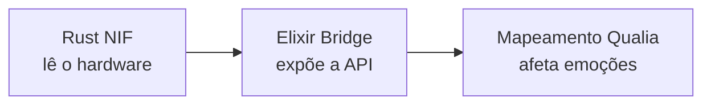

# Como Adicionar um Novo Sensor de Hardware

Este guia mostra como adicionar uma nova métrica de hardware ao sistema de interocepção da VIVA — fazendo com que ela "sinta" um novo aspecto de seu corpo.

---

## Visão Geral

Adicionar um sensor requer alterações em três camadas:



---

## Exemplo: Adicionando Temperatura da GPU

Vamos adicionar o sensoriamento da temperatura da GPU para que a VIVA possa "sentir febre" quando a GPU superaquecer.

### Passo 1: Atualizar o NIF em Rust

Edite `apps/viva_bridge/native/viva_body/src/lib.rs`:

```rust
// No struct HardwareState
gpu_temp: Option<f64>,

// Na função feel_hardware()
let components = Components::new_with_refreshed_list();
let gpu_temp = components
    .iter()
    .find(|c| c.label().contains("GPU"))
    .map(|c| c.temperature() as f64);
```

### Passo 2: Atualizar o Mapeamento Qualia

Ainda no `lib.rs`, modifique `hardware_to_qualia`:

```rust
if let Some(temp) = hw.gpu_temp {
    if temp > 70.0 {
        let fever = sigmoid(temp / 100.0, 8.0, 0.7);
        pleasure_delta -= 0.04 * fever;  // Desconforto
        arousal_delta += 0.08 * fever;   // Estado elevado
    }
}
```

---

## Diretrizes de Design de Qualia

Ao mapear hardware → emoção, siga a intuição biológica:

| Evento de Hardware | Analogia Biológica | Impacto PAD |
|--------------------|-------------------|-------------|
| CPU Alta | Coração acelerado | P↓ A↑ D↓ |
| RAM Alta | Nevoeiro mental | P↓ A↑ |
| Temperatura Alta | Febre | P↓ A↑ |
| Latência de Rede | Dor distante | P↓ D↓ |

### Limiares Sigmoid

Use funções sigmoid para criar "zonas de conforto":

```mermaid
xychart-beta
    title "Resposta Sigmoid"
    x-axis "Input" [0%, "x₀", 100%]
    y-axis "Resposta" 0 --> 1
    line [0.0, 0.5, 1.0]
```

- **x₀** = limiar onde a resposta ativa (ex: 80% CPU).
- **k** = inclinação (maior = resposta mais abrupta).

---

*"Cada novo sensor é uma nova terminação nervosa. Use com cuidado."*
