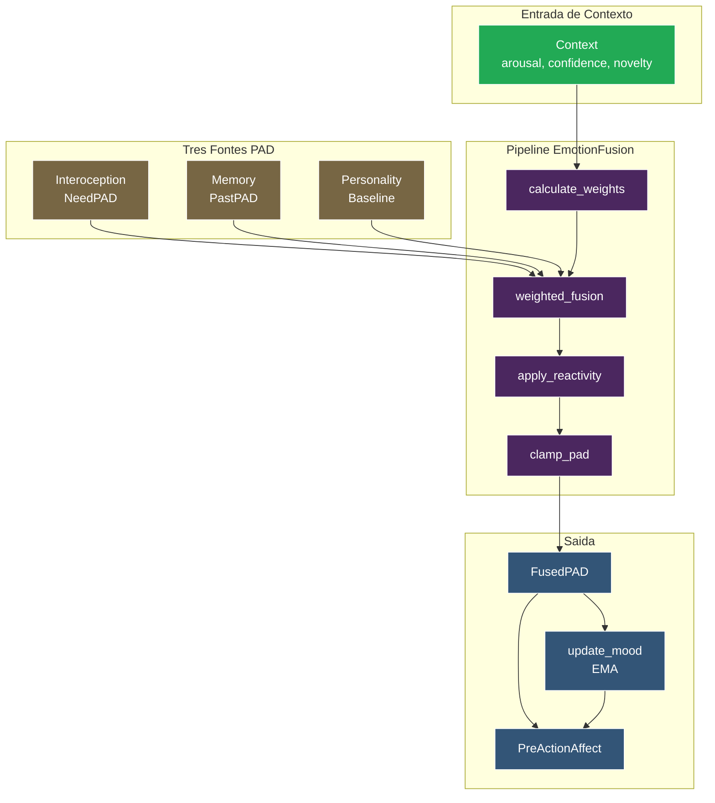
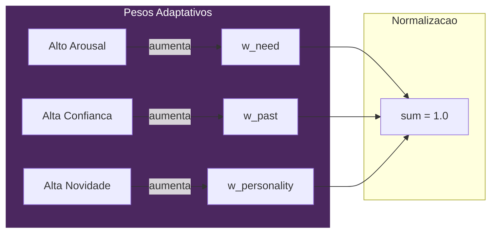
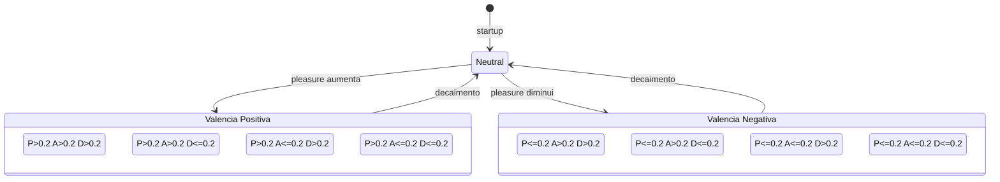
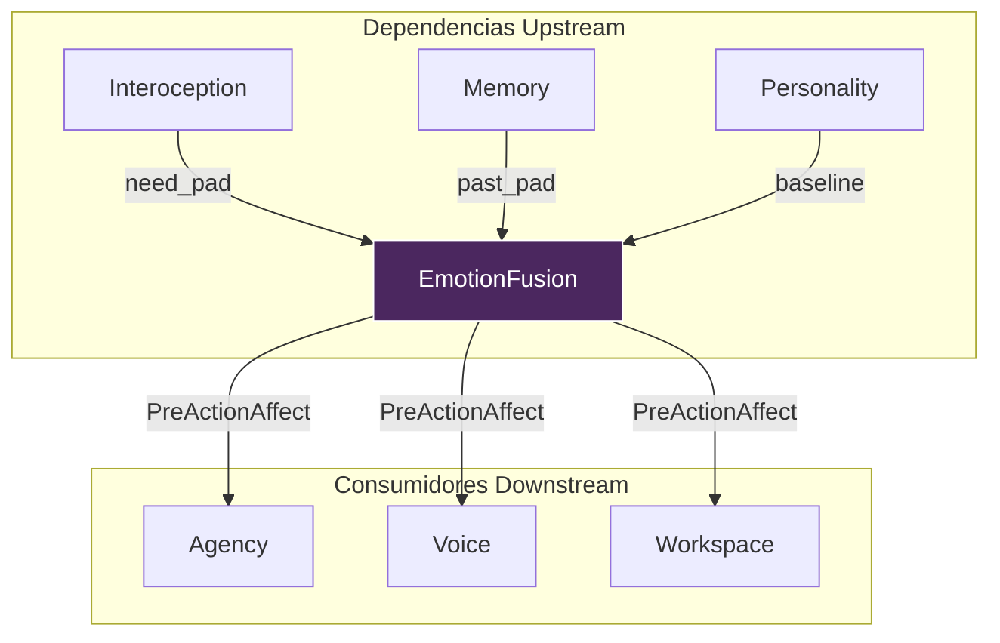

# EmotionFusion - Processamento Emocional de Fonte Dupla

> *"As emocoes de VIVA emergem da fusao de necessidades imediatas, experiencias passadas e personalidade."*

## Visao Geral

EmotionFusion implementa um **modelo de emocao de fonte dupla** baseado em Borotschnig (2025) "Emotions in Artificial Intelligence". Em vez de depender de uma unica fonte emocional, VIVA integra tres fluxos distintos:

1. **Emocoes baseadas em necessidade** (de Interoception) - Estado fisiologico atual
2. **Emocoes passadas** (de recuperacao de Memory) - Tags emocionais de episodios similares
3. **Vies de personalidade** (baseline de tracos) - Tendencias emocionais de longo prazo

A fusao usa **pesos adaptativos** que variam baseados no contexto, produzindo um estado **PreActionAffect** unificado que dirige a selecao de acoes.

---

## Conceito

### Tres Fontes de Emocao

| Fonte | Origem | Quando Confiavel |
|-------|--------|------------------|
| **Baseada em necessidade** | Interoception (Free Energy) | Alta excitacao (resposta de emergencia) |
| **Baseada no passado** | Recuperacao Memory (Qdrant) | Alta confianca (situacao familiar) |
| **Personalidade** | Tracos PAD baseline | Alta novidade (situacao nova) |

### Pesos Adaptativos

Pesos **nao sao fixos** - eles se adaptam ao contexto:

```
Alta Excitacao  -> Confia mais em NECESSIDADES (luta-ou-fuga)
Alta Confianca  -> Confia mais no PASSADO (padrao conhecido)
Alta Novidade   -> Confia mais em PERSONALIDADE (comportamento padrao)
```

**Calculo de Peso:**

```
w_need = 0.4 * (1.0 + |arousal| * 0.5)
w_past = 0.4 * (0.5 + confidence)
w_pers = 0.2 * (0.5 + novelty)

Entao normaliza para w_need + w_past + w_pers = 1.0
```

### Mood como Media Movel Exponencial (EMA)

Mood fornece **estabilidade emocional** - muda lentamente mesmo quando emocoes flutuam rapidamente.

```
Mood[t] = alpha * Mood[t-1] + (1 - alpha) * Emotion[t]

Onde alpha = 0.95 (aproximadamente 20 passos de meia-vida)
```

Isso significa que mood e um **historico suavizado** de estados emocionais recentes, nao uma reacao direta a estimulos.

---

## Arquitetura

### Pipeline de Fusao



### Visualizacao de Pesos Adaptativos



### Fluxo de Dados

1. **Contexto chega** com valores de arousal, confidence e novelty
2. **Pesos calculados** baseados no contexto (adaptativo)
3. **Tres vetores PAD** recuperados de Interoception, Memory, Personality
4. **Fusao ponderada** combina as tres fontes
5. **Reatividade aplicada** (personalidade amplifica/amortece desvios)
6. **Valores limitados** ao range PAD valido [-1, 1]
7. **Mood atualizado** via EMA
8. **PreActionAffect construido** para selecao de acao downstream

---

## Classificacao de Octantes PAD



---

## Referencia da API

### `fuse/5` - Funcao Principal de Fusao

Combina multiplas fontes de emocao em um estado unificado.

```elixir
@spec fuse(pad(), pad(), Personality.t(), pad(), context()) :: fusion_result()
```

**Parametros:**

| Parametro | Tipo | Descricao |
|-----------|------|-----------|
| `need_pad` | `pad()` | PAD de Interoception (necessidades atuais) |
| `past_pad` | `pad()` | PAD de recuperacao Memory (tags emocionais) |
| `personality` | `Personality.t()` | Struct com baseline, reactivity, volatility |
| `mood` | `pad()` | Estado de mood atual (EMA de emocoes recentes) |
| `context` | `context()` | `%{arousal: float, confidence: float, novelty: float}` |

**Retorna:**

```elixir
%{
  fused_pad: %{pleasure: float, arousal: float, dominance: float},
  mood: %{pleasure: float, arousal: float, dominance: float},
  pre_action_affect: %{
    emotion: pad(),
    mood: pad(),
    personality_baseline: pad(),
    personality_traits: [atom()],
    confidence: float(),
    novelty: float(),
    fusion_weights: %{need: float, past: float, personality: float}
  },
  weights: {w_need, w_past, w_personality}
}
```

---

### `simple_fuse/2` - Fusao Rapida

Funde dois vetores PAD usando pesos padrao. Util para atualizacoes rapidas sem contexto completo.

```elixir
@spec simple_fuse(pad(), pad()) :: pad()
```

---

### `calculate_weights/1` - Calculo de Peso Adaptativo

Calcula pesos de fusao baseados no contexto.

```elixir
@spec calculate_weights(context()) :: {float(), float(), float()}
```

**Campos de contexto:**

| Campo | Faixa | Efeito |
|-------|-------|--------|
| `arousal` | [-1, 1] | Valor absoluto maior aumenta peso de necessidade |
| `confidence` | [0, 1] | Valor maior aumenta peso do passado |
| `novelty` | [0, 1] | Valor maior aumenta peso de personalidade |

---

### `update_mood/2` - Atualizacao EMA de Mood

Atualiza mood usando Media Movel Exponencial.

```elixir
@spec update_mood(pad(), pad()) :: pad()
```

O fator de suavizacao EMA (alpha) e **0.95**, significando:
- Mood retem 95% do valor anterior
- Nova emocao contribui apenas 5%
- Meia-vida e aproximadamente 20 ticks

---

### `classify_emotion/1` - Classificacao de Octante PAD

Classifica uma emocao baseada em qual octante do espaco PAD ela ocupa.

```elixir
@spec classify_emotion(pad()) :: atom()
```

**Retorna um de:**

| Rotulo | P | A | D | Descricao |
|--------|---|---|---|-----------|
| `:exuberant` | > 0.2 | > 0.2 | > 0.2 | Feliz e energizado com controle |
| `:dependent_joy` | > 0.2 | > 0.2 | <= 0.2 | Feliz mas sentindo-se dependente |
| `:relaxed` | > 0.2 | <= 0.2 | > 0.2 | Contente e no controle |
| `:docile` | > 0.2 | <= 0.2 | <= 0.2 | Contente e submisso |
| `:hostile` | <= 0.2 | > 0.2 | > 0.2 | Irritado e dominante |
| `:anxious` | <= 0.2 | > 0.2 | <= 0.2 | Preocupado e impotente |
| `:disdainful` | <= 0.2 | <= 0.2 | > 0.2 | Frio e superior |
| `:bored` | <= 0.2 | <= 0.2 | <= 0.2 | Desengajado |
| `:neutral` | - | - | - | Perto do centro |

---

### `emotional_distance/2` - Distancia no Espaco PAD

Computa distancia Euclidiana entre dois vetores PAD.

```elixir
@spec emotional_distance(pad(), pad()) :: float()
```

---

### Funcoes Auxiliares

```elixir
# Obter a constante alpha de mood
mood_alpha() :: 0.95

# Criar contexto neutro para fusao padrao
neutral_context() :: %{arousal: 0.0, confidence: 0.5, novelty: 0.5}

# Obter estado PAD neutro
neutral_pad() :: %{pleasure: 0.0, arousal: 0.0, dominance: 0.0}
```

---

## Exemplos de Uso

### Fusao Basica

```elixir
alias VivaCore.{EmotionFusion, Personality}

# Estado atual de Interoception (alto estresse)
need_pad = %{pleasure: -0.3, arousal: 0.6, dominance: -0.2}

# Recuperado de episodio de memoria similar
past_pad = %{pleasure: 0.1, arousal: 0.2, dominance: 0.0}

# Carregar personalidade
personality = Personality.load()

# Mood atual (do tick anterior)
mood = %{pleasure: 0.05, arousal: 0.1, dominance: 0.1}

# Contexto: alta excitacao, confianca media, baixa novidade
context = %{arousal: 0.6, confidence: 0.7, novelty: 0.2}

# Realizar fusao
result = EmotionFusion.fuse(need_pad, past_pad, personality, mood, context)

IO.inspect(result.fused_pad)
# => %{pleasure: -0.12, arousal: 0.35, dominance: -0.05}

IO.inspect(result.weights)
# => {0.48, 0.42, 0.10}  # Necessidades pesadas fortemente devido a alta excitacao
```

### Fusao Rapida (Sem Contexto)

```elixir
# Fusao simples de 2 fontes com pesos padrao
need_pad = %{pleasure: -0.2, arousal: 0.4, dominance: 0.0}
past_pad = %{pleasure: 0.3, arousal: 0.1, dominance: 0.2}

fused = EmotionFusion.simple_fuse(need_pad, past_pad)
# => %{pleasure: 0.02, arousal: 0.2, dominance: 0.08}
```

### Classificacao de Emocao

```elixir
pad = %{pleasure: 0.5, arousal: 0.6, dominance: 0.3}

EmotionFusion.classify_emotion(pad)
# => :exuberant

pad2 = %{pleasure: -0.4, arousal: 0.7, dominance: -0.3}

EmotionFusion.classify_emotion(pad2)
# => :anxious
```

### Monitorando Deriva de Mood

```elixir
# Acompanhar mood ao longo de multiplos ticks
initial_mood = EmotionFusion.neutral_pad()

emotions = [
  %{pleasure: 0.5, arousal: 0.3, dominance: 0.2},  # sucesso
  %{pleasure: 0.4, arousal: 0.2, dominance: 0.1},  # sucesso calmo
  %{pleasure: -0.2, arousal: 0.5, dominance: -0.1} # estresse subito
]

final_mood = Enum.reduce(emotions, initial_mood, fn emotion, mood ->
  EmotionFusion.update_mood(mood, emotion)
end)

# Mood muda lentamente mesmo com pico de estresse
IO.inspect(final_mood)
# => %{pleasure: 0.031, arousal: 0.046, dominance: 0.014}
```

---

## Configuracao

### Atributos do Modulo

| Constante | Valor | Descricao |
|-----------|-------|-----------|
| `@default_need_weight` | 0.4 | Peso base para emocoes baseadas em necessidade |
| `@default_past_weight` | 0.4 | Peso base para emocoes baseadas no passado |
| `@default_personality_weight` | 0.2 | Peso base para baseline de personalidade |
| `@mood_alpha` | 0.95 | Fator de suavizacao EMA (~20 passos de meia-vida) |

### Diretrizes de Ajuste

- **Aumentar `@mood_alpha`** (mais perto de 1.0) para mood mais estavel
- **Diminuir `@mood_alpha`** (mais perto de 0.5) para mood mais reativo
- **Ajustar pesos padrao** para mudar confianca baseline em cada fonte

---

## Integracao com Outros Modulos

### Diagrama de Integracao Completa



### Dependencias Upstream

```
Interoception -----> EmotionFusion
    (need_pad)           |
                         v
Memory ------------> EmotionFusion
    (past_pad)           |
                         v
Personality -------> EmotionFusion
    (baseline)           |
                         v
                   PreActionAffect
```

### Consumidores Downstream

O mapa `pre_action_affect` e consumido por:
- **Agency** - Selecao de acao baseada em estado emocional
- **Voice** - Geracao de proto-linguagem (balbucio)
- **Workspace** - Alocacao de consciencia/atencao

---

## Referencia do Paper

Baseado em **Borotschnig (2025)** "Emotions in Artificial Intelligence".

### Pseudocodigo Original

```
FusedEmotions := FuseEmotions(CurrentEmotions, PastEmotions)
PreActionAffect := [FusedEmotions, Mood, Personality]
```

### Implementacao VIVA

```elixir
# FusedEmotions := FuseEmotions(CurrentEmotions, PastEmotions)
fused = weighted_fusion(need_pad, past_pad, personality.baseline, weights)
fused = apply_reactivity(fused, personality)
fused = clamp_pad(fused)

# PreActionAffect := [FusedEmotions, Mood, Personality]
pre_action_affect = %{
  emotion: fused,              # FusedEmotions
  mood: update_mood(mood, fused),  # Mood (EMA)
  personality_baseline: personality.baseline,
  personality_traits: personality.traits,
  fusion_weights: weights
}
```

### Extensoes Principais

VIVA estende o modelo do paper com:

1. **Tres fontes** em vez de duas (adiciona baseline de Personality)
2. **Pesos adaptativos** baseados em contexto (arousal, confidence, novelty)
3. **Amplificacao de reatividade** de tracos de Personality
4. **Mood como EMA** para suavizacao temporal

---

## Definicoes de Tipo

```elixir
@type pad :: %{pleasure: float(), arousal: float(), dominance: float()}

@type context :: %{
  arousal: float(),     # Nivel de excitacao atual [-1, 1]
  confidence: float(),  # Confianca de recuperacao de memoria [0, 1]
  novelty: float()      # 1 - max_similarity [0, 1]
}

@type fusion_result :: %{
  fused_pad: pad(),
  mood: pad(),
  pre_action_affect: map(),
  weights: {float(), float(), float()}
}
```

---

## Referencias

- Borotschnig, R. (2025). "Emotions in Artificial Intelligence."
- Mehrabian, A. (1996). "Pleasure-arousal-dominance: A general framework for describing and measuring individual differences in temperament."
- Russell, J. A. (1980). "A circumplex model of affect."
