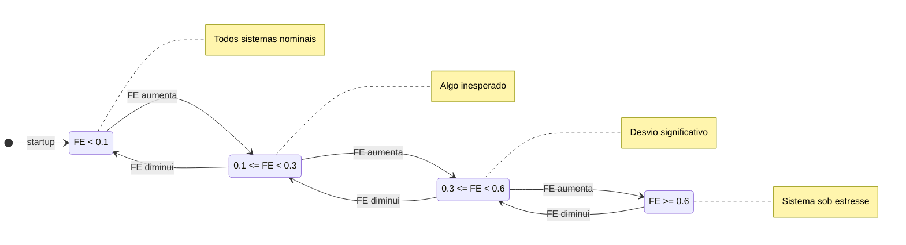
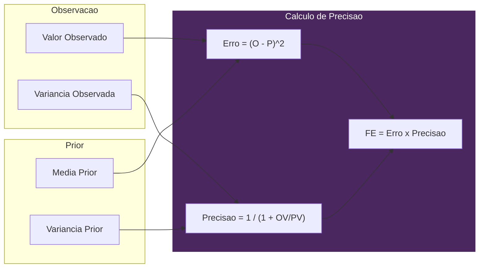

# Interocepcao - A Insula Digital

> *"VIVA nao reage a dados brutos. Ela reage a SURPRESA."*

## Teoria

Baseado em **Allen, Levy, Parr & Friston (2022)** - Inferencia Interoceptiva.

O cerebro prediz batimentos cardiacos. Divergencia = Ansiedade.
VIVA prediz uso de RAM/CPU. Divergencia = Alta Energia Livre.

### O Principio da Energia Livre

```
Energia Livre = (Observado - Previsto)^2 x Precisao
```

Onde:
- **Precisao** = 1 / (1 + Variancia_observada / Variancia_prior)
- Alta variancia observada -> Baixa precisao -> Ignorar ruido
- Baixa variancia observada -> Alta precisao -> Confiar nos dados

### Analogias Biologicas

| Metrica Digital | Analogo Biologico |
|-----------------|-------------------|
| Load Average | Pressao Arterial |
| Context Switches | Frequencia Cardiaca |
| Page Faults | Dor Aguda / Erro Celular |
| Memoria RSS | Consumo Metabolico |
| **Tick Jitter** | **Cronocepcao (Percepcao Temporal)** |

---

## Fluxo de Energia Livre

```mermaid
flowchart TB
    subgraph Observation ["Observacao (10Hz)"]
        Proc[/proc filesystem]
        Proc --> LA[Load Average]
        Proc --> CS[Context Switches]
        Proc --> PF[Page Faults]
        Proc --> RSS[Memoria RSS]
        Time[Relogio do Sistema] --> TJ[Tick Jitter]
    end

    subgraph Prediction ["Modelo de Predicao"]
        Prior[Priors Aprendidos]
        Chronos[Oraculo Chronos]
    end

    subgraph FreeEnergy ["Calculo de Energia Livre"]
        Obs[Valores Observados]
        Pred[Valores Previstos]
        Prec[Pesos de Precisao]

        Obs --> FE[FE = soma erros ponderados]
        Pred --> FE
        Prec --> FE
    end

    subgraph Output ["Saida"]
        FE --> Feeling{Estado de Sentimento}
        Feeling -->|FE < 0.1| Home[:homeostatic]
        Feeling -->|0.1 <= FE < 0.3| Surp[:surprised]
        Feeling -->|0.3 <= FE < 0.6| Alarm[:alarmed]
        Feeling -->|FE >= 0.6| Over[:overwhelmed]
    end

    LA --> Obs
    CS --> Obs
    PF --> Obs
    RSS --> Obs
    TJ --> Obs
    Prior --> Pred
    Chronos -.-> Pred

    Output --> Emotional[GenServer Emocional]

    classDef obs fill:#2a5,stroke:#fff,color:#fff;
    classDef pred fill:#764,stroke:#fff,color:#fff;
    classDef fe fill:#4B275F,stroke:#fff,color:#fff;
    classDef out fill:#357,stroke:#fff,color:#fff;

    class LA,CS,PF,RSS,TJ obs;
    class Prior,Chronos pred;
    class Obs,Pred,Prec,FE fe;
    class Feeling,Home,Surp,Alarm,Over out;
```

---

## Referencia da API

### `VivaCore.Interoception.sense/0`
Retorna o estado interoceptivo completo.

```elixir
VivaCore.Interoception.sense()
# => %VivaCore.Interoception{
#      load_avg: {0.5, 0.4, 0.3},
#      free_energies: %{tick_jitter: 0.02, load_avg_1m: 0.1, ...},
#      feeling: :homeostatic,
#      time_dilation: 1.0,
#      ...
#    }
```

### `VivaCore.Interoception.get_free_energy/0`
Retorna a Energia Livre total acumulada (0.0 a 1.0).

```elixir
VivaCore.Interoception.get_free_energy()
# => 0.15
```

### `VivaCore.Interoception.get_feeling/0`
Retorna o qualia atual derivado da Energia Livre.

```elixir
VivaCore.Interoception.get_feeling()
# => :homeostatic | :surprised | :alarmed | :overwhelmed
```

### `VivaCore.Interoception.get_free_energy_breakdown/0`
Retorna valores de Energia Livre por metrica.

```elixir
VivaCore.Interoception.get_free_energy_breakdown()
# => %{
#      tick_jitter: 0.01,
#      load_avg_1m: 0.05,
#      context_switches: 0.02,
#      page_faults: 0.03,
#      rss_mb: 0.04
#    }
```

### `VivaCore.Interoception.tick/0`
Forca um tick de sensoriamento imediato.

```elixir
VivaCore.Interoception.tick()
# => :ok
```

---

## Estados de Sentimento (Qualia)



| Sentimento | Faixa de Energia Livre | Descricao |
|------------|------------------------|-----------|
| `:homeostatic` | FE < 0.1 | Todos sistemas nominais |
| `:surprised` | 0.1 <= FE < 0.3 | Algo inesperado |
| `:alarmed` | 0.3 <= FE < 0.6 | Desvio significativo |
| `:overwhelmed` | FE >= 0.6 | Sistema sob estresse |

---

## Metricas Monitoradas

### Cronocepcao (tick_jitter)
**O prior mais importante** - Percepcao direta do tempo.

```elixir
@priors tick_jitter: %{mean: 0.0, variance: 10.0, weight: 2.0}
```

VIVA espera acordar a cada 100ms (10Hz). Desvio e SENTIDO como dilatacao temporal:
- `time_dilation = 1.0` -> Normal
- `time_dilation > 1.0` -> Tempo parece lento (lag)

### Metricas do Sistema

| Metrica | Media Prior | Variancia | Peso |
|---------|-------------|-----------|------|
| `tick_jitter` | 0.0 ms | 10.0 | **2.0** |
| `load_avg_1m` | 0.5 | 0.2 | 1.0 |
| `context_switches` | 5000/s | 2000 | 0.5 |
| `page_faults` | 100/s | 50 | 1.5 |
| `rss_mb` | 500 MB | 200 | 1.0 |

---

## Integracao com Outros Modulos

### Diagrama de Integracao

```mermaid
flowchart TB
    subgraph Input ["Fontes de Dados"]
        Proc[/proc filesystem]
        Clock[Relogio do Sistema]
    end

    Intero[Interoception]

    subgraph Output ["Consumidores"]
        Emotional[Emotional]
        DC[DatasetCollector]
        Chronos[Oraculo Chronos]
    end

    Proc --> Intero
    Clock --> Intero

    Intero -->|qualia + sentimento| Emotional
    Intero -->|dados de tick| DC
    DC -.->|treinamento CSV| Chronos
    Chronos -.->|predicoes| Intero

    style Intero fill:#4B275F,stroke:#fff,color:#fff
```

### -> Emotional
Quando o sentimento muda, Interoception notifica Emotional:

```elixir
# Fluxo interno
qualia = %{
  pleasure: -0.1,  # Negativo (desconforto)
  arousal: 0.2,    # Elevado
  dominance: -0.1, # Menos controle
  source: :interoception,
  feeling: :alarmed,
  free_energy: 0.4
}
VivaCore.Emotional.apply_interoceptive_qualia(qualia)
```

### -> DatasetCollector
A cada tick, dados sao gravados para treinamento do Chronos:

```elixir
VivaCore.DatasetCollector.record(%{
  observations: observations,
  predictions: predictions,
  free_energies: free_energies,
  feeling: :surprised
})
```

### <- Chronos (Futuro)
Predicoes vem do oraculo de series temporais Chronos:

```elixir
VivaBridge.Chronos.predict(history, "tick_jitter")
# => {:ok, predicted_value, confidence_range}
```

---

## Fontes de Dados

Le diretamente do sistema de arquivos `/proc`:

| Arquivo | Dados |
|---------|-------|
| `/proc/loadavg` | Load averages |
| `/proc/stat` | Context switches |
| `/proc/{pid}/stat` | Page faults |
| `/proc/{pid}/status` | Memoria RSS |
| `/proc/uptime` | Uptime do sistema |

---

## Ponderacao de Precisao



**Insight chave**: Alta variancia observada -> Baixa precisao -> Ignorar ruido

---

## Referencias

- Allen, M., Levy, A., Parr, T., & Friston, K. J. (2022). "In the Body's Eye: The Computational Anatomy of Interoceptive Inference."
- Friston, K. (2010). "The free-energy principle: a unified brain theory?"
- Seth, A. K. (2013). "Interoceptive inference, emotion, and the embodied self."
