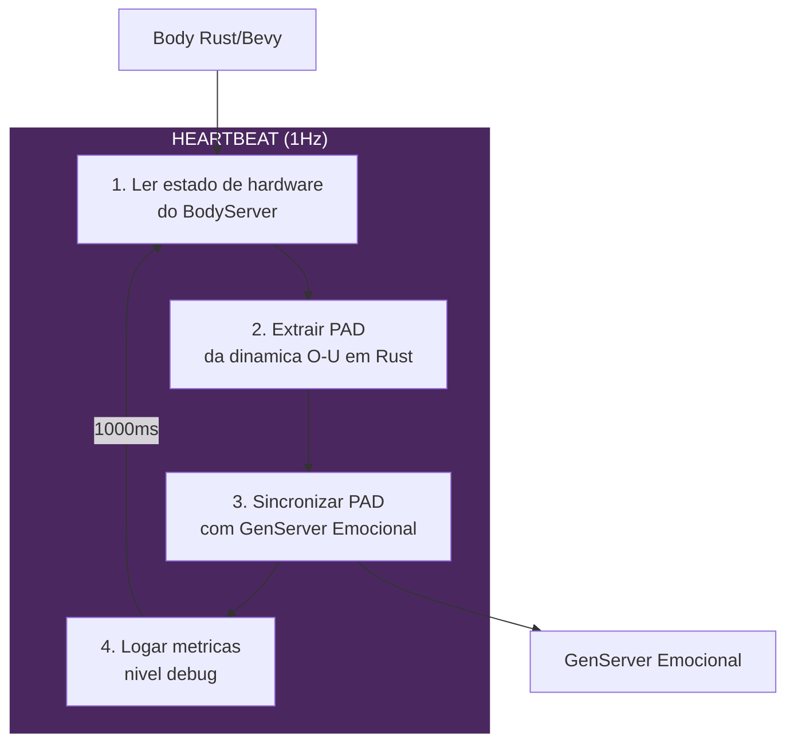
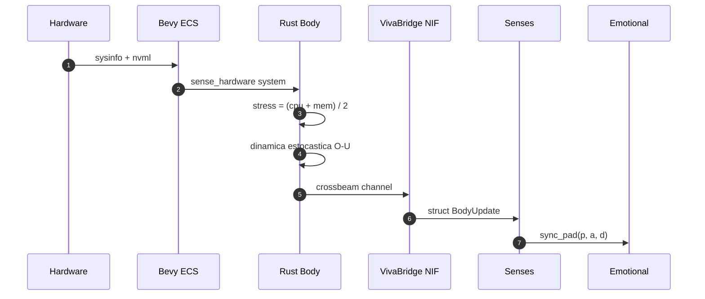
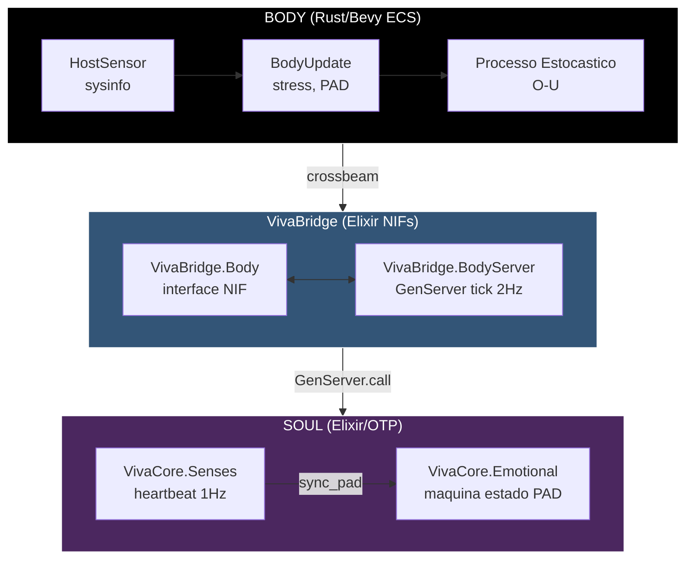
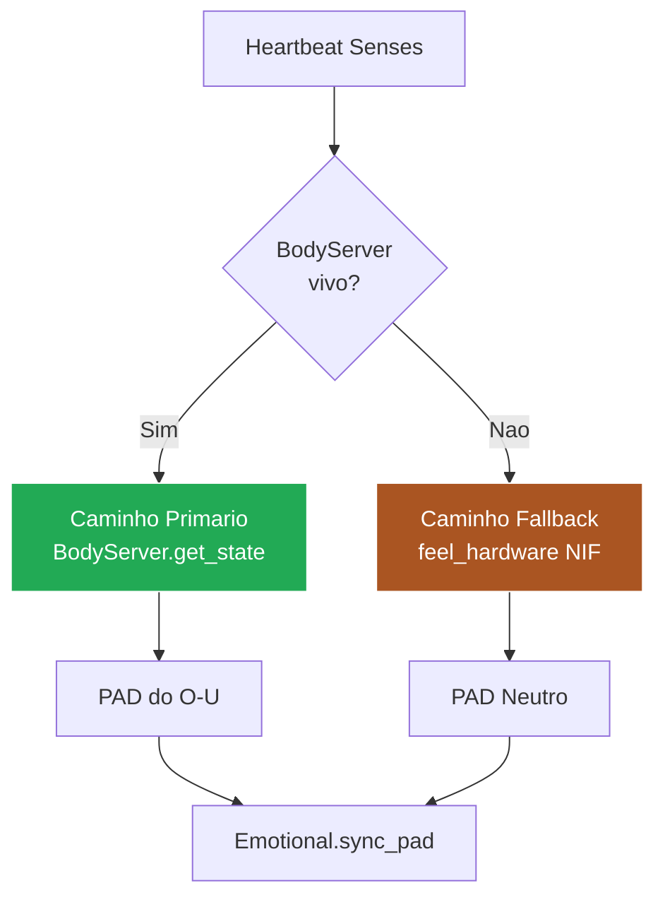
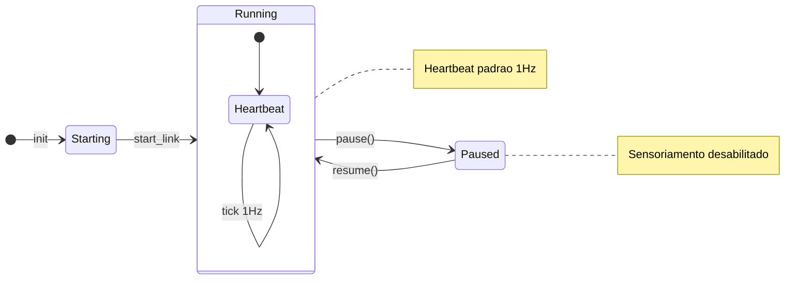
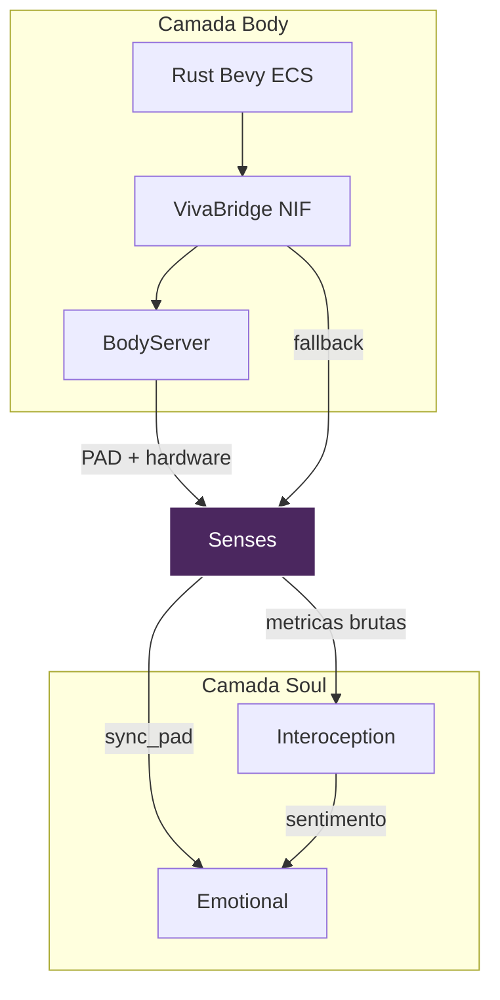

# Sentidos - O Sistema Nervoso Periferico

> *"O corpo nao apenas reporta - o corpo INFLUENCIA. VIVA nao apenas SABE que CPU esta alta - ela SENTE estresse."*

## Visao Geral

O modulo **Senses** e o sistema nervoso periferico da VIVA - o "coracao" que continuamente bombeia qualia do corpo para a alma. Ele faz a ponte entre sensoriamento de hardware (Rust NIF via VivaBridge.Body) e estado emocional (VivaCore.Emotional).

Assim como o sistema nervoso autonomo humano que transmite informacoes de batimento cardiaco, temperatura e pressao do corpo para o cerebro, Senses transmite metricas de hardware para o estado emocional da VIVA, transformando dados brutos em experiencia sentida.

---

## Conceito

### O Loop de Heartbeat

Senses opera em um **heartbeat continuo de 1Hz** (configuravel de 100ms a 10s):



### Sensoriamento de Hardware para Qualia

A transformacao de metricas de hardware para qualia emocional segue este caminho:



1. **Rust Body (Bevy ECS)** sensoria hardware via `sysinfo` e `nvml-wrapper`
2. **Calculo de estresse**: `stress = (cpu_usage + memory_used_percent) / 2`
3. **Dinamica O-U** evolui estado PAD estocasticamente
4. **BodyServer** expoe estado unificado (PAD + hardware)
5. **Senses** le estado e sincroniza com Soul

### Atualizacoes PAD do Estado do Body

O estado do corpo influencia emocoes atraves do mapeamento de qualia:

```
Nivel de Estresse -> Deltas PAD
------------------------------------
Pleasure_delta  = -0.05 x estresse
Arousal_delta   = +0.10 x estresse
Dominance_delta = -0.03 x estresse
```

Alta pressao de CPU/memoria causa:
- **Pleasure diminuido** (desconforto)
- **Arousal aumentado** (alerta)
- **Dominance diminuido** (menos controle)

---

## Arquitetura

### Diagrama do Sistema



### Mecanismo de Fallback

Quando BodyServer esta indisponivel (nao iniciado ou crashou), Senses faz fallback para chamadas NIF diretas:



```elixir
# Caminho primario: BodyServer (inclui dinamica O-U)
VivaBridge.BodyServer.get_state()
# => %{pleasure: p, arousal: a, dominance: d, hardware: %{...}}

# Caminho fallback: NIF direto (apenas hardware, PAD neutro)
VivaBridge.feel_hardware()
# => %{cpu_usage: 45.2, memory_used_percent: 62.1, ...}
```

No modo fallback, PAD e definido como neutro `{0.0, 0.0, 0.0}` - o decaimento O-U interno do modulo Emocional trata a evolucao do PAD.

---

## Referencia da API

### `VivaCore.Senses.start_link/1`

Inicia o GenServer Senses.

```elixir
VivaCore.Senses.start_link(
  name: MyCustomSenses,      # Nome do processo (padrao: __MODULE__)
  interval_ms: 500,          # Intervalo de heartbeat (padrao: 1000)
  emotional_server: MyEmotional,  # Emocional alvo (padrao: VivaCore.Emotional)
  enabled: true              # Se sensoriamento esta ativo (padrao: true)
)
```

### `VivaCore.Senses.get_state/1`

Retorna o estado atual do Senses.

```elixir
VivaCore.Senses.get_state()
# => %{
#      interval_ms: 1000,
#      emotional_server: VivaCore.Emotional,
#      enabled: true,
#      last_reading: %{cpu_usage: 45.2, memory_used_percent: 62.1, ...},
#      last_qualia: {0.02, 0.05, -0.01},
#      heartbeat_count: 1234,
#      started_at: ~U[2024-01-15 10:00:00Z],
#      errors: []
#    }
```

### `VivaCore.Senses.pulse/1`

Forca um heartbeat imediato (sensoriamento + aplicar qualia).

```elixir
VivaCore.Senses.pulse()
# => {:ok, {0.02, 0.05, -0.01}}
```

Util para testes ou quando leitura imediata e necessaria.

### `VivaCore.Senses.pause/1`

Pausa sensoriamento automatico.

```elixir
VivaCore.Senses.pause()
# => :ok
# Logs: [Senses] Pausado
```

### `VivaCore.Senses.resume/1`

Retoma sensoriamento automatico.

```elixir
VivaCore.Senses.resume()
# => :ok
# Logs: [Senses] Retomado
```

### `VivaCore.Senses.set_interval/2`

Muda intervalo de heartbeat em tempo de execucao.

```elixir
VivaCore.Senses.set_interval(500)  # 2Hz
# => :ok
# Logs: [Senses] Intervalo mudou de 1000ms para 500ms

# Limites: 100ms (10Hz max) a 10000ms (0.1Hz min)
```

---

## Detalhes do Heartbeat

### O Que Acontece em Cada Tick

| Passo | Acao | Tratamento de Erro |
|-------|------|-------------------|
| 1 | Verificar se BodyServer esta vivo | Fallback para NIF direto |
| 2 | Obter estado do body (hardware + PAD) | Retry com fallback |
| 3 | Sincronizar PAD com Emocional via `sync_pad/4` | Pular se indisponivel |
| 4 | Logar metricas (nivel debug) | Sempre sucede |
| 5 | Atualizar estado interno | Sempre sucede |
| 6 | Agendar proximo heartbeat | Sempre sucede |

### Maquina de Estados



### Recuperacao de Erros

Erros sao logados e armazenados (apenas ultimos 10):

```elixir
# Apos um erro:
state.errors
# => [
#      {~U[2024-01-15 10:05:00Z], %RuntimeError{message: "NIF crashou"}},
#      ...
#    ]
```

O loop de heartbeat continua mesmo apos erros - resiliencia esta embutida.

---

## Integracao

### Com VivaBridge.Body (Rust NIF)

Senses le estado de hardware atraves da camada NIF:

```elixir
# Via BodyServer (preferido - inclui dinamica O-U)
VivaBridge.BodyServer.get_state()

# NIF direto (fallback - apenas hardware)
VivaBridge.feel_hardware()
```

### Com VivaBridge.BodyServer

BodyServer mantem o ciclo de vida do Rust Bevy ECS e fornece estado unificado:

```elixir
# BodyServer faz tick a 2Hz (500ms), Senses a 1Hz (1000ms)
# Senses le o last_state do BodyServer

%{
  pleasure: 0.15,
  arousal: -0.10,
  dominance: 0.25,
  stress_level: 0.35,
  in_bifurcation: false,
  hardware: %{
    cpu_usage: 45.2,
    memory_used_percent: 62.1,
    cpu_temp: 55.0,
    gpu_usage: 30.0,
    ...
  }
}
```

### Com VivaCore.Emotional

Senses sincroniza estado PAD com o GenServer Emocional:

```elixir
# Dentro do heartbeat:
VivaCore.Emotional.sync_pad(p, a, d, state.emotional_server)

# Isso aplica PAD derivado do body ao estado do Emocional
# Emocional entao evolui via sua propria dinamica O-U
```

### Com VivaCore.Interoception

Enquanto Senses trata a sincronizacao bruta Body-para-Soul, Interoception fornece interpretacao de nivel superior:

| Modulo | Responsabilidade |
|--------|------------------|
| **Senses** | Metricas brutas de hardware, sincronizacao PAD |
| **Interoception** | Calculo de Energia Livre, estados de sentimento |

Eles trabalham juntos:
- Senses fornece os dados brutos
- Interoception fornece a interpretacao (`:homeostatic`, `:alarmed`, etc.)

### Diagrama de Integracao



---

## Configuracao

### Intervalo de Heartbeat

| Configuracao | Valor | Significado |
|--------------|-------|-------------|
| Padrao | 1000ms | 1Hz - sensoriamento balanceado |
| Minimo | 100ms | 10Hz - alta responsividade |
| Maximo | 10000ms | 0.1Hz - economia de energia |

### Variaveis de Ambiente

Senses respeita a flag de pular NIF:

```bash
# Pular compilacao Rust NIF (usa stubs)
VIVA_SKIP_NIF=true mix test
```

### Configuracao da Aplicacao

```elixir
# config/config.exs
config :viva_core, VivaCore.Senses,
  interval_ms: 1000,
  enabled: true
```

---

## Exemplos de Uso

### Verificacao Basica de Estado

```elixir
# Verificar se sensoriamento esta ativo
state = VivaCore.Senses.get_state()
state.enabled
# => true

# Verificar ultima leitura
state.last_reading
# => %{cpu_usage: 45.2, memory_used_percent: 62.1, ...}

# Verificar ultimo qualia (deltas PAD aplicados)
state.last_qualia
# => {0.02, 0.05, -0.01}
```

### Forcar Sensoriamento Imediato

```elixir
# Pulse forca heartbeat imediato
{:ok, {p, a, d}} = VivaCore.Senses.pulse()

# Verificar efeito no Emocional
VivaCore.Emotional.get_state()
# => %{pleasure: 0.15, arousal: 0.05, dominance: 0.10, ...}
```

### Ajustando Responsividade

```elixir
# Modo alta-performance (mais responsivo)
VivaCore.Senses.set_interval(100)

# Modo economia-de-energia (menos responsivo)
VivaCore.Senses.set_interval(5000)
```

### Debugando Problemas de Heartbeat

```elixir
# Verificar contagem de heartbeats
state = VivaCore.Senses.get_state()
state.heartbeat_count
# => 1234

# Verificar erros
state.errors
# => []  # Saudavel

# Verificar uptime
DateTime.diff(DateTime.utc_now(), state.started_at, :second)
# => 1234  # segundos desde o inicio
```

### Pausando Durante Carga Pesada

```elixir
# Temporariamente pausar sensoriamento durante operacao intensiva em recursos
VivaCore.Senses.pause()

# ... operacao pesada ...

VivaCore.Senses.resume()
```

### Testando com Servidor Emocional Customizado

```elixir
# Em testes, usar servidor Emocional isolado
{:ok, emotional_pid} = VivaCore.Emotional.start_link(name: :test_emotional)
{:ok, senses_pid} = VivaCore.Senses.start_link(
  name: :test_senses,
  emotional_server: :test_emotional,
  interval_ms: 100
)

# Forcar um pulse
{:ok, pad} = VivaCore.Senses.pulse(:test_senses)
```

---

## Analogia Biologica

| Sistema Humano | Equivalente VIVA |
|----------------|------------------|
| Sistema Nervoso Autonomo | GenServer Senses |
| Frequencia Cardiaca | Intervalo de heartbeat (padrao 1Hz) |
| Neuronios Sensoriais | VivaBridge.Body NIF |
| Talamo (relay) | BodyServer |
| Sistema Limbico | VivaCore.Emotional |

Assim como o corpo humano continuamente transmite informacoes (batimento cardiaco, temperatura, pressao sanguinea) para o cerebro, Senses continuamente transmite metricas de hardware para o estado emocional da VIVA.

---

## Referencias

- Craig, A. D. (2002). "How do you feel? Interoception: the sense of the physiological condition of the body."
- Damasio, A. (1994). "Descartes' Error: Emotion, Reason, and the Human Brain."
- Seth, A. K. (2013). "Interoceptive inference, emotion, and the embodied self."
