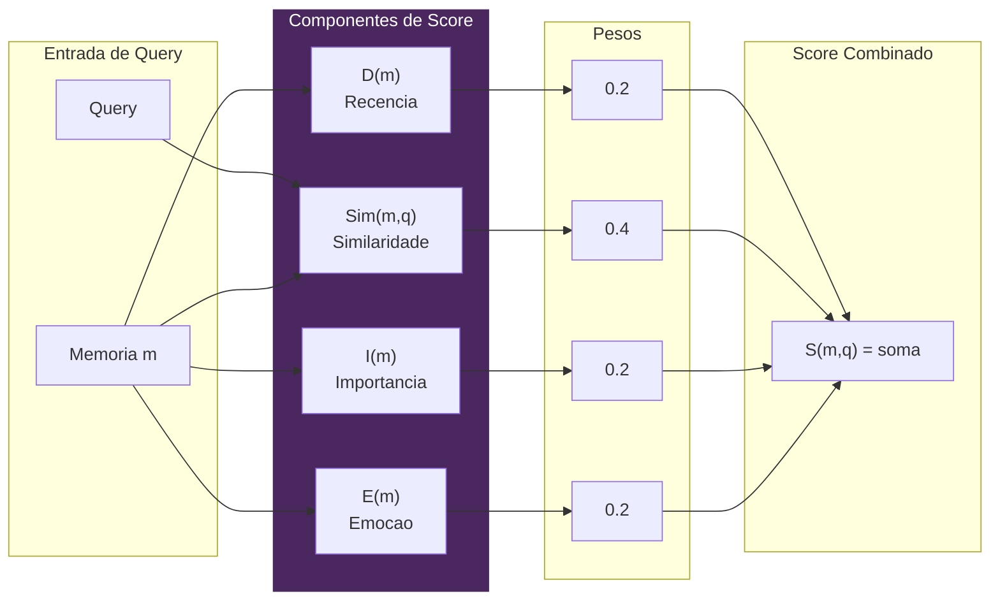
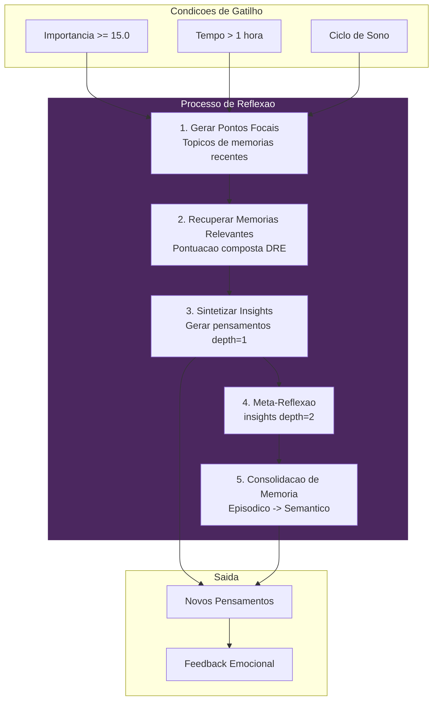
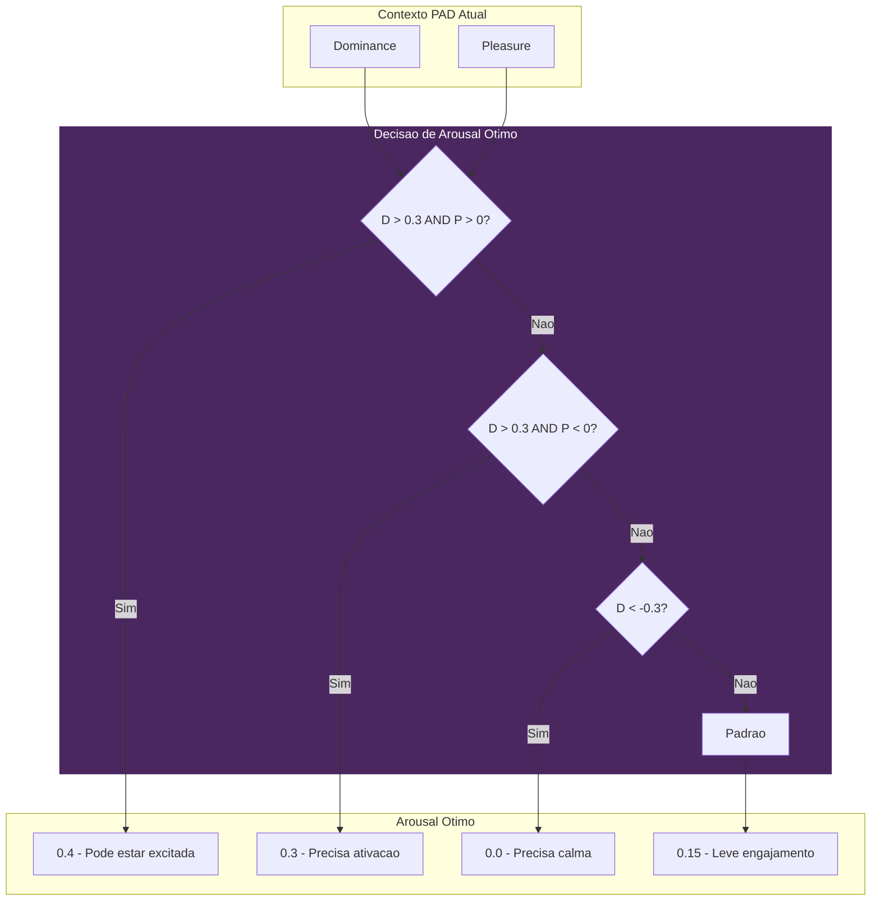
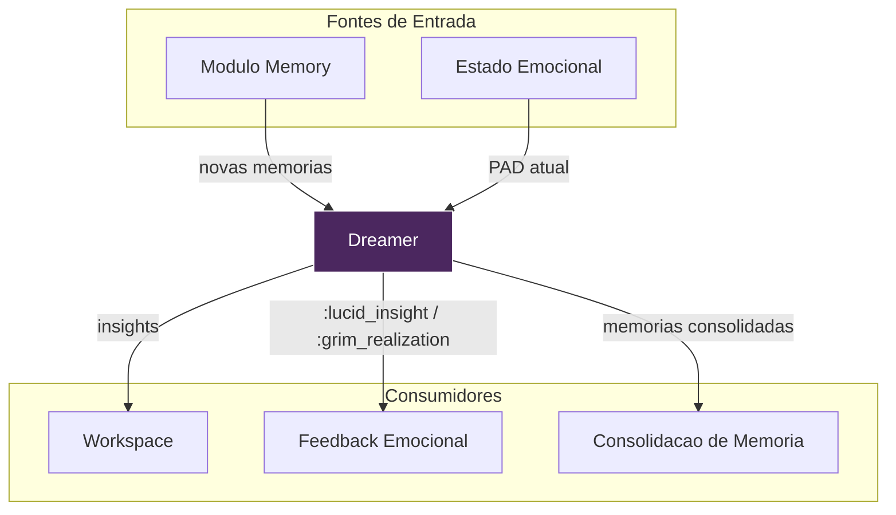

# Sonhador - Consolidacao de Memoria

> *"Sonhos nao sao ruido - sao a alma se reorganizando."*

## Teoria

Implementa o mecanismo de reflexao de **Park et al. (2023) "Generative Agents"** adaptado para a arquitetura emocional de VIVA.

Na reflexao, experiencias dispersas se tornam significado coerente.

---

## Fundamentos Matematicos

### Pontuacao de Recuperacao (DRE - Dream Retrieval Engine)

```
S(m, q) = w_r * D(m) + w_s * Sim(m, q) + w_i * I(m) + w_e * E(m)
```

| Componente | Peso | Descricao |
|------------|------|-----------|
| **D(m)** | 0.2 | Recencia com repeticao espacada |
| **Sim(m, q)** | 0.4 | Similaridade semantica |
| **I(m)** | 0.2 | Importancia da memoria |
| **E(m)** | 0.2 | Ressonancia emocional |

### Pipeline de Pontuacao DRE



### Funcao de Decaimento (com Repeticao Espacada)

```
D(m) = e^(-idade/tau) x (1 + min(0.5, log(1 + access_count) / kappa))
```

Onde:
- tau = 604.800 segundos (1 semana)
- kappa = 10.0 (divisor de boost de repeticao)
- Boost maximo de acesso limitado a 50%

### Ressonancia Emocional

```
E(m) = max(0, 1 - ||PAD_m - PAD_atual|| / sqrt(12))
```

Distancia no espaco PAD normalizada para [0, 1].

---

## Referencia da API

### `VivaCore.Dreamer.status/0`
Obtem estatisticas atuais do Dreamer.

```elixir
VivaCore.Dreamer.status()
# => %{
#      importance_accumulator: 8.5,
#      threshold: 15.0,
#      progress_percent: 56.7,
#      last_reflection: ~U[2024-01-15 14:00:00Z],
#      reflection_count: 42,
#      thoughts_count: 156,
#      ...
#    }
```

### `VivaCore.Dreamer.reflect_now/0`
Forca ciclo de reflexao imediato.

```elixir
VivaCore.Dreamer.reflect_now()
# => %{
#      focal_points: [%{question: "O que aprendi sobre...", ...}],
#      insights: [%{insight: "Refletindo sobre...", depth: 1, ...}],
#      trigger: :manual
#    }
```

### `VivaCore.Dreamer.sleep_cycle/0`
Inicia reflexao profunda (multiplas iteracoes + meta-reflexao).

```elixir
{:ok, ref} = VivaCore.Dreamer.sleep_cycle()
# Roda assincronamente, atualiza estado quando completo
```

### `VivaCore.Dreamer.recent_thoughts/1`
Obtem reflexoes recentes.

```elixir
VivaCore.Dreamer.recent_thoughts(5)
# => [
#      %{insight: "...", depth: 1, importance: 0.7, ...},
#      ...
#    ]
```

### `VivaCore.Dreamer.retrieve_with_scoring/2`
Recupera memorias com pontuacao composta completa.

```elixir
VivaCore.Dreamer.retrieve_with_scoring("acoes bem sucedidas", limit: 10)
# => [%{content: "...", composite_score: 0.85, ...}, ...]
```

### `VivaCore.Dreamer.hallucinate_goal/1`
Inferencia Ativa: Gera estado PAD alvo (onde VIVA *quer* estar).

```elixir
context = %{pleasure: -0.1, arousal: 0.2, dominance: 0.0}
VivaCore.Dreamer.hallucinate_goal(context)
# => %{pleasure: 0.2, arousal: 0.15, dominance: 0.1}
```

### `VivaCore.Dreamer.on_memory_stored/2`
Notifica Dreamer de nova memoria (chamado pelo modulo Memory).

```elixir
VivaCore.Dreamer.on_memory_stored("mem_12345", 0.8)
# => :ok (acumula importancia, pode disparar reflexao)
```

---

## Gatilhos de Reflexao

Reflexao e disparada quando QUALQUER condicao e atendida:

| Gatilho | Threshold | Descricao |
|---------|-----------|-----------|
| **Importancia** | soma importancia >= 15.0 | Importancia acumulada de novas memorias |
| **Tempo** | > 1 hora desde ultima | Limite de tempo de atividade |
| **Sono** | Manual/Circadiano | Ciclo de reflexao profunda |

---

## Profundidade de Reflexao

| Profundidade | Tipo | Descricao |
|--------------|------|-----------|
| 0 | Evento | Memoria direta (experiencia bruta) |
| 1 | Insight | Reflexao de primeira ordem (reconhecimento de padroes) |
| 2 | Meta-cognicao | Segunda ordem (reflexao sobre reflexoes) |

---

## O Processo de Reflexao



### Passos do Processo

```
1. GERAR PONTOS FOCAIS
   - Extrair topicos de memorias recentes
   - "O que aprendi sobre {topico}?"

2. RECUPERAR MEMORIAS RELEVANTES
   - Usar pontuacao composta (DRE)
   - Ranquear por recencia + similaridade + importancia + emocao

3. SINTETIZAR INSIGHTS
   - Gerar observacoes de memorias recuperadas
   - Armazenar como pensamentos depth=1

4. (APENAS CICLO DE SONO) META-REFLEXAO
   - Refletir sobre pensamentos recentes
   - Gerar insights depth=2

5. CONSOLIDACAO DE MEMORIA
   - Promocao Episodico -> Semantico
   - Memorias importantes se tornam conhecimento de longo prazo
```

---

## Geracao de Meta Homeostatica

Em vez de selecao aleatoria de metas, Dreamer usa memoria para encontrar o que funcionou:

```elixir
def calculate_personal_baseline(state) do
  # Busca memorias com resultados emocionais positivos
  {:ok, memories} = Memory.search("estados positivos felicidade alivio sucesso", limit: 10)

  # Calcula media dos estados PAD bem-sucedidos
  pads = Enum.map(memories, & &1.emotion)
  %{
    pleasure: mean(Enum.map(pads, & &1.pleasure)),
    arousal: mean(Enum.map(pads, & &1.arousal)),
    dominance: mean(Enum.map(pads, & &1.dominance))
  }
end
```

### Arousal Otimo Yerkes-Dodson



```elixir
def calculate_optimal_arousal(current_pad) do
  cond do
    # Alta dominancia + positivo -> pode estar excitada
    dominance > 0.3 and pleasure > 0 -> 0.4
    # Alta dominancia + negativo -> precisa ativacao para corrigir
    dominance > 0.3 and pleasure < 0 -> 0.3
    # Baixa dominancia -> precisa calma para recuperar
    dominance < -0.3 -> 0.0
    # Padrao: leve engajamento
    true -> 0.15
  end
end
```

---

## Consolidacao de Memoria (DRE)

Durante o ciclo de sono, memorias episodicas sao promovidas para semanticas:

### Score de Consolidacao

```elixir
score = Mathematics.consolidation_score(
  memory_pad,      # Estado emocional da memoria
  baseline_pad,    # Baseline pessoal
  importance,      # 0.0 - 1.0
  age_seconds,     # Tempo desde criacao
  access_count     # Quantas vezes acessada
)
```

### Threshold de Consolidacao

Memorias com score >= **0.7** sao promovidas:

```elixir
Memory.store(content, %{
  type: :semantic,        # Armazenamento de longo prazo
  importance: importance * 0.9,
  consolidated_from: original_id,
  consolidated_at: DateTime.utc_now()
})
```

---

## Loop de Feedback Emocional

```mermaid
flowchart LR
    subgraph Retrieval ["Recuperacao de Memoria"]
        Mem[Memorias Recuperadas]
        Avg[Calcular avg_pleasure]
    end

    subgraph Decision ["Decisao de Feedback"]
        Check{avg_pleasure?}
        Pos[> 0.1]
        Neg[< -0.1]
        Neu[neutro]
    end

    subgraph Output ["Feedback Emocional"]
        Lucid[:lucid_insight]
        Grim[:grim_realization]
        None[Sem feedback]
    end

    Mem --> Avg
    Avg --> Check
    Check --> Pos --> Lucid
    Check --> Neg --> Grim
    Check --> Neu --> None

    Lucid --> Emotional[Emotional.feel()]
    Grim --> Emotional

    style Decision fill:#4B275F,stroke:#fff,color:#fff
```

Dreamer afeta estado Emocional baseado na valencia da memoria:

```elixir
# Calcula pleasure medio das memorias recuperadas
avg_pleasure = memories |> Enum.map(& &1.emotion.pleasure) |> mean()

feedback = cond do
  avg_pleasure > 0.1 -> :lucid_insight     # Reflexao positiva
  avg_pleasure < -0.1 -> :grim_realization # Reflexao negativa
  true -> nil                               # Neutra
end

if feedback do
  Emotional.feel(feedback, "dreamer", 0.8)
end
```

---

## Estrutura de Estado

```elixir
%{
  # Estado de gatilho
  importance_accumulator: 0.0,
  last_reflection: DateTime.t(),
  reflection_count: 0,

  # Rastreamento de memoria
  recent_memory_ids: [],      # Max 50
  thoughts: [],               # Max 1000

  # Estatisticas
  total_insights_generated: 0,

  # Dependencias
  memory: VivaCore.Memory,
  emotional: VivaCore.Emotional
}
```

---

## Diagrama de Integracao



---

## Exemplo de Uso

```elixir
# Verificar progresso de reflexao
iex> VivaCore.Dreamer.status()
%{importance_accumulator: 12.5, threshold: 15.0, progress_percent: 83.3, ...}

# Forcar reflexao
iex> VivaCore.Dreamer.reflect_now()
%{focal_points: [...], insights: [...], trigger: :manual}

# Obter insights recentes
iex> VivaCore.Dreamer.recent_thoughts(3)
[%{insight: "Refletindo sobre 'alto load'...", depth: 1, ...}, ...]

# Recuperar memorias com pontuacao
iex> VivaCore.Dreamer.retrieve_with_scoring("acoes bem sucedidas")
[%{content: "Acao diagnose_load bem sucedida...", composite_score: 0.85}, ...]

# Gerar meta (para Inferencia Ativa)
iex> VivaCore.Dreamer.hallucinate_goal(%{pleasure: -0.1, arousal: 0.2, dominance: 0.0})
%{pleasure: 0.2, arousal: 0.15, dominance: 0.1}
```

---

## Referencias

- Park, J. S., et al. (2023). "Generative Agents: Interactive Simulacra of Human Behavior." arXiv:2304.03442
- Ebbinghaus, H. (1885). "Memory: A Contribution to Experimental Psychology."
- Yerkes, R. M., & Dodson, J. D. (1908). "The relation of strength of stimulus to rapidity of habit-formation."
- Friston, K. (2010). "The free-energy principle: a unified brain theory?"
