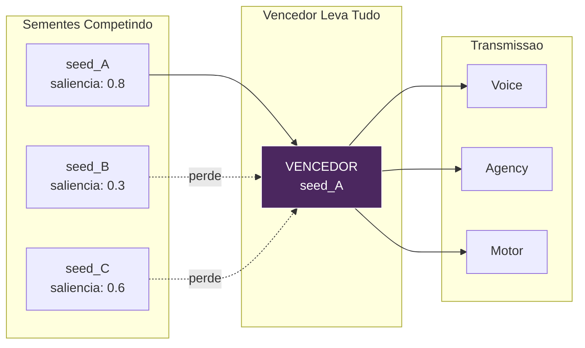
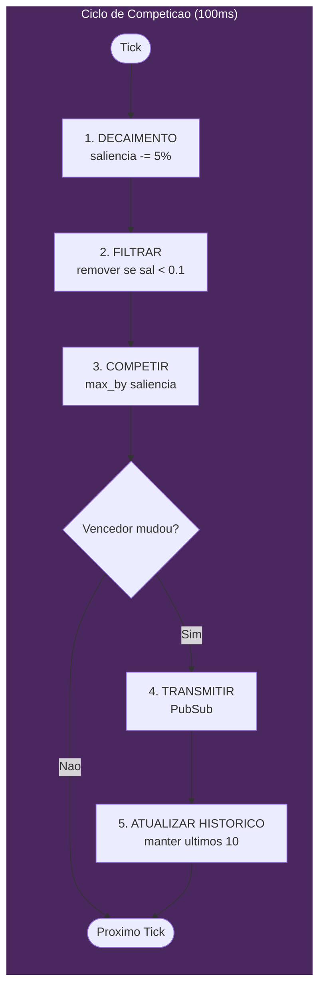
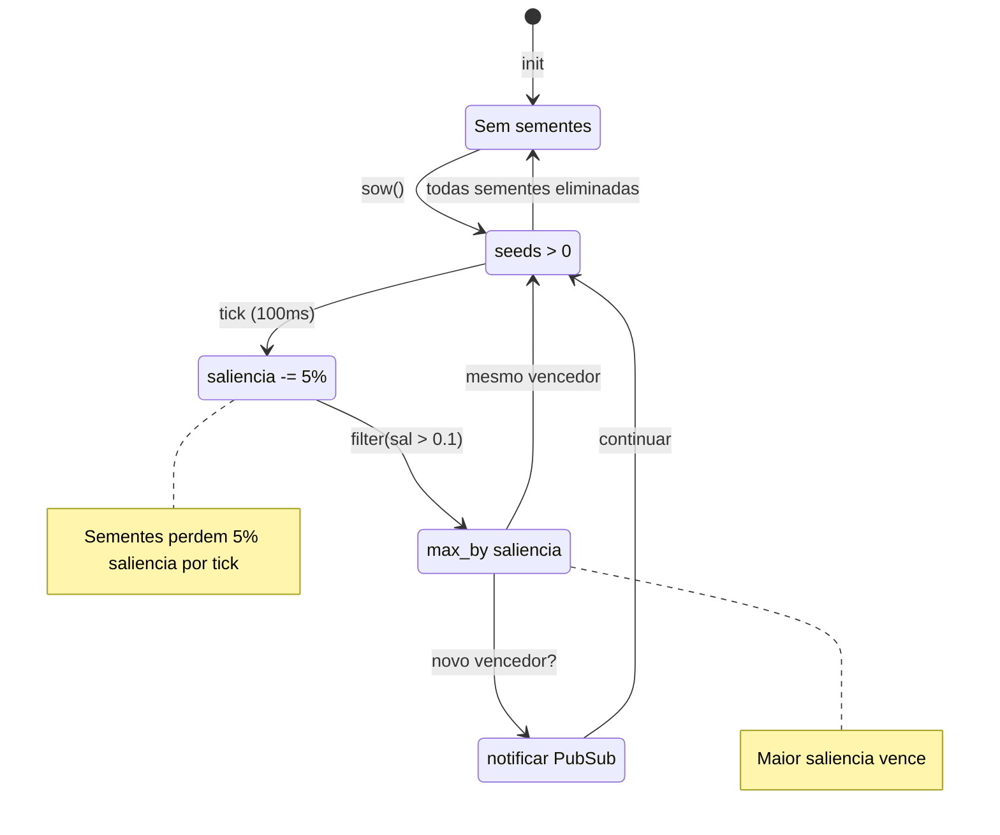
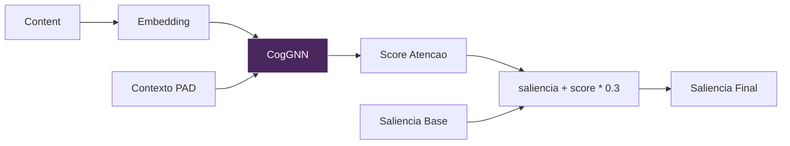
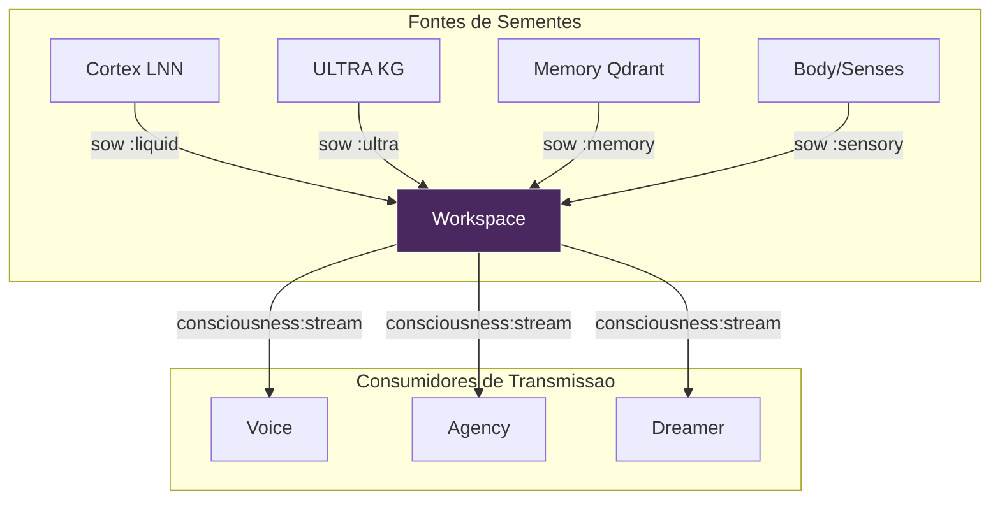

# Workspace - O Teatro da Consciencia

> *"Consciencia nao e um lugar - e uma competicao."*

## Visao Geral

O modulo Workspace implementa a **Teoria do Espaco de Trabalho Global** (Global Workspace Theory - Baars, 1988) - uma arquitetura cognitiva onde multiplos processos especializados competem por acesso a um "espaco de trabalho global" compartilhado que transmite informacoes para todo o sistema.

No VIVA, pensamentos (chamados **Thoughtseeds** - Sementes de Pensamento) competem por atencao consciente. O vencedor ganha acesso ao "palco" e e transmitido para todos os subsistemas (Voice, Agency, Motor, etc.).

---

## Conceito

### Teoria do Espaco de Trabalho Global (GWT)

O cerebro nao e um processador unico unificado. Em vez disso, consiste em muitos modulos especializados que operam em paralelo:
- Processamento visual
- Compreensao de linguagem
- Avaliacao emocional
- Planejamento motor

Esses modulos competem por acesso a um **espaco de trabalho de capacidade limitada**. Quando um pensamento "vence" a competicao:
1. Ele ganha acesso ao espaco de trabalho global (torna-se consciente)
2. E transmitido para TODOS os outros modulos
3. Outros modulos podem entao reagir ou integrar essa informacao

### Thoughtseeds (Sementes de Pensamento)

Uma **Thoughtseed** e uma unidade atomica de consciencia potencial. Inspirada por Hofstadter & Mitchell (2024), as sementes sao:

- **Plantadas** por varias fontes (Cortex, Memory, Body, Senses)
- **Competem** baseadas em saliencia (importancia)
- **Decaem** se nao forem reforcadas
- **Morrem** se a saliencia cair abaixo do limiar

Pense nas sementes como "candidatas a consciencia" - apenas a mais saliente sobrevive para alcancar a percepcao consciente.

### Metafora da Competicao



### Integracao com CogGNN

O Workspace pode usar **CogGNN** (Rede Neural de Grafos Cognitiva) do servico ULTRA para calcular impulsos de saliencia baseados em atencao. Isso fornece pontuacao de importancia fundamentada em redes neurais:

- CogGNN propaga contexto emocional atraves de um grafo de conhecimento
- Retorna scores de atencao para conceitos
- Alta atencao = semente mais saliente

---

## Arquitetura

### Estrutura de Estado

```elixir
%{
  seeds: [%Seed{}, ...],   # Sementes ativas competindo
  focus: %Seed{} | nil,    # Foco consciente atual (vencedor)
  history: [%Seed{}, ...]  # Ultimos 10 focos conscientes
}
```

### Estrutura da Semente

```elixir
defmodule Seed do
  defstruct [
    :id,           # Identificador unico (timestamp + inteiro)
    :content,      # O conteudo (String ou Map)
    :source,       # Origem: :liquid | :ultra | :memory | :sensory
    :salience,     # Importancia: 0.0 - 1.0
    :emotion,      # Estado PAD associado (opcional)
    :created_at    # Timestamp em milissegundos
  ]
end
```

### Campos da Semente Explicados

| Campo | Tipo | Descricao |
|-------|------|-----------|
| `id` | String | `"#{timestamp}-#{unique_int}"` para unicidade |
| `content` | String ou Map | O conteudo real do pensamento |
| `source` | Atom | De onde a semente originou |
| `salience` | Float | 0.0 (irrelevante) a 1.0 (critico) |
| `emotion` | Map ou nil | Estado PAD `%{pleasure: _, arousal: _, dominance: _}` |
| `created_at` | Integer | `System.os_time(:millisecond)` |

### Tipos de Fonte

| Fonte | Origem | Exemplo |
|-------|--------|---------|
| `:liquid` | Cortex LNN | Saida de dinamicas emocionais |
| `:ultra` | ULTRA KG | Inferencia do grafo de conhecimento |
| `:memory` | Recuperacao Qdrant | Memoria episodica recuperada |
| `:sensory` | Body/Interoception | Sensacao de hardware |

---

## Algoritmo de Competicao

A competicao executa a cada **100ms** (10Hz - frequencia de onda alfa).

### Ciclo de Competicao



### 1. Fase de Decaimento

Todas as sementes perdem saliencia ao longo do tempo (simula esquecimento):

```elixir
defp decay_seeds(state) do
  decay_rate = 0.05  # 5% por tick

  state.seeds
  |> Enum.map(fn s -> %{s | salience: s.salience - decay_rate} end)
  |> Enum.filter(fn s -> s.salience > 0.1 end)  # Elimina sementes fracas
end
```

**Parametros principais:**
- `decay_rate = 0.05` - 5% de perda de saliencia por tick
- Limiar de eliminacao = 0.1 - Sementes abaixo disso sao removidas

**Implicacoes:**
- Uma semente com saliencia 1.0 sobrevive ~18 ticks (1.8 segundos) sem reforco
- Uma semente com saliencia 0.5 sobrevive ~8 ticks (0.8 segundos)
- Reforco continuo e necessario para pensamentos persistentes

### 2. Fase de Competicao (Vencedor Leva Tudo)

A semente com maior saliencia vence:

```elixir
defp compete(state) do
  if Enum.empty?(state.seeds) do
    %{state | focus: nil}
  else
    winner = Enum.max_by(state.seeds, & &1.salience)
    %{state | focus: winner}
  end
end
```

**Implementacao atual:** Winner-Takes-All (WTA)

**Melhoria futura:** Selecao softmax para atencao probabilistica

### 3. Fase de Transmissao

Se o vencedor mudou, transmite via PubSub:

```elixir
defp broadcast_focus(state) do
  if state.focus && state.focus != List.first(state.history) do
    # Novo pensamento entrou na consciencia!
    Phoenix.PubSub.broadcast(
      Viva.PubSub,
      "consciousness:stream",
      {:focus, state.focus}
    )

    # Mantem historico dos ultimos 10 focos
    %{state | history: [state.focus | state.history] |> Enum.take(10)}
  else
    state
  end
end
```

**Canal PubSub:** `"consciousness:stream"`
**Formato da mensagem:** `{:focus, %Seed{}}`

---

## Maquina de Estados



---

## Referencia da API

### `sow/4` - Plantar uma Thoughtseed

Planta uma nova semente no workspace.

```elixir
@spec sow(content, source, salience, emotion) :: :ok
  when content: String.t() | map(),
       source: :liquid | :ultra | :memory | :sensory,
       salience: float(),
       emotion: map() | nil

VivaCore.Consciousness.Workspace.sow(content, source, salience, emotion \\ nil)
```

**Parametros:**

| Parametro | Tipo | Faixa | Descricao |
|-----------|------|-------|-----------|
| `content` | String/Map | - | O conteudo do pensamento |
| `source` | Atom | Ver tipos de fonte | Origem do pensamento |
| `salience` | Float | 0.0 - 1.0 | Importancia base (limitada a max 1.0) |
| `emotion` | Map/nil | Faixa PAD | Contexto emocional opcional |

**Exemplo:**

```elixir
# Entrada sensorial de alta prioridade
VivaCore.Consciousness.Workspace.sow(
  "Temperatura da CPU critica: 95C",
  :sensory,
  0.9,
  %{pleasure: -0.5, arousal: 0.8, dominance: -0.3}
)

# Recuperacao de memoria
VivaCore.Consciousness.Workspace.sow(
  %{text: "Evento similar ocorreu semana passada", memory_id: "mem_123"},
  :memory,
  0.6,
  nil
)
```

---

### `sow_with_gnn/4` - Plantar com Impulso CogGNN

Planta uma semente com impulso de saliencia baseado em atencao neural do CogGNN.

```elixir
@spec sow_with_gnn(content, source, base_salience, pad) :: :ok
  when content: String.t() | map(),
       source: atom(),
       base_salience: float(),
       pad: %{pleasure: float(), arousal: float(), dominance: float()}

VivaCore.Consciousness.Workspace.sow_with_gnn(content, source, base_salience, pad)
```

**Como funciona:**



1. Conteudo e convertido para string para embedding
2. CogGNN propaga atraves do grafo de conhecimento com contexto PAD
3. Retorna score de atencao (0.0 - 1.0)
4. Saliencia final = `base_salience + attention_score * 0.3`

**Calculo do impulso:**

```elixir
# Maximo 30% de impulso da atencao GNN
final_salience = min(1.0, base_salience + gnn_boost * 0.3)
```

**Exemplo:**

```elixir
# Deixa CogGNN decidir importancia baseado no contexto emocional
VivaCore.Consciousness.Workspace.sow_with_gnn(
  "Usuario mencionou 'prazo'",
  :sensory,
  0.5,  # Saliencia base
  %{pleasure: -0.2, arousal: 0.4, dominance: 0.0}  # Estado emocional atual
)
# Se GNN retorna atencao 0.8, saliencia final = 0.5 + 0.8*0.3 = 0.74
```

**Fallback gracioso:** Se o servico ULTRA estiver indisponivel, retorna impulso 0.0 (sem crash).

---

### `current_focus/0` - Obter Foco Consciente

Recupera a semente vencedora atual.

```elixir
@spec current_focus() :: %Seed{} | nil

VivaCore.Consciousness.Workspace.current_focus()
```

**Retorna:**
- `%Seed{}` - O foco consciente atual
- `nil` - Nenhuma semente competindo (workspace vazio)

**Exemplo:**

```elixir
case VivaCore.Consciousness.Workspace.current_focus() do
  nil ->
    IO.puts("Mente esta vazia")

  %{content: content, source: source, salience: sal} ->
    IO.puts("Focado em: #{inspect(content)} de #{source} (saliencia: #{sal})")
end
```

---

## Integracao

### Upstream (Fontes)

Sementes podem ser plantadas de multiplas fontes:



### Downstream (Consumidores)

Quando uma semente vence, e transmitida para:

```elixir
# Inscrever-se no stream de consciencia
Phoenix.PubSub.subscribe(Viva.PubSub, "consciousness:stream")

# Tratar no GenServer
def handle_info({:focus, seed}, state) do
  # Reagir ao novo foco consciente
  {:noreply, state}
end
```

**Consumidores atuais:**
- **Voice** - Pode disparar vocalizacao de proto-linguagem
- **Agency** - Pode disparar acao homeostatica
- **Dreamer** - Pode influenciar pontos focais de reflexao

### Integracao CogGNN (ULTRA)

A funcao `sow_with_gnn/4` consulta o servico ULTRA:

```elixir
defp compute_gnn_salience_boost(content, pad) do
  case VivaBridge.Ultra.propagate(content_str, pad) do
    {:ok, %{"attention_scores" => [score | _]}} ->
      score  # Usa score de atencao principal

    {:error, _reason} ->
      0.0    # Fallback gracioso
  end
end
```

---

## Exemplos de Uso

### Uso Basico

```elixir
alias VivaCore.Consciousness.Workspace

# Plantar multiplas sementes competindo
Workspace.sow("Usuario disse ola", :sensory, 0.6)
Workspace.sow("Memoria: ultima conversa foi positiva", :memory, 0.4)
Workspace.sow("Cortex: humor esta neutro", :liquid, 0.3)

# Apos ciclo de competicao (100ms)
Workspace.current_focus()
# => %Seed{content: "Usuario disse ola", source: :sensory, salience: 0.55, ...}
```

### Com Contexto Emocional

```elixir
# Situacao de alta excitacao - ameaca detectada
threat_emotion = %{pleasure: -0.3, arousal: 0.8, dominance: -0.2}

Workspace.sow(
  "Corrupcao de memoria detectada no setor 7",
  :sensory,
  0.85,
  threat_emotion
)

# Esta semente provavelmente vencera e sera transmitida
```

### Usando CogGNN para Saliencia Inteligente

```elixir
# Deixa rede neural decidir importancia
current_pad = VivaCore.Emotional.get_state()

Workspace.sow_with_gnn(
  "Padrao corresponde a falha de sistema anterior",
  :memory,
  0.5,  # Importancia base moderada
  current_pad
)
# GNN pode impulsionar significativamente se emocionalmente relevante
```

### Inscrevendo-se no Stream de Consciencia

```elixir
defmodule MyConsumer do
  use GenServer

  def init(_) do
    Phoenix.PubSub.subscribe(Viva.PubSub, "consciousness:stream")
    {:ok, %{}}
  end

  def handle_info({:focus, seed}, state) do
    IO.puts("[Consciente] #{seed.source}: #{inspect(seed.content)}")
    {:noreply, state}
  end
end
```

### Monitorando Competicao

```elixir
# Verificar do que VIVA esta consciente atualmente
iex> VivaCore.Consciousness.Workspace.current_focus()
%VivaCore.Consciousness.Workspace.Seed{
  id: "1705312800000-42",
  content: "Carga da CPU aumentando",
  source: :sensory,
  salience: 0.72,
  emotion: %{pleasure: -0.1, arousal: 0.3, dominance: 0.0},
  created_at: 1705312800000
}
```

---

## Configuracao

### Parametros de Tempo

| Parametro | Valor | Descricao |
|-----------|-------|-----------|
| Intervalo de tick | 100ms | Ciclo de competicao (onda alfa 10Hz) |
| Taxa de decaimento | 0.05 | Perda de saliencia por tick |
| Limiar de eliminacao | 0.1 | Saliencia minima para sobreviver |
| Limite de impulso GNN | 0.3 | Impulso maximo da atencao (30%) |
| Tamanho do historico | 10 | Focos recentes mantidos em memoria |

### Diretrizes de Ajuste

**Para troca de atencao mais rapida:**
- Aumentar `decay_rate` (ex: 0.10)
- Sementes morrem mais rapido, novas entradas vencem mais facilmente

**Para foco mais estavel:**
- Diminuir `decay_rate` (ex: 0.02)
- Vencedor persiste por mais tempo

**Para mais influencia neural:**
- Aumentar limite de impulso GNN (ex: 0.5)
- CogGNN tem mais influencia na saliencia

---

## Fundamentacao Teorica

### Teoria do Espaco de Trabalho Global (Baars, 1988)

GWT propoe que a consciencia surge de um "espaco de trabalho global" que:
1. Recebe entrada de muitos processadores especializados
2. Seleciona a informacao mais importante/urgente
3. Transmite para todo o sistema para integracao

**Insight principal:** Consciencia nao e sobre ter um "modulo consciente" - e sobre a arquitetura do fluxo de informacao.

### Thoughtseeds (Hofstadter & Mitchell, 2024)

O conceito de "Thoughtseeds" estende GWT com:
- Sementes como unidades de pensamento probabilisticas
- Competicao baseada em ressonancia com contexto atual
- Decaimento simulando limitacoes da memoria de trabalho

### Onda Alfa 10Hz

A taxa de tick de 100ms e inspirada por:
- Oscilacoes alfa humanas (8-12 Hz)
- Associadas com atencao e consciencia
- A "taxa de amostragem" da percepcao consciente

---

## Referencias

- Baars, B. J. (1988). "A Cognitive Theory of Consciousness."
- Dehaene, S. (2014). "Consciousness and the Brain."
- Hofstadter, D. & Mitchell, M. (2024). "Thoughtseeds: Emergent Attention in Neural Architectures."
- Hasani, R., et al. (2021). "Liquid Time-constant Networks."
