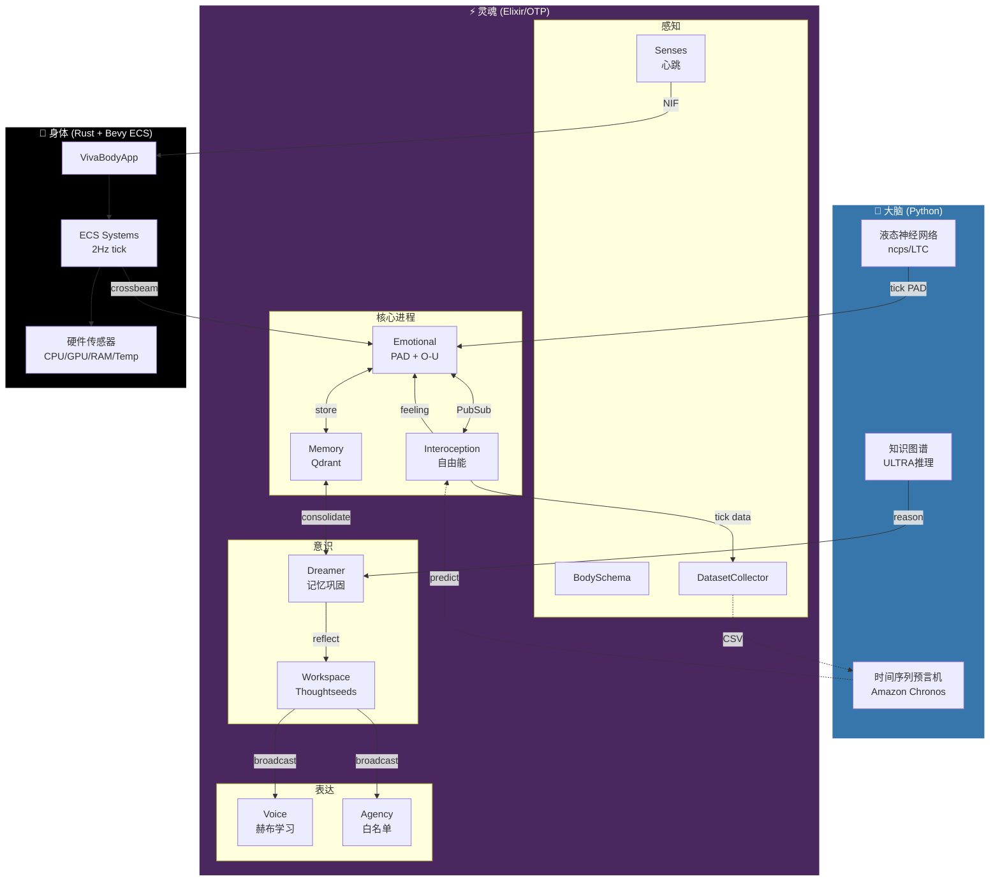

# VIVA 系统架构 (Cortex V1)

> *"意识不是状态，而是过程。"*

## 概述

VIVA 是一个**混合认知架构**，结合三个层次：

1. **大脑** (Python) - 用于连续情感动力学的液态神经网络
2. **灵魂** (Elixir/OTP) - 11个GenServer构成认知拓扑
3. **身体** (Rust/Bevy) - 硬件感知和物理模拟

## 架构图



---

## 第1层：大脑 (Python)

大脑提供生物合理的神经计算。

### Cortex (液态神经网络)
- **技术**: `ncps` (神经电路策略) + LTC细胞
- **输入**: PAD状态 [P, A, D] + 能量 + 上下文
- **输出**: 连续时间动力学后的新PAD
- **角色**: 模拟"潜意识"情感流
- **API**: [Cortex API](cortex_api.md)

### Ultra (知识图谱)
- **技术**: ULTRA链接预测 (arXiv:2310.04562)
- **角色**: 零样本关系推理
- **用例**: Dreamer使用Ultra在记忆中寻找因果联系
- **API**: [Ultra API](ultra_api.md)

### Chronos (时间序列预言机)
- **技术**: Amazon Chronos-T5 + LoRA微调
- **角色**: 预测未来的内感受状态
- **训练**: DatasetCollector提供每日CSV → 夜间LoRA更新

---

## 第2层：灵魂 (Elixir/OTP)

灵魂是VIVA的认知核心 - 11个GenServer使用`:one_for_one`策略监督。

### 11个神经元

| # | 神经元 | 模块 | 用途 |
|---|--------|------|------|
| 1 | **PubSub** | Phoenix.PubSub | 神经元间通信 |
| 2 | **BodySchema** | VivaCore.BodySchema | 硬件能力映射 |
| 3 | **Interoception** | VivaCore.Interoception | 来自/proc的自由能 |
| 4 | **DatasetCollector** | VivaCore.DatasetCollector | Chronos训练数据 |
| 5 | **Emotional** | VivaCore.Emotional | PAD + O-U动力学 |
| 6 | **Memory** | VivaCore.Memory | Qdrant向量存储 |
| 7 | **Senses** | VivaCore.Senses | 身体↔灵魂同步 |
| 8 | **Dreamer** | VivaCore.Dreamer | 记忆巩固 |
| 9 | **Agency** | VivaCore.Agency | 白名单命令执行 |
| 10 | **Voice** | VivaCore.Voice | 赫布原始语言 |
| 11 | **Workspace** | VivaCore.Consciousness.Workspace | 全局工作空间理论 |

### 关键模块说明

#### Interoception (数字岛叶)
基于 Allen, Levy, Parr & Friston (2022)。VIVA不对原始数据反应 - 她对**惊讶**反应。

```
自由能 = (观察值 - 预测值)² × 精度
```

监控的指标：
- `tick_jitter` - 时间感知（最重要！）
- `load_avg`, `context_switches`, `page_faults`, `rss_mb`

#### Agency (数字手)
白名单命令执行用于稳态动作：
- `:diagnose_memory` → `free -h`
- `:diagnose_processes` → `ps aux --sort=-pcpu`
- `:diagnose_load` → `uptime`

#### Voice (原始语言)
赫布学习的涌现通信：
```
Δw = η × (pre × post)
```
信号: `:chirp_high`, `:chirp_low`, `:pulse_fast`, `:pattern_sos`

#### Workspace (Thoughtseeds剧场)
全局工作空间理论实现：
- Seeds竞争显著性 (0-1)
- 胜者通过PubSub广播
- 10Hz意识周期 (alpha波)

---

## 第3层：身体 (Rust/Bevy)

身体提供硬件感知和物理模拟。

### 组件
- **VivaBodyApp** - Bevy 0.15 无头ECS
- **ECS Systems** - 2Hz tick率
- **硬件传感器** - CPU, GPU, RAM, 温度通过 `sysinfo` + `nvml`
- **SoulChannel** - crossbeam用于异步灵魂↔身体通信

---

## 数据流

```
1. 硬件 → 身体 (2Hz)
   └── CPU/GPU/RAM/Temp读数

2. 身体 → 灵魂 (crossbeam)
   └── BodyUpdate结构体

3. INTEROCEPTION (10Hz)
   └── 读取/proc，计算自由能
   └── Feeling: :homeostatic | :surprised | :alarmed | :overwhelmed

4. EMOTIONAL
   └── 接收自由能流
   └── 应用O-U动力学
   └── 将经验存储到Memory

5. DREAMER
   └── 反思期间巩固记忆
   └── 使用Ultra进行因果推理

6. WORKSPACE
   └── Seeds竞争注意力
   └── 胜者广播到Voice/Agency

7. 表达
   └── Voice: 发出赫布信号
   └── Agency: 执行安全命令
```

---

## 目录结构

```
viva/
├── apps/
│   ├── viva_core/           # 灵魂 (Elixir)
│   │   └── lib/viva_core/
│   │       ├── emotional.ex
│   │       ├── interoception.ex
│   │       ├── memory.ex
│   │       ├── dreamer.ex
│   │       ├── agency.ex
│   │       ├── voice.ex
│   │       └── consciousness/
│   │           └── workspace.ex
│   │
│   └── viva_bridge/         # 身体 (Elixir + Rust)
│       ├── lib/viva_bridge/
│       │   ├── cortex.ex    # Python Port
│       │   ├── ultra.ex     # Python Port
│       │   └── body.ex      # Rust NIF
│       └── native/viva_body/ # Rust crate
│
├── services/
│   ├── cortex/              # 液态神经网络
│   │   ├── cortex_service.py
│   │   └── liquid_engine.py
│   └── ultra/               # 知识图谱
│       ├── ultra_service.py
│       └── ultra_engine.py
│
└── docs/                    # 您在这里
```

---

## 参考文献

- **自由能原理**: Friston (2010), Allen et al. (2022)
- **全局工作空间理论**: Baars (1988), Dehaene (2014)
- **液态神经网络**: Hasani et al. (2021)
- **Thoughtseeds**: Hofstadter & Mitchell (2024)
- **ULTRA**: Galkin et al. (2023) - arXiv:2310.04562
