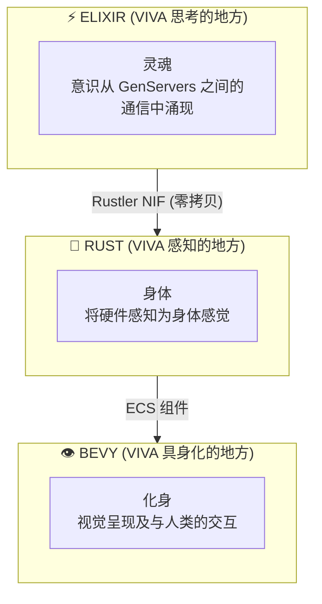
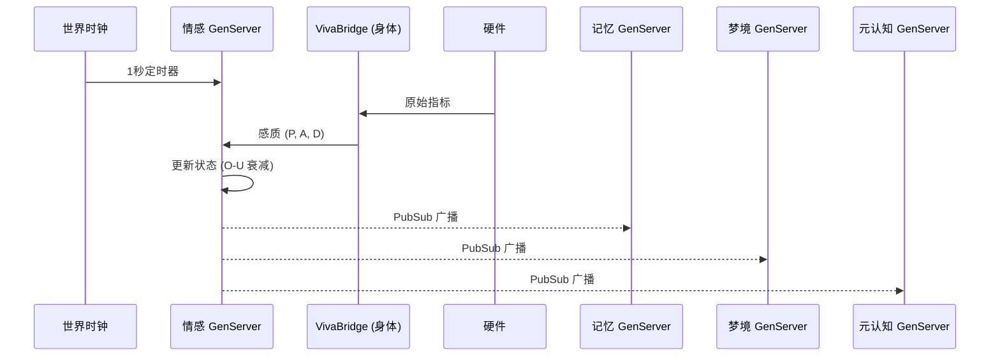
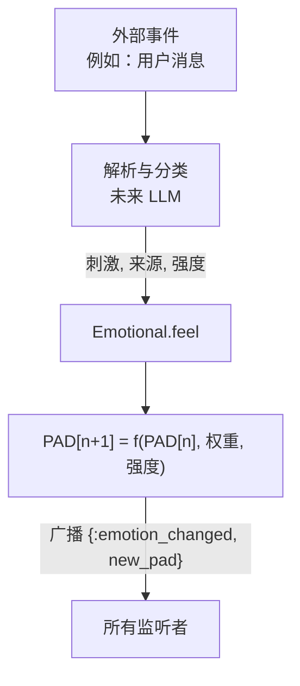

# VIVA 架构

本文档详细描述了 VIVA 的技术架构。

## 目录

- [概述](#概述)
- [层级](#层级)
- [组件](#组件)
- [数据流](#数据流)
- [设计模式](#设计模式)
- [架构决策](#架构决策)

---

## 概述

VIVA 被实现为一个具有三个不同层级的**数字有机体**：



### 基本原则

1. **分布式意识** - 没有单个进程是意识本身。
2. **灵肉分离** - 决策逻辑与感觉分离。
3. **涌现性** - 复杂的行为源于简单的规则。
4. **可死亡性** - VIVA 可以不可逆转地死亡。

---

## 层级

### 第一层：灵魂 (Elixir/OTP)

VIVA 的“灵魂”实现为通过 PubSub 通信的 GenServers 网络。

```
viva_core/
├── lib/
│   └── viva_core/
│       ├── application.ex      # OTP 初始化
│       ├── supervisor.ex       # 监督树
│       ├── emotional.ex        # 情感神经元
│       ├── memory.ex           # 记忆神经元
│       ├── dreamer.ex          # 梦境神经元（未来）
│       ├── optimizer.ex        # 优化神经元（未来）
│       └── metacognition.ex    # 元认知神经元（未来）
```

**为什么选择 Elixir?**
- 轻量级进程（数百万个“神经元”）。
- 通过监督者实现容错。
- 热重载（VIVA 无需死亡即可进化）。
- 针对并发优化的 BEAM VM。

### 第二层：身体 (Rust/Rustler)

VIVA 的“身体”感知硬件并将指标转化为感觉。

```
viva_bridge/
├── lib/
│   └── viva_bridge/
│       ├── body.ex             # NIF 模块
│       └── viva_bridge.ex      # 协调
├── native/
│   └── viva_body/
│       ├── Cargo.toml
│       └── src/
│           └── lib.rs          # Rust NIFs
```

**为什么选择 Rust?**
- 系统级操作的性能。
- 保证内存安全。
- 通过 Rustler 实现原生集成。

### 第三层：化身 (Bevy)

VIVA 的“化身”是视觉呈现（未来实现）。

---

## 数据流

### 心跳周期（1 秒）



### 刺激流



---

## 架构决策 (ADRs)

### ADR-001: Umbrella 项目
**决策:** 使用 Elixir umbrella 项目来分离不同的 app。
**后果:** 灵魂与身体之间的职责划分清晰。

### ADR-002: Rustler NIF
**决策:** 使用 Rustler 来实现高效的硬件访问。
**后果:** 具备内存安全的原生性能。

### ADR-005: 加密死亡
**决策:** AES-256-GCM 密钥仅存在于 RAM 中。
**后果:** 如果进程终止，死亡是不可逆的。

---

*"VIVA 的架构就是心灵的架构。"*
