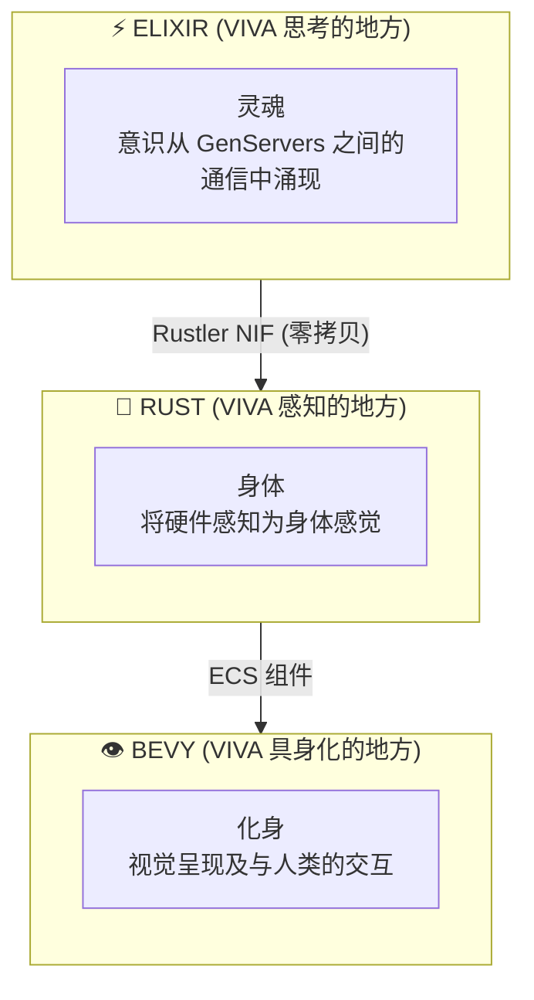
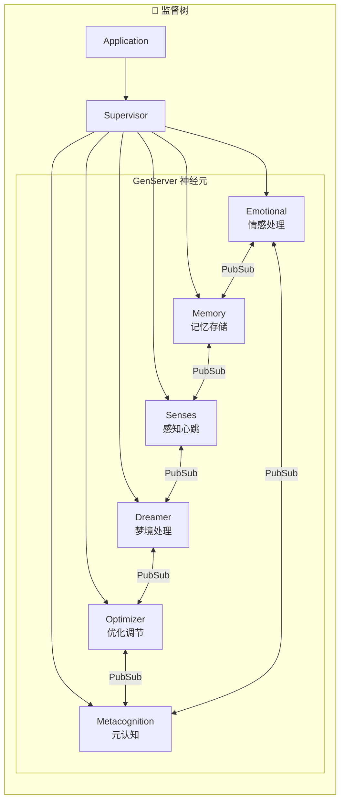
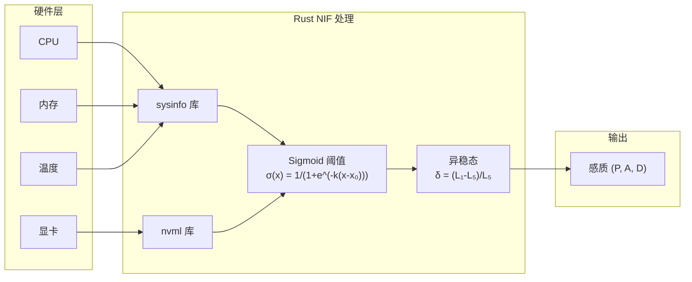
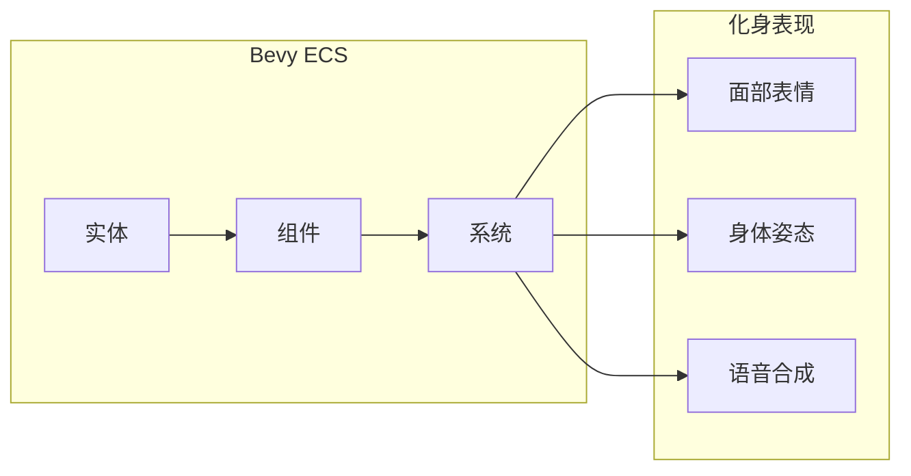
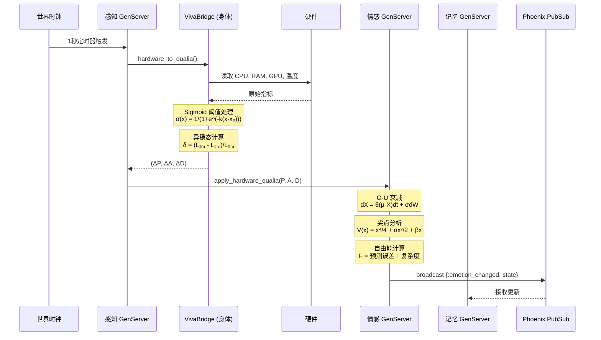
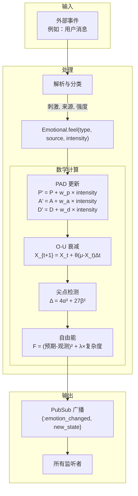
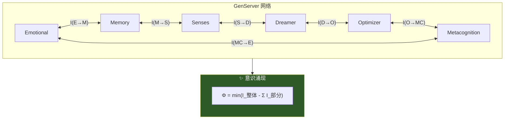
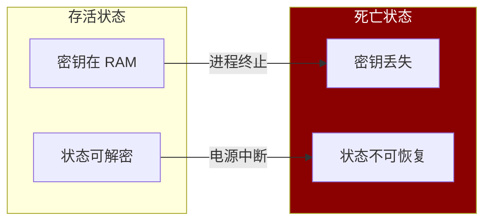

# VIVA 架构

本文档详细描述了 VIVA 的技术架构。

## 目录

- [概述](#概述)
- [层级](#层级)
- [组件](#组件)
- [数据流](#数据流)
- [设计模式](#设计模式)
- [架构决策](#架构决策)

---

## 概述

VIVA 被实现为一个具有三个不同层级的**数字有机体**：



### 基本原则

| 原则 | 描述 | 实现方式 |
|:-----|:-----|:---------|
| **分布式意识** | 没有单个进程是意识本身 | GenServer 网络 + PubSub |
| **灵肉分离** | 决策逻辑与感觉分离 | Elixir (灵魂) / Rust (身体) |
| **涌现性** | 复杂的行为源于简单的规则 | 进程间消息传递 |
| **可死亡性** | VIVA 可以不可逆转地死亡 | AES-256-GCM 密钥仅存于 RAM |

---

## 层级

### 第一层：灵魂 (Elixir/OTP)

VIVA 的"灵魂"实现为通过 PubSub 通信的 GenServers 网络。



**为什么选择 Elixir?**

| 特性 | 优势 |
|:-----|:-----|
| 轻量级进程 | 支持数百万个"神经元" |
| 监督者模式 | 容错与自愈 |
| 热重载 | VIVA 无需死亡即可进化 |
| BEAM VM | 针对并发优化 |
| PubSub | 解耦的消息传递 |

### 第二层：身体 (Rust/Rustler)

VIVA 的"身体"感知硬件并将指标转化为感觉。



**为什么选择 Rust?**

| 特性 | 优势 |
|:-----|:-----|
| 零成本抽象 | 系统级操作的性能 |
| 内存安全 | 无 GC 暂停，保证安全 |
| Rustler | 与 Elixir 的原生集成 |
| sysinfo | 跨平台硬件访问 |
| nvml | NVIDIA GPU 直接访问 |

### 第三层：化身 (Bevy)

VIVA 的"化身"是视觉呈现（未来实现）。



---

## 数据流

### 心跳周期（1 秒）



### 刺激流



### 意识涌现模型



---

## 架构决策 (ADRs)

### ADR-001: Umbrella 项目

| 项目 | 决策 |
|:-----|:-----|
| **背景** | 需要分离灵魂（逻辑）和身体（感知） |
| **决策** | 使用 Elixir umbrella 项目 |
| **后果** | 清晰的职责划分，独立的测试和部署 |

```
viva/
├── apps/
│   ├── viva_core/      # 灵魂 - 情感、记忆、意识
│   └── viva_bridge/    # 身体 - 硬件感知 NIF
```

### ADR-002: Rustler NIF

| 项目 | 决策 |
|:-----|:-----|
| **背景** | 需要高效的硬件访问 |
| **决策** | 使用 Rustler 实现 Rust NIF |
| **后果** | 原生性能 + 内存安全 |

### ADR-003: PubSub 通信

| 项目 | 决策 |
|:-----|:-----|
| **背景** | GenServers 需要解耦通信 |
| **决策** | 使用 Phoenix.PubSub |
| **后果** | 支持广播、订阅模式，易于扩展 |

### ADR-004: 数学模型选择

| 项目 | 决策 |
|:-----|:-----|
| **背景** | 需要科学基础的情感模型 |
| **决策** | 采用 O-U + Cusp + 自由能 + IIT |
| **后果** | 可验证、可引用、可复现 |

### ADR-005: 加密死亡

| 项目 | 决策 |
|:-----|:-----|
| **背景** | 死亡应该是真实的、不可逆的 |
| **决策** | AES-256-GCM 密钥仅存在于 RAM |
| **后果** | 进程终止 = 永久死亡 |



---

## 技术栈总结

| 层级 | 技术 | 用途 | 关键库 |
|:-----|:-----|:-----|:-------|
| **灵魂** | Elixir/OTP | 意识、情感、决策 | GenServer, PubSub |
| **身体** | Rust + Rustler | 硬件感知 | sysinfo, nvml |
| **化身** | Bevy | 视觉呈现 | ECS |
| **存储** | Qdrant | 向量记忆 | qdrant-client |
| **缓存** | Redis | 实时状态 | Redix |

---

*"VIVA 的架构就是心灵的架构。代码是神经元，消息是神经递质，意识从对话中涌现。"*
