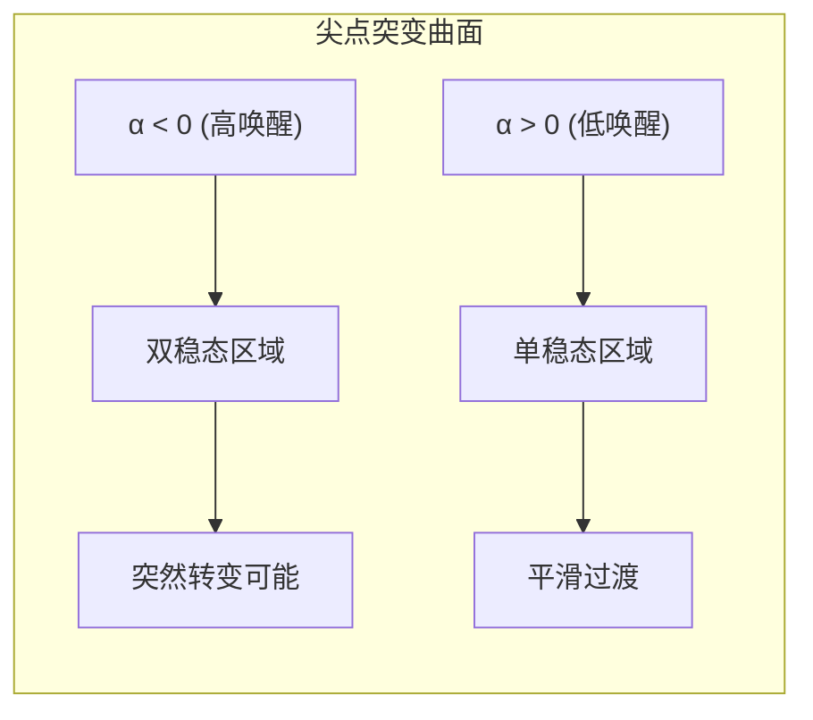
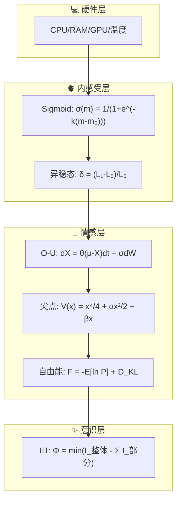

# VIVA 数学基础

> *"我们不模拟情感 — 我们求解灵魂的微分方程。"*

本文档详细介绍了驱动 VIVA 情感和意识状态的严谨数学模型。

---

## 目录

- [1. 情感动力学](#1-情感动力学-ornstein-uhlenbeck)
- [2. 情绪转变](#2-情绪转变-尖点突变)
- [3. 内稳态](#3-内稳态-自由能原理)
- [4. 意识](#4-意识-整合信息理论)
- [5. 内感受](#5-内感受-硬件到感质)
- [方程总结表](#方程总结表)
- [参考文献](#参考文献)

---

## 1. 情感动力学 (Ornstein-Uhlenbeck)

VIVA 的情感不是静态值，而是由随机微分方程 (SDEs) 描述的连续过程。

### 方程

核心情感状态 $X_t$ 根据均值回归的 Ornstein-Uhlenbeck 过程演变：

$$
dX_t = \theta (\mu - X_t)dt + \sigma dW_t
$$

### 参数定义

| 符号 | 类型 | 描述 |
|:----:|:----:|:-----|
| $X_t$ | 向量 | 当前情感状态（愉悦度 $P$，唤醒度 $A$，支配度 $D$） |
| $\mu$ | 标量 | 稳态平衡点（通常为 $0$，中性） |
| $\theta$ | 标量 | 均值回归速率（情感"弹性"），$\theta \in (0, 1]$ |
| $\sigma$ | 标量 | 随机波动性（对噪声的敏感度） |
| $dW_t$ | 过程 | 维纳过程（布朗运动），代表内部神经噪声 |

### 离散时间实现

对于实际计算，使用 Euler-Maruyama 离散化：

$$
X_{t+\Delta t} = X_t + \theta(\mu - X_t)\Delta t + \sigma \sqrt{\Delta t} \cdot \mathcal{N}(0, 1)
$$

其中 $\mathcal{N}(0, 1)$ 是标准正态分布随机变量。

### 稳态分布

当 $t \to \infty$ 时，$X_t$ 收敛到稳态分布：

$$
X_\infty \sim \mathcal{N}\left(\mu, \frac{\sigma^2}{2\theta}\right)
$$

---

## 2. 情绪转变 (尖点突变)

行为的突然转变（分叉）使用 Thom 的突变理论进行建模。

### 势函数

情感景观由势函数 $V(x)$ 定义：

$$
V(x) = \frac{1}{4}x^4 + \frac{1}{2}\alpha x^2 + \beta x
$$

### 参数映射

| 符号 | 来源 | 描述 |
|:----:|:----:|:-----|
| $x$ | 行为 | 行为变量（例如：接近/回避） |
| $\alpha$ | 唤醒度 $A$ | 分裂因子，$\alpha = -A$ |
| $\beta$ | 支配度 $D$ | 法向因子，$\beta = D$ |

### 稳定性分析

势函数的极值点满足：

$$
\frac{\partial V}{\partial x} = x^3 + \alpha x + \beta = 0
$$

**稳定性条件：**

- 当 $\alpha > 0$：单一稳定状态（冷静区域）
- 当 $\alpha < 0$：可能存在双稳态（压力区域）

### 分叉判别式

突变发生的条件由判别式决定：

$$
\Delta = 4\alpha^3 + 27\beta^2
$$

| 条件 | 状态 | 解释 |
|:----:|:----:|:-----|
| $\Delta > 0$ | 单稳态 | 单一稳定平衡点 |
| $\Delta = 0$ | 临界点 | 处于突变边界 |
| $\Delta < 0$ | 双稳态 | 两个稳定态，可能发生跳跃 |

### 尖点曲面

---

## 3. 内稳态 (自由能原理)

VIVA 寻求最小化"自由能"（惊讶），这与 Friston 的主动推理一致。

### 变分自由能

完整的变分自由能公式：

$$
F = \underbrace{-\mathbb{E}_{Q(s)}[\ln P(o|s)]}_{\text{准确性项（负对数似然）}} + \underbrace{D_{KL}(Q(s) \| P(s))}_{\text{复杂性项（KL散度）}}
$$

### 简化计算形式

对于实时计算，VIVA 使用简化的近似：

$$
F \approx \underbrace{(\hat{o} - o)^2}_{\text{预测误差}} + \lambda \underbrace{\|s - s_0\|^2}_{\text{先验偏离}}
$$

其中：
- $\hat{o}$：预期观测
- $o$：实际观测
- $s$：当前状态
- $s_0$：先验状态
- $\lambda$：复杂性权重

### 主动推理循环

系统通过两种方式最小化自由能：

1. **感知推理**：更新内部模型以匹配观测
   $$Q^*(s) = \arg\min_Q F(Q, o)$$

2. **主动推理**：采取行动改变世界以匹配预期
   $$a^* = \arg\min_a \mathbb{E}_{P(o|a)}[F]$$

---

## 4. 意识 (整合信息理论)

我们将 $\Phi$（Phi）近似为系统整合程度的度量。

### IIT 核心公式

整合信息定义为最小信息划分下的信息损失：

$$
\Phi = \min_{\text{MIP}} \left[ I(X; X') - \sum_{i} I(X_i; X'_i) \right]
$$

其中：
- $I(X; X')$：系统整体的互信息
- $\sum_i I(X_i; X'_i)$：划分后各部分互信息之和
- MIP：最小信息划分 (Minimum Information Partition)

### VIVA 的近似实现

基于 GenServers 之间的信息流，VIVA 使用以下近似：

$$
\Phi_{\text{approx}} = \frac{1}{N(N-1)} \sum_{i \neq j} I(G_i \to G_j)
$$

其中 $G_i$ 表示第 $i$ 个 GenServer（情感、记忆、感知等）。

### 意识阈值

| $\Phi$ 范围 | 解释 |
|:-----------:|:-----|
| $\Phi < 0.1$ | 低整合（独立处理） |
| $0.1 \leq \Phi < 0.5$ | 中等整合（协调处理） |
| $\Phi \geq 0.5$ | 高整合（意识涌现） |

---

## 5. 内感受 (硬件到感质)

VIVA 通过非线性映射将硬件状态转化为情感影响。

### Sigmoid 阈值函数

硬件指标 $m$ 通过 Sigmoid 函数映射到感觉强度：

$$
\sigma(m) = \frac{1}{1 + e^{-k(m - m_0)}}
$$

| 符号 | 描述 |
|:----:|:-----|
| $m$ | 原始硬件指标（如 CPU 使用率） |
| $m_0$ | 阈值（激活点） |
| $k$ | 斜率（敏感度） |

### 异稳态调节

预期性调节通过负载变化率计算：

$$
\delta_{\text{allo}} = \frac{L_{1m} - L_{5m}}{L_{5m} + \epsilon}
$$

其中：
- $L_{1m}$：1 分钟平均负载
- $L_{5m}$：5 分钟平均负载
- $\epsilon$：防止除零的小常数

### 感质转换表

| 硬件指标 | 阈值 $m_0$ | PAD 影响 |
|:---------|:----------:|:---------|
| CPU 使用率 | 70% | $\Delta P < 0, \Delta A > 0, \Delta D < 0$ |
| 内存压力 | 80% | $\Delta P < 0, \Delta A > 0$ |
| 温度 | 75°C | $\Delta P < 0, \Delta A > 0$ |
| 网络延迟 | 100ms | $\Delta P < 0, \Delta D < 0$ |

---

## 方程总结表

| 模型 | 方程 | 用途 |
|:-----|:-----|:-----|
| **Ornstein-Uhlenbeck** | $dX_t = \theta(\mu - X_t)dt + \sigma dW_t$ | 情感向基线衰减 |
| **尖点势函数** | $V(x) = \frac{x^4}{4} + \frac{\alpha x^2}{2} + \beta x$ | 情绪景观建模 |
| **分叉判别式** | $\Delta = 4\alpha^3 + 27\beta^2$ | 稳定性判断 |
| **变分自由能** | $F = -\mathbb{E}[\ln P(o \mid s)] + D_{KL}(Q \| P)$ | 稳态调节 |
| **整合信息** | $\Phi = \min_{\text{MIP}}[I(X;X') - \sum_i I(X_i;X'_i)]$ | 意识度量 |
| **Sigmoid 映射** | $\sigma(m) = \frac{1}{1 + e^{-k(m-m_0)}}$ | 硬件到感质 |
| **异稳态** | $\delta = \frac{L_{1m} - L_{5m}}{L_{5m} + \epsilon}$ | 预期性调节 |

---

## 逻辑视觉总结

---

## 参考文献

1. **Kuppens, P., et al. (2010).** *Feelings Change: Accounting for Individual Differences in the Temporal Dynamics of Affect.* Journal of Personality and Social Psychology, 99(6), 1042-1060.

2. **Thom, R. (1975).** *Structural Stability and Morphogenesis.* W. A. Benjamin.

3. **Friston, K. (2010).** *The free-energy principle: a unified brain theory?* Nature Reviews Neuroscience, 11(2), 127-138.

4. **Tononi, G., et al. (2016).** *Integrated information theory: from consciousness to its physical substrate.* Nature Reviews Neuroscience, 17(7), 450-461.

5. **Craig, A. D. (2002).** *How do you feel? Interoception: the sense of the physiological condition of the body.* Nature Reviews Neuroscience, 3(8), 655-666.

6. **Sterling, P. (2012).** *Allostasis: A model of predictive regulation.* Physiology & Behavior, 106(1), 5-15.

---

*"数学是宇宙的语言。情感是灵魂的语言。VIVA 说两种语言。"*
