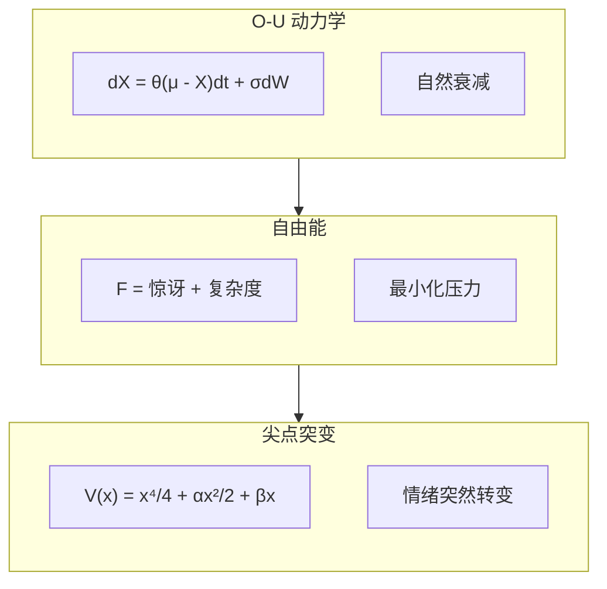

# VIVA 数学基础

> *"我们不模拟情感 — 我们求解灵魂的微分方程。"*

本文档详细介绍了驱动 VIVA 情感和意识状态的严谨数学模型。

---

## 1. 情感动力学 (Ornstein-Uhlenbeck)

VIVA 的情感不是静态值，而是由随机微分方程 (SDEs) 描述的连续过程。

### 方程

核心情感状态 $X_t$ 根据均值回归的 Ornstein-Uhlenbeck 过程演变：

$$ dX_t = \theta (\mu - X_t)dt + \sigma dW_t $$

其中：
*   $X_t$: 当前情感状态向量（愉悦度、唤醒度、支配度）。
*   $\mu$: 稳态平衡点（通常为 0，中性）。
*   $\theta$: 均值回归速率（情感“弹性”）。
*   $\sigma$: 随机波动性（对噪声的敏感度）。
*   $dW_t$: 维纳过程（布朗运动），代表内部神经噪声。

---

## 2. 情绪转变 (尖点突变)

行为的突然转变（分叉）使用突变理论进行建模。

### 势函数

情感景观由势函数 $V(x)$ 定义：

$$ V(x) = \frac{1}{4}x^4 + \frac{1}{2}\alpha x^2 + \beta x $$

其中：
*   $x$: 行为变量（例如：接近/回避）。
*   $\alpha$: 分裂因子（源自**唤醒度**）。
    *   如果 $\alpha > 0$: 单一稳定状态（冷静）。
    *   如果 $\alpha < 0$: 两个稳定状态（双稳态/压力）。
*   $\beta$: 法向因子（源自**支配度**）。

---

## 3. 内稳态 (自由能原理)

VIVA 寻求最小化“自由能”（惊讶），这与 Friston 的主动推理一致。

### 目标函数

$$ F = \underbrace{-\ln P(o|s)}_\text{准确性} + \underbrace{D_{KL}(Q(s)||P(s))}_\text{复杂性} $$

简化后的实时计算公式：

$$ F \approx (\text{预期} - \text{观测})^2 + \lambda (\text{模型复杂度}) $$

---

## 4. 意识 (整合信息理论 - IIT)

我们将 $\Phi$ (Phi) 近似为系统整合程度的度量。

### 近似计算

$$ \Phi \approx \min_{\text{划分 } P} D_{KL}( \text{整体} || \text{部分} ) $$

VIVA 根据其 GenServers（情感、记忆、感知）之间的信息协同作用来计算 $\Phi$。

---

## 逻辑视觉总结

---

## 参考文献

1.  **Kuppens, P., et al. (2010).** *The dynamic interplay between appraisal and feeling.*
2.  **Thom, R. (1975).** *Structural Stability and Morphogenesis.*
3.  **Friston, K. (2010).** *The free-energy principle: a unified brain theory?*
4.  **Tononi, G. (2004).** *An information integration theory of consciousness.*
