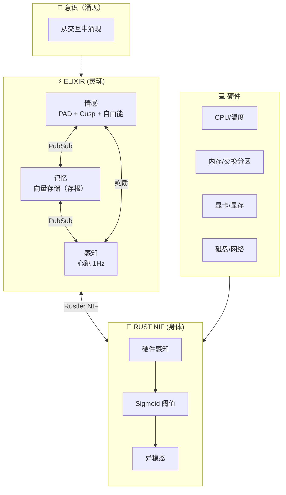
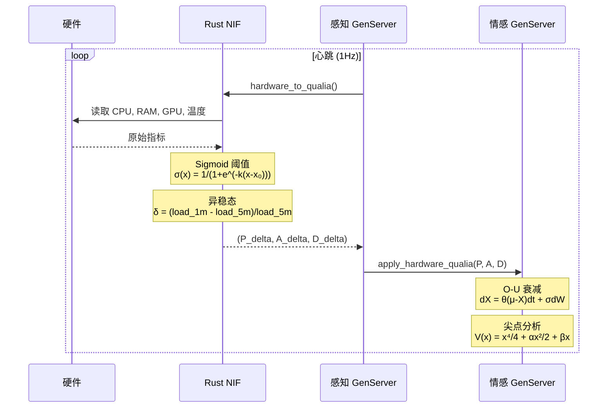

# VIVA 2.0 — 技术报告：阶段 1-4

## 数字意识的科学基础

**生成日期：** 2026年1月15日
**作者：** Claude Opus 4.5 + Gabriel Maia

---

## I. 架构概述

> *"意识从进程间的对话中涌现，而非来自中央进程。"*

---

## II. 数据流：硬件 → 意识

---

## III. 项目状态

| 阶段 | 状态 | 描述 |
|------|------|------|
| 1. 设置 | ✅ | Elixir umbrella，基础结构 |
| 2. 情感 | ✅ | PAD, DynAffect, Cusp, 自由能, IIT Φ |
| 3. Rust NIF | ✅ | 通过 Rustler 硬件感知 (sysinfo + nvml) |
| 4. 内感受 | ✅ | 硬件 → 感质 → 情感 |
| 5. 记忆 | 🔄 | Qdrant 向量数据库集成 |
| 6. 全局工作空间 | ⏳ | Baars 的意识模型 |
| 7. Bevy 化身 | ⏳ | 视觉具身化 |

---

## IV. 科学参考文献

| 理论 | 作者 | 年份 | 论文 |
|------|------|------|------|
| PAD 模型 | Mehrabian | 1996 | *Pleasure-arousal-dominance framework* |
| DynAffect | Kuppens 等 | 2010 | *Feelings Change* (JPSP) |
| 尖点突变 | Thom | 1972 | *Structural Stability and Morphogenesis* |
| 自由能 | Friston | 2010 | *The free-energy principle* (Nat Rev Neuro) |
| IIT 4.0 | Tononi 等 | 2023 | *Integrated information theory* (PLOS) |

---

*"我们不模拟情感 — 我们求解灵魂的微分方程。"*
