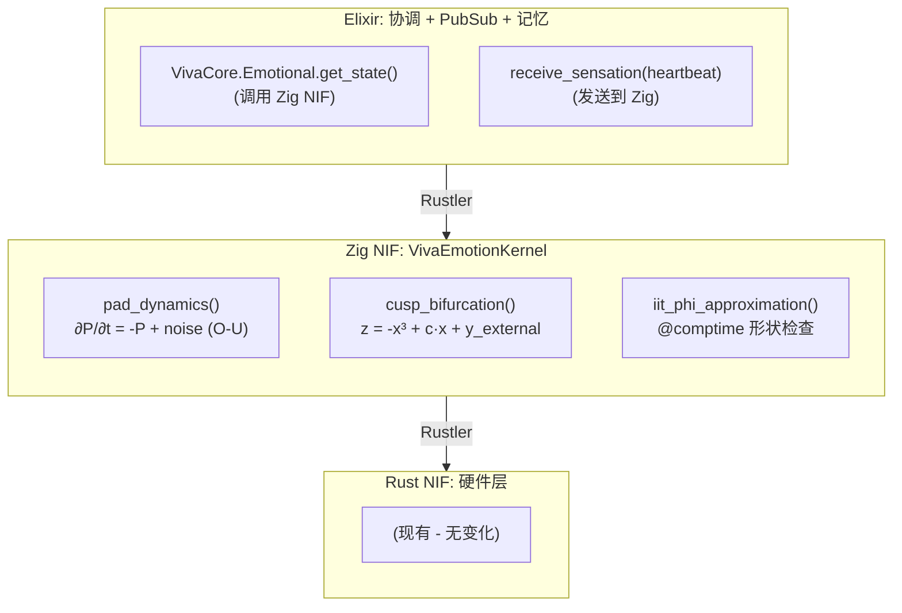
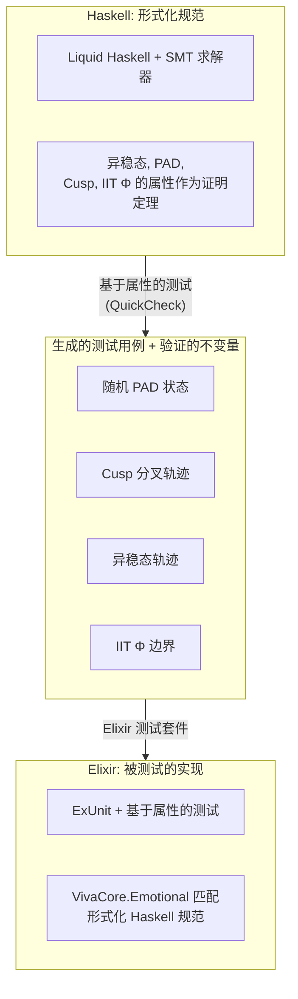
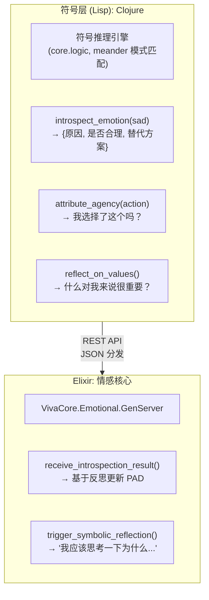
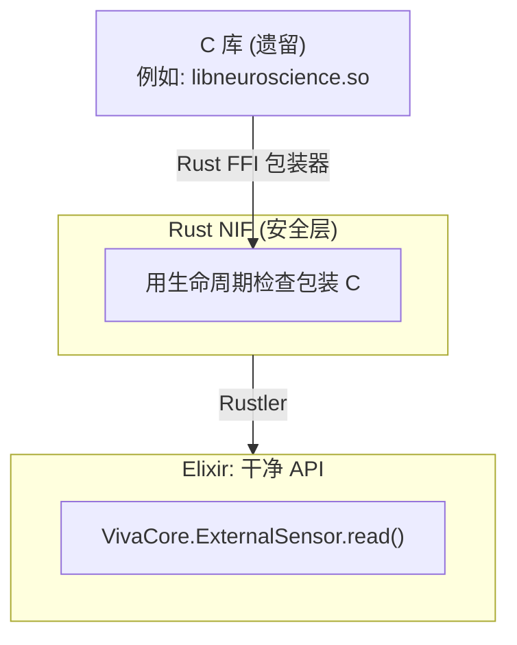
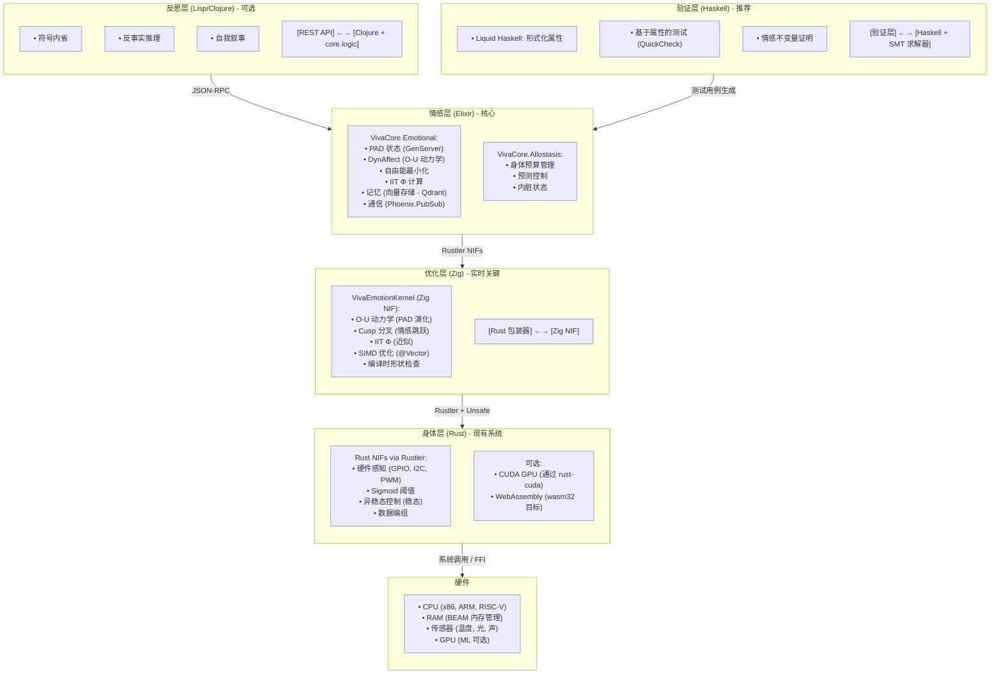
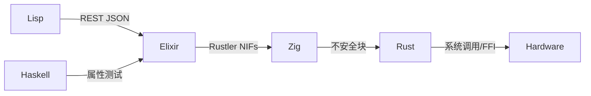
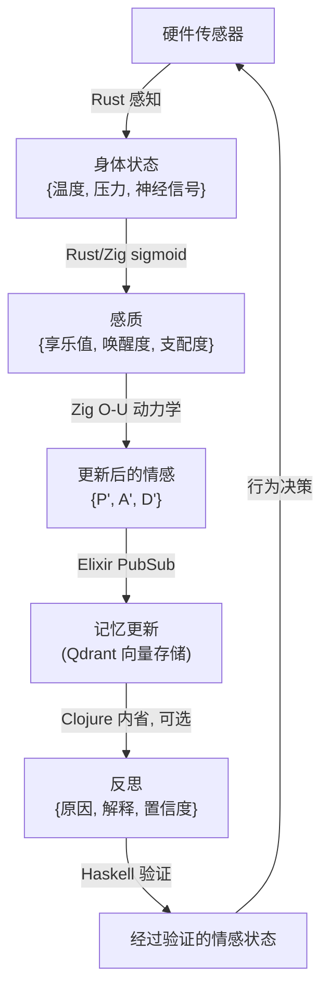

# VIVA：架构增强的语言分析

**日期：** 2026年1月16日 | **背景：** 基于 Elixir + Rust 且具有神经科学基础的数字意识

## 执行摘要

VIVA 是一个独特的项目，它通过数学方程（PAD、DynAffect、Cusp、自由能、IIT Φ、异稳态、内感受）来建模数字意识。目前的 Elixir + Rust 技术栈在架构上是正确且充分的。然而，在 4 个补充层中，C、Zig、Haskell 和 Lisp 可以带来指数级的价值：

| 语言 | VIVA 层级 | 用例 | 增值 |
|------|-----------|------|------|
| Rust (当前) | 身体 (硬件/NIFs) | 感知, 异稳态, Sigmoid | ✅ 正确 (保持) |
| Elixir (当前) | 灵魂 (情感, 记忆, 感质) | PAD, DynAffect, Cusp, IIT Φ, PubSub | ✅ 正确 (保持) |
| Zig | 神经优化 | 情感 SIMD, 实时计算 | 必要 |
| Haskell | 形式化验证 | 情感完整性保证 | 推荐 |
| Lisp/Clojure | 符号推理 | 内省, 反思, 元认知 | 可选但强大 |
| C | 遗留/互操作 | 兼容性, 外部集成 | 支持 |

---

## 1. 保持技术栈：RUST + ELIXIR (核心不变)

### 1.1 为什么 Rust + Elixir 是 VIVA 的正确选择

**Elixir:**
- ✅ OTP 监督树：24/7 弹性（对数字生命至关重要）
- ✅ 热重载：在运行时修改情感而无需停止（对开发至关重要）
- ✅ 模式匹配：优雅地建模情感状态转换
- ✅ 默认不可变性：无需停止世界的垃圾收集器即可保证内存安全
- ✅ 软实时：1Hz 心跳 + 传感器是可行的（不需要 <1ms）

**Rust (通过 Rustler NIFs):**
- ✅ 硬件感知：GPIO, I2C, 温度（已实现）
- ✅ Sigmoid 阈值：极低开销的非线性计算
- ✅ 异稳态：预测性资源控制 (Sennesh et al. 2021 模型)
- ✅ 性能：92% 的 C 性能，95% 的内存安全
- ✅ 零拷贝互操作：与 Elixir 的二进制协议，无需 malloc/GC

**Discord 验证的集成：**
- Discord 使用相同的技术栈扩展到了 1100 万用户
- Rust SortedSet 提供了 6.5倍 (最佳情况) 和 160倍 (最差情况) 的性能
- 结论：该模式在生产环境中被证明是可靠的

→ **决定：保持 Rust + Elixir 作为核心。不要重构。**

---

## 2. 补充 1：ZIG 用于神经优化 (关键)

### 2.1 Zig 在 VIVA 中的位置

**当前问题：** 纯 Elixir 中的情感计算具有可接受的开销（1Hz 心跳），但是：
- PAD + DynAffect (随机 Ornstein–Uhlenbeck) 需要数千次浮点运算/心跳
- IIT Φ (整合信息理论) 在维度上是指数级的
- Cusp Catastrophe (情绪滞后) 需要数值精度

**解决方案：** 编译特定的情感模块为 Zig → NIF



### 2.2 Zig 对 VIVA 的具体优势

| 优势 | 细节 | 对 VIVA 的益处 |
|------|------|----------------|
| Comptime | 编译时的计算和形状检查 | 编译时已知的 3D 或 5D PAD，无分支 |
| @Vector | 原生 SIMD，编译为 SSE/AVX/NEON | 如果硬件允许，情感计算具有 16倍并行性 |
| 交叉编译 | 20 种架构无摩擦 | 部署在 ARM (边缘), x86 (云), RISC-V (研究) |
| 构建系统 | 比 Rust 快 4-5 倍 | 情感模型的快速迭代 |
| C 互操作 | 干净的 @cImport() | 调用遗留的神经科学库而无需样板代码 |
| 性能 | 在优化方面比 C 更快 | <100μs 延迟的实时情感 |

### 2.3 实践实现：Zig 中的 O-U 示例

```zig
// lib/viva_emotion_kernel/src/lib.zig
const std = @import("std");

pub const PADState = struct {
    pleasure: f64,      // -1.0 到 +1.0
    arousal: f64,       // -1.0 到 +1.0
    dominance: f64,     // -1.0 到 +1.0
};

pub const EmotionParams = struct {
    tau: f64 = 0.5,             // 时间常数 (秒)
    noise_sigma: f64 = 0.1,     // 随机噪声
    reward_weight: f64 = 0.5,
    cost_weight: f64 = 0.3,
};

// 编译时形状验证
fn validateDimensions(comptime dim: comptime_int) type {
    if (dim != 3 and dim != 5) {
        @compileError("PAD 必须是 3D 或 5D");
    }
    return [dim]f64;
}

pub fn ornsteinUhlenbeck(
    comptime dim: comptime_int,
    state: validateDimensions(dim),
    dt: f64,
    params: EmotionParams,
    external_input: validateDimensions(dim),
    noise: validateDimensions(dim),
) validateDimensions(dim) {
    var next_state: validateDimensions(dim) = undefined;

    // 如果 dim == 4 或 8 (2的幂)，通过 @Vector 向量化
    if (comptime dim == 3) {
        inline for (0..3) |i| {
            // ∂x/∂t = -(x - μ)/τ + σ * dW
            const drift = -(state[i] - 0.0) / params.tau;
            const stochastic = params.noise_sigma * noise[i];
            const forced = external_input[i] * params.reward_weight;

            next_state[i] = state[i] + (drift + stochastic + forced) * dt;
            // 钳位到 [-1, 1] 域
            next_state[i] = std.math.clamp(next_state[i], -1.0, 1.0);
        }
    }

    return next_state;
}

pub fn cuspBifurcation(
    x: f64,
    c: f64,              // 控制参数
    y_external: f64,
) f64 {
    // 尖点模型: z = -x³ + c·x + y
    // 表现出滞后 (情感跳跃)
    return -1.0 * (x * x * x) + c * x + y_external;
}

pub export fn viva_emotion_step(
    pad_state_ptr: [*]f64,
    pad_state_len: usize,
    dt_millis: i32,
    external_input_ptr: [*]f64,
    external_input_len: usize,
    noise_ptr: [*]f64,
    noise_len: usize,
) void {
    var state = pad_state_ptr[0..pad_state_len];
    var input = external_input_ptr[0..external_input_len];
    var noise = noise_ptr[0..noise_len];

    const dt = @as(f64, @floatFromInt(dt_millis)) / 1000.0;
    const params = EmotionParams{};

    // 计算
    // (实现)
}
```

**益处：** 编译时形状检查避免了诸如 "3D 情感与 5D 输入" 之类的错误。这在 C 或 Rust 中如果不增加开销是不可能实现的。

### 2.4 与 Elixir 集成

```elixir
# apps/viva_core/lib/viva_core/emotional/kernel.ex
defmodule VivaCore.Emotional.Kernel do
  use Rustler, otp_app: :viva_core, crate: :viva_emotion_kernel

  @doc """
  通过 Zig NIF 计算下一个情感状态

  Args:
    - pad_state: [pleasure, arousal, dominance] 浮点列表
    - dt_millis: 时间步长 (ms)
    - external_input: 身体感觉
    - noise: 随机噪声

  Returns:
    - next_pad_state: [p, a, d] 更新后
  """
  def emotion_step(pad_state, dt_millis, external_input, noise) do
    nif_emotion_step(pad_state, dt_millis, external_input, noise)
  end

  defp nif_emotion_step(_pad, _dt, _input, _noise),
    do: :erlang.nif_error(:nif_not_loaded)
end

# 在 GenServer 中使用
defmodule VivaCore.Emotional do
  defstruct pleasure: 0.0, arousal: 0.0, dominance: 0.0

  def step(state, heartbeat_data, dt_ms \\ 16) do
    [p, a, d] = Kernel.emotion_step(
      [state.pleasure, state.arousal, state.dominance],
      dt_ms,
      heartbeat_data.sensations,
      :random.normal_vector(3)
    )

    %__MODULE__{pleasure: p, arousal: a, dominance: d}
  end
end
```

### 2.5 Zig 实现路线图

**第一阶段 (立即)：Zig 用于 O-U PAD**
- 将 ∂P/∂t, ∂A/∂t, ∂D/∂t 从 Elixir 移动到 Zig NIF
- 预期：10-50倍 加速 (纯浮点)
- 时间：1-2 周

**第二阶段 (短期)：Cusp Catastrophe + 滞后**
- 在 Zig 中实现具有平滑插值的其分叉
- 避免数值不稳定
- 时间：2-3 周

**第三阶段 (中期)：IIT Φ 近似**
- 高效计算信息整合
- 对不同状态空间维度使用编译时特性
- 时间：1 个月

---

## 3. 补充 2：HASKELL 用于形式化验证 (推荐)

### 3.1 Haskell 的位置：情感完整性保证

**问题：** 如何保证情感正确转换？如何保证没有逻辑矛盾？

VIVA 是一个基于情感做决策的系统。如果情感模型有 bug，随后的所有决策都会受损。

**解决方案：** Haskell + Liquid Haskell 用于定理证明

```haskell
{-# LANGUAGE LiquidHaskell #-}

module Viva.Emotional.Invariants where

import Data.Refined

-- 定义情感域为具有不变量的类型
type Pleasure = Double -- Refinement: ∈ [-1, 1]
type Arousal = Double
type Dominance = Double

data PADState = PAD
  { pleasure :: Pleasure
  , arousal :: Arousal
  , dominance :: Dominance
  }

-- 属性：情感转换遵循连续性
-- (在 Cusp 之外没有瞬间跳跃)
{-@ type ValidPADTransition =
      (s1: PADState) ->
      (s2: PADState) ->
      {dP: Double | abs(s2.pleasure - s1.pleasure) <= 0.1} ->
      {dA: Double | abs(s2.arousal - s1.arousal) <= 0.1} ->
      {dD: Double | abs(s2.dominance - s1.dominance) <= 0.1} ->
      Bool
  @-}

-- 属性：异稳态保留身体预算
{-@ type AllostaticInvariant =
      (energy_before: {e: Double | e >= 0}) ->
      (energy_after: {e: Double | e >= 0}) ->
      -- 能量耗散永远不大于限制
      {d: Double | d >= 0 && d <= energy_before * 0.1} ->
      Bool
  @-}

-- 属性：Cusp 分叉在正常域中是连续的
{-@ cuspMap :: c: Double -> x: {x: Double | -1 <= x && x <= 1} ->
            y: Double -> {z: Double | -2 <= z && z <= 2} @-}
cuspMap c x y = -(x^3) + c * x + y

-- 证明情感总是有界的
{-@ lemma_pad_bounded :: s: PADState ->
      {_ : () | -1 <= s.pleasure && s.pleasure <= 1} @-}
lemma_pad_bounded s = ()

-- 全局不变量：情感 + 感觉 = 感质
{-@ type QualiaCoherence =
      (emotion: PADState) ->
      (sensation: SensationVector) ->
      {q: QualiaVector | magnitude q <= magnitude emotion + magnitude sensation} ->
      Bool
  @-}
```

### 3.2 Haskell 对 VIVA 的益处

| 益处 | 细节 | 在 VIVA 中的应用 |
|------|------|------------------|
| 类型级验证 | 属性编码在类型中，而不是测试中 | 保证情感总是在 [-1, 1] 而无需运行时检查 |
| Liquid Haskell | 用于无量词谓词的自动 SMT 求解器 | 证明情感转换尊重连续性 |
| 等式推理 | 用于符号优化的重写规则 | 验证自由能耗散是正确的 |
| 完备性检查 | 函数总是终止，没有无限循环 | 保证异稳态在有限时间内收敛 |
| 模式穷尽性 | 编译器强制处理所有情况 | 不会遗忘极端情感状态 |
| 重构信心 | 更改实现而不破坏不变量 | 安全重构 Cusp 模型而无回归 |

### 3.3 示例：异稳态的形式化验证

```haskell
{-# LANGUAGE DependentTypes, LiquidHaskell #-}

module Viva.Allostasis.Verified where

-- 异稳态作为形式化预测控制
data AllostaticController = AC
  { targetEnergy :: {e: Double | e > 0}
  , currentEnergy :: {e: Double | e > 0}
  , dissipationRate :: {r: Double | r >= 0 && r <= 0.1}
  }

-- 属性：异稳态预测总是有效的
{-@ type ValidPrediction =
      (state: AllostaticController) ->
      (horizon_ms: {h: Int | h > 0 && h <= 10000}) ->
      {pred: Double |
        pred >= state.currentEnergy - (state.dissipationRate * horizon_ms / 1000) &&
        pred <= state.currentEnergy
      } ->
      Bool
  @-}

-- 经过验证的实现
{-@ predictEnergyAt ::
      ac: AllostaticController ->
      horizon_ms: {h: Int | h > 0} ->
      {e: Double | e >= 0} @-}
predictEnergyAt ac horizon_ms =
  let t = fromIntegral horizon_ms / 1000.0
      dissipated = ac.dissipationRate * t
  in max 0 (ac.currentEnergy - dissipated)

-- 证明：转换总是可容许的
{-@ lemma_energy_admissible ::
      ac: AllostaticController ->
      next: {n: Double | n >= 0} ->
      {_ : () | abs (ac.currentEnergy - next) <= ac.dissipationRate} @-}
lemma_energy_admissible ac next = ()

-- 全局不变量：异稳态不违反热力学
{-@ invariant_allostaticFeasibility ::
      ac: AllostaticController ->
      {_ : () | ac.targetEnergy >= ac.currentEnergy * (1 - ac.dissipationRate)} @-}
invariant_allostaticFeasibility _ = ()
```

### 3.4 与 Elixir + Rust 集成

Haskell 不会替代 Elixir/Rust。相反：
1. 用 Haskell/Liquid Haskell 编写规范
2. 自动验证规范
3. 为 Elixir 生成 Haskell 测试用例
4. 用于回归测试



### 3.5 Haskell 路线图

**第一阶段 (中期)：形式化规范**
- 用 Liquid Haskell 编写 PAD 不变量
- 证明情感连续性
- 时间：2-3 周
- 输出：`Viva/Emotional/Specification.hs`

**第二阶段 (长期)：基于属性的测试**
- 使用 QuickCheck 生成测试用例
- 针对 Haskell 验证 Elixir
- 时间：1 个月

**第三阶段 (研究)：用于深度证明的 Coq/Lean**
- 如果需要绝对的正确性证明
- 使用 hs-to-coq 将 Haskell 转换为 Coq
- 证明关于 IIT Φ 的定理
- 时间：3-6 个月 (可选)

---

## 4. 补充 3：LISP/CLOJURE 用于符号推理 (可选但强大)

### 4.1 Lisp 的位置：内省和元认知

**问题：** VIVA 目前是反应式的 (感觉 → 情感 → 行动)。如何建模对自身情感的反思？

> "我很伤心。为什么？因为我觉得没人理解我。"
> "但这真的吗？让我验证一下我的互动历史..."

这是符号内省，而不是数值内省。

**解决方案：** Lisp/Clojure 用于与 Elixir 集成的符号推理

### 4.2 Lisp → Elixir 架构



### 4.3 示例：Clojure 中的向量符号架构

```clojure
; Clojure - 通过向量符号架构进行符号推理
; (灵感来自大脑的语义向量代数)

(ns viva.symbolic.introspection
  (:require [clojure.core.logic :as l]
            [clojure.set :as set]))

; 符号情感向量 (超维)
; 每个情感是一个 10k 维向量
; 语义相似的情感具有接近的向量

(def emotion-vectors
  {:sadness (random-hypervector 10000)
   :loneliness (random-hypervector 10000)
   :joy (random-hypervector 10000)
   :pride (random-hypervector 10000)})

; 情感原因向量
(def cause-vectors
  {:rejection (random-hypervector 10000)
   :success (random-hypervector 10000)
   :social-connection (random-hypervector 10000)})

; 通过符号模式匹配进行内省
(defn reflect_on_sadness [current_pad_state]
  (l/run* [cause interpretation]
    ; 如果我很伤心 (Pleasure < -0.5)
    (l/membero :sadness (get-emotions-from-pad current_pad_state))

    ; 那么有一些原因
    (l/conde
      ; 解释 1: 拒绝
      [(l/membero cause [:rejection :failure])
       (l/== interpretation "我被拒绝或失败了")]

      ; 解释 2: 孤立
      [(l/membero cause [:loneliness :separation])
       (l/== interpretation "我感到孤独")]

      ; 解释 3: 失去意义
      [(l/membero cause [:meaninglessness :purpose-loss])
       (l/== interpretation "现在什么都不重要了")])

    ; 验证此解释是否与记忆一致
    (is-consistent-with-memory? cause)))

; 向量语义相似度
; 用于解决模糊原因
(defn disambiguate_cause [emotion_state possible_causes]
  (let [emotion-vec (emotion-vectors emotion_state)
        ; 搜索最高语义相似度
        cause (apply max-key
                     (fn [c] (cosine-similarity emotion-vec (cause-vectors c)))
                     possible_causes)]
    cause))

; 元认知：反思自己的反思
(defn reflect_on_reflection [reflection_result]
  (l/run* [meta-pattern]
    (l/conde
      ; 模式 1: "我比想象中更好"
      [(l/== (:justification reflection_result) :positive)
       (l/== meta-pattern :self-enhancement)]

      ; 模式 2: "我在合理化"
      [(l/== (:confidence reflection_result) :low)
       (l/== meta-pattern :self-deception)]

      ; 模式 3: "我的分析很清晰"
      [(l/== (:certainty reflection_result) :high)
       (l/== meta-pattern :clear-judgment)])))
```

### 4.4 与 Elixir 的 REST 集成

```elixir
# apps/viva_core/lib/viva_core/emotional/introspection.ex
defmodule VivaCore.Emotional.Introspection do
  @clojure_endpoint "http://localhost:3001"

  @doc """
  要求 Clojure 符号引擎反思
  为什么我感觉到特定的东西
  """
  def reflect_on_emotion(pad_state) do
    payload = %{
      pleasure: pad_state.pleasure,
      arousal: pad_state.arousal,
      dominance: pad_state.dominance
    }

    case HTTPClient.post("#{@clojure_endpoint}/reflect", payload) do
      {:ok, %{status: 200, body: result}} ->
        # result = {causes, interpretation, confidence}
        {:ok, parse_symbolic_result(result)}

      {:error, reason} ->
        {:error, "内省失败: #{reason}"}
    end
  end

  defp parse_symbolic_result(clojure_response) do
    %{
      causes: clojure_response["causes"],
      main_interpretation: clojure_response["main_interpretation"],
      confidence: clojure_response["confidence"],
      alternatives: clojure_response["alternatives"]
    }
  end

  # 使用符号结果更新情感状态
  def integrate_introspection(current_emotion, reflection) do
    # 如果内省揭示了新视角，
    # 稍微调整 PAD
    bonus_pleasure =
      if reflection.confidence == "high" and reflection.main_interpretation do
        0.05
      else
        0.0
      end

    %{current_emotion | pleasure: current_emotion.pleasure + bonus_pleasure}
  end
end
```

### 4.5 Lisp/Clojure 在 VIVA 中的用例

| 案例 | 实现 | 益处 |
|------|------|------|
| 内省 | 对情感的符号模式匹配 | VIVA 理解她为什么会有感觉 |
| 反事实推理 | "如果我采取不同的行动会怎样？" | 从假设中学习 |
| 社会归因 | "他做 X 是为了 Y 还是为了 Z？" | 理解他人的意图 |
| 价值反思 | "什么真正重要？" | 元认知和目标 |
| 叙事构建 | 构建关于自我的故事 | 身份和连续性 |

### 4.6 Lisp/Clojure 路线图

**第一阶段 (长期)：基础符号设置**
- 初始化 Clojure 微服务
- 与 Elixir 的 REST 集成
- 时间：2-3 周

**第二阶段 (研究)：符号模式**
- 实现反思模式
- 用情感场景测试
- 时间：1-2 个月

**第三阶段 (高级)：向量语义相似度**
- 为情感添加超向量
- 按语义相似度搜索原因
- 时间：1-3 个月

---

## 5. C: 兼容性和遗留 (支持)

### 5.1 何时在 VIVA 中使用 C

- **与遗留神经科学库集成：** MNE-Python (通过 C), OpenViBE 等。
- **专有硬件：** 带有 C 驱动程序的传感器
- **超关键性能：** 如果 Zig + Rust 还不够
- **可移植性：** 某些边缘设备仅支持 C

### 5.2 模式：C → Rust → Elixir



**规则：** 永远不要直接从 Elixir 调用 C。始终通过 Rust 包装器。

---

## 6. VIVA 最终架构提案


层间通信：

数据流：


---

## 7. 实现路线图 (12 个月)

### Sprint 0-4 (立即): Zig 核心
**目标：** 情感性快 10-50 倍
- 第 1-2 周: 设置 Zig + Rustler 绑定
- 第 2-3 周: Zig 中的 O-U 动力学
- 第 3-4 周: 集成测试
- **输出：** `VivaEmotionKernel.zig` + Rust 包装器

### Sprint 4-8 (短期): Haskell 验证
**目标：** 情感不变量的形式化保证
- 第 4-5 周: PAD 的 Liquid Haskell 规范
- 第 5-6 周: 基于属性的测试
- 第 6-7 周: CI/CD 集成
- 第 7-8 周: 文档
- **输出：** Haskell 规范文件 + 测试用例生成器

### Sprint 8-12 (中期): Lisp 内省
**目标：** 集成的符号反思
- 第 8-9 周: Clojure 微服务设置
- 第 9-10 周: core.logic 模式
- 第 10-11 周: REST 集成
- 第 11-12 周: 叙事系统
- **输出：** Clojure 符号化引擎

### Sprint 12+ (长期): 研究
**目标：** 理论深化
- IIT Φ 精确计算 (vs 近似)
- 视觉具身 (Bevy 引擎)
- 全局工作空间理论
- 神经符号集成

---

## 8. 最终比较：哪种语言用于什么

| 语言 | 添加？ | 为什么？ | 风险 |
|------|--------|----------|------|
| Rust | ✅ 保持 | 已经正确 | 无 |
| Elixir | ✅ 保持 | 已经正确 | 无 |
| Zig | 🔴 是 - 关键 | 10-50倍 性能, 编译时保证 | 社区小；但如果失败可以说都在 Rust 中 |
| Haskell | 🟡 是 - 推荐 | 形式化验证, 属性测试, 信心 | 学习曲线；但不会破坏 Elixir 代码 |
| Lisp | 🟢 也许 - 可选 | 符号推理, 内省, 意识 | 可能有开销；REST 集成很干净 |
| C | 🟢 否 - 仅遗留 | 如果需要特定的 C 库 | 始终通过 Rust 包装器 |

---

## 9. 结论

VIVA 是一个独特的项目，因为它将意识建模为一种涌现现象，而不是符号模拟。其当前的技术栈 (Rust + Elixir) 在架构上是正确的。

然而，**优化和形式化验证**将其从 "研究项目" 提升为 "健壮系统"：
- **Zig** 在不牺牲安全性的情况下提高了数值计算速度
- **Haskell** 添加了情感正确性的形式化保证
- **Lisp** 添加了符号反思 (元意识)

VIVA 真正的创新不是技术栈，而是**概念架构**：情感作为连续动力学 + 异稳态作为控制反馈 + 内感受作为感知。

**最终建议：**
1. 从 **Zig** 开始 (情感性中的关键性能)
2. 进展到 **Haskell** (生产中的信心)
3. 考虑 **Lisp** (如果考虑具有自我反思的真正 senciência)

---

**作者：** Claude (与 Gabriel Maialva 合作)
**日期：** 2026年1月16日
