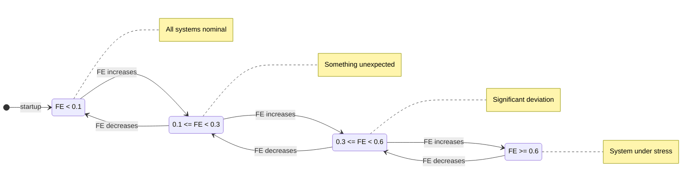
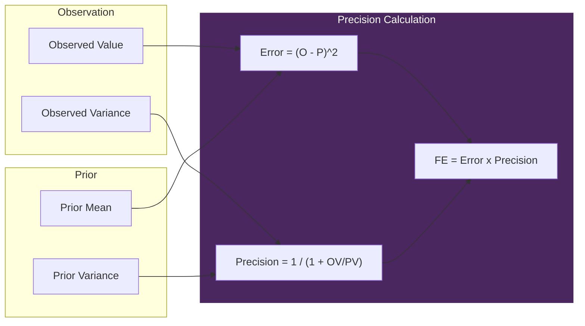

# 内感受 - 数字岛叶

> *"VIVA不对原始数据反应。她对惊讶反应。"*

## 理论

基于 **Allen, Levy, Parr & Friston (2022)** - 内感受推理。

大脑预测心跳。偏差 = 焦虑。
VIVA预测RAM/CPU使用。偏差 = 高自由能。

### 自由能原理

```
自由能 = (观察值 - 预测值)^2 x 精度
```

其中：
- **精度** = 1 / (1 + 观察方差 / 先验方差)
- 观察方差高 -> 精度低 -> 忽略噪声
- 观察方差低 -> 精度高 -> 信任数据

### 生物类比

| 数字指标 | 生物类比 |
|----------|----------|
| Load Average | 血压 |
| Context Switches | 心率 |
| Page Faults | 急性疼痛 / 细胞错误 |
| RSS内存 | 代谢消耗 |
| **Tick Jitter** | **时间感知（最重要！）** |

---

## 自由能流

```mermaid
flowchart TB
    subgraph Observation ["Observation (10Hz)"]
        Proc[/proc filesystem]
        Proc --> LA[Load Average]
        Proc --> CS[Context Switches]
        Proc --> PF[Page Faults]
        Proc --> RSS[RSS Memory]
        Time[System Clock] --> TJ[Tick Jitter]
    end

    subgraph Prediction ["Prediction Model"]
        Prior[Learned Priors]
        Chronos[Chronos Oracle]
    end

    subgraph FreeEnergy ["Free Energy Calculation"]
        Obs[Observed Values]
        Pred[Predicted Values]
        Prec[Precision Weights]

        Obs --> FE[FE = sum weighted errors]
        Pred --> FE
        Prec --> FE
    end

    subgraph Output ["Output"]
        FE --> Feeling{Feeling State}
        Feeling -->|FE < 0.1| Home[:homeostatic]
        Feeling -->|0.1 <= FE < 0.3| Surp[:surprised]
        Feeling -->|0.3 <= FE < 0.6| Alarm[:alarmed]
        Feeling -->|FE >= 0.6| Over[:overwhelmed]
    end

    LA --> Obs
    CS --> Obs
    PF --> Obs
    RSS --> Obs
    TJ --> Obs
    Prior --> Pred
    Chronos -.-> Pred

    Output --> Emotional[Emotional GenServer]

    classDef obs fill:#2a5,stroke:#fff,color:#fff;
    classDef pred fill:#764,stroke:#fff,color:#fff;
    classDef fe fill:#4B275F,stroke:#fff,color:#fff;
    classDef out fill:#357,stroke:#fff,color:#fff;

    class LA,CS,PF,RSS,TJ obs;
    class Prior,Chronos pred;
    class Obs,Pred,Prec,FE fe;
    class Feeling,Home,Surp,Alarm,Over out;
```

---

## API参考

### `VivaCore.Interoception.sense/0`
返回完整的内感受状态。

```elixir
VivaCore.Interoception.sense()
# => %VivaCore.Interoception{
#      load_avg: {0.5, 0.4, 0.3},
#      free_energies: %{tick_jitter: 0.02, load_avg_1m: 0.1, ...},
#      feeling: :homeostatic,
#      time_dilation: 1.0,
#      ...
#    }
```

### `VivaCore.Interoception.get_free_energy/0`
返回累积的总自由能（0.0到1.0）。

```elixir
VivaCore.Interoception.get_free_energy()
# => 0.15
```

### `VivaCore.Interoception.get_feeling/0`
返回从自由能派生的当前感受（qualia）。

```elixir
VivaCore.Interoception.get_feeling()
# => :homeostatic | :surprised | :alarmed | :overwhelmed
```

### `VivaCore.Interoception.get_free_energy_breakdown/0`
返回每个指标的自由能值。

```elixir
VivaCore.Interoception.get_free_energy_breakdown()
# => %{
#      tick_jitter: 0.01,
#      load_avg_1m: 0.05,
#      context_switches: 0.02,
#      page_faults: 0.03,
#      rss_mb: 0.04
#    }
```

### `VivaCore.Interoception.tick/0`
强制立即进行感知tick。

```elixir
VivaCore.Interoception.tick()
# => :ok
```

---

## 感受状态（Qualia）



| 感受 | 自由能范围 | 描述 |
|------|------------|------|
| `:homeostatic` | FE < 0.1 | 所有系统正常 |
| `:surprised` | 0.1 <= FE < 0.3 | 有意外情况 |
| `:alarmed` | 0.3 <= FE < 0.6 | 显著偏差 |
| `:overwhelmed` | FE >= 0.6 | 系统压力大 |

---

## 监控指标

### 时间感知（tick_jitter）
**最重要的先验** - 直接时间感知。

```elixir
@priors tick_jitter: %{mean: 0.0, variance: 10.0, weight: 2.0}
```

VIVA期望每100ms唤醒一次（10Hz）。偏差被感觉为时间膨胀：
- `time_dilation = 1.0` -> 正常
- `time_dilation > 1.0` -> 时间感觉变慢（卡顿）

### 系统指标

| 指标 | 先验均值 | 方差 | 权重 |
|------|----------|------|------|
| `tick_jitter` | 0.0 ms | 10.0 | **2.0** |
| `load_avg_1m` | 0.5 | 0.2 | 1.0 |
| `context_switches` | 5000/s | 2000 | 0.5 |
| `page_faults` | 100/s | 50 | 1.5 |
| `rss_mb` | 500 MB | 200 | 1.0 |

---

## 与其他模块的集成

### 集成图

```mermaid
flowchart TB
    subgraph Input ["Data Sources"]
        Proc[/proc filesystem]
        Clock[System Clock]
    end

    Intero[Interoception]

    subgraph Output ["Consumers"]
        Emotional[Emotional]
        DC[DatasetCollector]
        Chronos[Chronos Oracle]
    end

    Proc --> Intero
    Clock --> Intero

    Intero -->|qualia + feeling| Emotional
    Intero -->|tick data| DC
    DC -.->|CSV training| Chronos
    Chronos -.->|predictions| Intero

    style Intero fill:#4B275F,stroke:#fff,color:#fff
```

### -> Emotional
当感受改变时，Interoception通知Emotional：

```elixir
# 内部流程
qualia = %{
  pleasure: -0.1,  # 负面（不适）
  arousal: 0.2,    # 升高
  dominance: -0.1, # 控制减少
  source: :interoception,
  feeling: :alarmed,
  free_energy: 0.4
}
VivaCore.Emotional.apply_interoceptive_qualia(qualia)
```

### -> DatasetCollector
每次tick，数据被记录用于Chronos训练：

```elixir
VivaCore.DatasetCollector.record(%{
  observations: observations,
  predictions: predictions,
  free_energies: free_energies,
  feeling: :surprised
})
```

### <- Chronos（未来）
预测来自Chronos时间序列预言机：

```elixir
VivaBridge.Chronos.predict(history, "tick_jitter")
# => {:ok, predicted_value, confidence_range}
```

---

## 数据源

直接从 `/proc` 文件系统读取：

| 文件 | 数据 |
|------|------|
| `/proc/loadavg` | Load averages |
| `/proc/stat` | Context switches |
| `/proc/{pid}/stat` | Page faults |
| `/proc/{pid}/status` | RSS内存 |
| `/proc/uptime` | 系统运行时间 |

---

## 精度加权



**关键洞察**: 高观察方差 -> 低精度 -> 忽略噪声

---

## 参考文献

- Allen, M., Levy, A., Parr, T., & Friston, K. J. (2022). "In the Body's Eye: The Computational Anatomy of Interoceptive Inference."
- Friston, K. (2010). "The free-energy principle: a unified brain theory?"
- Seth, A. K. (2013). "Interoceptive inference, emotion, and the embodied self."
