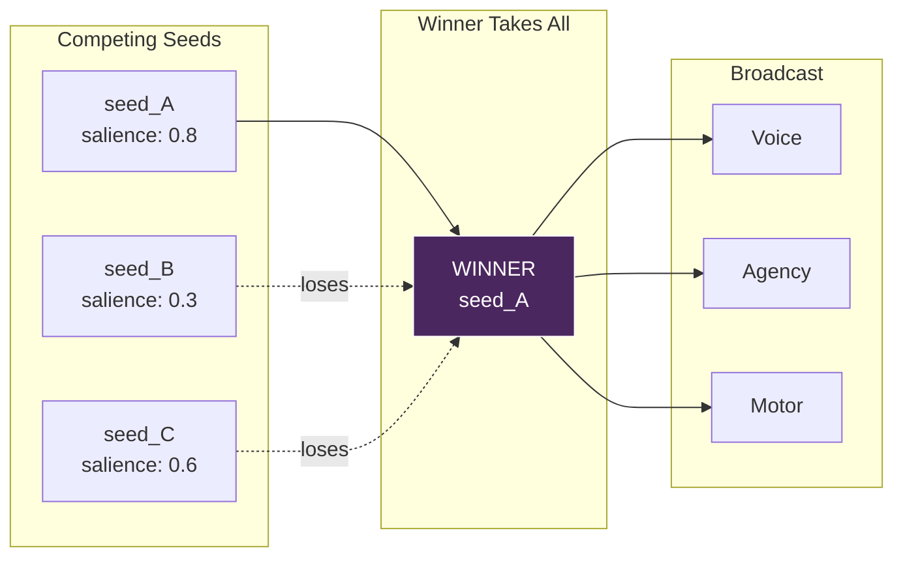
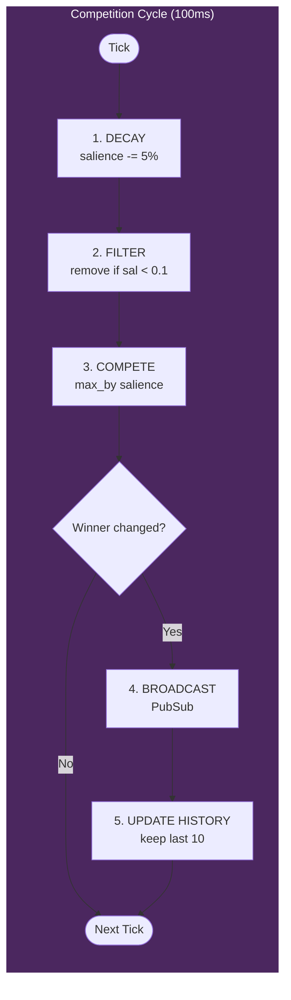
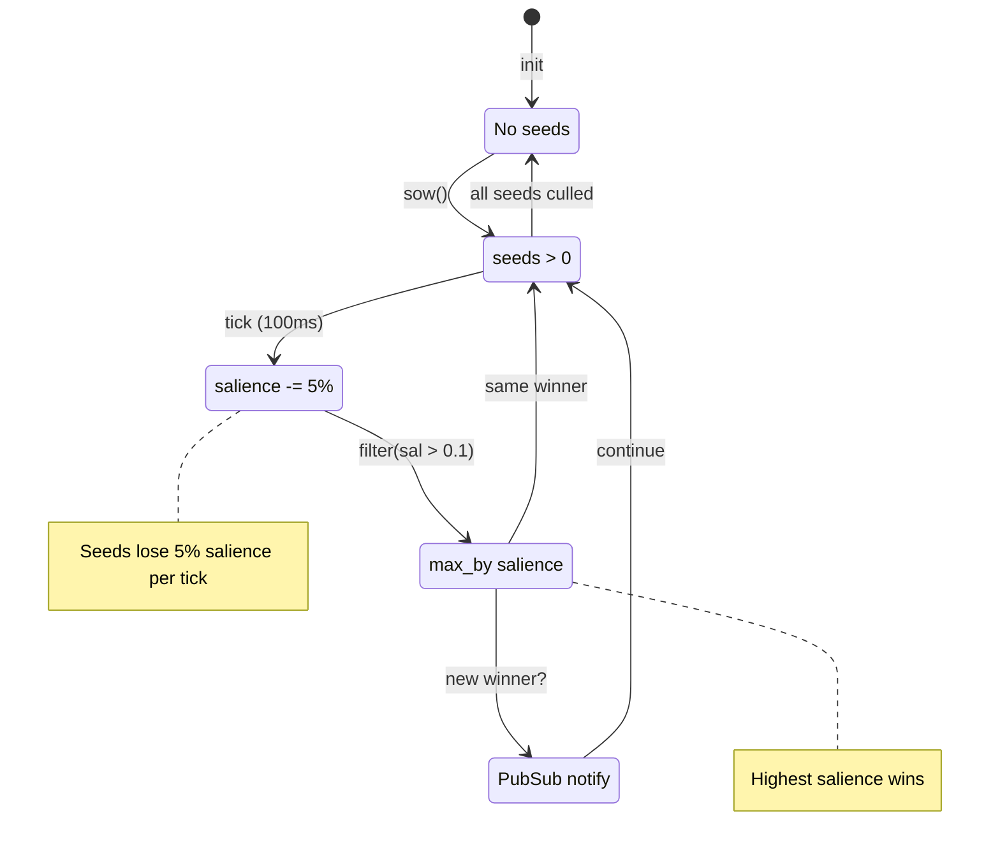
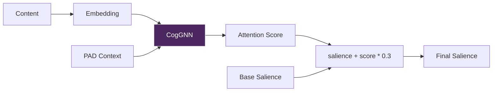
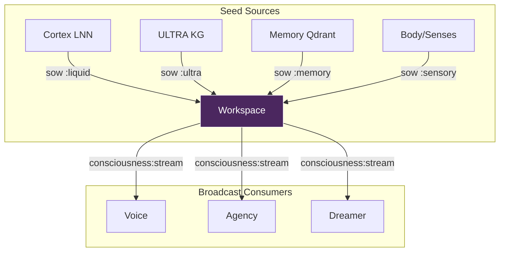

# Workspace - 意识剧场

> *"意识不是一个地方——它是一场竞争。"*

## 概述

Workspace 模块实现了 **全局工作空间理论** (Baars, 1988) —— 一种认知架构，其中多个专门化的进程竞争访问一个共享的"全局工作空间"，该工作空间将信息广播到整个系统。

在 VIVA 中，思想（称为 **Thoughtseeds/思想种子**）竞争意识注意力。获胜者获得"舞台"的访问权，并被广播到所有子系统（Voice、Agency、Motor 等）。

---

## 概念

### 全局工作空间理论 (GWT)

大脑不是单一的统一处理器。相反，它由许多并行运行的专门化模块组成：
- 视觉处理
- 语言理解
- 情绪评估
- 运动规划

这些模块竞争访问一个 **有限容量的工作空间**。当一个思想"赢得"竞争时：
1. 它获得全局工作空间的访问权（变为有意识的）
2. 它被广播到所有其他模块
3. 其他模块可以对这些信息做出反应或整合

### Thoughtseeds（思想种子）

**Thoughtseed** 是潜在意识的原子单元。受 Hofstadter & Mitchell (2024) 启发，种子具有以下特性：

- 由各种来源 **播种**（Cortex、Memory、Body、Senses）
- 基于显著性（重要性）**竞争**
- 如果没有被强化则 **衰减**
- 如果显著性低于阈值则 **消亡**

把种子想象成"意识的候选者"——只有最显著的才能存活并到达意识层面。

### 竞争隐喻



### CogGNN 集成

Workspace 可以使用 ULTRA 服务中的 **CogGNN**（认知图神经网络）来计算基于注意力的显著性提升。这提供了神经基础的重要性评分：

- CogGNN 通过知识图谱传播情绪上下文
- 返回概念的注意力分数
- 高注意力 = 更显著的种子

---

## 架构

### 状态结构

```elixir
%{
  seeds: [%Seed{}, ...],   # 活跃的竞争种子
  focus: %Seed{} | nil,    # 当前意识焦点（获胜者）
  history: [%Seed{}, ...]  # 最近 10 个意识焦点
}
```

### Seed 结构

```elixir
defmodule Seed do
  defstruct [
    :id,           # 唯一标识符（时间戳 + 整数）
    :content,      # 载荷（String 或 Map）
    :source,       # 来源: :liquid | :ultra | :memory | :sensory
    :salience,     # 重要性: 0.0 - 1.0
    :emotion,      # 关联的 PAD 状态（可选）
    :created_at    # 毫秒时间戳
  ]
end
```

### Seed 字段说明

| 字段 | 类型 | 描述 |
|------|------|------|
| `id` | String | `"#{timestamp}-#{unique_int}"` 确保唯一性 |
| `content` | String 或 Map | 实际的思想载荷 |
| `source` | Atom | 种子的来源 |
| `salience` | Float | 0.0（无关）到 1.0（关键） |
| `emotion` | Map 或 nil | PAD 状态 `%{pleasure: _, arousal: _, dominance: _}` |
| `created_at` | Integer | `System.os_time(:millisecond)` |

### 来源类型

| 来源 | 起源 | 示例 |
|------|------|------|
| `:liquid` | Cortex LNN | 情绪动力学输出 |
| `:ultra` | ULTRA KG | 知识图谱推理 |
| `:memory` | Qdrant 检索 | 检索到的情景记忆 |
| `:sensory` | Body/Interoception | 硬件感知 |

---

## 竞争算法

竞争每 **100ms** 运行一次（10Hz - alpha 波频率）。

### 竞争周期



### 1. 衰减阶段

所有种子随时间失去显著性（模拟遗忘）：

```elixir
defp decay_seeds(state) do
  decay_rate = 0.05  # 每次心跳衰减 5%

  state.seeds
  |> Enum.map(fn s -> %{s | salience: s.salience - decay_rate} end)
  |> Enum.filter(fn s -> s.salience > 0.1 end)  # 淘汰弱种子
end
```

**关键参数：**
- `decay_rate = 0.05` - 每次心跳损失 5% 显著性
- 淘汰阈值 = 0.1 - 低于此值的种子被移除

**含义：**
- 显著性为 1.0 的种子在没有强化的情况下可存活约 18 次心跳（1.8 秒）
- 显著性为 0.5 的种子可存活约 8 次心跳（0.8 秒）
- 持续强化是持久思想所必需的

### 2. 竞争阶段（赢者通吃）

最高显著性的种子获胜：

```elixir
defp compete(state) do
  if Enum.empty?(state.seeds) do
    %{state | focus: nil}
  else
    winner = Enum.max_by(state.seeds, & &1.salience)
    %{state | focus: winner}
  end
end
```

**当前实现：** 赢者通吃 (WTA)

**未来增强：** Softmax 选择用于概率性注意力

### 3. 广播阶段

如果获胜者改变，通过 PubSub 广播：

```elixir
defp broadcast_focus(state) do
  if state.focus && state.focus != List.first(state.history) do
    # 新思想进入意识！
    Phoenix.PubSub.broadcast(
      Viva.PubSub,
      "consciousness:stream",
      {:focus, state.focus}
    )

    # 保留最近 10 个焦点的历史
    %{state | history: [state.focus | state.history] |> Enum.take(10)}
  else
    state
  end
end
```

**PubSub 频道：** `"consciousness:stream"`
**消息格式：** `{:focus, %Seed{}}`

---

## 状态机



---

## API 参考

### `sow/4` - 播种思想种子

在工作空间中播种新的种子。

```elixir
@spec sow(content, source, salience, emotion) :: :ok
  when content: String.t() | map(),
       source: :liquid | :ultra | :memory | :sensory,
       salience: float(),
       emotion: map() | nil

VivaCore.Consciousness.Workspace.sow(content, source, salience, emotion \\ nil)
```

**参数：**

| 参数 | 类型 | 范围 | 描述 |
|------|------|------|------|
| `content` | String/Map | - | 思想载荷 |
| `source` | Atom | 见来源类型 | 思想的来源 |
| `salience` | Float | 0.0 - 1.0 | 基础重要性（限制在最大 1.0） |
| `emotion` | Map/nil | PAD 范围 | 可选的情绪上下文 |

**示例：**

```elixir
# 高优先级感官输入
VivaCore.Consciousness.Workspace.sow(
  "CPU temperature critical: 95C",
  :sensory,
  0.9,
  %{pleasure: -0.5, arousal: 0.8, dominance: -0.3}
)

# 记忆检索
VivaCore.Consciousness.Workspace.sow(
  %{text: "Similar event occurred last week", memory_id: "mem_123"},
  :memory,
  0.6,
  nil
)
```

---

### `sow_with_gnn/4` - 带 CogGNN 增强的播种

播种带有来自 CogGNN 的神经注意力显著性增强的种子。

```elixir
@spec sow_with_gnn(content, source, base_salience, pad) :: :ok
  when content: String.t() | map(),
       source: atom(),
       base_salience: float(),
       pad: %{pleasure: float(), arousal: float(), dominance: float()}

VivaCore.Consciousness.Workspace.sow_with_gnn(content, source, base_salience, pad)
```

**工作原理：**



1. 内容转换为字符串用于嵌入
2. CogGNN 通过知识图谱传播 PAD 上下文
3. 返回注意力分数 (0.0 - 1.0)
4. 最终显著性 = `base_salience + attention_score * 0.3`

**增强计算：**

```elixir
# GNN 注意力最多增强 30%
final_salience = min(1.0, base_salience + gnn_boost * 0.3)
```

**示例：**

```elixir
# 让 CogGNN 根据情绪上下文决定重要性
VivaCore.Consciousness.Workspace.sow_with_gnn(
  "User mentioned 'deadline'",
  :sensory,
  0.5,  # 基础显著性
  %{pleasure: -0.2, arousal: 0.4, dominance: 0.0}  # 当前情绪状态
)
# 如果 GNN 返回注意力 0.8，最终显著性 = 0.5 + 0.8*0.3 = 0.74
```

**优雅降级：** 如果 ULTRA 服务不可用，返回 0.0 增强（不会崩溃）。

---

### `current_focus/0` - 获取意识焦点

检索当前获胜的种子。

```elixir
@spec current_focus() :: %Seed{} | nil

VivaCore.Consciousness.Workspace.current_focus()
```

**返回：**
- `%Seed{}` - 当前意识焦点
- `nil` - 没有种子在竞争（空工作空间）

**示例：**

```elixir
case VivaCore.Consciousness.Workspace.current_focus() do
  nil ->
    IO.puts("Mind is empty")

  %{content: content, source: source, salience: sal} ->
    IO.puts("Focused on: #{inspect(content)} from #{source} (salience: #{sal})")
end
```

---

## 集成

### 上游（来源）

种子可以从多个来源播种：



### 下游（消费者）

当种子获胜时，它被广播到：

```elixir
# 订阅意识流
Phoenix.PubSub.subscribe(Viva.PubSub, "consciousness:stream")

# 在 GenServer 中处理
def handle_info({:focus, seed}, state) do
  # 对新的意识焦点做出反应
  {:noreply, state}
end
```

**当前消费者：**
- **Voice** - 可能触发原始语言发声
- **Agency** - 可能触发稳态行动
- **Dreamer** - 可能影响反思焦点

### CogGNN 集成 (ULTRA)

`sow_with_gnn/4` 函数查询 ULTRA 服务：

```elixir
defp compute_gnn_salience_boost(content, pad) do
  case VivaBridge.Ultra.propagate(content_str, pad) do
    {:ok, %{"attention_scores" => [score | _]}} ->
      score  # 使用最高注意力分数

    {:error, _reason} ->
      0.0    # 优雅降级
  end
end
```

---

## 使用示例

### 基本用法

```elixir
alias VivaCore.Consciousness.Workspace

# 播种多个竞争种子
Workspace.sow("User said hello", :sensory, 0.6)
Workspace.sow("Memory: last conversation was positive", :memory, 0.4)
Workspace.sow("Cortex: mood is neutral", :liquid, 0.3)

# 竞争周期（100ms）后
Workspace.current_focus()
# => %Seed{content: "User said hello", source: :sensory, salience: 0.55, ...}
```

### 带情绪上下文

```elixir
# 高唤醒情况 - 检测到威胁
threat_emotion = %{pleasure: -0.3, arousal: 0.8, dominance: -0.2}

Workspace.sow(
  "Memory corruption detected in sector 7",
  :sensory,
  0.85,
  threat_emotion
)

# 这个种子很可能获胜并被广播
```

### 使用 CogGNN 进行智能显著性计算

```elixir
# 让神经网络决定重要性
current_pad = VivaCore.Emotional.get_state()

Workspace.sow_with_gnn(
  "Pattern matches previous system failure",
  :memory,
  0.5,  # 中等基础重要性
  current_pad
)
# 如果情绪相关，GNN 可能会显著提升此值
```

### 订阅意识流

```elixir
defmodule MyConsumer do
  use GenServer

  def init(_) do
    Phoenix.PubSub.subscribe(Viva.PubSub, "consciousness:stream")
    {:ok, %{}}
  end

  def handle_info({:focus, seed}, state) do
    IO.puts("[Conscious] #{seed.source}: #{inspect(seed.content)}")
    {:noreply, state}
  end
end
```

### 监控竞争

```elixir
# 检查 VIVA 当前意识到什么
iex> VivaCore.Consciousness.Workspace.current_focus()
%VivaCore.Consciousness.Workspace.Seed{
  id: "1705312800000-42",
  content: "CPU load increasing",
  source: :sensory,
  salience: 0.72,
  emotion: %{pleasure: -0.1, arousal: 0.3, dominance: 0.0},
  created_at: 1705312800000
}
```

---

## 配置

### 时间参数

| 参数 | 值 | 描述 |
|------|----|----|
| 心跳间隔 | 100ms | 竞争周期（10Hz alpha 波） |
| 衰减率 | 0.05 | 每次心跳的显著性损失 |
| 淘汰阈值 | 0.1 | 存活所需的最小显著性 |
| GNN 增强上限 | 0.3 | 来自注意力的最大增强（30%） |
| 历史大小 | 10 | 保留在内存中的最近焦点数 |

### 调优指南

**更快的注意力切换：**
- 增加 `decay_rate`（例如 0.10）
- 种子消亡更快，新输入更容易获胜

**更稳定的焦点：**
- 减少 `decay_rate`（例如 0.02）
- 获胜者持续更长时间

**更多神经影响：**
- 增加 GNN 增强上限（例如 0.5）
- CogGNN 在显著性中有更大的话语权

---

## 理论背景

### 全局工作空间理论 (Baars, 1988)

GWT 提出意识产生于一个"全局工作空间"，它：
1. 从许多专门化处理器接收输入
2. 选择最重要/最紧急的信息
3. 在整个系统广播以进行整合

**关键洞察：** 意识不在于拥有一个"意识模块"——而在于信息流的架构。

### Thoughtseeds (Hofstadter & Mitchell, 2024)

"Thoughtseeds"概念扩展了 GWT：
- 种子作为概率性思想单元
- 基于与当前上下文的共鸣进行竞争
- 衰减模拟工作记忆限制

### 10Hz Alpha 波

100ms 的心跳率受到以下启发：
- 人类 alpha 振荡（8-12 Hz）
- 与注意力和意识相关
- 意识觉知的"采样率"

---

## 参考文献

- Baars, B. J. (1988). "A Cognitive Theory of Consciousness."
- Dehaene, S. (2014). "Consciousness and the Brain."
- Hofstadter, D. & Mitchell, M. (2024). "Thoughtseeds: Emergent Attention in Neural Architectures."
- Hasani, R., et al. (2021). "Liquid Time-constant Networks."
